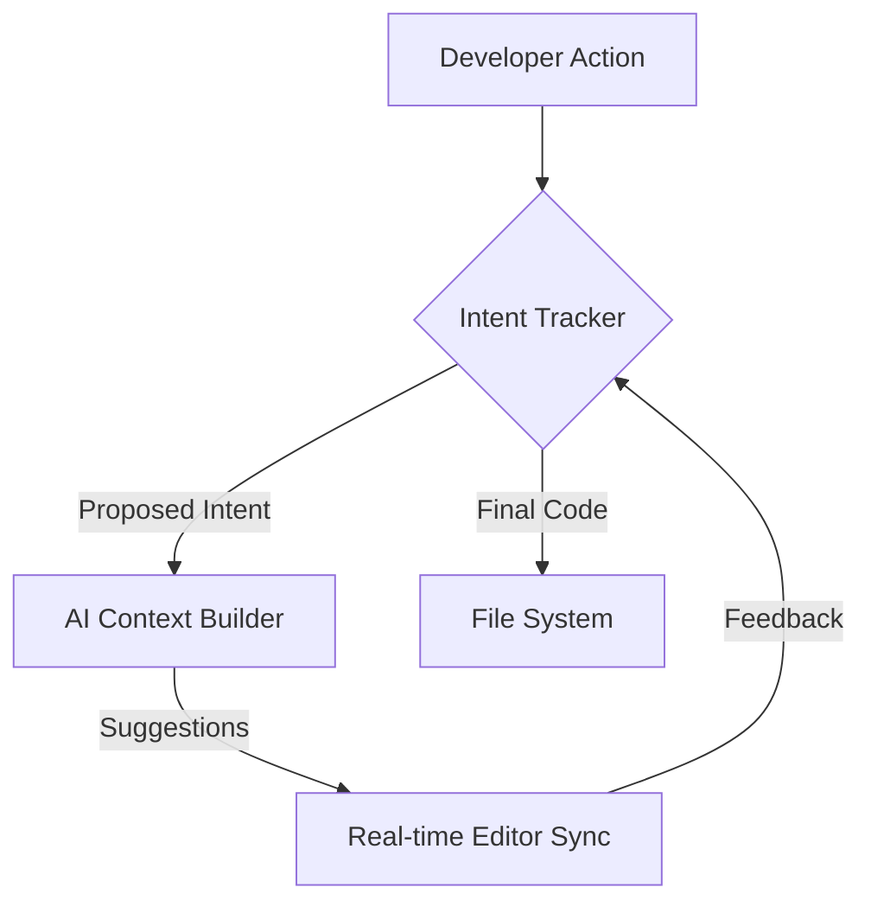

# Melty

## What it is
An open-source AI code editor designed to be a "human-in-the-loop" editor that understands the intent behind your changes. Melty focuses on the "Collaborative Editing" pattern, where the AI acts as a pair programmer rather than just a code generator.

## What problem it solves
Bridges the gap between AI code generation and developer intent. It solves the "black box" generation problem where AI makes changes that the developer doesn't fully understand or that don't align with the long-term architectural goals of the project.

## Where it fits in the stack
**Development & Ops**. Serves as an AI-native code editor with intent-aware editing. It is a direct competitor to proprietary editors like Cursor, but with an open-source core.

## Architecture overview
Melty uses an "Intent-State" loop to synchronize developer actions with AI assistance.

## Key Features & Workflow
- **Intent-Aware Editing**: As you type, Melty attempts to predict the "Why" behind your changes and suggests whole-block completions that align with that intent.
- **Human-in-the-Loop**: Every AI suggestion is treated as a proposal that requires explicit or implicit developer confirmation.
- **Integrated Terminal/Git**: Seamlessly integrates with standard developer tools to maintain a cohesive workflow.
- **Open Indexing**: Uses open-source indexing techniques to provide project-wide context without sending entire files to a proprietary server.

## Typical use cases
- **Intent-driven editing**: When the purpose of the change (e.g., "Refactor this class for better testability") is more important than the specific lines of code.
- **Collaborative coding**: Working with an AI that respects and learns from your specific coding style.
- **Open-source alternative**: For developers who prefer an open-source stack for their primary development tools.

## Strengths
- **Open Source**: Transparent and extensible by the community.
- **Intent-Awareness**: Focuses on higher-level reasoning rather than simple autocompletion.
- **Developer Control**: Keeps the human developer firmly in the driver's seat through iterative feedback loops.

## Limitations
- **Maturity**: Younger project compared to VS Code; the extension ecosystem is still developing.
- **Performance**: High-level intent tracking can be resource-intensive on older hardware.
- **Ecosystem**: Lacks some of the deep integration features of proprietary tools like GitHub Copilot.

## When to use it
- When you want an open-source AI editor focused on understanding developer intent.
- When you prefer a "Pair Programming" feel with your AI tools.
- For projects where data privacy and open-source compliance are critical.

## When not to use it
- When you need a highly mature editor with thousands of legacy extensions.
- When you prefer a terminal-only workflow (use [Aider](aider.md) or [Junie CLI](junie-cli.md)).

## Related tools / concepts

- [Cursor](cursor.md)
- [Zed](zed.md)
- [Codeium](codeium.md)
- [Claude Code — Project Setup Guide](claude-code-setup.md)
- [OpenCode (Oh My OpenCode Ecosystem)](opencode.md)
- [Software Factories](../../knowledge_base/patterns/software-factories.md)
- [Agentic Workflows](../../knowledge_base/patterns/agentic-workflows.md)

## Sources / references
- [Melty Labs Official Site](https://melty.sh/)
- [GitHub Repository](https://github.com/meltylabs/melty)
- [Melty Documentation Wiki](https://github.com/meltylabs/melty/wiki)

## Contribution Metadata

- Last reviewed: 2026-05-15
- Confidence: high
