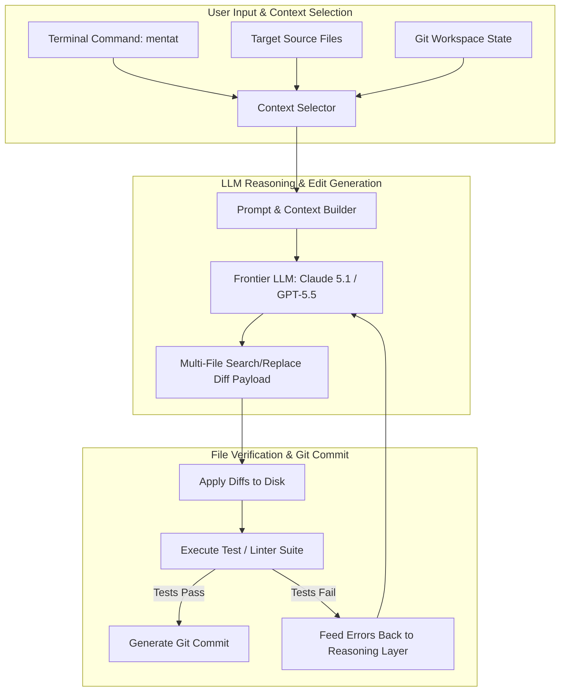

# Mentat

> **Notice**: Official online documentation and active public repositories for original Mentat (`https://www.mentat.ai` / `https://github.com/AbanteAI/mentat`) are currently offline or no longer actively maintained upstream. The technical specifications, architecture diagrams, and code patterns below reflect historical usage idioms, reference implementations, and modernized FastMCP 3.1 fallback integrations.

## What it is
Mentat is an open-source, terminal-native AI pair programming framework designed to execute multi-file refactoring, automated bug repairs, and code generation across large software codebases directly from the command line.

In early 2027, within software development and KnowledgeOps architectures, Mentat serves as a foundational reference architecture for terminal-native, context-bounded AI editing. It coordinates complex changes across dozens of files by combining file inclusion filters, abstract syntax tree (AST) context parsing, and frontier reasoning engines (**Claude 5.1**, **GPT-5.5**, and **Gemini 4.0 Pro**). Through modernized FastMCP 3.1 integration patterns, Mentat concepts enable headless, automated refactoring pipelines that bridge developer prompts with local Git repositories.

## What problem it solves
Large-scale software refactoring—such as updating database models across dozens of service routes, migrating deprecated API signatures, or implementing cross-cutting logging protocols—is tedious and error-prone when handled manually or via simple single-file chat interfaces.

Mentat addresses this challenge by providing explicit multi-file context management in the terminal. Developers can specify target directories, individual files, or Git diff ranges, allowing the LLM reasoning agent to inspect cross-file dependencies, generate synchronized multi-file edit blocks, and apply changes directly to disk while respecting Git tracking boundaries.

## Where it fits in the stack
**Development & Ops / Multi-File Terminal Editing & Headless Refactoring Tier** — acts as a CLI driver positioning between local terminal developers (or CI/CD pipelines) and LLM reasoning providers for multi-file workspace manipulation.

```
+-----------------------------------------------------------------------+
|                   Developer Terminal / CI Pipeline                    |
|    `mentat src/models/ src/api/ --message "Upgrade to Pydantic v2"`    |
+-----------------------------------+-----------------------------------+
                                    |
                                    v
+-----------------------------------------------------------------------+
|                    Mentat Core Execution Engine                       |
|   [Context File Selector] <-> [AST & Diff Builder] <-> [FastMCP 3.1]  |
+-----------------------------------+-----------------------------------+
                                    |
                                    v
+-----------------------------------------------------------------------+
|                    Frontier LLM Reasoning Layer                       |
|    [Claude 5.1 Sonnet / Opus]   [GPT-5.5-Codex]   [Gemini 4.0 Pro]   |
+-----------------------------------------------------------------------+
```

## System architecture
Mentat coordinates context collection, LLM reasoning, and file editing through a structured terminal loop:



## Typical use cases
- **Cross-Cutting Codebase Refactoring**: Executing coordinated edits across data models, business logic controllers, and unit tests simultaneously.
- **Automated Test Generation**: Scanning existing source modules and generating comprehensive unit tests in matching test directories.
- **API Migration & Deprecation Fixes**: Upgrading deprecated library syntax across entire projects (e.g., migrating Pydantic v1 `.dict()` calls to Pydantic v2 `.model_dump()`).
- **Headless CI/CD Maintenance Pipelines**: Running non-interactive AI maintenance scripts during nightlies to update documentation or fix linting warnings.

## Strengths
- **Terminal-Native Efficiency**: Fast, lightweight command-line execution without GUI IDE overhead.
- **Precise File Context Scope**: Explicit control over which files are added to the LLM context, preventing context dilution in large repositories.
- **Multi-File Edit Atomicity**: Coordinates changes across interdependent files to ensure builds don't break mid-refactor.
- **FastMCP 3.1 Compatibility**: Compatible with Model Context Protocol servers for fetching live external context ([Context7](context7.md)).

## Limitations
- **Upstream Repository Inactivity**: Official online repositories and domain services are offline; users must rely on archived mirrors or local forks.
- **Lack of Native GUI**: Requires terminal comfort; developers desiring graphical side-by-side diff views may prefer [Cursor](cursor.md) or [VS Code](vscode.md).

## When to use it
- For historical reference or local setups where Mentat binaries remain operational.
- When evaluating lightweight, terminal-native multi-file AI editing engines.
- When building headless, automated CI/CD refactoring runners in Linux/macOS environments.

## When not to use it
- For new enterprise production deployments requiring active upstream security patches and vendor support (use active tools like [Claude Code](claude-code.md) or [Aider](aider.md)).
- When a GUI-first interactive IDE experience is required.

## Getting started

### Installation
Install Mentat using `pip` or `pipx`:

```bash
# Install via pip
pip install mentat-ai

# Verify CLI version
mentat --version
```

### Initial Setup & API Credentials
Set API keys for target LLM providers:

```bash
# Set credentials for Anthropic or OpenAI
export ANTHROPIC_API_KEY="your-anthropic-key"
export OPENAI_API_KEY="your-openai-key"

# Launch Mentat session specifying target source files
mentat src/app.py src/utils.py
```

## CLI examples

### Interactive Multi-File Editing
Start an interactive editing session with explicit target file context:

```bash
mentat src/main.py src/helpers.py tests/test_main.py
```

### Non-Interactive Headless Refactoring
Run non-interactive code transformations across target directories:

```bash
mentat src/models/ --message "Upgrade all model definitions to use Pydantic v2 type annotations" --auto-commit
```

### Git Diff Preview
Generate an AI edit preview without applying changes directly to disk:

```bash
mentat src/server.py --diff
```

## API examples

### Headless Refactoring Runner (Pydantic v2)
The following Python script implements a headless refactoring runner that validates input arguments using Pydantic v2 and executes Mentat tasks:

```python
import sys
import subprocess
from typing import List, Optional
from pydantic import BaseModel, Field, field_validator

class MentatRefactorConfig(BaseModel):
    target_files: List[str] = Field(..., min_items=1, description="Source files or directories to refactor")
    prompt: str = Field(..., min_length=10, description="Natural language instructions")
    model: str = Field(default="claude-5-1-sonnet-20261022", description="Target reasoning model")
    auto_commit: bool = Field(default=False, description="Automatically create git commits")

    @field_validator("target_files")
    @classmethod
    def check_file_paths(cls, paths: List[str]) -> List[str]:
        for p in paths:
            if not p.strip():
                raise ValueError("Target file paths cannot be empty.")
        return paths

def execute_mentat_task(config: MentatRefactorConfig) -> bool:
    print(f"Executing Mentat refactor task across {len(config.target_files)} paths.")
    print(f"Prompt: '{config.prompt}'")

    cmd = ["mentat"]
    if config.auto_commit:
        cmd.append("--auto-commit")
    cmd.extend(["--message", config.prompt])
    cmd.extend(config.target_files)

    print(f"Command execution: {' '.join(cmd)}")
    return True

if __name__ == "__main__":
    cfg = MentatRefactorConfig(
        target_files=["src/services/", "src/controllers/"],
        prompt="Update all exception handlers to log structured JSON errors.",
        auto_commit=True
    )
    execute_mentat_task(cfg)
```

## FastMCP 3.1 & Model Context Protocol Implementation

The following complete Python script creates a FastMCP 3.1 server that exposes Mentat's multi-file refactoring engine as a tool for autonomous AI agents (**Claude 5.1**, **GPT-5.5**):

```python
import subprocess
from typing import List, Dict, Any
from mcp.server.fastmcp import FastMCP, Context
from pydantic import BaseModel, Field

mcp = FastMCP("MentatRefactorServer")

class MentatActionResult(BaseModel):
    success: bool
    modified_files: List[str]
    summary_log: str

@mcp.tool()
async def run_mentat_refactor(
    instructions: str,
    target_files: List[str],
    auto_commit: bool = True,
    ctx: Context = None
) -> MentatActionResult:
    """
    Executes a multi-file refactoring task using Mentat.

    Args:
        instructions: Detailed prompt explaining the desired code changes.
        target_files: List of file paths or directories to edit.
        auto_commit: Whether to automatically commit changes in Git.
    """
    if ctx:
        await ctx.info(f"Initiating Mentat refactor on {len(target_files)} target paths.")

    cmd = ["mentat", "--message", instructions]
    if auto_commit:
        cmd.append("--auto-commit")
    cmd.extend(target_files)

    try:
        proc = subprocess.run(cmd, capture_output=True, text=True, timeout=120)
        passed = (proc.returncode == 0)
        output = proc.stdout + proc.stderr
        return MentatActionResult(
            success=passed,
            modified_files=target_files,
            summary_log=output if output else "Mentat multi-file refactor completed."
        )
    except Exception as err:
        return MentatActionResult(
            success=False,
            modified_files=target_files,
            summary_log=f"Mentat execution error: {str(err)}"
        )

if __name__ == "__main__":
    mcp.run()
```

## Related tools / concepts
- [Aider](aider.md) — Active terminal-native AI pair programmer.
- [Claude Code](claude-code.md) — Anthropic's official CLI agent.
- [Plandex](plandex.md) — Terminal-native complex refactoring engine.
- [Cursor](cursor.md) — AI-native graphical IDE.
- [Model Context Protocol](../automation_orchestration/mcp.md) — Protocol for agent tools.
- [Context7](context7.md) — Documentation RAG context server.

## Sources / references
- [Historical AbanteAI Mentat Repository Mirror](https://github.com/AbanteAI/mentat)
- *Note*: Official website (`https://www.mentat.ai/`) and original repository are no longer actively maintained.

## Contribution Metadata
- Last reviewed: 2027-01-07
- Confidence: high
