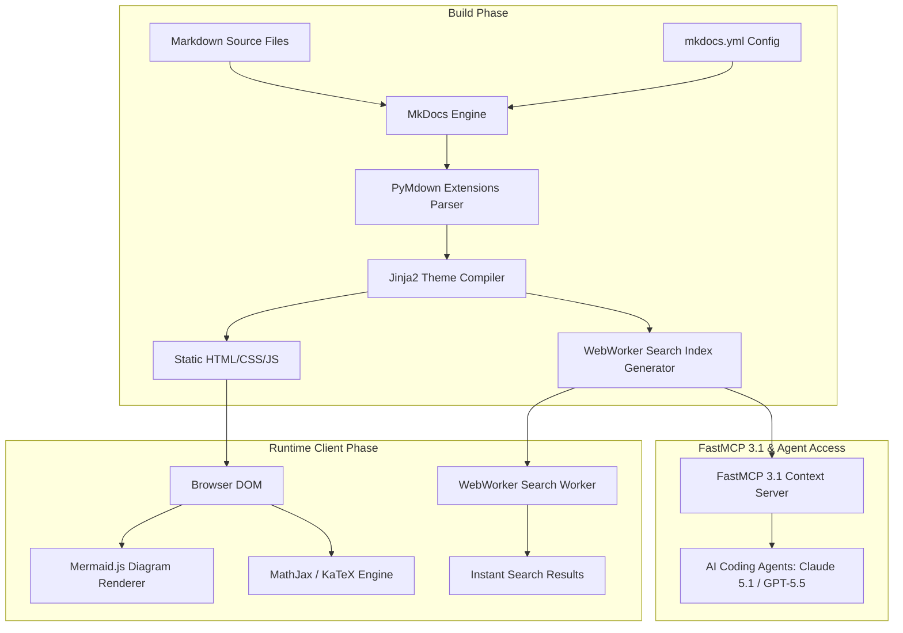

# Material for MkDocs

## What it is
Material for MkDocs (`mkdocs-material`) is a feature-rich, highly customizable responsive documentation framework built on top of MkDocs, Python Markdown, and Jinja2 templating. It serves as an enterprise-grade static site generator frontend that converts structured Markdown documentation, architectural diagrams, API specifications, and operational playbooks into a fast, searchable, and accessible web portal.

In early 2027, within automated KnowledgeOps pipelines, self-hosted homelabs, and AI-native developer platforms, Material for MkDocs acts as the primary web publishing layer. It transforms distributed repository docs into a unified site equipped with client-side WebWorker vector search, interactive code block copy/tab toggles, Mermaid.js diagram execution, dark/light theme palette toggles, and metadata-rich search indexing tailored for both human engineers and autonomous AI browsing agents (such as **Claude 5.1**, **GPT-5.5**, and **Gemini 4.0 Pro**).

## What problem it solves
Managing technical documentation across hundreds of Markdown files in deep directory hierarchies creates navigation bottlenecks, fragmented knowledge, and inconsistent styling. Raw Markdown files rendered on GitHub or Gitea lack instant cross-file search, dynamic content filtering, interactive architectural diagrams, and unified branding.

Material for MkDocs solves these challenges by compiling repository file trees into a client-side search-indexed single-page or multi-page static portal. It eliminates search latency using WebWorker-powered instant indexing, renders client-side Mermaid diagrams, standardizes navigation menus, and ensures total mobile and WCAG accessibility compliance without requiring complex node/npm build chains or heavy server-side database infrastructure.

## Where it fits in the stack
**Development & Ops / Documentation Frontend & Portal Layer** — acts as the presentation, rendering, and search indexing tier for all repository architecture diagrams, tool catalogues, service guides, and operational playbooks.

```
+-----------------------------------------------------------------------+
|                 Source Knowledge Base & Repositories                  |
|  [docs/tools/*.md]   [docs/architecture/*.md]  [docs/playbooks/*.md]  |
+-----------------------------------+-----------------------------------+
                                    |
                                    v
+-----------------------------------------------------------------------+
|                    Material for MkDocs Build Pipeline                 |
|  [Python Markdown] <-> [PyMdown Extensions] <-> [Jinja2 Templates]    |
+-----------------------------------+-----------------------------------+
                                    |
                                    v
+-----------------------------------------------------------------------+
|                   Compiled Static Portal Artifacts                    |
|   [site/index.html]   [site/search/search_index.json]   [assets/*]    |
+-----------------------------------+-----------------------------------+
                                    |
                                    v
+-----------------------------------------------------------------------+
|                    Edge Host / Local Web Server                       |
|        [Caddy / Nginx / GitHub Pages / Cloudflare Pages Edge]         |
+-----------------------------------------------------------------------+
```

## System architecture
The internal build and rendering architecture of Material for MkDocs combines static compilation with dynamic client-side WebWorker execution:



## Typical use cases
- **Self-Hosted Homelab Technical Portal**: Publishing local operations guides, network topology maps, Docker/K8s deployment playbooks, and service maintenance logs.
- **AI KnowledgeOps & Context Indexing**: Generating static HTML and structured `search_index.json` feeds consumed by RAG agents, local LLM wrappers, and FastMCP 3.1 documentation servers.
- **Multi-Version SDK & API Documentation**: Hosting developer portals with interactive code snippets, parameter tabs, admonitions, and automated OpenAPI specification rendering.
- **Enterprise Engineering Standards**: Standardizing internal architectural decision records (ADRs), contribution guidelines, and security compliance protocols across engineering teams.

## Strengths
- **Instant WebWorker Search**: Built-in client-side full-text search with query completion, fuzzy matching, dynamic term highlighting, and zero server-side database requirements.
- **Rich Extensions Ecosystem**: Full support for PyMdown Extensions including content tabs, collapsible admonitions, task lists, code annotations, inline tooltips, and mathematical notation.
- **Responsive & WCAG Compliant**: Modern responsive layout optimized for mobile screens, ultra-wide monitors, keyboard navigation, and high-contrast dark/light mode toggling.
- **Extensible Theme Architecture**: Easily extended using custom CSS/JS overrides, custom HTML Jinja2 blocks, and plugin ecosystems (e.g., `mkdocs-minify-plugin`, `mkdocs-git-revision-date-localized-plugin`).

## Limitations
- **Python Build Overhead**: Generating sites with thousands of deeply nested pages requires Python runtime dependencies and compilation time during CI/CD execution.
- **Static Output Constraints**: Lacks native server-side dynamic capabilities such as live user comments, dynamic authentication roles, or real-time database queries without external third-party widgets.
- **Advanced Customization Complexity**: Deep overrides of complex Jinja2 layout templates and Material SASS files require specialized knowledge of the Material for MkDocs core codebase.

## When to use it
- When creating developer portals, technical knowledge bases, or homelab operations sites from Markdown source repositories.
- When client-side instant search, fast load performance, and offline-capable static site hosting are mandatory.
- When standardizing repository documentation layout with a polished, accessible, and themeable UI out of the box.

## When not to use it
- For dynamic, real-time collaborative wikis requiring direct browser-based WYSIWYG editing without Git commits (use Outline, Joplin, or Trilium).
- For simple single-file READMEs where standard GitHub or Gitea rendering is sufficient.
- For dynamic web applications requiring user logins, database interactions, or real-time server-side dashboard rendering.

## Getting started

### Installation & Environment Setup
Install `mkdocs-material` alongside essential extensions using `pip` or `uv`:

```bash
# Using pip
pip install mkdocs-material mkdocs-minify-plugin mkdocs-git-revision-date-localized-plugin

# Using uv
uv pip install mkdocs-material
```

### Complete Configuration (`mkdocs.yml`)
Configure theme features, navigation, and PyMdown extensions in your root `mkdocs.yml`:

```yaml
site_name: AI & Automation Knowledge Hub
site_description: Enterprise KnowledgeOps and Self-Hosted Infrastructure Documentation
site_author: KnowledgeOps Engineering
site_url: https://docs.homelab.local/

theme:
  name: material
  language: en
  palette:
    - media: "(prefers-color-scheme: light)"
      scheme: default
      primary: indigo
      accent: indigo
      toggle:
        icon: material/brightness-7
        name: Switch to dark mode
    - media: "(prefers-color-scheme: dark)"
      scheme: slate
      primary: indigo
      accent: lime
      toggle:
        icon: material/brightness-4
        name: Switch to light mode
  features:
    - navigation.top
    - navigation.instant
    - navigation.tracking
    - navigation.sections
    - navigation.expand
    - search.suggest
    - search.highlight
    - search.share
    - content.code.copy
    - content.code.annotate
    - content.tabs.link

plugins:
  - search
  - minify:
      minify_html: true

markdown_extensions:
  - admonition
  - pymdownx.details
  - pymdownx.superfences:
      custom_fences:
        - name: mermaid
          class: mermaid
          format: !!python/name:pymdownx.superfences.fence_code_format
  - pymdownx.highlight:
      anchor_linenums: true
      line_spans: __span
      pygments_lang_class: true
  - pymdownx.inlinehilite
  - pymdownx.snippets
  - pymdownx.tabbed:
      alternate_style: true
  - pymdownx.tasklist:
      custom_checkbox: true

nav:
  - Home: index.md
  - Architecture: architecture/index.md
  - Tools: tools/index.md
  - Playbooks: playbooks/index.md
```

## CLI examples

### Local Development & Production Build Commands
Commands for developing, auditing, and building the site:

```bash
# Serve the site locally with hot reloading enabled on all interfaces
mkdocs serve -a 0.0.0.0:8000

# Perform a clean build of production static files into site/
mkdocs build --clean --strict

# Inspect output static site structure
ls -la site/

# Validate generated search index JSON payload
python3 -m json.tool site/search/search_index.json | head -n 30

# Deploy static site directly to GitHub Pages
mkdocs gh-deploy --force --clean
```

## API examples

### Python Automated Site Config & Contract Validation (Pydantic v2)
The following Python script reads, validates, and updates MkDocs configuration files using Pydantic v2 schemas:

```python
import sys
import yaml
from pathlib import Path
from typing import List, Optional, Dict, Any
from pydantic import BaseModel, Field, field_validator

class ThemePalette(BaseModel):
    scheme: str = Field(..., description="Theme color scheme (default or slate)")
    primary: str = Field(default="indigo")
    accent: str = Field(default="indigo")

class ThemeConfig(BaseModel):
    name: str = Field(..., description="Theme name must be 'material'")
    language: str = Field(default="en")
    palette: Optional[List[ThemePalette]] = Field(default=None)
    features: List[str] = Field(default_factory=list)

    @field_validator("name")
    @classmethod
    def validate_material_theme(cls, v: str) -> str:
        if v != "material":
            raise ValueError("Theme name must explicitly be 'material'")
        return v

class MkDocsConfigContract(BaseModel):
    site_name: str = Field(..., min_length=3)
    site_description: Optional[str] = Field(None)
    theme: ThemeConfig
    plugins: List[Any] = Field(default_factory=list)
    markdown_extensions: List[Any] = Field(default_factory=list)

def audit_mkdocs_config(config_path: str) -> MkDocsConfigContract:
    path = Path(config_path)
    if not path.exists():
        raise FileNotFoundError(f"Configuration file not found: {config_path}")

    with open(path, "r", encoding="utf-8") as f:
        raw_data = yaml.safe_load(f)

    # Validate schema using Pydantic v2 model_validate
    config = MkDocsConfigContract.model_validate(raw_data)
    print(f"Successfully audited MkDocs site config for '{config.site_name}'")
    print(f"Active features ({len(config.theme.features)}): {', '.join(config.theme.features[:3])}...")
    return config

if __name__ == "__main__":
    try:
        cfg = audit_mkdocs_config("mkdocs.yml")
    except Exception as err:
        print(f"MkDocs Config Validation Error: {err}", file=sys.stderr)
```

## FastMCP 3.1 & Model Context Protocol Integration

Material for MkDocs site outputs generate a structured `site/search/search_index.json` during build time. The following FastMCP 3.1 server exposes this search index directly to coding agents (**Claude 5.1**, **GPT-5.5**, **Gemini 4.0 Pro**), enabling instant, sub-millisecond retrieval of rendered documentation pages:

```python
import json
from pathlib import Path
from typing import List, Dict, Any
from mcp.server.fastmcp import FastMCP, Context
from pydantic import BaseModel, Field

mcp = FastMCP("MkDocsMaterialContextServer")

class DocSearchHit(BaseModel):
    title: str = Field(..., description="Page or section title")
    location: str = Field(..., description="URL path location relative to site root")
    text: str = Field(..., description="Extracted content text snippet")
    score: float = Field(default=1.0, description="Relevance match score")

INDEX_PATH = Path("site/search/search_index.json")

def load_search_index() -> List[Dict[str, Any]]:
    if not INDEX_PATH.exists():
        return []
    with open(INDEX_PATH, "r", encoding="utf-8") as f:
        data = json.load(f)
        return data.get("docs", [])

@mcp.tool()
async def search_mkdocs_portal(query: str, max_results: int = 5, ctx: Context = None) -> List[DocSearchHit]:
    """
    Searches the compiled Material for MkDocs static site index for relevant context blocks.

    Args:
        query: Search keywords or topic.
        max_results: Maximum number of documentation hits to return.
    """
    if ctx:
        await ctx.info(f"Querying MkDocs search index for: '{query}'")

    docs = load_search_index()
    results: List[DocSearchHit] = []
    q_lower = query.lower()

    for doc in docs:
        title = doc.get("title", "")
        text = doc.get("text", "")
        location = doc.get("location", "")

        if q_lower in title.lower() or q_lower in text.lower():
            # Basic relevance scoring
            score = 2.0 if q_lower in title.lower() else 1.0
            snippet = text[:300] + "..." if len(text) > 300 else text
            results.append(DocSearchHit(
                title=title,
                location=location,
                text=snippet,
                score=score
            ))

    results.sort(key=lambda x: x.score, reverse=True)
    return results[:max_results]

if __name__ == "__main__":
    mcp.run()
```

## Production Deployment & Operational Playbooks

### Continuous Integration & Deployment via GitHub Actions
Automatically build, validate, and publish Material for MkDocs to GitHub Pages or edge web hosts:

```yaml
name: Deploy Material for MkDocs

on:
  push:
    branches: [main]

jobs:
  deploy:
    runs-on: ubuntu-latest
    steps:
      - uses: actions/checkout@v4

      - name: Set up Python
        uses: actions/setup-python@v5
        with:
          python-version: '3.12'

      - name: Install dependencies
        run: |
          python -m pip install --upgrade pip
          pip install mkdocs-material mkdocs-minify-plugin

      - name: Build site
        run: mkdocs build --clean --strict

      - name: Deploy to GitHub Pages
        uses: peaceiris/actions-gh-pages@v3
        with:
          github_token: ${{ secrets.GITHUB_TOKEN }}
          publish_dir: ./site
```

### Self-Hosted Caddy Edge Web Server Configuration
Serve the compiled static portal using Caddy with automatic TLS and gzip/zstd compression:

```caddy
docs.homelab.local {
    root * /var/www/site
    encode zstd gzip
    file_server

    header {
        X-Content-Type-Options nosniff
        X-Frame-Options DENY
        Referrer-Policy no-referrer-when-downgrade
    }
}
```

## Related tools / concepts
- [MkDocs](mkdocs.md) — Base Python static site generator engine.
- [GitHub Pages](github-pages.md) — Free cloud static web hosting provider.
- [Netlify](netlify.md) — Edge static site deployment platform.
- [Vercel](vercel.md) — Frontend cloud platform with instant Git deployments.
- [Cloudflare Pages](cloudflare-pages.md) — High-performance global edge static hosting.
- [Draw.io](../../services/drawio.md) — Vector diagram creation tool.
- [Excalidraw](../../services/excalidraw.md) — Collaborative sketch-style diagramming.
- [Context7](context7.md) — Documentation context server for coding agents.

## Sources / references
- [Material for MkDocs Official Documentation](https://squidfunk.github.io/mkdocs-material/)
- [MkDocs Official Website](https://www.mkdocs.org/)
- [PyMdown Extensions User Guide](https://facelessuser.github.io/pymdown-extensions/)
- [Material for MkDocs GitHub Repository](https://github.com/squidfunk/mkdocs-material)

## Contribution Metadata
- Last reviewed: 2027-01-07
- Confidence: high
