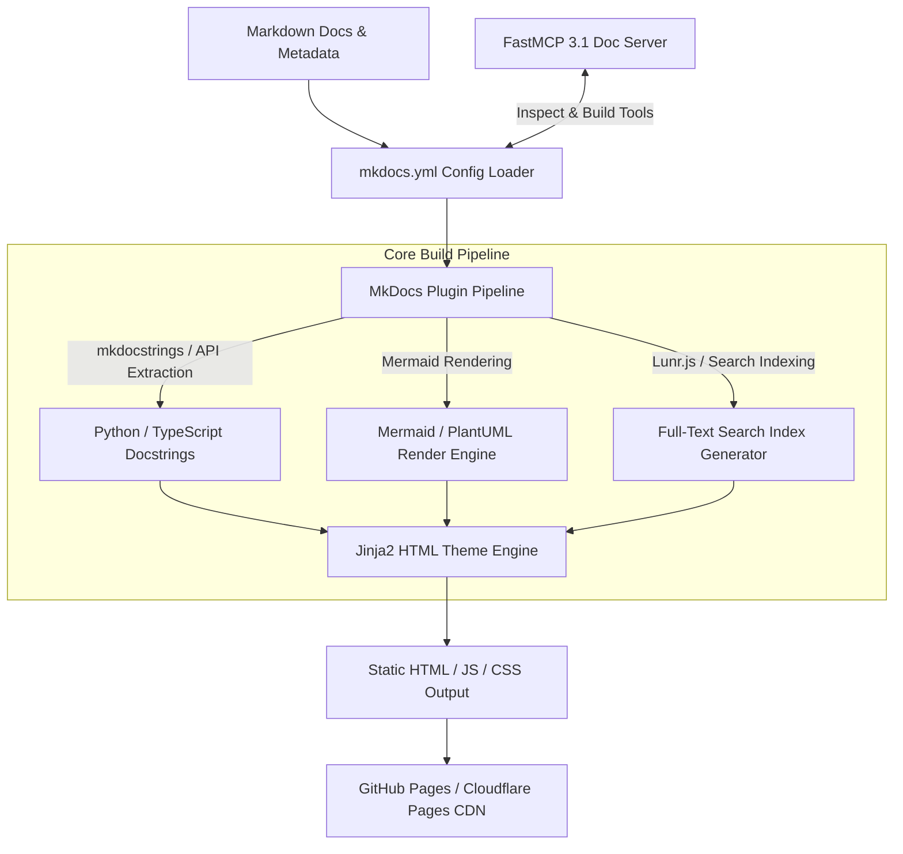

# MkDocs

## What it is
MkDocs is a fast, flexible, and developer-friendly static site generator specifically architected for technical documentation hubs and developer knowledge portals. Written in Python, MkDocs converts plain Markdown source files into clean, search-indexed HTML documentation websites configured via a unified `mkdocs.yml` manifest. As of early 2027, MkDocs—particularly when paired with the widely adopted Material for MkDocs framework—serves as a primary visual and structured knowledge presentation layer for AI agent systems, Model Context Protocol (MCP) tool directories, developer platforms, and enterprise architectural decision records (ADRs).

In modern agentic ecosystems, MkDocs operates both as a human-readable web portal and as a structured document compilation engine. Automated documentation workflows compile agent schemas, OpenAPI specifications, and FastMCP 3.1 server documentation into static assets that are indexed for instant full-text search, published to edge CDNs (GitHub Pages, Cloudflare Pages, Vercel, Netlify), and exposed to AI agents via structured inspection tools.



## What problem it solves
Maintaining software documentation across rapid engineering cycles frequently results in severe presentation and freshness challenges:

1. **Fragmented Repository Knowledge**: Disorganized Markdown files scattered across dozens of git repositories are difficult for human developers and AI context retrievers to discover without a centralized, structured portal.
2. **Heavyweight Build Toolchain Overhead**: Complex JavaScript or SSG frameworks (like Docusaurus or Next.js) often introduce heavy node_modules dependencies, complex build configurations, and slow CI compilation times just to publish technical reference manuals.
3. **Stale API & Schema Documentation**: Manual publishing pipelines fail to keep pace with code updates, leading to version drift between deployed code and published developer guides.
4. **Poor Context Searchability**: Plain Git repositories lack instant client-side full-text search, syntax highlighting, cross-linking validation, and tabbed code sample rendering.

MkDocs eliminates these bottlenecks by providing a lightweight, fast, Git-native compilation engine that transforms version-controlled Markdown directory trees into production-grade static documentation portals with zero runtime server dependencies.

## Where it fits in the stack
**Category**: Development & Ops / Static Site Generation & Technical Publishing.

MkDocs sits at the output and presentation tier of the technical knowledge ops pipeline:

- **Upstream Inputs**: Pulls raw Markdown files, Pydantic v2 schemas, FastMCP 3.1 tool docstrings, OpenAPI JSON specs, and architectural diagrams from Git repositories.
- **Compilation Engine**: Executes Python-based plugin chains (`mkdocstrings`, `mkdocs-material`, `mkdocs-minify-plugin`, `mkdocs-git-revision-date-localized-plugin`) to process Markdown and generate static HTML/JS/CSS assets.
- **Downstream Targets**: Deploys compiled static sites to GitHub Pages, Cloudflare Pages, AWS S3 / CloudFront, Vercel, or air-gapped Nginx containers.

## Typical use cases
- **AI Agent Knowledge Portals**: Publishing centralized tool catalogs, system prompts, and architectural guidelines for human engineering teams and AI context indexing.
- **Automated API Reference Sites**: Generating real-time client library and SDK documentation directly from Python and TypeScript docstrings via `mkdocstrings`.
- **Enterprise ADR & Playbook Directories**: Storing and serving architectural decision records, security policies, and incident response playbooks with full-text client-side search.
- **Multi-Version Product Manuals**: Building version-aware documentation sites that allow users to toggle between different release branches (e.g., `v1.0`, `v2.0`, `latest`) using `mike`.
- **Internal Knowledge Bases for CI/CD**: Running live local preview servers (`mkdocs serve`) during development and triggering automated static builds on every merged pull request.

## Strengths
- **Simple & Expressive YAML Configuration**: Single-file `mkdocs.yml` control over site title, navigation hierarchy, themes, plugins, and custom CSS/JS assets.
- **Material for MkDocs Ecosystem**: Access to the industry-standard Material theme featuring instant client-side search, dark mode toggles, tabbed code blocks, interactive callouts, and responsive mobile design.
- **Docstring Auto-Extraction**: Native integration with `mkdocstrings` for auto-generating pristine API documentation directly from Python type annotations and docstrings.
- **Sub-Second Live Reloading**: Built-in development server (`mkdocs serve`) with instant file watching and live-reload browser updates for rapid editing feedback.
- **Zero-Config Git Deployment**: Single CLI command deployment (`mkdocs gh-deploy`) to publish static builds directly to `gh-pages` branches.
- **Rich Plugin Ecosystem**: Hundreds of community plugins supporting Mermaid diagrams, RSS feeds, PDF exports, minification, and Git revision history tracking.

## Limitations
- **Static Output Only**: Does not support dynamic server-side rendering (SSR), database-backed interactive components, or user authentication without external identity proxies (e.g., Cloudflare Access, Authentik, or OAuth2 proxies).
- **Python Runtime Dependency**: Requires a Python environment (`python >= 3.10`) and pip package setup for site compilation.
- **Compilation Scaling on Ultra-Large Sites**: Repositories containing over 20,000 Markdown pages may experience slower build times compared to Rust-based SSGs like mdBook or Zola.

## When to use it
- When authoring and maintaining software documentation using version-controlled Markdown files in Git repositories.
- When building developer portals, AI tool catalogs, or team playbooks requiring instant full-text search and rich technical formatting.
- When requiring automated docstring-to-documentation pipelines in Python or TypeScript projects.
- When deploying technical documentation to zero-cost static hosting providers like GitHub Pages, Vercel, or Cloudflare Pages.

## When not to use it
- For dynamic marketing portals or e-commerce websites requiring complex client-side user accounts, payment processing, or database state.
- For pure API reference portals where auto-generated interactive OpenAPI UIs (Redoc, Swagger UI, Stoplight) suffice on their own without general documentation content.
- When working in strict non-Python build environments where installing a Python runtime in CI pipelines is prohibited (consider mdBook or Hugo).

## Getting started

### 1. Installation & Environment Setup
Create a Python virtual environment and install MkDocs along with the Material for MkDocs theme and key extensions:

```bash
# Create and activate virtual environment
python3 -m venv .venv
source .venv/bin/activate

# Install MkDocs and essential plugins
pip install mkdocs mkdocs-material mkdocstrings[python] mkdocs-minify-plugin
```

### 2. Initialize Documentation Structure
Initialize a new MkDocs project repository:

```bash
mkdocs new my-docs-hub
cd my-docs-hub
ls -la
```

### 3. Launch Development Live-Reload Server
Start the local development server to edit and preview docs in real time:

```bash
mkdocs serve --dev-addr 127.0.0.1:8000
```
Open `http://127.0.0.1:8000` in your web browser.

## CLI examples

### 1. Build Production Static Distribution
Compile the Markdown source tree into optimized HTML, CSS, JavaScript, and search index assets in the `site/` directory with strict warning validation:

```bash
mkdocs build --strict --clean
```

### 2. Live-Reload Development Server on Custom Port
Run the preview server bound to all network interfaces for containerized or remote server environments:

```bash
mkdocs serve -a 0.0.0.0:8080 --livereload
```

### 3. Deploy Directly to GitHub Pages
Clean, build, and publish the compiled static site to the repository's `gh-pages` branch:

```bash
mkdocs gh-deploy --clean --message "docs: automated deployment via MkDocs CLI [ci skip]"
```

### 4. Manage Multi-Version Documentation with Mike
Deploy versioned documentation branches (e.g., `v2.4`, `latest`) using `mike`:

```bash
# Install mike version manager
pip install mike

# Deploy current branch as v2.4 and set as default alias
mike deploy --update-aliases 2.4 latest
mike set-default latest
```

## API examples

### FastMCP 3.1 MkDocs Management Server (Python)
This FastMCP 3.1 tool server enables AI agents to inspect, validate, compile, and deploy MkDocs sites programmatically:

```python
from typing import Dict, Any, List, Optional
from mcp.server.fastmcp import FastMCP
from pydantic import BaseModel, Field, FilePath
import subprocess
import os
import yaml
import json

mcp = FastMCP(
    "MkDocs-Management-Server",
    instructions="FastMCP 3.1 server for programmatically auditing, compiling, and deploying MkDocs documentation hubs."
)

class MkDocsBuildRequest(BaseModel):
    config_file: str = Field(default="mkdocs.yml", description="Path to mkdocs.yml configuration file")
    strict: bool = Field(default=True, description="Enable strict mode (fails on warnings)")
    site_dir: str = Field(default="site", description="Output directory for generated static assets")

class NavigationEntry(BaseModel):
    title: str = Field(..., description="Navigation tab or item title")
    path: str = Field(..., description="Relative Markdown file path or sub-navigation list")

class MkDocsConfigAudit(BaseModel):
    site_name: str = Field(..., description="Name of the documentation site")
    site_url: Optional[str] = Field(None, description="Canonical site URL")
    theme_name: str = Field(..., description="Selected theme, e.g. material")
    plugins: List[str] = Field(default_factory=list, description="Enabled plugin names")
    strict_compliant: bool = Field(default=True, description="Whether strict compilation passes")

@mcp.tool()
async def audit_mkdocs_config(config_path: str = "mkdocs.yml") -> Dict[str, Any]:
    """
    Parses and audits an mkdocs.yml configuration file using Pydantic v2 validation.
    """
    if not os.path.exists(config_path):
        return {"error": f"Configuration file not found: {config_path}"}

    with open(config_path, "r", encoding="utf-8") as f:
        raw_config = yaml.safe_load(f) or {}

    theme_info = raw_config.get("theme", {})
    theme_name = theme_info.get("name", "mkdocs") if isinstance(theme_info, dict) else str(theme_info)

    raw_plugins = raw_config.get("plugins", ["search"])
    plugins_list = []
    for p in raw_plugins:
        if isinstance(p, str):
            plugins_list.append(p)
        elif isinstance(p, dict):
            plugins_list.extend(list(p.keys()))

    audit_result = MkDocsConfigAudit(
        site_name=raw_config.get("site_name", "Untitled Site"),
        site_url=raw_config.get("site_url"),
        theme_name=theme_name,
        plugins=plugins_list,
        strict_compliant=True
    )

    return audit_result.model_dump()

@mcp.tool()
async def build_mkdocs_site(request: MkDocsBuildRequest) -> Dict[str, Any]:
    """
    Executes an mkdocs build command and returns compilation logs and status.
    """
    cmd = ["mkdocs", "build", "-f", request.config_file, "-d", request.site_dir]
    if request.strict:
        cmd.append("--strict")

    try:
        result = subprocess.run(cmd, capture_output=True, text=True, check=True)
        return {
            "status": "success",
            "site_dir": request.site_dir,
            "stdout": result.stdout,
            "message": "MkDocs site compiled successfully."
        }
    except subprocess.CalledProcessError as e:
        return {
            "status": "error",
            "exit_code": e.returncode,
            "stdout": e.stdout,
            "stderr": e.stderr,
            "message": "MkDocs build failed. Inspect stderr for details."
        }

if __name__ == "__main__":
    mcp.run()
```

### Pydantic v2 Configuration & Build Manifest Validator
Comprehensive Pydantic v2 schemas for validating full `mkdocs.yml` structure, theme features, and build output metrics:

```python
from pydantic import BaseModel, Field, HttpUrl, field_validator
from typing import List, Dict, Union, Optional
import yaml

class MaterialPalette(BaseModel):
    media: Optional[str] = Field(None, description="CSS media query for theme switching")
    scheme: str = Field(default="default", description="Color scheme: default or slate")
    primary: str = Field(default="indigo", description="Primary color")
    accent: str = Field(default="indigo", description="Accent color")

class MaterialThemeConfig(BaseModel):
    name: str = Field(..., description="Theme framework name")
    language: str = Field(default="en", description="UI language code")
    palette: Optional[Union[MaterialPalette, List[MaterialPalette]]] = None
    features: List[str] = Field(default_factory=list, description="Material UI features enabled")

    @field_validator("name")
    @classmethod
    def validate_theme_name(cls, v: str) -> str:
        if v not in ["material", "mkdocs", "readthedocs"]:
            raise ValueError(f"Unsupported theme: {v}. Recommended theme is 'material'.")
        return v

class MkDocsManifestValidator(BaseModel):
    site_name: str = Field(..., min_length=1, max_length=200, description="Site header title")
    site_url: Optional[HttpUrl] = Field(None, description="Published website URL")
    site_author: Optional[str] = Field(None, description="Author / Organization name")
    theme: MaterialThemeConfig
    docs_dir: str = Field(default="docs", description="Source markdown directory")
    site_dir: str = Field(default="site", description="Compiled output directory")
    use_directory_urls: bool = Field(default=True, description="Generate directory-style clean URLs")

# Example Validation Execution
raw_yaml = """
site_name: "Knowledge Ops Documentation"
site_url: "https://knowledge.example.com"
site_author: "Knowledge Ops Team"
docs_dir: "docs"
site_dir: "site"
use_directory_urls: true
theme:
  name: "material"
  language: "en"
  features:
    - navigation.instant
    - navigation.tracking
    - search.suggest
    - content.code.copy
"""

config_dict = yaml.safe_load(raw_yaml)
validated_config = MkDocsManifestValidator.model_validate(config_dict)
print(f"Configuration for '{validated_config.site_name}' validated successfully!")
print(f"Theme: {validated_config.theme.name} with {len(validated_config.theme.features)} UI features.")
```

## Related tools / concepts
- [GitHub Pages](github-pages.md) — Premier static site hosting platform tightly integrated with MkDocs deployment workflows.
- [Vercel](vercel.md) — Edge static host for instant preview deployments of compiled MkDocs sites.
- [Desktop Commander MCP](desktop-commander-mcp.md) — Local system execution tool for controlling documentation build scripts.
- [Docling MCP](../process_understanding/docling-mcp.md) — Document parsing pipeline for ingesting external documentation into Markdown source trees.

## Sources / references
- [MkDocs Official Website & Documentation](https://www.mkdocs.org/)
- [Material for MkDocs Documentation Hub](https://squidfunk.github.io/mkdocs-material/)
- [mkdocstrings: Automatic Documentation from Code](https://mkdocstrings.github.io/)
- [Mike: Managing Multiple Versions of MkDocs Sites](https://github.com/jimporter/mike)
- [FastMCP 3.1 Specification Standard](https://modelcontextprotocol.io)

## Contribution Metadata
- Last reviewed: 2027-01-07
- Confidence: high
