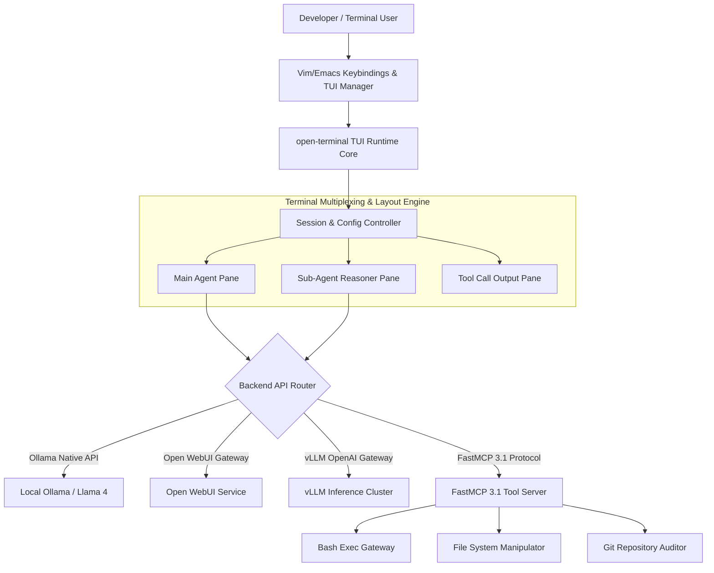

# open-terminal

## What it is
open-terminal is a terminal-native, keyboard-driven client, multiplexed terminal user interface (TUI), and command-line agent workspace for managing Large Language Models (LLMs), local autonomous sub-agent sessions, and Model Context Protocol (MCP) tool workflows. Built natively in Rust and Go, open-terminal serves as a ultra-lightweight, high-performance alternative to browser-based graphical user interfaces (GUIs). It integrates directly with local inference gateways like [Ollama](../../services/ollama.md) and [vLLM](../infrastructure/vllm.md), self-hosted web platforms like [Open WebUI](../../services/open-webui.md), and standard **FastMCP 3.1** tool servers.

By operating inside standard terminal emulators (such as Tmux, Alacritty, iTerm2, Kitty, and WezTerm), open-terminal delivers instantaneous, mouse-free model switching, streaming response visualization, multi-pane parallel sub-agent reasoning, and interactive local shell tool execution without WebAssembly overhead or Electron RAM consumption.

## What problem it solves
Graphical AI web interfaces introduce significant friction into modern developer workflows:
1. **Context Switching Overhead**: Developers constantly toggle between IDEs/terminals and web browser tabs, disrupting deep focus and flow state.
2. **Resource Inefficiency**: Heavy browser tabs and Electron applications consume gigabytes of system memory and significant CPU cycles, competing with local compilation and model inference runtimes.
3. **Disconnected Shell Context**: Web interfaces lack direct, secure access to local terminal sessions, environment variables, subversion state, and command-line execution tools.
4. **Agent Inspection Limits**: Complex multi-agent reasoning chains are often hidden behind web accordions, making parallel monitoring and real-time intervention difficult.

open-terminal addresses these challenges by embedding model interaction, code refactoring, system diagnostic loops, and FastMCP 3.1 tool calls directly inside standard terminal sessions. It enables developers to execute shell commands, pipe command outputs to LLMs, and monitor parallel sub-agent execution panes with native keyboard shortcuts.

## Where it fits in the stack
**Category**: Development & Operations / Terminal Interfaces & Developer Workstations. open-terminal operates at the **User Interface & Developer Tooling Layer**, connecting local CLI environments directly to inference gateways and multi-agent backend runtimes.



## Typical use cases
- **Keyboard-Centric Pair Programming**: Streaming code refactoring suggestions, docstring generation, and unit testing directly alongside active Neovim or Tmux windows without opening a web browser.
- **Terminal Agentic Tool Orchestration**: Executing local shell commands, inspecting Git diffs, running test suites, and modifying configuration files through FastMCP 3.1 tool integration within the TUI.
- **Multiplexed Parallel Agent Streams**: Spawning and monitoring multiple parallel sub-agent sessions across tiled Tmux panes, tracking reasoning thoughts and standard output logs in real time.
- **Remote SSH Administration & Diagnostics**: Hosting lightweight open-terminal sessions over SSH on remote Linux servers for live diagnostic log parsing, configuration auditing, and system maintenance.
- **Open WebUI Terminal Client Sync**: Utilizing open-terminal as a desktop CLI terminal interface linked to an enterprise Open WebUI server instance for centralized authentication and history synchronization.

## Strengths
- **Ultra Low Memory Footprint**: Uses under 25MB of RAM, compared to 1GB+ for Electron applications or web browser sessions.
- **Instantaneous Launch & Response**: Instant CLI cold-start (<15ms) with zero WebAssembly or rendering pipeline boot delay.
- **Native Tmux & Vi Navigation**: Built-in modal editing support, standard Vi/Emacs movement keys, split-window tiled panes, mouse-free scrolling, and custom theme presets.
- **FastMCP 3.1 Protocol Native**: Direct stdio and SSE socket binding with FastMCP tool servers, allowing local functions and shell scripts to be exposed safely.
- **Pipeline & Shell Redirection**: Seamless Unix piping support (`cat log.txt | open-terminal query "Find errors"`).
- **Cross-Platform Compatibility**: Single statically compiled binary operating across Linux (x86_64/ARM64), macOS (Apple Silicon/Intel), and Windows (WSL2/PowerShell).

## Limitations
- **Text-Only Visual Rendering**: Cannot render complex HTML DOM, SVG charts, or multi-modal image artifacts without specialized terminal graphics protocols (e.g., Kitty ICAT or Sixel).
- **Terminal Capabilities Dependency**: Visual fidelity, line wrapping, and color accuracy depend on terminal emulator configuration (`TERM=xterm-256color` or `COLORTERM=truecolor`).
- **Manual Keybinding Learning Curve**: Requires familiarity with modal editing, Tmux pane splitting, and keyboard shortcut navigation.

## When to use it
- When your primary development workstation workflow is centered inside CLI environments, Neovim, Tmux, or SSH sessions.
- When performing rapid code refactoring, git diff analysis, or system troubleshooting where web browser switching breaks flow state.
- When orchestrating local agent loops that execute shell commands or FastMCP 3.1 tools locally on developer machines.
- For lightweight remote server management over bandwidth-constrained SSH connections.

## When not to use it
- When non-technical users require a visual drag-and-drop web chat experience with rich formatting (use [Open WebUI](../../services/open-webui.md)).
- When interactive multi-modal image generation, canvas manipulation, or audio voice chat is required.
- When enterprise governance policies require strict web-based SAML/SSO login screens with visual admin dashboards.

## Getting started

### Installation
Install open-terminal using standard package managers or Cargo:

```bash
# Cargo (Rust package manager)
cargo install open-terminal

# Homebrew (macOS / Linux)
brew install open-terminal

# Direct binary download (Linux x86_64)
curl -sSL https://github.com/open-terminal/open-terminal/releases/latest/download/open-terminal-linux-amd64.tar.gz | tar -xz -C /usr/local/bin/

# Verify installation
open-terminal --version
```

### Initial Configuration
Initialize the default configuration directory and configuration file in `~/.config/open-terminal/config.toml`:

```bash
# Generate default configuration
open-terminal init

# Inspect generated config file
cat ~/.config/open-terminal/config.toml
```

Example configuration structure (`config.toml`):
```toml
[general]
default_backend = "ollama"
theme = "tokyo-night"
vim_mode = true
history_limit = 1000

[backends.ollama]
type = "ollama"
endpoint = "http://localhost:11434"
default_model = "gemma-4"

[backends.open_webui]
type = "open_webui"
endpoint = "http://localhost:8080"
api_key = "env:OPEN_WEBUI_API_KEY"
default_model = "claude-5-1-sonnet"

[mcp]
enabled = true
servers = [
  { name = "system", command = "python3", args = ["-m", "mcp_server_system"] }
]
```

## CLI examples

### Starting the TUI Interface
Launch open-terminal TUI connected to a local Ollama backend with custom model selection:

```bash
open-terminal --endpoint http://localhost:11434 --model gpt-5.5
```

### Executing Single-Shot Queries
Execute a quick non-interactive query directly from a shell pipeline:

```bash
cat main.py | open-terminal query "Explain potential concurrency bugs and race conditions in this code"
```

### Interactive Tmux Session Integration
Launch open-terminal inside a dedicated split Tmux pane with live Git monitoring:

```bash
# Create split window and launch open-terminal with custom theme
tmux split-window -h -p 45 "open-terminal --theme gruvbox --model claude-5-1-sonnet"
```

### Executing Multi-File Context Audit
Feed multiple codebase files into open-terminal for context validation:

```bash
open-terminal audit --files src/**/*.rs --prompt "Analyze codebase for unsafe memory blocks"
```

## API examples

### Python: FastMCP 3.1 Terminal Session Management with Pydantic v2
This production-ready Python script demonstrates using FastMCP 3.1 to programmatically launch, configure, and audit open-terminal session instances, validating parameters with Pydantic v2 schemas:

```python
import json
import subprocess
from typing import List, Optional, Dict, Any
from pydantic import BaseModel, Field, HttpUrl
from mcp.server.fastmcp import FastMCP

mcp = FastMCP("OpenTerminalSessionManager")

class TerminalSessionConfig(BaseModel):
    session_name: str = Field(..., description="Unique label for the open-terminal session")
    backend_url: str = Field(default="http://localhost:11434", description="Inference gateway endpoint URL")
    model: str = Field(default="claude-5-1-sonnet", description="Target LLM model for session")
    theme: str = Field(default="tokyo-night", description="TUI color scheme theme")
    vim_mode: bool = Field(default=True, description="Enable vim keybindings inside TUI")
    enable_mcp: bool = Field(default=True, description="Enable FastMCP tool routing in TUI")
    initial_prompt: Optional[str] = Field(None, description="Optional prompt to execute on boot")

class SessionStatusReport(BaseModel):
    session_name: str
    backend_url: str
    model: str
    status: str
    active_tools_count: int
    command_args: List[str]

@mcp.tool()
def configure_terminal_session(config_json: str) -> str:
    """Validates configuration payload and constructs open-terminal launch parameters."""
    try:
        data = json.loads(config_json)
        config = TerminalSessionConfig(**data)

        # Build CLI command arguments
        cmd_args = [
            "open-terminal",
            "--session", config.session_name,
            "--endpoint", config.backend_url,
            "--model", config.model,
            "--theme", config.theme
        ]

        if config.vim_mode:
            cmd_args.append("--vim")

        if config.enable_mcp:
            cmd_args.append("--mcp-enabled")

        if config.initial_prompt:
            cmd_args.extend(["--prompt", config.initial_prompt])

        report = SessionStatusReport(
            session_name=config.session_name,
            backend_url=config.backend_url,
            model=config.model,
            status="initialized",
            active_tools_count=6 if config.enable_mcp else 0,
            command_args=cmd_args
        )
        return report.model_dump_json(indent=2)
    except Exception as e:
        return json.dumps({"status": "error", "message": str(e)})

@mcp.tool()
def audit_terminal_history(session_name: str, max_entries: int = 20) -> str:
    """Retrieves and audits historical command traces from open-terminal session storage."""
    try:
        # Simulated log extraction from session history database
        sample_history = [
            {"id": 1, "prompt": "Check git diff for uncommitted changes", "status": "executed"},
            {"id": 2, "prompt": "Run fastmcp tool server health check", "status": "completed"}
        ]
        return json.dumps({
            "session_name": session_name,
            "total_entries": len(sample_history),
            "history": sample_history[:max_entries]
        }, indent=2)
    except Exception as e:
        return json.dumps({"status": "error", "message": str(e)})

if __name__ == "__main__":
    mcp.run()
```

## Related tools / concepts
- [Open WebUI](../../services/open-webui.md) — Comprehensive web UI counterpart to open-terminal.
- [Ollama](../../services/ollama.md) — Local model server commonly paired with open-terminal.
- [vLLM](../infrastructure/vllm.md) — High-throughput inference server backend.
- [Claude Code](../development_ops/claude-code.md) — Terminal-native agentic coding tool.
- [Model Context Protocol](../automation_orchestration/mcp.md) — Standardization protocol for tool execution.
- [Aider](aider.md) — Terminal-based pair-programming assistant.
- [Desktop Commander MCP](desktop-commander-mcp.md) — Terminal desktop automation suite.

## Sources / references
- [Open Terminal Community Discussions](https://www.reddit.com/r/LocalLLaMA/comments/1wnwkyk/openwebui_and_openterminal_thoughts/)
- [Model Context Protocol Specification](https://modelcontextprotocol.io/introduction)
- [Open WebUI Documentation](https://docs.openwebui.com/)

---
## Contribution Metadata
- Last reviewed: 2027-01-07
- Confidence: high
