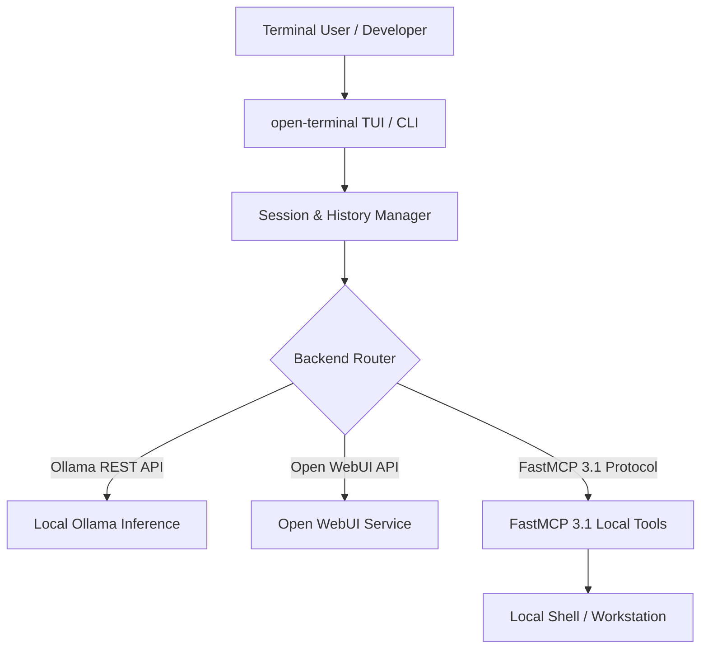

# open-terminal

## What it is
open-terminal is a terminal-native, keyboard-driven client and TUI interface for managing LLMs, local agentic sessions, and MCP tool workflows. As of early 2027, open-terminal serves as a lightweight alternative to graphical web interfaces, providing developers and terminal enthusiasts with instant model switching, multiplexed sub-agent sessions, and seamless integration with [Open WebUI](../services/open-webui.md) backends, [Ollama](../services/ollama.md), and **FastMCP 3.1** tool servers.

## What problem it solves
Graphical web interfaces (UIs) can be heavy, require browser context switching, and lack direct integration with local shell environments. open-terminal solves this by embedding conversational LLM interaction, code execution, and MCP tool routing directly into standard terminal sessions (supporting Tmux, Alacritty, iTerm2, and Kitty) with zero WebAssembly or web browser overhead.

## Where it fits in the stack
**Category**: Development & Operations / Terminal Interfaces. open-terminal operates at the **User Interface & Developer Tooling Layer**, connecting local terminal workstations directly to inference gateways and agent backends.



## Typical use cases
- **Keyboard-Centric LLM Chatting**: Fast model interaction and streaming directly inside terminal windows without browser tabs.
- **Terminal Agentic Workflows**: Executing shell scripts, code refactoring, and file edits via FastMCP 3.1 tool calls within the TUI.
- **Multiplexed Sub-Agent Monitoring**: Viewing parallel sub-agent reasoning chains and stdout streams in tiled terminal panes.
- **Open WebUI Sync**: Utilizing open-terminal as a lightweight terminal client connected to an Open WebUI backend server.

## Strengths
- **Ultra Low Memory Footprint**: Written in Rust/Go, using minimal CPU/RAM compared to Electron or WebAssembly browsers.
- **Tmux & TUI Integration**: Native support for vim navigation keys, split panes, mouse mouse-free keybindings, and custom themes.
- **FastMCP 3.1 Compliant**: Direct execution of local FastMCP servers and tool definitions.
- **Cross-Platform**: Operates natively on Linux, macOS, and Windows (WSL/PowerShell).

## Limitations
- **Text-Only Rendering**: Cannot natively display rich HTML or image artifacts without terminal graphics protocols (e.g., Kitty ICAT).
- **Terminal Configuration Dependency**: Requires proper terminal color, font, and keybinding setup for optimal visual rendering.

## When to use it
- When working primarily in CLI environments or SSH remote sessions without desktop GUI access.
- For quick paired coding sessions where terminal context switching needs to be minimized.
- When managing multiple concurrent agent streams via terminal multiplexers like Tmux.

## When not to use it
- When non-technical users require a visual, drag-and-drop web chat experience (use [Open WebUI](../services/open-webui.md)).
- When rendering complex multi-modal image generation and canvas interfaces is necessary.

## Getting started

### Installation
Install open-terminal using standard package managers or Cargo:
```bash
# Cargo (Rust)
cargo install open-terminal

# Homebrew
brew install open-terminal
```

### Initial Configuration
Initialize the default config file:
```bash
open-terminal init
```

## CLI examples

### Starting the TUI Interface
Launch open-terminal TUI connected to local Ollama:
```bash
open-terminal --endpoint http://localhost:11434 --model gpt-5.5
```

### Executing Single-Shot Queries
Execute a quick query directly from the shell pipeline:
```bash
cat main.py | open-terminal query "Explain potential concurrency bugs in this file"
```

## API examples

### Python: FastMCP 3.1 Terminal Session Management with Pydantic v2
This production-ready Python script demonstrates using FastMCP 3.1 to manage open-terminal session configurations and validate command parameters via Pydantic v2:

```python
import json
from pydantic import BaseModel, Field
from mcp.server.fastmcp import FastMCP

mcp = FastMCP("OpenTerminalSessionManager")

class TerminalSessionConfig(BaseModel):
    session_name: str = Field(..., description="Name of the open-terminal session")
    backend_url: str = Field(default="http://localhost:11434", description="Inference backend endpoint")
    model: str = Field(default="claude-5-1-sonnet", description="Target model for session")
    enable_mcp: bool = Field(default=True, description="Enable FastMCP tool routing")

class SessionStatusReport(BaseModel):
    session_name: str
    status: str
    active_tools_count: int

@mcp.tool()
def configure_terminal_session(config_json: str) -> str:
    """Validates configuration and initializes an open-terminal session instance."""
    try:
        data = json.loads(config_json)
        config = TerminalSessionConfig(**data)

        # Simulated setup logic
        report = SessionStatusReport(
            session_name=config.session_name,
            status="active",
            active_tools_count=5 if config.enable_mcp else 0
        )
        return report.model_dump_json(indent=2)
    except Exception as e:
        return json.dumps({"status": "error", "message": str(e)})

if __name__ == "__main__":
    mcp.run()
```

## Related tools / concepts
- [Open WebUI](../services/open-webui.md) — Comprehensive web UI counterpart to open-terminal.
- [Ollama](../services/ollama.md) — Local model server commonly paired with open-terminal.
- [Claude Code](claude-code.md) — Terminal-native coding agent CLI.
- [Model Context Protocol](../automation_orchestration/mcp.md) — Tool protocol supported by open-terminal.
- [Aider](aider.md) — Terminal-based pair-programming tool.

## Sources / references
- [Open Terminal Community Discussions](https://www.reddit.com/r/LocalLLaMA/comments/1wnwkyk/openwebui_and_openterminal_thoughts/)
- [Model Context Protocol Specification](https://modelcontextprotocol.io/introduction)

---
## Contribution Metadata
- Last reviewed: 2027-01-07
- Confidence: high
