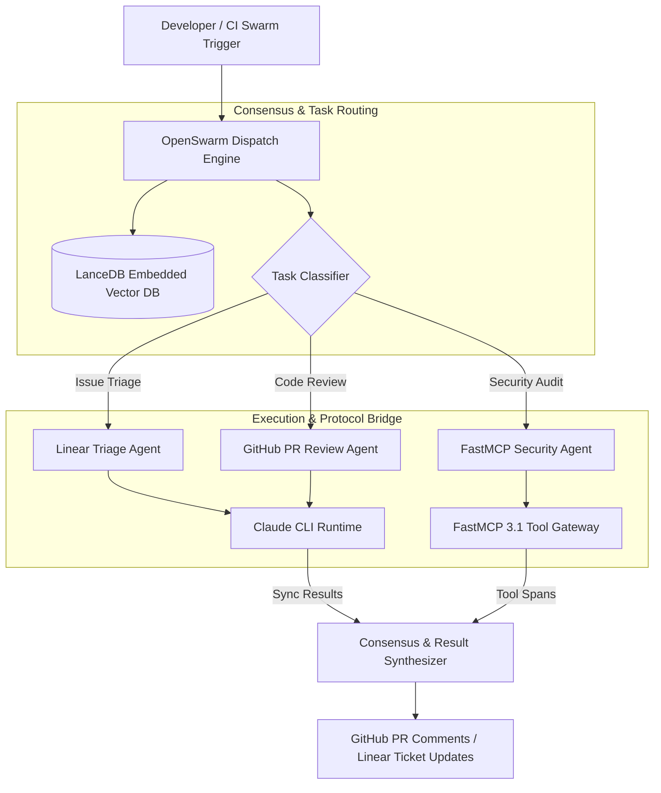

# OpenSwarm

## What it is
OpenSwarm is an open-source, multi-agent orchestrator for terminal workflows and developer tools, designed to manage complex parallel tasks across platforms like Linear, GitHub, and local Git repositories. It leverages Anthropic's Claude CLI and frontier reasoning models (including Claude 5.6, GPT-5.6, DeepSeek-V4, and Qwen 3.6) to automate repetitive software development, issue triage, code review, and project management tasks.

As of early January 2027, OpenSwarm features native support for the **Model Context Protocol (MCP 3.1)** and **FastMCP 3.1** Task Protocols, enabling seamless coordination of complex, long-running agentic tasks across multi-agent clusters with state persistence in embedded stores like LanceDB.



## What problem it solves
Managing software projects across modern issue trackers (Linear) and version control hosts (GitHub) requires continuous human context switching. Developer tasks like issue labeling, initial bug reproduction, security checks, and PR code reviews are often executed piecemeal by single-threaded AI assistants, causing context fragmentation and race conditions.

OpenSwarm simplifies the coordination of multiple AI agents performing complex, interdependent tasks across project management and version control systems. It acts as a multi-threaded swarm controller, decomposing high-level directives into parallel agent sub-tasks, enforcing transactional execution safety, and ensuring that no single agent alters code or project state without consensus.

## Where it fits in the stack
**Agent / Orchestrator**. It acts as the management layer that dispatches tasks to multiple instances of the Claude CLI or custom LLM endpoints, coordinating their outputs and maintaining long-term project context across enterprise repositories.

- **Developer Tooling Layer**: Interacts directly with developer terminals, Git repositories, and command-line interfaces.
- **Orchestration Layer**: Manages parallel worker agents, task dependencies, and state checkpoints.
- **Protocol & Vector Layer**: Uses [FastMCP 3.1](../automation_orchestration/mcp.md) for tool interfaces and [LanceDB](../infrastructure/lancedb.md) for local RAG and context persistence.

## Typical use cases
- **Automated Issue Management**: Using agents to triage, label, and respond to Linear issues with DeepSeek-V4 and Claude 5.6 reasoning.
- **Pull Request Orchestration**: Coordinating multiple specialized agents (security, style, performance) to review code, run test suites, and suggest improvements on GitHub.
- **CLI-based Agent Loops**: Running complex multi-step agentic tasks directly from the terminal with FastMCP 3.1 protocol task state persistence.
- **Context & Documentation Synthesis**: Summarizing long discussion threads across multiple platforms to provide actionable next steps and maintain project documentation.

## Strengths
- **Native Claude CLI Integration**: Leverages Anthropic's official CLI tools for robust local terminal interaction.
- **Workflow Focused**: Specifically tuned for core engineering tools (Linear, GitHub, local Git repositories).
- **Open Source & Extensible**: Fully customizable agent roles, prompt templates, and execution strategies.
- **Parallel Swarm Execution**: Manages a "swarm" of agents working in parallel on different parts of a codebase or issue backlog without state collisions.
- **Frontier Model Support**: Optimized for [Claude 5.6](../providers/anthropic.md), [GPT-5.6](../ai_knowledge/openai.md), and [DeepSeek-V4](../providers/deepseek.md).

## Limitations
- **Ecosystem Focus**: Highly optimized for Linear and GitHub; integrations with other platforms (Jira, GitLab) require custom driver modules.
- **CLI Dependency**: Requires active local CLI tools and node runtimes on the host machine.
- **API Token Consumption**: Running dense multi-agent swarms in parallel increases token consumption across active LLM providers.

## When to use it
- When you need to coordinate multiple agentic tasks across Linear and GitHub using Claude or frontier reasoning models.
- For engineering teams looking for a CLI-first approach to multi-agent orchestration and PR review automation.
- When automating the "human-in-the-loop" triage process for high-volume repositories.

## When not to use it
- For general-purpose GUI-driven non-technical automation that doesn't involve software repositories or developer issue trackers.
- When working with enterprise platforms not yet supported by the OpenSwarm ecosystem (e.g., legacy SVN or on-premise Jira) without building custom adapter drivers.

## Getting started

### Installation
OpenSwarm can be installed via npm or cloned directly from GitHub:

```bash
npm install -g @intrect/openswarm
```

### Environment Configuration
Configure your environment variables for platform access:

```bash
export ANTHROPIC_API_KEY="sk-ant-your-key-here"
export LINEAR_API_KEY="lin_api_your_key_here"
export GITHUB_TOKEN="ghp_your_github_token_here"
export OPENSWARM_DB_PATH="$HOME/.openswarm/lancedb"
```

## CLI examples

### Triaging Linear Issues
Run an agent swarm to triage new issues in a specific Linear team, applying labels based on AI analysis:

```bash
openswarm linear triage --team "ENG" --auto-label --confidence-threshold 0.85
```

### GitHub PR Review Swarm
Initiate a swarm of parallel agents to review a specific Pull Request with specialized strategies:

```bash
openswarm github review --pr 42 --strategy "security,performance,style" --format markdown
```

### Context and Knowledge Management
OpenSwarm utilizes LanceDB for high-performance vector storage of project context. Sync local documentation or code to the vector store:

```bash
# Sync local documentation for RAG-based reasoning
openswarm context sync --path ./docs --db-path ~/.openswarm/lancedb
```

### Inspecting Active Swarm Status
```bash
openswarm status --session-id "swarm-session-9912"
```

## API examples

### Minimal Node.js Integration
OpenSwarm can be used programmatically to trigger swarms from custom automation scripts:

```javascript
import { OpenSwarm } from '@intrect/openswarm';

const swarm = new OpenSwarm({
  provider: 'anthropic',
  model: 'claude-5.6-opus-20270105',
  maxConcurrency: 4
});

await swarm.dispatch('linear', 'triage', {
  team: 'ENG',
  autoAssign: true
});
```

### FastMCP 3.1 Task Server Integration
The following Python script implements a **FastMCP 3.1** server that bridges OpenSwarm agent tasks with local terminal tool execution:

```python
from mcp.server.fastmcp import FastMCP
from pydantic import BaseModel, Field, ValidationError
from typing import List, Literal, Optional

mcp = FastMCP("openswarm-task-gateway")

class SwarmTaskSpec(BaseModel):
    task_id: str = Field(..., description="Unique identifier for the swarm subtask")
    strategy: Literal["security", "performance", "style", "triage"] = Field(..., description="Swarm execution strategy")
    target_resource: str = Field(..., description="Linear issue key or GitHub PR number")
    timeout_seconds: int = Field(default=300, ge=30, le=3600, description="Task execution timeout")

class SwarmTaskResult(BaseModel):
    task_id: str = Field(..., description="Task identifier")
    status: Literal["completed", "failed", "timed_out"] = Field(..., description="Execution outcome")
    summary: str = Field(..., description="Summary of findings or actions taken")
    action_items: List[str] = Field(default_factory=list, description="Actionable recommendations")

@mcp.tool(name="dispatch_openswarm_task", description="Dispatches a specialized OpenSwarm agent task")
def dispatch_openswarm_task(task_id: str, strategy: str, target_resource: str, timeout_seconds: int = 300) -> str:
    """FastMCP 3.1 tool for executing OpenSwarm agent tasks with Pydantic v2 validation."""
    try:
        spec = SwarmTaskSpec(
            task_id=task_id,
            strategy=strategy, # type: ignore
            target_resource=target_resource,
            timeout_seconds=timeout_seconds
        )

        # Simulate execution of OpenSwarm agent strategy
        result = SwarmTaskResult(
            task_id=spec.task_id,
            status="completed",
            summary=f"Successfully executed '{spec.strategy}' review for resource {spec.target_resource}.",
            action_items=["Enforce strict input sanitization on API endpoints", "Update unit tests for edge cases"]
        )

        return result.model_dump_json(indent=2)
    except ValidationError as ve:
        return f"Task specification validation failed: {ve}"

if __name__ == "__main__":
    mcp.run()
```

### Programmatic Python Session Handler (Pydantic v2)
Manage the state of multi-agent execution safely using Pydantic validation:

```python
from pydantic import BaseModel, Field, ValidationError
from typing import List, Literal, Optional

class AgentTask(BaseModel):
    agent_id: str = Field(..., alias="agentId", description="Unique agent instance identifier")
    strategy: Literal["security", "performance", "style", "triage"] = Field(..., description="Assigned analysis strategy")
    max_duration_seconds: int = Field(default=300, alias="maxDurationSeconds", ge=10, description="Maximum execution window")

class SwarmDispatchConfig(BaseModel):
    session_id: str = Field(..., alias="sessionId", description="Unique swarm session token")
    provider: str = Field(default="anthropic", description="Target LLM provider")
    model: str = Field(default="claude-5.6", description="Frontier model name")
    tasks: List[AgentTask] = Field(default_factory=list, description="Subtasks assigned to swarm workers")

    class Config:
        populate_by_name = True

def run_swarm_session(payload: dict) -> SwarmDispatchConfig:
    """Validates raw session payload and initializes OpenSwarm execution."""
    return SwarmDispatchConfig.model_validate(payload)

if __name__ == "__main__":
    dispatch_payload = {
        "sessionId": "swarm-session-abc-123",
        "provider": "anthropic",
        "model": "claude-5.6-opus",
        "tasks": [
            {"agentId": "agent-1", "strategy": "security", "maxDurationSeconds": 600},
            {"agentId": "agent-2", "strategy": "triage", "maxDurationSeconds": 180}
        ]
    }

    config = run_swarm_session(dispatch_payload)
    print(f"Validated swarm session: {config.session_id}")
    print(f"Dispatched {len(config.tasks)} agents using model {config.model}")
```

## Related tools / concepts
- [Claude Code](./claude-code.md) — Anthropic's CLI tool that OpenSwarm orchestrates.
- [Anthropic](../providers/anthropic.md) — The underlying LLM provider.
- [Multi-Agent Systems](../../knowledge_base/agent_protocols.md) — Architectural patterns for agent coordination.
- [Plandex](./plandex.md) — For complex, multi-file engineering tasks.
- [Aider](./aider.md) — Terminal-native pair programming.
- [Mentat](./mentat.md) — Multi-file AI editing.
- [Sweep](./sweep_dev.md) — For automating GitHub issues into PRs.
- [Superconductor](./superconductor.md) — Parallel agent sessions for rapid development.
- [FastMCP](../automation_orchestration/mcp.md) — High-performance Python framework for Model Context Protocol 3.1.
- [LanceDB](../infrastructure/lancedb.md) — Embedded vector database used for context persistence.

## Sources / references
- [OpenSwarm GitHub Repository](https://github.com/Intrect-io/OpenSwarm)
- [Anthropic Claude CLI Documentation](https://docs.anthropic.com/claude/docs/claude-cli)
- [Model Context Protocol Specification](https://modelcontextprotocol.io/)

---
## Contribution Metadata
- Last reviewed: 2027-01-07
- Confidence: high
