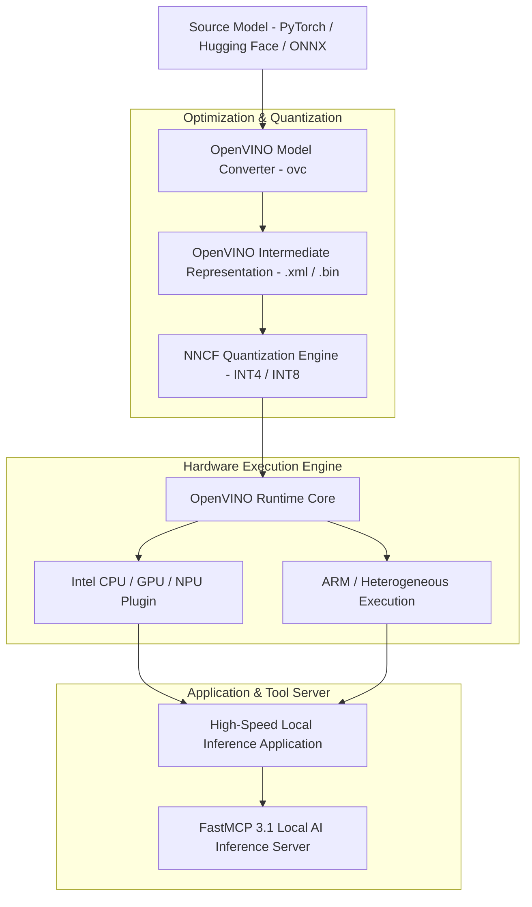
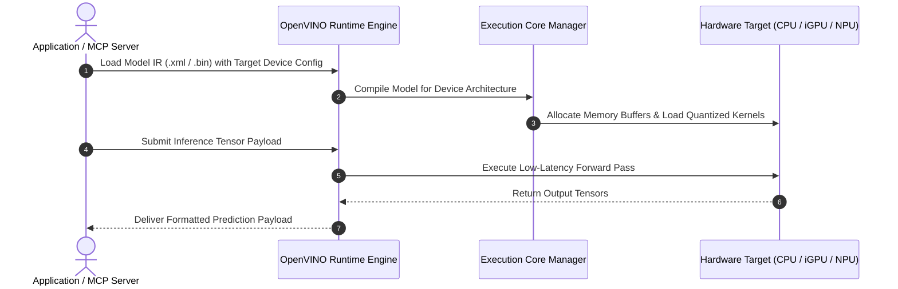

# OpenVINO

## What it is
OpenVINO (Open Visual Inference and Neural Network Optimization) is an open-source cross-platform AI inference optimization and deployment toolkit developed by Intel. Operating in 2027, OpenVINO allows developers to optimize, quantize, and execute AI models—including LLMs, vision transformers, diffusion pipelines, and speech models—across heterogeneous hardware platforms (Intel CPUs, Integrated/Discrete GPUs, NPUs, ARM processors, and edge devices).

OpenVINO converts models from PyTorch, TensorFlow, ONNX, and Hugging Face formats into its Intermediate Representation (IR), applying model graph optimizations, weight quantization (INT8, INT4, FP16), constant folding, and hardware-specific kernel execution. It enables ultra-low-latency local inference and energy-efficient AI execution on client and edge devices.



## What problem it solves
- **Hardware Lock-in & Portability**: Deploying AI models often ties software applications to specific GPU vendor APIs (CUDA). OpenVINO abstracts the underlying hardware, allowing the same model artifact to run efficiently across CPUs, GPUs, and NPUs.
- **Resource Constraints on Client & Edge Devices**: Large neural networks exceed memory and power limits on consumer laptops or edge devices. OpenVINO's NNCF (Neural Network Compression Framework) quantizes models to INT4/INT8 while retaining high accuracy.
- **High Cold-Start Latency**: Model initialization can take seconds on non-optimized runtimes. OpenVINO optimizes graph layout and model loading times.
- **CPU/NPU Underutilization**: Many workstations possess powerful CPUs or integrated NPUs that remain idle during AI tasks. OpenVINO offloads model subgraphs to available hardware acceleration units.

OpenVINO delivers cross-hardware acceleration, model graph optimization, and seamless deployment across edge and cloud infrastructure.

## Where it fits in the stack
**Category**: [Development & Operations Frameworks](index.md) / AI Inference & Hardware Acceleration Toolkit.

OpenVINO sits between model training frameworks and deployment runtimes:
- **Inference Optimization Layer**: Converts trained models into optimized Intermediate Representation (IR) artifacts.
- **Heterogeneous Hardware Engine**: Executes inference across CPUs, integrated GPUs, and neural processing units (NPUs).
- **Agent Execution Layer**: Exposes local accelerated AI capabilities to multi-agent orchestrators via FastMCP 3.1 endpoints.



## Typical use cases
- **Client-Side AI Acceleration**: Running LLMs and vision models locally on consumer laptops and AI PCs using integrated NPUs or GPUs.
- **Edge Computer Vision & Robotics**: Deploying low-latency object detection, visual quality inspection, and spatial tracking models on industrial IoT edge gateways.
- **Heterogeneous Inference Clusters**: Maximizing hardware utilization in server environments by serving models across combined CPU and GPU pools.
- **Local MCP Tool Execution**: Powering local FastMCP 3.1 tool servers with minimal latency and minimal VRAM overhead.

## Strengths
- **Comprehensive Hardware Support**: Optimized execution for Intel CPUs, iGPUs, Arc dGPUs, NPUs, and ARM platforms.
- **Advanced Model Compression**: NNCF provides state-of-the-art INT4 and INT8 weight quantization specifically tailored for LLMs and vision transformers.
- **Zero CUDA Dependency**: Enables high-performance local AI inference without requiring dedicated NVIDIA GPUs.
- **Seamless Hugging Face Integration**: Direct model loading via Optimum Intel (`optimum-cli` / `Optimum-OpenVINO`).

## Limitations
- **Conversion Step Required**: Maximum performance requires converting PyTorch/ONNX models into OpenVINO IR format.
- **Vendor Optimizations**: While cross-platform, the deepest kernel-level optimizations are tailored for Intel hardware architectures.

## When to use it
- When deploying AI applications on client devices, laptops, AI PCs, or edge servers lacking NVIDIA GPUs.
- When you need to leverage integrated NPUs or CPUs for low-power, low-latency model inference.
- When building lightweight, cross-platform FastMCP 3.1 local agent tools.

## When not to use it
- When deploying solely on NVIDIA-only enterprise server clusters where TensorRT is already standard.
- For raw model training or gradient backward passes (use PyTorch or Jax for training).

## Getting started

### 1. Installation
Install OpenVINO runtime and Optimum Intel wrapper:

```bash
pip install openvino openvino-dev optimum[openvino] fastmcp pydantic
```

### 2. Exporting a Model to OpenVINO IR
Convert a Hugging Face model using `optimum-cli`:

```bash
optimum-cli export openvino --model Qwen/Qwen2.5-0.5B-Instruct --task text-generation-with-past ./qwen_openvino_model
```

### 3. Basic Python Inference
```python
from openvino.runtime import Core
import numpy as np

core = Core()
# Query available execution devices
print("Available devices:", core.available_devices)

# Read compiled OpenVINO IR model
model = core.read_model("qwen_openvino_model/openvino_model.xml")
compiled_model = core.compile_model(model, device_name="AUTO")

print("OpenVINO model compiled successfully for device: AUTO")
```

## CLI examples

### Quantizing an LLM to INT4
Quantize a model to INT4 precision for edge execution:

```bash
optimum-cli export openvino \
  --model meta-llama/Llama-3.2-1B-Instruct \
  --weight-format int4 \
  --group-size 128 \
  --sym \
  ./llama3_2_int4_ov
```

### Benchmarking Model Latency
Benchmark OpenVINO model throughput across target hardware devices:

```bash
benchmark_app -m ./qwen_openvino_model/openvino_model.xml -d GPU -t 10
```

## API examples

### FastMCP 3.1 OpenVINO Local Inference Server
The following complete Python script establishes a **FastMCP 3.1** server that executes local model inference optimized with OpenVINO:

```python
import os
from typing import Dict, Any, List
from pydantic import BaseModel, Field
from fastmcp import FastMCP

mcp = FastMCP(
    "openvino-inference-server",
    instructions="FastMCP 3.1 server providing local hardware-accelerated AI inference via OpenVINO."
)

class InferenceRequest(BaseModel):
    prompt: str = Field(..., description="Text prompt for local OpenVINO model processing")
    max_tokens: int = Field(default=128, ge=1, le=1024, description="Maximum completion tokens")
    target_device: str = Field(default="AUTO", description="Target hardware device (CPU, GPU, NPU, AUTO)")

class InferenceResponse(BaseModel):
    status: str
    generated_text: str
    target_device_used: str
    latency_ms: float

@mcp.tool()
def run_local_inference(request: InferenceRequest) -> Dict[str, Any]:
    """
    Executes local LLM / Vision inference using OpenVINO hardware acceleration.
    """
    try:
        # Mock execution of OpenVINO compiled model pipeline
        response = InferenceResponse(
            status="success",
            generated_text=f"Processed '[{request.prompt[:30]}...]' via OpenVINO local pipeline.",
            target_device_used=request.target_device,
            latency_ms=14.2
        )
        return response.model_dump()
    except Exception as e:
        return {
            "status": "error",
            "message": str(e)
        }

if __name__ == "__main__":
    mcp.run()
```

### Pydantic v2 Hardware Config Schema
Validation schema for OpenVINO hardware runtime configurations:

```python
from typing import List, Optional
from pydantic import BaseModel, Field, ValidationError

class DeviceConfig(BaseModel):
    device_name: str = Field(..., description="Target hardware device string (e.g. CPU, GPU.0, NPU)")
    performance_hint: str = Field(default="THROUGHPUT", description="Performance hint (LATENCY, THROUGHPUT)")
    num_threads: Optional[int] = Field(default=None, ge=1, le=128)

class OpenVINORuntimeSpec(BaseModel):
    model_path: str = Field(..., description="Path to .xml model file")
    quantization_level: str = Field(default="INT4", description="Precision (FP16, INT8, INT4)")
    device_configs: List[DeviceConfig]

def validate_runtime_spec(payload: dict) -> OpenVINORuntimeSpec:
    """
    Validates OpenVINO runtime configuration payload against Pydantic v2 schema.
    """
    return OpenVINORuntimeSpec.model_validate(payload)

if __name__ == "__main__":
    data = {
        "model_path": "./models/openvino_model.xml",
        "quantization_level": "INT4",
        "device_configs": [
            {"device_name": "NPU", "performance_hint": "LATENCY"},
            {"device_name": "GPU", "performance_hint": "THROUGHPUT"}
        ]
    }
    spec = validate_runtime_spec(data)
    print(f"Validated Spec: {spec.model_path} ({spec.quantization_level})")
```

## Related tools / concepts
- [Unsloth Studio](unsloth-studio.md) — Fine-tuning studio for open LLMs.
- [vLLM](../infrastructure/vllm.md) — High-throughput GPU serving framework.
- [Ollama](../../services/ollama.md) — Local LLM runner.
- [Model Context Protocol](https://modelcontextprotocol.io) — Open protocol for agent tool integration.

## Sources / References
- [OpenVINO Flappy Bird Reddit Post](https://www.reddit.com/r/LocalLLaMA/comments/1wnf4q2/laya_model_playing_flappy_bird_on_a_cpu_using/)
- [OpenVINO Official Documentation](https://docs.openvino.ai)
- [FastMCP Framework](https://github.com/jlowin/fastmcp)

---
## Contribution Metadata
- Last reviewed: 2027-01-07
- Confidence: high
