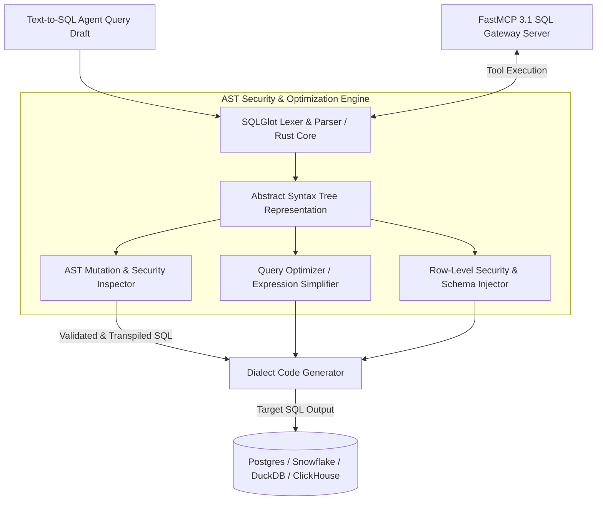

# SQLGlot

## What it is
SQLGlot is a high-performance, no-dependency SQL parser, transpiler, optimizer, and expression engine written in Python with a Rust-accelerated core parser (`v26.x+`). As of early 2027, SQLGlot serves as a foundational "In-Transit SQL Gateway" and AST compilation engine for AI data agents, Text-to-SQL pipelines (like Data Copilot), multi-dialect data warehouses, and security proxies.

SQLGlot parses SQL queries across 25+ database dialects (including Snowflake, Postgres, DuckDB, BigQuery, ClickHouse, Databricks Spark, MySQL, SQLite, and Trino/Presto) into a deterministic Abstract Syntax Tree (AST). Once represented as an AST, SQL queries can be programmatically inspected, audited for security violations, transformed (e.g. injecting row-level security predicates or schema qualification), optimized (e.g. removing redundant joins or simplifying subqueries), and transpiled back into target dialect SQL syntax with zero semantic loss.



## What problem it solves
Text-to-SQL systems and multi-database agentic pipelines encounter severe syntax, security, and execution challenges:

1. **Dialect Mismatch & Syntax Hallucination**: AI models frequently output mixed dialect syntax (e.g. applying BigQuery `QUALIFY` clauses or Snowflake JSON path syntax against a local DuckDB or Postgres instance), leading to runtime database errors.
2. **SQL Injection & Mutation Security Risks**: LLM-generated SQL queries risk executing destructive mutation operations (`DROP TABLE`, `TRUNCATE`, `ALTER DATABASE`, `DELETE WITHOUT WHERE`) or accessing unauthorized tenant tables.
3. **Inefficient Query Planning**: Unoptimized agent queries often generate redundant `SELECT *` subqueries, duplicate joins, or unindexed full-table scans that consume massive cloud warehouse compute credits.
4. **Lack of Programmatic AST Access**: String-based regex regex manipulation of SQL queries is fragile, error-prone, and incapable of accurately handling nested subqueries, CTEs, or complex window functions.

SQLGlot resolves these challenges by converting raw SQL strings into fully traversable, structured AST expressions. This enables deterministic security scanning, automated query optimization, row-level tenant filter injection, and seamless cross-dialect transpilation before queries touch production databases.

## Where it fits in the stack
**Category**: Development & Ops / Data Infrastructure & Query Translation.

SQLGlot operates at the data gateway and query validation tier of agentic architectures:

- **Upstream Agent**: Receives raw SQL strings generated by Text-to-SQL agents (Data Copilot, LangGraph, AutoGen) or user query interfaces.
- **SQLGlot Processing Tier**: Parses raw SQL into ASTs, enforces schema policies, injects tenant security predicates, optimizes query expressions, and transpiles to target dialect syntax.
- **Downstream Database**: Delivers clean, optimized, dialect-compliant SQL queries to target database engines (Snowflake, BigQuery, DuckDB, Postgres, ClickHouse).

## Typical use cases
- **Multi-Dialect Text-to-SQL Transpilation**: Converting LLM-generated SQL drafted in standard Postgres into target warehouse syntax (Snowflake, BigQuery, ClickHouse, DuckDB) without re-prompting the LLM.
- **Agentic SQL Safety & Mutation Interception**: Programmatically scanning AST nodes to block destructive statements (`DROP`, `TRUNCATE`, `DELETE`, `ALTER`) or illegal multi-tenant joins.
- **Automated Row-Level Security (RLS) Predicate Injection**: Programmatically injecting tenant isolation filters (`WHERE tenant_id = 'org_123'`) into all parsed `SELECT` tables prior to query dispatch.
- **Data Lake Cost Optimization**: Simplifying complex nested subqueries, removing unused column selections, and eliminating redundant joins to reduce cloud warehouse compute costs.
- **Automated Schema Qualification & Lineage Extraction**: Resolving unqualified table and column names against database schemas to build data lineage graphs.

## Strengths
- **Pure Python with Rust Acceleration**: Zero mandatory C-extension dependencies, with optional Rust-accelerated parser core (`sqlglotrs`) for sub-millisecond parsing throughput.
- **Industry-Leading Dialect Parity**: Unmatched support for 25+ dialects including Snowflake, BigQuery, DuckDB, ClickHouse, Postgres, Spark, Presto, SQLite, Oracle, and T-SQL.
- **Deep AST Expression Manipulation API**: Expressive Python API for traversing, replacing, appending, and inspecting AST expression nodes (`exp.Select`, `exp.Where`, `exp.Join`).
- **Native FastMCP 3.1 Integration**: Easily exposes SQL parsing, security validation, and transpilation capabilities as standardized MCP tools.
- **Built-in Rule-Based Optimizer**: Includes a production-grade optimizer that simplifies expressions, pushes down predicates, eliminates subquery aliases, and evaluates constant expressions.

## Limitations
- **Dialect Extension Lag**: Highly proprietary vendor-specific syntax extensions or newly introduced cloud features may require custom AST node definitions.
- **Requires Compilation & Compiler Theory Knowledge**: Advanced custom AST transformations require an understanding of relational algebra, AST node hierarchy, and expression trees.
- **Non-Python Stack Overhead**: Integrating SQLGlot into non-Python backend services (Go, Node.js, Rust) requires running a Python sidecar or gRPC microservice.

## When to use it
- When building Text-to-SQL agent pipelines where LLM queries must be validated, sanitized, and transpiled across target database engines.
- When creating database proxy services that enforce row-level security policies and tenant isolation dynamically.
- When optimizing database query costs by removing unneeded joins, columns, and nested CTEs automatically.
- When building FastMCP 3.1 servers providing data analysis and SQL safety tools.

## When not to use it
- For static, hardcoded application queries where raw database drivers (`asyncpg`, `psycopg2`, `sqlite3`) execute pre-written queries directly.
- In low-latency Node.js or Go microservices where calling external Python processes introduces unacceptable latency (unless hosted as a persistent gRPC sidecar).

## Getting started

### 1. Installation
Install SQLGlot via pip (includes pure Python parser with optional Rust acceleration):

```bash
pip install sqlglot
```

### 2. Transpile SQL Across Dialects
Transpile a Snowflake query with window functions into DuckDB syntax:

```python
import sqlglot

snowflake_sql = """
SELECT name, department, salary,
       RANK() OVER (PARTITION BY department ORDER BY salary DESC) as rank
FROM company.employees
QUALIFY rank <= 3
"""

duckdb_sql = sqlglot.transpile(snowflake_sql, read="snowflake", write="duckdb")[0]
print(duckdb_sql)
```

### 3. Parse and Inspect Query AST
Parse raw SQL into an expression tree and inspect table dependencies:

```python
from sqlglot import parse_one, exp

query = parse_one("SELECT u.id, u.email, o.total FROM users u JOIN orders o ON u.id = o.user_id WHERE u.active = true")

# Find all table names in query
tables = [table.name for table in query.find_all(exp.Table)]
print(f"Referenced Tables: {tables}")
```

## CLI examples

### 1. Transpile Query File via CLI
Transpile a Postgres SQL file into BigQuery dialect format:

```bash
sqlglot-cli --read postgres --write bigquery "SELECT id, created_at FROM users WHERE active = true LIMIT 50"
```

### 2. Format and Pretty-Print Complex SQL Query
Clean and indent a raw unformatted SQL string:

```bash
echo "select a,b,c from t1 join t2 on t1.id=t2.id where a>10 group by a,b,c" | sqlglot-cli --pretty
```

### 3. Check SQL Syntax Compatibility Across Dialects
Verify whether a DuckDB query parses cleanly under ClickHouse syntax rules:

```bash
sqlglot-cli --read duckdb --write clickhouse "SELECT * FROM read_parquet('data/*.parquet') LIMIT 10"
```

## API examples

### FastMCP 3.1 SQL Security & Transpilation Server (Python)
This complete FastMCP 3.1 Python server exposes SQLGlot parsing, mutation security auditing, row-level tenant filter injection, and dialect transpilation tools:

```python
from typing import Dict, Any, List, Optional
from mcp.server.fastmcp import FastMCP
from pydantic import BaseModel, Field, field_validator
import sqlglot
from sqlglot import parse_one, exp

mcp = FastMCP(
    "SQLGlot-Gateway-Server",
    instructions="FastMCP 3.1 tool server for SQL parsing, security mutation auditing, row-level security injection, and dialect transpilation."
)

class SQLTranspileRequest(BaseModel):
    sql: str = Field(..., min_length=5, description="Raw SQL query string")
    read_dialect: str = Field(default="postgres", description="Source dialect")
    write_dialect: str = Field(default="duckdb", description="Target dialect")
    pretty: bool = Field(default=True, description="Format transpiled output SQL")

class SQLSecurityAuditRequest(BaseModel):
    sql: str = Field(..., min_length=5, description="SQL query to audit")
    allowed_tables: Optional[List[str]] = Field(default=None, description="Whitelist of allowed tables")
    tenant_id: Optional[str] = Field(default=None, description="Tenant ID to inject into WHERE clauses")

@mcp.tool()
async def transpile_sql_query(request: SQLTranspileRequest) -> Dict[str, Any]:
    """
    Transpiles SQL queries between 25+ database dialects using SQLGlot.
    """
    try:
        transpiled = sqlglot.transpile(
            request.sql,
            read=request.read_dialect,
            write=request.write_dialect,
            pretty=request.pretty
        )
        return {
            "status": "success",
            "source_dialect": request.read_dialect,
            "target_dialect": request.write_dialect,
            "transpiled_sql": transpiled[0] if transpiled else ""
        }
    except Exception as e:
        return {"error": f"Transpilation failed: {str(e)}"}

@mcp.tool()
async def audit_and_inject_security(request: SQLSecurityAuditRequest) -> Dict[str, Any]:
    """
    Audits SQL query AST for prohibited mutation operations and injects row-level security predicates.
    """
    try:
        parsed = parse_one(request.sql)

        # Check for mutation operations
        for node, *_ in parsed.walk():
            node_type = node.__class__.__name__
            if node_type in ["Drop", "Delete", "Truncate", "AlterTable", "Insert"]:
                return {
                    "status": "rejected",
                    "reason": f"Prohibited mutation operation detected: {node_type.upper()}",
                    "safe": False
                }

        # Table whitelist audit
        referenced_tables = [t.name for t in parsed.find_all(exp.Table)]
        if request.allowed_tables:
            for table in referenced_tables:
                if table not in request.allowed_tables:
                    return {
                        "status": "rejected",
                        "reason": f"Unauthorized table access: '{table}' not in whitelist.",
                        "safe": False
                    }

        # Inject tenant isolation filter if tenant_id provided
        if request.tenant_id:
            parsed = parsed.where(f"tenant_id = '{request.tenant_id}'")

        return {
            "status": "approved",
            "safe": True,
            "referenced_tables": referenced_tables,
            "sanitized_sql": parsed.sql()
        }
    except Exception as e:
        return {"error": f"SQL Parsing/Audit failed: {str(e)}"}

if __name__ == "__main__":
    mcp.run()
```

### Pydantic v2 SQL Payload & Schema Validation Engine
Strict Pydantic v2 models for validating database queries, dialect settings, and security policy rules before database dispatch:

```python
from pydantic import BaseModel, Field, field_validator
from typing import List, Optional
import sqlglot

class SQLQueryPayload(BaseModel):
    raw_query: str = Field(..., description="Agent-generated SQL query string")
    target_dialect: str = Field(default="postgres", description="Target database engine")
    prohibited_operations: List[str] = Field(
        default_factory=lambda: ["drop", "delete", "truncate", "alter"]
    )

    @field_validator("raw_query")
    @classmethod
    def validate_and_sanitize_sql(cls, v: str, info) -> str:
        prohibited = info.data.get("prohibited_operations", ["drop", "delete", "truncate"])
        try:
            parsed_expressions = sqlglot.parse(v)
            for expression in parsed_expressions:
                if expression is None:
                    continue
                for node, *_ in expression.walk():
                    node_name = node.__class__.__name__.lower()
                    if any(op in node_name for op in prohibited):
                        raise ValueError(f"Prohibited database mutation operation detected: {node_name.upper()}")
            return v
        except sqlglot.errors.ParseError as e:
            raise ValueError(f"Invalid SQL syntax: {str(e)}")

# Example Payload Validation
try:
    payload = SQLQueryPayload(
        raw_query="SELECT id, name, salary FROM employees WHERE salary > 50000;",
        target_dialect="postgres"
    )
    print(f"Query payload validated successfully: {payload.raw_query[:35]}...")
except ValueError as err:
    print(f"Validation Error: {err}")
```

## Related tools / concepts
- [Data Copilot](../../architecture/data-copilot-text-to-sql.md) — Text-to-SQL architecture pattern powered by SQLGlot.
- [Claude Code](claude-code-setup.md) — Command-line interface for developer agents.
- [Model Context Protocol (MCP)](../automation_orchestration/mcp.md) — FastMCP 3.1 protocol standard.
- [Desktop Commander MCP](desktop-commander-mcp.md) — Local system tool server.

## Sources / references
- [SQLGlot GitHub Repository](https://github.com/tobymao/sqlglot)
- [SQLGlot Official Site & API Documentation](https://sqlglot.com/)
- [FastMCP 3.1 Specification Standard](https://modelcontextprotocol.io)

## Contribution Metadata
- Last reviewed: 2027-01-07
- Confidence: high
