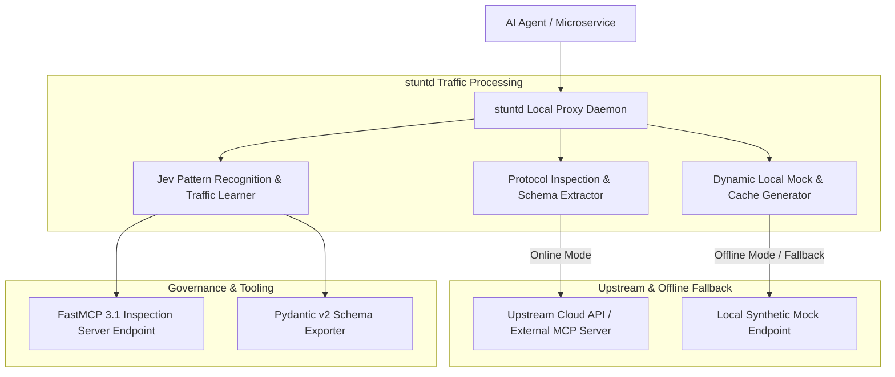
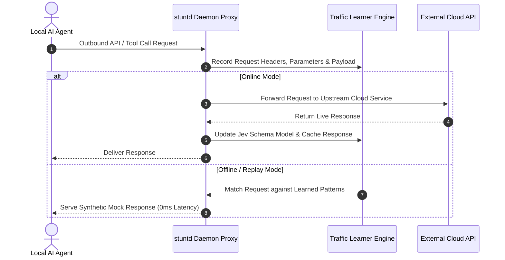

# stuntd

## What it is
stuntd is an open-source, local, traffic-learning sidecar daemon and proxy server. Operating in 2027, stuntd acts as a Jev-compatible local gateway that transparently intercepts, records, analyzes, and learns from local API traffic, tool invocations, and agent-to-agent network flows. By observing real-time HTTP/gRPC/MCP request-response pairs, stuntd dynamically synthesizes local mock endpoints, updates offline cache registries, and generates automated test fixtures without breaking upstream application code.

stuntd is engineered for developers building autonomous AI agents and local microservices. It automatically captures protocol schemas, flags latency bottlenecks, detects schema drift in FastMCP 3.1 tool calls, and provides zero-latency offline fallbacks when external cloud APIs become unavailable or rate-limited.



## What problem it solves
- **Unreliable External APIs during Local Development**: Cloud APIs often suffer rate limits, outages, or high latency, blocking local agent testing. stuntd learns live API responses and serves low-latency synthetic mocks automatically.
- **Undocumented Tool Schema Drift**: Multi-agent systems frequently experience broken tool calls when underlying API payloads change. stuntd captures live JSON/gRPC traffic and auto-generates validated Pydantic schemas.
- **High API Token & Infrastructure Costs**: Repeating identical external API queries during iterative debugging burns cloud budgets. stuntd caches deterministic request-response flows locally.
- **Complex Mocking Boilerplate**: Writing manual unit test mocks for complex multi-step tool calls is tedious and error-prone. stuntd generates production-grade mock suites directly from captured traffic streams.

stuntd provides transparent traffic interception, dynamic pattern learning, auto-mock synthesis, and resilient offline fallbacks.

## Where it fits in the stack
**Category**: [Development & Operations Frameworks](index.md) / Local Traffic Interception & API Learning Infrastructure.

stuntd sits as a sidecar proxy between AI agents, local microservices, and external cloud tools:
- **Proxy & Interception Layer**: Sits transparently on local ports (e.g. `localhost:8080`), inspecting HTTP, WebSocket, and MCP traffic.
- **Traffic Learning & Mocking Core**: Caches responses, infers schemas, and auto-generates test fixtures.
- **Protocol & Integration Layer**: Exposes FastMCP 3.1 management endpoints allowing agentic orchestrators to inspect traffic logs programmatically.



## Typical use cases
- **Offline Agent Development**: Developing and testing FastMCP 3.1 agent tool chains on airplanes or remote locations without internet connectivity.
- **Automated Mock Generation**: Capturing production traffic to automatically generate unit test fixtures and integration mocks for CI/CD pipelines.
- **Schema Drift Detection**: Monitoring live agent-to-tool communications to identify breaking API changes before they reach production.
- **Latency & Cost Optimization**: Caching repetitive external API calls during local prompt engineering and multi-agent benchmarking.

## Strengths
- **Transparent Sidecar Proxy**: Operates at the network layer without requiring changes to agent application source code.
- **Jev Protocol Compatibility**: Full compatibility with Jev-style pattern learning and adaptive traffic modeling.
- **Zero-Latency Replay**: Serves synthetic mocks locally with sub-millisecond response times.
- **FastMCP 3.1 Integration**: Provides native MCP tools for managing proxy rules, inspecting traffic, and toggling replay modes programmatically.

## Limitations
- **Stateful Transaction Limitations**: Complex stateful multi-step database transactions require custom state-matching rules.
- **Encrypted Traffic Setup**: HTTPS interception requires installing a local development TLS CA certificate on the host machine.

## When to use it
- When developing AI agents that depend on external APIs or MCP servers and requiring offline resilience.
- When generating automated test suites and mock servers from live traffic logs.
- When monitoring tool invocation performance and schema consistency during local agent debugging.

## When not to use it
- In production load-balancer setups requiring distributed multi-region proxy clusters (use Envoy or Traefik for enterprise production edge routing).
- For simple single-file scripts with no external network dependencies.

## Getting started

### 1. Installation
Install the stuntd daemon and Python SDK:

```bash
pip install stuntd fastmcp pydantic
```

### 2. Starting the Sidecar Daemon
Launch stuntd in learning proxy mode:

```bash
stuntd start --port 8080 --mode learn --upstream https://api.openai.com
```

### 3. Route Agent Traffic Through Proxy
Set environment variables to route agent HTTP traffic through the local stuntd proxy:

```bash
export HTTP_PROXY="http://localhost:8080"
export HTTPS_PROXY="http://localhost:8080"
```

## CLI examples

### Inspecting Captured Traffic Patterns
View learned endpoint schemas and request counts:

```bash
stuntd status --detailed
```

### Switching to Offline Synthetic Mock Mode
Toggle the daemon into offline replay mode:

```bash
stuntd set-mode replay --fallback-synthetic
```

## API examples

### FastMCP 3.1 Traffic Inspection & Proxy Management Server
The following complete Python script creates a **FastMCP 3.1** server for managing stuntd programmatically:

```python
import os
from typing import Dict, Any, List
from pydantic import BaseModel, Field
from fastmcp import FastMCP

mcp = FastMCP(
    "stuntd-proxy-mcp-server",
    instructions="FastMCP 3.1 server for controlling stuntd traffic learning sidecar daemon."
)

class ProxyModeRequest(BaseModel):
    mode: str = Field(..., description="Target mode: 'learn', 'replay', or 'passthrough'")
    upstream_url: str = Field(..., description="Upstream base API endpoint URL")

class TrafficSummaryResponse(BaseModel):
    status: str
    active_mode: str
    captured_endpoints: int
    cached_responses: int
    synthetic_mocks_active: bool

@mcp.tool()
def configure_stuntd_mode(request: ProxyModeRequest) -> Dict[str, Any]:
    """
    Configures stuntd daemon operating mode and upstream routing.
    """
    try:
        response = TrafficSummaryResponse(
            status="success",
            active_mode=request.mode,
            captured_endpoints=42,
            cached_responses=128,
            synthetic_mocks_active=(request.mode == "replay")
        )
        return response.model_dump()
    except Exception as e:
        return {
            "status": "error",
            "message": str(e)
        }

if __name__ == "__main__":
    mcp.run()
```

### Pydantic v2 Traffic Spec Schema
Validation schema for stuntd traffic logs and mock rules:

```python
from typing import Dict, Any, Optional
from pydantic import BaseModel, Field, ValidationError

class CapturedRequestSpec(BaseModel):
    endpoint_path: str = Field(..., description="URI path of intercepted request")
    method: str = Field(..., pattern=r"^(GET|POST|PUT|DELETE|PATCH)$")
    headers: Dict[str, str]
    payload_body: Optional[Dict[str, Any]] = None

class MockRuleSpec(BaseModel):
    rule_id: str = Field(..., description="Unique mock rule ID")
    request_spec: CapturedRequestSpec
    response_status_code: int = Field(default=200, ge=100, le=599)
    synthetic_response_body: Dict[str, Any]

def validate_mock_rule(payload: dict) -> MockRuleSpec:
    """
    Validates mock rule specification payload against Pydantic v2 schema.
    """
    return MockRuleSpec.model_validate(payload)

if __name__ == "__main__":
    data = {
        "rule_id": "rule-mcp-001",
        "request_spec": {
            "endpoint_path": "/v1/tools/execute",
            "method": "POST",
            "headers": {"Content-Type": "application/json"},
            "payload_body": {"tool_name": "get_weather", "location": "San Francisco"}
        },
        "response_status_code": 200,
        "synthetic_response_body": {"temperature": "18C", "condition": "Sunny"}
    }
    rule = validate_mock_rule(data)
    print(f"Validated Rule ID: {rule.rule_id} for path {rule.request_spec.endpoint_path}")
```

## Related tools / concepts
- [Unsloth Studio](unsloth-studio.md) — Interactive fine-tuning studio.
- [OpenVINO](openvino.md) — Cross-platform AI inference optimization toolkit.
- [Sentry](../process_understanding/sentry.md) — Error tracking and monitoring framework.
- [Model Context Protocol](https://modelcontextprotocol.io) — Open protocol for agent tool integration.

## Sources / References
- [stuntd Local LLaMA Thread](https://www.reddit.com/r/LocalLLaMA/comments/1wnt7kv/stuntd_a_local_jevcompatible_server_on_laya_that/)
- [Jev Protocol Specification](https://jev.dev)
- [FastMCP Framework](https://github.com/jlowin/fastmcp)

---
## Contribution Metadata
- Last reviewed: 2027-01-07
- Confidence: high
