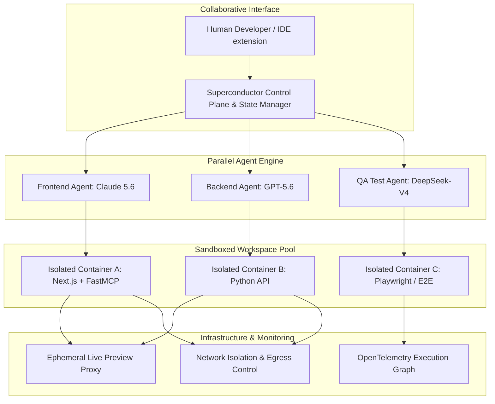

# Superconductor

## What it is
Superconductor is a multiplayer, cloud-native AI workspace and execution engine engineered for parallel multi-agent orchestration. It provides developers and autonomous software teams with a synchronized, sandboxed environment where dozens of AI agents (powered by **Claude 5.6**, **GPT-5.6**, **Gemini 4.0 Ultra**, **DeepSeek-V4**, and **Llama 4 Maverick**) can collaborate simultaneously on shared codebases without state collisions.

Superconductor integrates deeply with **FastMCP 3.1** (Model Context Protocol) servers, exposing isolated ephemeral sandboxes, network egress firewalls, live preview proxies, and OpenTelemetry trace graphs. This architecture enables human developers and AI agents to pair-program in real time within a unified workspace.



## What problem it solves
Coordinating multiple autonomous code-generating agents in complex enterprise codebases presents severe operational friction:

1. **State Drift & Git Merge Collisions**: When multiple agents modify files in a single shared working directory simultaneously, uncoordinated edits trigger syntax corruption, broken builds, and conflicting git branches. Superconductor isolates each agent in an ephemeral branch sandbox, automatically resolving AST-level code merges.
2. **Untrusted Code Execution & Data Exfiltration**: Autonomous agents with terminal access risk executing unsafe shell commands or transmitting credentials externally. Superconductor wraps every sandbox in a strict network firewall with fine-grained FastMCP tool privilege isolation.
3. **Lack of Visual Feedback for Web Agents**: Text-only agents cannot verify visual regressions in frontend UI components. Superconductor spins up ephemeral HTTP preview proxies with headless browser streaming, allowing agents to "see" their UI changes live.
4. **Opaque Agent Interactions**: Tracking why parallel agents modified specific modules requires comprehensive tracing. Superconductor logs every shell command, file write, and FastMCP call as OpenTelemetry spans.

## Where it fits in the stack
**Category**: Development & Ops / Multi-Agent Workspace & Parallel Orchestration Platform.

In the 2027 software development stack, Superconductor functions as the cloud-native "Operating System" for AI development teams, situated between local IDEs (Cursor, Claude Code, VS Code) and cloud Kubernetes runtime clusters.

```
+-----------------------------------------------------------------------+
|                    Human Developers & AI Agent Interfaces             |
|                 (Claude Code, Cursor, Aider, Web Workspace)           |
+-----------------------------------------------------------------------+
                                    |
                                    v
+-----------------------------------------------------------------------+
|                     Superconductor Workspace Engine                   |
|  - Ephemeral Branch Sandboxing & AST Conflict Resolution               |
|  - FastMCP 3.1 Network Egress & Privilege Isolation                   |
|  - Live Ephemeral HTTP Preview Proxy Generation                       |
|  - OpenTelemetry Trace & Spans Execution Graph                        |
+-----------------------------------------------------------------------+
        |                           |                           |
        v                           v                           v
+------------------+     +--------------------+     +-------------------+
| Kubernetes/Docker|     | FastMCP 3.1 Tools  |     | Cloud Models      |
| Sandboxes        |     | (PostgreSQL, Git,  |     | (Claude 5.6,      |
| (EKS, GKE, KinD) |     |  Terminal, Linters)|     |  GPT-5.6, Gemini) |
+------------------+     +--------------------+     +-------------------+
```

## Typical use cases
- **Parallel Feature Development**: Assigning a "Frontend UI Agent" and a "Backend Database Agent" to build a full-stack feature simultaneously in isolated sandboxes before automated merging.
- **Automated Regression Testing & QA**: Deploying specialized "QA Tester Agents" that interact with ephemeral live previews via Playwright to identify and fix visual regressions before PR approval.
- **Security Red-Teaming & Vulnerability Patching**: Running "Attacker Agents" against sandboxed environments to surface security vulnerabilities, followed by "Remediation Agents" that issue automated patches.
- **Multiplayer Human-AI Pair Programming**: Humans and autonomous agents making live edits in the same cloud workspace with shared state synchronization and real-time previews.

## Strengths
- **Native Parallel Agent Isolation**: Runs dozens of agents concurrently in isolated sandboxes without state drift or filesystem collisions.
- **FastMCP 3.1 Protocol Integration**: Direct support for Model Context Protocol servers with fine-grained tool privilege isolation.
- **Ephemeral Live Previews**: Automatically provisions public or private preview URLs for web applications created inside sandboxes.
- **Deep Observability Graphs**: OpenTelemetry tracing maps all agent actions, model generation steps, and shell commands into a single DAG.
- **Enterprise Security Sandboxing**: Built-in gVisor / Kata Container isolation with strict egress firewall rules to prevent data exfiltration.

## Limitations
- **Cloud-Native Infrastructure Requirements**: Requires a modern Kubernetes cluster (EKS, GKE, AKS) or high-spec Docker Swarm environment to host sandboxed worker nodes.
- **Resource Footprint**: Running multiple parallel sandboxes with full Node.js/Python build toolchains consumes significant CPU, RAM, and network bandwidth.
- **Model Token Expenditure**: Coordinating multiple frontier agents on large codebases requires careful token budget limits to control costs.

## When to use it
- When managing multi-agent development workflows that require parallel execution without workspace corruption.
- When enterprise security mandates strict network sandboxing and privilege isolation for AI code execution.
- When building web applications that benefit from agentic visual verification via ephemeral live previews.

## When not to use it
- For simple single-file edits or small personal projects where a local CLI tool (like [Aider](aider.md) or [Claude Code](claude-code.md)) is sufficient.
- In strict air-gapped local environments lacking Kubernetes or Docker container orchestration capabilities.

## Getting started

### Installation Options

Superconductor can be deployed via Helm to Kubernetes clusters or run locally via Docker Compose for testing.

#### 1. Kubernetes Deployment via Helm
Deploy Superconductor into your cluster:

```bash
# Add Superconductor Helm repository
helm repo add superconductor https://charts.superconductor.ai
helm repo update

# Install Superconductor control plane
helm install superconductor superconductor/superconductor \
  --namespace superconductor-system \
  --create-namespace \
  --set controlPlane.domain="superconductor.internal" \
  --set sandboxing.backend="gvisor"
```

#### 2. Local Docker Compose Setup
For local development and evaluation:

```bash
git clone https://github.com/superconductor/superconductor.git
cd superconductor
docker compose up -d
```

#### 3. CLI Authentication & Workspace Setup
Authenticate your local terminal with the Superconductor control plane:

```bash
# Set control plane endpoint
export SUPERCONDUCTOR_HOST="https://superconductor.internal"
export SUPERCONDUCTOR_API_KEY="sc_live_9021830912"

# Initialize project workspace
superconductor init --name "analytics-microservice"
```

## CLI examples

### 1. Launching Parallel Agent Sessions
Spin up multiple specialized agents to execute concurrent tasks on a project:

```bash
# Launch a backend database migration agent
superconductor agent run \
  --persona "Database Architect" \
  --task "Add pgvector indexing to documents table" \
  --sandbox-image "node:22-alpine" \
  --autonomy-level high

# Launch a concurrent API agent on a separate branch
superconductor agent run \
  --persona "API Engineer" \
  --task "Implement FastMCP 3.1 search endpoints" \
  --autonomy-level high
```

### 2. Inspecting Active Agent Sandboxes & Live Previews
Monitor running container sandboxes and retrieve ephemeral preview URLs:

```bash
# List all active sandboxes and status
superconductor sandbox list

# Stream live terminal output from a specific agent sandbox
superconductor sandbox logs sb_88192a --follow

# Get ephemeral web preview URL for QA testing
superconductor sandbox preview sb_88192a
```

### 3. Merging Sandbox Branches
Merge completed agent sandbox branches back into the main repository branch with AST validation:

```bash
# Run automated merge check and AST verification
superconductor merge sb_88192a --target main --auto-resolve
```

## API examples

### Python FastMCP 3.1 Integration for Superconductor Sandboxes
This example demonstrates configuring a FastMCP 3.1 server that runs inside a Superconductor sandbox, giving agents secure access to repository analysis tools.

```python
import os
from fastmcp import FastMCP
from pydantic import BaseModel, Field

mcp = FastMCP("Superconductor Repository Tools")

class FileReadRequest(BaseModel):
    filepath: str = Field(..., description="Path relative to repository root")

class ExecuteTestRequest(BaseModel):
    test_suite: str = Field(default="unit", pattern=r"^(unit|integration|e2e)$")

@mcp.tool()
async def read_sandbox_file(params: FileReadRequest) -> dict:
    """Safely reads file contents from the sandboxed workspace."""
    safe_root = os.getenv("SANDBOX_WORKSPACE_ROOT", "/workspace")
    full_path = os.path.normpath(os.path.join(safe_root, params.filepath))

    if not full_path.startswith(safe_root):
        raise PermissionError("Access denied: path traverses outside sandbox boundary.")

    if not os.path.exists(full_path):
        return {"error": "File not found", "path": params.filepath}

    with open(full_path, "r", encoding="utf-8") as f:
        content = f.read()

    return {"path": params.filepath, "content": content, "size_bytes": len(content)}

@mcp.tool()
async def trigger_sandbox_tests(params: ExecuteTestRequest) -> dict:
    """Executes test suite inside the isolated container sandbox."""
    # Simulated test run inside sandbox
    return {
        "suite": params.test_suite,
        "status": "PASSED",
        "passed_tests": 42,
        "failed_tests": 0,
        "duration_seconds": 3.8
    }

if __name__ == "__main__":
    mcp.run(transport="sse", port=8080)
```

### Production Pydantic v2 Schema for Workspace & Agent Request Validation
This production script validates Superconductor workspace triggers, agent autonomy levels, network firewall parameters, and resource allocations prior to dispatching work to the cloud runtime.

```python
from datetime import datetime
from enum import Enum
from typing import List, Optional, Dict, Any
from pydantic import BaseModel, Field, field_validator, ConfigDict

class AutonomyLevel(str, Enum):
    LOW = "low"
    MEDIUM = "medium"
    HIGH = "high"
    FULL_AUTONOMOUS = "full_autonomous"

class ModelTarget(str, Enum):
    CLAUDE_5_6_SONNET = "claude-5-6-sonnet"
    GPT_5_6 = "gpt-5-6"
    GEMINI_4_ULTRA = "gemini-4-ultra"
    DEEPSEEK_V4 = "deepseek-v4"

class AgentSessionConfig(BaseModel):
    persona: str = Field(..., min_length=2, max_length=60)
    task: str = Field(..., min_length=10)
    model: ModelTarget = Field(default=ModelTarget.CLAUDE_5_6_SONNET)
    autonomy_level: AutonomyLevel = Field(default=AutonomyLevel.MEDIUM)
    max_token_budget: int = Field(default=100000, ge=1000, le=2000000)
    base_branch: str = Field(default="main")

class SandboxSecurityPolicy(BaseModel):
    enable_network_egress: bool = Field(default=False)
    allowed_domains: List[str] = Field(default_factory=lambda: ["github.com", "registry.npmjs.org", "pypi.org"])
    read_only_root: bool = Field(default=True)
    mcp_privilege_level: str = Field(default="restricted")

class WorkspaceOrchestrationTrigger(BaseModel):
    model_config = ConfigDict(extra="ignore")

    workspace_id: str = Field(..., pattern=r"^ws_[a-zA-Z0-9]+$")
    project_name: str = Field(..., min_length=2)
    agents: List[AgentSessionConfig] = Field(..., min_items=1)
    security_policy: SandboxSecurityPolicy = Field(default_factory=SandboxSecurityPolicy)
    mcp_protocol_version: str = Field(default="3.1")
    timestamp: datetime = Field(default_factory=datetime.utcnow)

    @field_validator("agents")
    @classmethod
    def validate_unique_personas(cls, agents: List[AgentSessionConfig]) -> List[AgentSessionConfig]:
        personas = [a.persona for a in agents]
        if len(personas) != len(set(personas)):
            raise ValueError("Duplicate agent personas detected in single orchestration trigger.")
        return agents

# Example Validation
if __name__ == "__main__":
    payload = {
        "workspace_id": "ws_99201a",
        "project_name": "ecommerce-storefront",
        "agents": [
            {
                "persona": "Frontend Developer",
                "task": "Migrate checkout component to Tailwind v4",
                "model": "claude-5-6-sonnet",
                "autonomy_level": "high",
                "max_token_budget": 200000
            },
            {
                "persona": "Backend Developer",
                "task": "Add Stripe payment intent FastMCP tool endpoint",
                "model": "gpt-5-6",
                "autonomy_level": "medium",
                "max_token_budget": 150000
            }
        ],
        "security_policy": {
            "enable_network_egress": False,
            "allowed_domains": ["github.com", "api.stripe.com"],
            "read_only_root": True,
            "mcp_privilege_level": "isolated"
        }
    }

    trigger = WorkspaceOrchestrationTrigger.model_validate(payload)
    print(f"Validated Superconductor Trigger for Workspace: {trigger.workspace_id}")
    print(f"Active Agents: {len(trigger.agents)} | Security Policy Egress Allowed: {trigger.security_policy.enable_network_egress}")
    print(f"Trigger JSON:\n{trigger.model_dump_json(indent=2)}")
```

## Related tools / concepts
- [Agentic Workflows](../../knowledge_base/patterns/agentic-workflows.md) — Fundamental architectural design pattern.
- [Model Context Protocol (MCP)](../automation_orchestration/mcp.md) — Protocol for agent tool and resource binding.
- [Claude Code](claude-code.md) — Command-line agent harness.
- [Aider](aider.md) — Local terminal pair-programming assistant.
- [Cursor](cursor.md) — AI-native IDE environment.
- [Plandex](plandex.md) — Plan-first engineering agent.
- [EKS Auto Mode](../../architecture/infrastructure.md) — Recommended cloud hosting infrastructure.
- [Langfuse](../process_understanding/langfuse.md) — Open-source agent tracing.
- [AgentOps](../process_understanding/agentops.md) — Session monitoring and telemetry.

## Sources / references
- [Superconductor Official Site](https://superconductor.ai/)
- [Superconductor GitHub Repository](https://github.com/superconductor/superconductor)
- [Superconductor Multi-Agent Parallelism Documentation](https://docs.superconductor.ai/concepts/parallelism)

## Contribution Metadata
- Last reviewed: 2027-01-07
- Confidence: high
