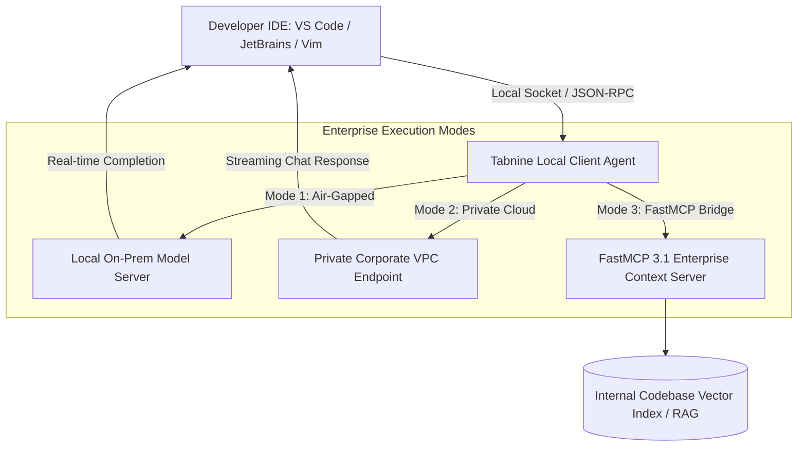

# Tabnine

## What it is
Tabnine is an AI code assistant that focuses on privacy, data security, and enterprise-grade code completion control. It provides AI-powered code completions, inline inline-refactoring, and conversational chat capabilities, with a strong emphasis on local-only execution, private model hosting, air-gapped VPC deployments, and FastMCP 3.1 contextual servers to ensure source code never leaves a secure environment.

As of early 2027, Tabnine's enterprise engine supports fine-tuning on custom internal code repositories, integrates with local model runners (such as [LocalAI](../infrastructure/localai.md) or vLLM), and supports frontier models like Claude 5.6 and DeepSeek-V4 in hybrid enterprise setups.



## What problem it solves
It addresses the critical security concern of sending proprietary, regulated, or sensitive source code to external cloud-based LLM APIs. By offering local-only inference and private cloud deployments, Tabnine enables teams in regulated industries (finance, healthcare, defense, aerospace) to leverage AI coding productivity without compromising data sovereignty or intellectual property compliance.

Furthermore, Tabnine eliminates context leakage and hallucination on proprietary internal SDKs by indexing internal codebases locally via FastMCP 3.1 contextual RAG servers.

## Where it fits in the stack
**Development & Ops / AI Coding Assistant**. It functions as a privacy-first alternative to cloud-heavy assistants like GitHub Copilot, often serving as the primary completion engine in air-gapped or high-security environments.

- **Developer Workspace Layer**: Embedded directly into IDE extensions (VS Code, JetBrains, Vim, Neovim, Sublime Text).
- **Context & RAG Layer**: Interacts with local repository indexes via FastMCP 3.1 tools.
- **Inference Layer**: Operates on-device via quantized local models or in private enterprise VPCs.

## Typical use cases
- **Secure Code Completion**: Real-time multi-line suggestions in environments where external cloud API access is strictly prohibited.
- **Local LLM Inference**: Running small, optimized models directly on developer workstations without Internet connectivity.
- **Enterprise Private Cloud Deployment**: Deploying Tabnine's infrastructure on-premises or within a private AWS/GCP/Azure VPC.
- **Legacy & Proprietary Codebases**: Training custom models or indexing private repositories to improve completion relevance for internal frameworks.

## Strengths
- **Uncompromising Privacy**: Local-only options, air-gapped modes, and zero data retention are core differentiators.
- **Enterprise Ready**: Full support for private VPCs, on-prem deployments, FastMCP 3.1 local servers, and strict telemetry disabling.
- **Custom Model Fine-Tuning**: Can be trained or fine-tuned on private internal repositories for domain-specific syntax awareness.
- **Multi-IDE Support**: Wide editor coverage including VS Code, JetBrains IDEs, Sublime, Vim, Neovim, and Eclipse.
- **FastMCP 3.1 Tool Support**: Native protocol bridges for fetching internal enterprise context safely.

## Limitations
- **Completion Quality Trade-Off**: Small local-only models (3B–7B parameters) may lag behind state-of-the-art multi-hundred-billion parameter cloud models in complex multi-step reasoning.
- **Hardware Resource Usage**: On-device local inference requires significant host RAM and CPU/GPU resources on developer workstations.
- **Enterprise Licensing**: Advanced air-gapped features and custom model fine-tuning require enterprise tier contracts.

## When to use it
- When code privacy is a non-negotiable requirement and cloud-based AI providers are prohibited by organizational compliance.
- When working in air-gapped, defense, or restricted network environments.
- When you need a consistent, uniform AI completion experience across a diverse team using various IDEs (e.g., JetBrains, VS Code, and Neovim).

## When not to use it
- When you prioritize the absolute highest multi-file autonomous reasoning over data privacy and have clearance for cloud LLM APIs.
- When you are a solo open-source developer looking for a simple free cloud assistant (consider [Codeium](codeium.md)).
- When you want an autonomous terminal agent that executes OS-level commands (consider [Claude Code](claude-code-setup.md)).

## Getting started

### Installation (VS Code)
1. Open VS Code and go to the Extensions view (`Ctrl+Shift+X`).
2. Search for `Tabnine`.
3. Click **Install**.
4. Sign in or configure your local model path if using Tabnine Pro/Enterprise.

### Installation (JetBrains)
1. Go to `Settings` -> `Plugins`.
2. Search for `Tabnine` in the Marketplace.
3. Install and restart the IDE.

### Configuring Local-Only Mode
For users with Tabnine Pro/Enterprise, force the client binary to operate strictly offline with local models:

```json
{
  "tabnine.model_type": "local",
  "tabnine.local_model_path": "/opt/tabnine/models/tabnine-local-v2",
  "tabnine.cloud_inference_enabled": false,
  "tabnine.telemetry_enabled": false
}
```

## CLI examples

```bash
# Check version of Tabnine local enterprise client binary
Tabnine --version

# Run the Tabnine binary in local chat verification mode
Tabnine --chat-only --config-file ~/.config/tabnine/tabnine.json

# Export internal enterprise endpoint for air-gapped VPC
export TABNINE_REMOTE_ENDPOINT="https://tabnine.internal.company.com"
export TABNINE_DISABLE_TELEMETRY=1
```

## API examples

### JSON-RPC Autocomplete Request
Tabnine's internal binary is consumed via JSON-RPC over a local IPC socket or stdin/stdout by IDE extensions:

```json
{
  "version": "1.0.0",
  "request": {
    "Autocomplete": {
      "before": "def calculate_risk_score(account_id: str) -> float:\n    # Fetch risk parameters\n    ",
      "after": "",
      "filename": "services/risk_engine.py",
      "region_includes_beginning": true,
      "region_includes_end": true,
      "max_num_results": 3
    }
  }
}
```

### FastMCP 3.1 Local Context Integration
The following Python script implements a **FastMCP 3.1** context server that supplies local code snippets to Tabnine Chat without external cloud connectivity:

```python
from mcp.server.fastmcp import FastMCP
from pydantic import BaseModel, Field, ValidationError
from typing import List, Optional

mcp = FastMCP("tabnine-local-context-server")

class CodeSnippetQuery(BaseModel):
    symbol_name: str = Field(..., description="Target function or class symbol")
    file_path: Optional[str] = Field(None, description="Path filter for search")

class CodeSnippetResult(BaseModel):
    symbol_name: str = Field(..., description="Target symbol name")
    snippet_content: str = Field(..., description="Extracted internal code context")
    file_path: str = Field(..., description="File path location")

@mcp.tool(name="fetch_local_code_context", description="Retrieves internal repository context for Tabnine local engine")
def fetch_local_code_context(symbol_name: str, file_path: Optional[str] = None) -> str:
    """FastMCP 3.1 tool for local RAG context retrieval."""
    try:
        query = CodeSnippetQuery(symbol_name=symbol_name, file_path=file_path)

        # Simulate local vector database lookup
        result = CodeSnippetResult(
            symbol_name=query.symbol_name,
            snippet_content=f"def {query.symbol_name}(*args, **kwargs):\n    # Internal enterprise implementation\n    pass",
            file_path=query.file_path or "src/internal_core.py"
        )

        return result.model_dump_json(indent=2)
    except ValidationError as ve:
        return f"Query validation error: {ve}"

if __name__ == "__main__":
    mcp.run()
```

### Programmatic Tabnine Local Config Validator (Pydantic v2)
Validate Tabnine local-only and enterprise settings using Pydantic v2:

```python
from pydantic import BaseModel, Field, ValidationError
from typing import Optional

class TabnineLocalConfig(BaseModel):
    model_type: str = Field(default="local", description="Inference mode: local, private_cloud, hybrid")
    local_model_path: str = Field(..., description="Path to local weights")
    cloud_inference_enabled: bool = Field(default=False, description="Disable cloud fallback")
    telemetry_enabled: bool = Field(default=False, description="Telemetry opt-out toggle")
    remote_endpoint: Optional[str] = Field(None, description="Internal Enterprise URL")

def validate_config(raw_data: dict) -> TabnineLocalConfig:
    """Validates Tabnine configuration dictionary against Pydantic v2 schema."""
    return TabnineLocalConfig.model_validate(raw_data)

if __name__ == "__main__":
    config_data = {
        "model_type": "local",
        "local_model_path": "/opt/tabnine/models/tabnine-local-v2",
        "cloud_inference_enabled": False,
        "telemetry_enabled": False,
        "remote_endpoint": "https://tabnine.internal.company.com"
    }

    config = validate_config(config_data)
    print(f"Validated Tabnine local mode: {config.model_type}")
    print(f"Cloud inference allowed: {config.cloud_inference_enabled}")
    print(f"Internal Endpoint: {config.remote_endpoint}")
```

## Related tools / concepts
- [VS Code](vscode.md) — The most common platform for Tabnine extensions.
- [Superconductor](superconductor.md) — Cloud-native parallel agent orchestration.
- [OpenCode](opencode.md) — Open-source alternative for AI coding assistance.
- [Zed](zed.md) — A high-performance editor with native AI capabilities.
- [Cursor](cursor.md) — An AI-native IDE that prioritizes integrated features.
- [Codeium](codeium.md) — A leading privacy-conscious competitor with a free tier.
- [GitHub Copilot](github_copilot.md) — Standard cloud-based coding assistant.
- [Sourcegraph Cody](sourcegraph_cody.md) — Focuses on codebase-wide context and search.
- [Aider](aider.md) — Terminal-based AI coding assistant.
- [LocalAI](../infrastructure/localai.md) — Platform for serving local models.
- [Claude Code](claude-code-setup.md) — High-autonomy agent CLI.
- [FastMCP](../automation_orchestration/mcp.md) — Model Context Protocol 3.1 Python framework.

## Sources / references
- [Official Tabnine Website](https://www.tabnine.com/)
- [Tabnine Documentation](https://docs.tabnine.com/)
- [Tabnine Enterprise Security Overview](https://www.tabnine.com/enterprise)

---
## Contribution Metadata
- Last reviewed: 2027-01-07
- Confidence: high
