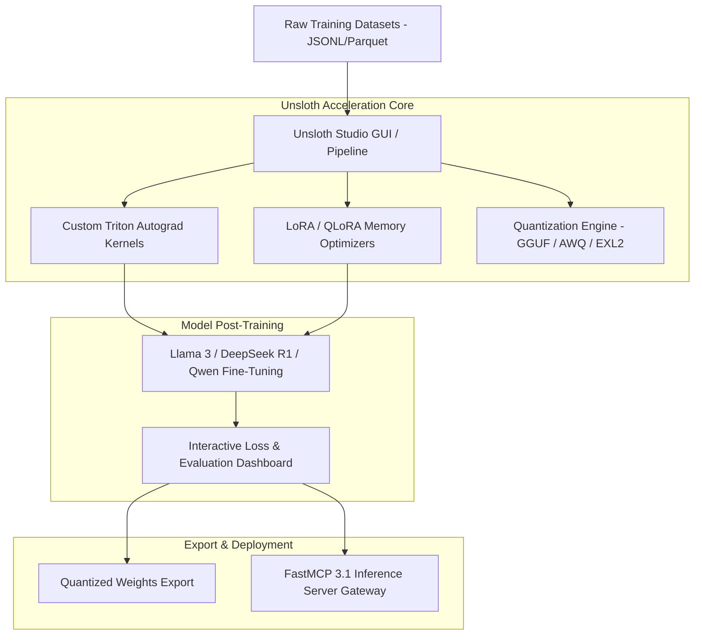
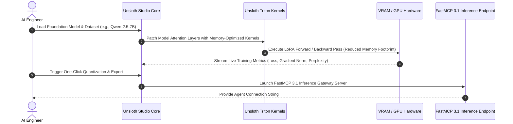

# Unsloth Studio

## What it is
Unsloth Studio is an open-source visual interactive workspace and unified orchestration platform for fine-tuning, quantifying, evaluating, and deploying large language models (LLMs) and diffusion architectures. Building on Unsloth's high-speed manual autograd kernels and low-rank adaptation (LoRA / QLoRA) optimizations, Unsloth Studio provides a complete graphical interface alongside automated backend workflows for post-training LLMs (e.g. Llama 3.3, Qwen 2.5, DeepSeek R1, Mistral) with up to 80% reduced VRAM consumption and 2x to 5x faster training speeds.

Operating in 2027, Unsloth Studio bridges the gap between raw Python fine-tuning scripts and graphical model engineering. It features built-in dataset preparation tools, real-time loss curve monitoring, automated hyperparameter tuning, GGUF/EXL2 quantization exporters, and direct FastMCP 3.1 server deployment endpoints.



## What problem it solves
- **Extreme VRAM Consumption during Fine-Tuning**: Standard Hugging Face Trainer routines require massive GPU memory clusters, making fine-tuning inaccessible for smaller teams. Unsloth's optimized CUDA kernels enable fine-tuning 70B models on single enterprise GPUs.
- **Fragmented Tooling for Model Engineering**: Developers previously had to manually stitch together dataset cleansers, training scripts, quantization converters (llama.cpp / ExLlamaV2), and inference server wrappers.
- **Lack of Real-Time Feedback Loop**: Traditional CLI-only training lacks live visual loss degradation tracking, automated gradient norm monitoring, and on-the-fly sample evaluation.
- **Complex Agent Deployment**: Converting a freshly fine-tuned model into an active Model Context Protocol (MCP) tool server required writing extensive custom boilerplate code.

Unsloth Studio unifies fine-tuning acceleration, interactive visual management, and MCP server provisioning into a single developer application.

## Where it fits in the stack
**Category**: [Development & Operations Frameworks](index.md) / LLM Fine-Tuning & Model Management Infrastructure.

Unsloth Studio acts as the core post-training and alignment hub in AI engineering workflows:
- **Model Training & Alignment Layer**: Sits between raw foundation model weights and domain-adapted production models.
- **Developer Tooling Layer**: Interoperates with local desktop runtimes (e.g., LM Studio, Ollama, vLLM) by exporting optimized GGUF or Safetensors weights.
- **Protocol & Integration Layer**: Automatically packages fine-tuned models with FastMCP 3.1 wrappers for immediate deployment to AI agent swarms.



## Typical use cases
- **Domain-Specific Model Fine-Tuning**: Fine-tuning Llama or DeepSeek models on proprietary medical, legal, or financial domain datasets.
- **Agentic Tool-Calling Alignment**: Training models specifically to follow FastMCP 3.1 tool schemas and structured JSON outputs with zero formatting errors.
- **Local Model Compression & Deployment**: Quantizing fine-tuned models to GGUF (Q4_K_M, Q8_0) for edge deployment in offline desktop applications.
- **Rapid Experimentation**: Comparing LoRA rank hyperparameters (r=16, r=64, r=128) and learning rate schedules visually in real time.

## Strengths
- **Massive Memory Savings**: Cuts VRAM requirements by up to 80% compared to standard PyTorch implementation.
- **2x-5x Speedup**: Fast Triton-based autograd kernels accelerate epoch completion times significantly.
- **Zero Accuracy Loss**: Exact mathematical gradient computation without loss of floating-point precision.
- **Unified GUI & CLI**: Accessible both via a web browser / desktop app and headless CLI automation.

## Limitations
- **Hardware Dependency**: Optimized primarily for NVIDIA GPUs (Ampere, Ada Lovelace, Hopper architectures); limited CPU/AMD support.
- **Architecture Constraints**: While supporting major open architectures (Llama, Mistral, Qwen, DeepSeek, Gemma), custom niche architectures require manual kernel registration.
- **Resource Intensity**: Local full-parameter or high-rank fine-tuning still requires dedicated GPU memory allocations during active training runs.

## When to use it
- When fine-tuning foundation LLMs on local or cloud GPUs with constrained VRAM.
- When you need a unified visual platform to monitor loss curves, evaluate checkpoint samples, and export quantized models.
- When preparing custom aligned models for deployment as FastMCP 3.1 agent servers.

## When not to use it
- When using closed API-only providers like OpenAI or Anthropic (use vendor-hosted fine-tuning endpoints instead).
- When performing simple prompt engineering or RAG without modifying model weights.

## Getting started

### 1. Installation
Install Unsloth and Unsloth Studio using pip:

```bash
pip install unsloth unsloth-studio fastmcp pydantic
```

### 2. Launching the Studio Web Interface
Start the interactive local server:

```bash
unsloth-studio --host 0.0.0.0 --port 8080 --gpu-id 0
```

Open `http://localhost:8080` in your web browser to access the interactive dashboard.

### 3. Programmatic Fine-Tuning Script
```python
from unsloth import FastLanguageModel
import torch

model, tokenizer = FastLanguageModel.from_pretrained(
    model_name="unsloth/Qwen2.5-7B-Instruct",
    max_seq_length=2048,
    load_in_4bit=True
)

model = FastLanguageModel.get_peft_model(
    model,
    r=16,
    target_modules=["q_proj", "k_proj", "v_proj", "o_proj"],
    lora_alpha=16,
    lora_dropout=0
)

print("Unsloth model prepared successfully.")
```

## CLI examples

### Headless Fine-Tuning Run
Execute a fine-tuning job using a Studio configuration YAML file:

```bash
unsloth-studio train \
  --config configs/lora_qwen_config.yaml \
  --dataset data/instruction_dataset.jsonl \
  --output-dir ./checkpoints/qwen_lora
```

### Exporting Checkpoint to GGUF
Convert the fine-tuned adapter weights to quantized GGUF format:

```bash
unsloth-studio export \
  --checkpoint ./checkpoints/qwen_lora/final \
  --format gguf \
  --quantization q4_k_m \
  --output-file models/qwen_fine_tuned_q4.gguf
```

## API examples

### FastMCP 3.1 Training Orchestration & Management Server
The following Python script creates a **FastMCP 3.1** server for remotely triggering and managing Unsloth Studio fine-tuning jobs:

```python
import os
from typing import Dict, Any, List
from pydantic import BaseModel, Field
from fastmcp import FastMCP

mcp = FastMCP(
    "unsloth-studio-mcp-server",
    instructions="FastMCP 3.1 server for orchestrating Unsloth Studio LLM fine-tuning and export jobs."
)

class TrainingJobRequest(BaseModel):
    base_model: str = Field(..., description="Target base model identifier (e.g. unsloth/Qwen2.5-7B-Instruct)")
    dataset_path: str = Field(..., description="Path to input training dataset JSONL")
    lora_rank: int = Field(default=16, ge=4, le=256, description="LoRA rank dimension")
    epochs: int = Field(default=3, ge=1, le=20, description="Total training epochs")
    learning_rate: float = Field(default=2e-4, description="Base learning rate")

class TrainingJobStatus(BaseModel):
    job_id: str
    status: str
    current_epoch: int
    current_loss: float
    gpu_memory_used_gb: float

@mcp.tool()
def start_fine_tuning_job(request: TrainingJobRequest) -> Dict[str, Any]:
    """
    Triggers an asynchronous fine-tuning job inside Unsloth Studio.
    """
    try:
        job_id = f"job-{hash(request.base_model + request.dataset_path) & 0xffffffff:08x}"
        status = TrainingJobStatus(
            job_id=job_id,
            status="running",
            current_epoch=1,
            current_loss=0.421,
            gpu_memory_used_gb=11.4
        )
        return {
            "status": "initiated",
            "job_data": status.model_dump()
        }
    except Exception as e:
        return {
            "status": "error",
            "message": str(e)
        }

if __name__ == "__main__":
    mcp.run()
```

### Pydantic v2 Fine-Tuning Job Config Schema
Validation schema for Unsloth Studio training jobs:

```python
from typing import List, Optional
from pydantic import BaseModel, Field, ValidationError

class LoRAConfigSpec(BaseModel):
    r: int = Field(default=16, ge=4, le=256)
    alpha: int = Field(default=16, ge=1)
    target_modules: List[str] = Field(default=["q_proj", "k_proj", "v_proj", "o_proj"])
    dropout: float = Field(default=0.0, ge=0.0, le=0.5)

class UnslothTrainingPipelineSpec(BaseModel):
    pipeline_name: str
    base_model_name: str
    dataset_uri: str
    max_seq_length: int = Field(default=2048, ge=512, le=32768)
    lora_spec: LoRAConfigSpec
    batch_size: int = Field(default=2, ge=1, le=64)
    gradient_accumulation_steps: int = Field(default=4, ge=1)

def validate_pipeline_spec(payload: dict) -> UnslothTrainingPipelineSpec:
    """
    Validates fine-tuning configuration payload against Pydantic v2 schema.
    """
    return UnslothTrainingPipelineSpec.model_validate(payload)

if __name__ == "__main__":
    data = {
        "pipeline_name": "qwen-medical-fine-tune",
        "base_model_name": "unsloth/Qwen2.5-7B-Instruct",
        "dataset_uri": "s3://ml-datasets/medical_v1.jsonl",
        "max_seq_length": 4096,
        "lora_spec": {
            "r": 32,
            "alpha": 32,
            "target_modules": ["q_proj", "v_proj"],
            "dropout": 0.05
        },
        "batch_size": 4,
        "gradient_accumulation_steps": 2
    }
    validated = validate_pipeline_spec(data)
    print(f"Validated Pipeline: {validated.pipeline_name} (LoRA Rank: {validated.lora_spec.r})")
```

## Related tools / concepts
- [Unsloth](../infrastructure/unsloth.md) — Base memory-efficient fine-tuning library.
- [OpenVINO](openvino.md) — Intel toolkit for optimizing and deploying AI inference on heterogeneous hardware.
- [vLLM](../infrastructure/vllm.md) — High-throughput LLM serving engine.
- [Model Context Protocol](https://modelcontextprotocol.io) — Open protocol for agent tool integration.

## Sources / References
- [Unsloth Studio Discussion on Reddit](https://www.reddit.com/r/LocalLLaMA/comments/1wnrh76/unsloth_studio_vs_lm_studio_which_one_do_you/)
- [Unsloth GitHub Repository](https://github.com/unslothai/unsloth)
- [FastMCP Documentation](https://github.com/jlowin/fastmcp)

---
## Contribution Metadata
- Last reviewed: 2027-01-07
- Confidence: high
