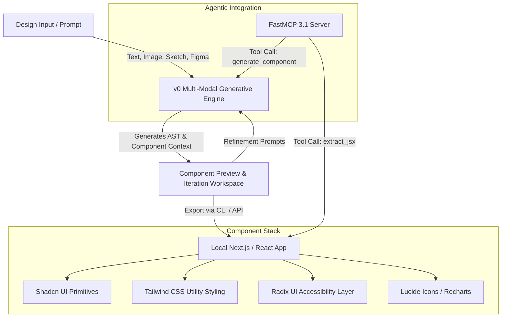
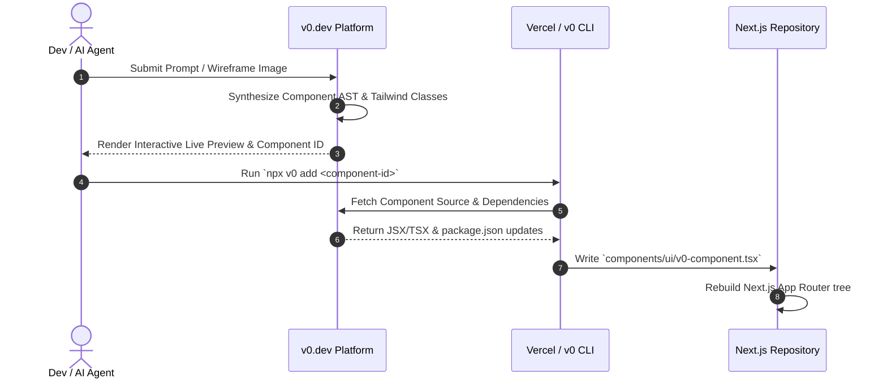

# v0.dev (Vercel v0)

## What it is
v0.dev (by Vercel) is an enterprise-grade Generative User Interface (Generative UI) platform, AI copilot, and design system compiler. Operating in early 2027, v0 transforms complex natural language prompts, wireframes, hand-drawn sketches, or Figma component URLs into production-grade React, [Next.js](nextjs.md), and [Tailwind CSS](tailwindcss.md) code. Deeply integrated with Shadcn UI, Radix UI primitives, Lucide icons, and modern state management libraries, v0 empowers frontend developers, UI/UX engineers, and AI agent frameworks to rapidly prototype, iterate, and deploy responsive, accessible Web applications.

Through its dual ecosystem—a interactive web workspace and programmatic CLI/API endpoints—v0 bridges design-to-code execution gaps. It generates semantic JSX/TypeScript code that adheres to strict ARIA accessibility standards and Tailwind CSS utility conventions, making it a foundational tool for contemporary frontend workflows and automated AI agent UI composition.



## What problem it solves
Designing and engineering React component architecture from scratch involves repetitive, error-prone boilerplate: configuring Tailwind class utilities, setting up keyboard accessibility and focus rings (Radix UI / ARIA standards), managing responsive layout breakpoints, and writing boilerplate state hooks. Furthermore, converting high-fidelity visual mockups into functional code often leads to visual drift and design system inconsistencies.

v0.dev solves these challenges by:
- **Automating UI Boilerplate**: Instantly generating clean, modular React/TypeScript components with pre-configured Tailwind classes and Radix primitives.
- **Eliminating Visual Drift**: Accepting image uploads (wireframes, screenshots, Figma exports) to recreate visual layouts with exact spatial alignment and styling.
- **Accelerating Agentic Frontend Workflows**: Providing a structured API and CLI interface (`npx v0 add`) that allows autonomous AI coding agents (e.g., Claude Code, Cursor) to inject frontend UI components directly into full-stack applications.

## Where it fits in the stack
**Category**: [Development & Ops](index.md) / Generative UI & Frontend Prototyping.

v0 sits at the intersection of frontend component architecture, design systems, and agentic UI composition:
- **Design System Layer**: Translates higher-level visual design tokens into standardized Shadcn UI and Tailwind CSS primitives.
- **Development & Ops Layer**: Works seamlessly with developer tools, Next.js App Router architectures, and Vercel edge deployment infrastructure.
- **AI Agent Tooling Layer**: Acts as a generative UI tool endpoint for multi-agent software engineering frameworks (FastMCP 3.1) requiring on-demand UI rendering.



## Typical use cases
- **Complex Dashboard Cards & Analytics**: Generating interactive data visualization widgets, metric trend cards, and tabbed analytics tables complete with [Recharts](https://recharts.org) and Tailwind responsive layouts.
- **Accessible Form Workflows**: Creating multi-step wizard forms, authentication portals, and settings forms with full keyboard navigation and accessible Radix UI primitives.
- **Design System Component Synthesis**: Translating company brand guidelines or Figma design tokens into custom Tailwind-styled component libraries.
- **Dynamic Generative UI for Agents**: Enabling autonomous agent runtimes to synthesize custom user interfaces on the fly in response to user queries, streaming interactive components directly to web clients.

## Strengths
- **Production-Ready Code Standards**: Outputs clean, maintainable TypeScript with zero obfuscation, using industry-standard utilities (`clsx`, `tailwind-merge`).
- **Multimodal Visual Inputs**: High-fidelity recreation of UI components directly from uploaded images, wireframe sketches, or UI screenshots.
- **Seamless CLI & Package Ecosystem**: Direct component injection via `npx v0 add`, automatically resolving required npm package dependencies (`lucide-react`, `framer-motion`, `radix-ui`).
- **Interactive Live Workspace**: Real-time component preview environment supporting mobile/desktop breakpoint toggles, dark mode switching, and inline prompt refinement.

## Limitations
- **Frontend Focus**: Specialized purely in client-side UI generation; backend data persistence, ORM integration, API routes, and database schemas require full-stack framework handling.
- **Ecosystem Alignment**: Deeply opinionated towards React, Next.js, Tailwind CSS, and Shadcn UI; less optimal for Vue, Svelte, Angular, or plain HTML environments.
- **State Complexity Bound**: Extremely complex global state management workflows (e.g., Redux RTK Query, Zustand stores across dozens of components) require manual refactoring post-generation.

## When to use it
- When scaffolding modern React and Next.js App Router frontend components quickly from prompts or design mockups.
- When generating accessible UI primitives (dialogs, drop-downs, sidebars) compliant with ARIA standards via Radix UI.
- When establishing design-to-code pipelines for AI coding agents and automated frontend generators.

## When not to use it
- When architecting backend server microservices, database schemas, or infrastructure-as-code (use [Next.js](nextjs.md) API routes, Prisma, or Terraform).
- For non-React projects built on Vue (Nuxt), Svelte (SvelteKit), or native mobile apps (React Native/Flutter).
- When generating raw unstyled HTML/CSS without component framework abstractions.

## Getting started

### 1. Workspace Prototyping
1. Navigate to [v0.dev](https://v0.dev) and log in with your Vercel account credentials.
2. Enter a natural language prompt or attach an image mockup:
   ```text
   Create a dark-mode SaaS billing dashboard card displaying active subscription tier, credit usage progress bar, and payment method details with a modal for upgrade options.
   ```
3. Use the interactive canvas to tweak responsive behavior, dark mode variants, and text content.

### 2. Exporting to a Local Project
Inject the generated component into your Next.js codebase using the v0 CLI:

```bash
# Add generated component directly to your project
npx v0 add v0-billing-dashboard-89a
```

Verify component injection inside `components/v0/billing-dashboard.tsx` and check `components.json` for path aliases (`@/components`).

## CLI examples

### Initializing and Adding v0 Components
Initialize v0 settings or inject components into custom component directories:

```bash
# Add component to a specific directory with custom component alias
npx v0 add v0-analytics-card-102 --path components/dashboard/analytics.tsx

# Force overwrite existing component file during iterative prompt updates
npx v0 add v0-analytics-card-102 --overwrite
```

### Checking Dependency Health and Tailwind Aliases
Confirm path aliases and Tailwind CSS utility setups:

```bash
# Inspect Shadcn / v0 configuration file
cat components.json
```

```json
{
  "$schema": "https://ui.shadcn.com/schema.json",
  "style": "default",
  "rsc": true,
  "tsx": true,
  "tailwind": {
    "config": "tailwind.config.js",
    "css": "app/globals.css",
    "baseColor": "slate",
    "cssVariables": true
  },
  "aliases": {
    "components": "@/components",
    "utils": "@/lib/utils"
  }
}
```

## API examples

### FastMCP 3.1 Server for Automated Component Generation
The following Python script implements a **FastMCP 3.1** server that exposes tools to synthesize v0 UI components, parse returned JSX ASTs, and validate export metadata:

```python
from typing import List, Optional, Dict, Any
from pydantic import BaseModel, Field, HttpUrl
from fastmcp import FastMCP

mcp = FastMCP(
    "v0-generative-ui-server",
    instructions="MCP Server for generating, validating, and managing v0.dev Generative UI components."
)

class ComponentProp(BaseModel):
    name: str = Field(..., description="Property name, e.g., isOpen, title, or onSelect")
    prop_type: str = Field(..., alias="type", description="TypeScript type definition string")
    required: bool = Field(default=False)
    default_value: Optional[str] = Field(None)

class V0ComponentSpec(BaseModel):
    component_id: str = Field(..., description="Unique v0 component identifier string")
    title: str = Field(..., description="Human-readable title of the component")
    framework: str = Field(default="nextjs", description="Target framework, e.g., nextjs, react")
    styling: str = Field(default="tailwindcss", description="CSS utility library")
    dependencies: List[str] = Field(default_factory=list, description="npm packages required by component")
    props: List[ComponentProp] = Field(default_factory=list, description="Validated TypeScript prop definitions")
    export_url: Optional[HttpUrl] = Field(None, description="Direct URL to v0 component preview")

@mcp.tool()
def synthesize_v0_component(
    prompt: str,
    design_system: str = "shadcn-ui",
    enable_dark_mode: bool = True
) -> Dict[str, Any]:
    """
    Synthesize a v0.dev React component specification based on a natural language prompt.
    """
    # Simulated v0 generation API response payload
    simulated_payload = {
        "component_id": "v0-chart-card-89a",
        "title": f"Generated UI for: {prompt[:30]}...",
        "framework": "nextjs",
        "styling": "tailwindcss",
        "dependencies": ["lucide-react", "recharts", "framer-motion", "@radix-ui/react-dialog"],
        "props": [
            {"name": "data", "type": "MetricPoint[]", "required": True},
            {"name": "isDark", "type": "boolean", "required": False, "default_value": "true"}
        ],
        "export_url": "https://v0.dev/chat/b/v0-chart-card-89a"
    }

    spec = V0ComponentSpec.model_validate(simulated_payload)
    return {
        "status": "success",
        "spec": spec.model_dump(),
        "cli_command": f"npx v0 add {spec.component_id}"
    }

@mcp.tool()
def validate_component_props(raw_json: str) -> str:
    """
    Validate incoming component prop specification JSON against Pydantic v2 schemas.
    """
    try:
        spec = V0ComponentSpec.model_validate_json(raw_json)
        return f"Component '{spec.title}' (ID: {spec.component_id}) is valid. {len(spec.dependencies)} dependencies verified."
    except Exception as e:
        return f"Validation error: {str(e)}"

if __name__ == "__main__":
    mcp.run()
```

### Production Pydantic v2 Validation Pipeline
Use **Pydantic v2** to validate complex UI generation responses, Shadcn configuration parameters, and component prop definitions before injecting into automated Next.js builds:

```python
import json
from typing import List, Dict, Optional
from pydantic import BaseModel, Field, HttpUrl, ValidationError, field_validator

class TailwindConfigSpec(BaseModel):
    config_path: str = Field(default="tailwind.config.js")
    css_path: str = Field(default="app/globals.css")
    base_color: str = Field(default="slate")
    css_variables: bool = Field(default=True)

class V0ExportManifest(BaseModel):
    component_id: str = Field(..., pattern=r"^v0-[a-z0-9-]+$")
    version: str = Field(default="1.0.0")
    framework: str = Field(default="nextjs")
    components_json_alias: str = Field(default="@/components")
    tailwind_spec: TailwindConfigSpec = Field(default_factory=TailwindConfigSpec)
    dependencies: List[str] = Field(default_factory=list)
    jsx_code: str = Field(..., min_length=20, description="Generated TSX/JSX component source code")

    @field_validator("jsx_code")
    def check_react_import(cls, v: str) -> str:
        if "export default" not in v and "export function" not in v:
            raise ValueError("Generated JSX code must export a valid React component function.")
        return v

def process_v0_webhook_payload(payload_str: str) -> V0ExportManifest:
    """
    Parses and validates incoming webhook payload from v0 component generation pipelines.
    """
    data = json.loads(payload_str)
    return V0ExportManifest.model_validate(data)

if __name__ == "__main__":
    sample_payload = """
    {
        "component_id": "v0-dashboard-widget-404",
        "version": "1.2.0",
        "framework": "nextjs",
        "components_json_alias": "@/components",
        "tailwind_spec": {
            "config_path": "tailwind.config.js",
            "css_path": "app/globals.css",
            "base_color": "zinc",
            "css_variables": true
        },
        "dependencies": ["lucide-react", "clsx", "tailwind-merge"],
        "jsx_code": "import React from 'react'; export function DashboardWidget() { return <div className='p-4 bg-slate-900 text-white rounded-lg'>Analytics Widget</div>; }"
    }
    """

    try:
        manifest = process_v0_webhook_payload(sample_payload)
        print(f"Successfully processed v0 Component: {manifest.component_id}")
        print(f"Tailwind Base Color: {manifest.tailwind_spec.base_color}")
        print(f"Dependencies count: {len(manifest.dependencies)}")
    except ValidationError as e:
        print(f"Validation failure:\n{e.json(indent=2)}")
```

## Production Deployment Patterns & Next.js Integration

### App Router Setup with v0 Components
When deploying components generated by v0 in a Next.js App Router project (`app/page.tsx`), adhere to the following file architecture and client directive rules:

```text
my-nextjs-app/
├── app/
│   ├── globals.css          # Tailwind base & CSS variables
│   ├── layout.tsx           # Root layout with font providers
│   └── page.tsx             # Main application page
├── components/
│   ├── ui/                  # Standard Shadcn UI components (button, dialog)
│   └── v0/                  # Dedicated directory for v0-generated widgets
│       └── billing-card.tsx # Generated component from `npx v0 add`
├── lib/
│   └── utils.ts             # Tailwind class merge helper (cn)
├── components.json          # Shadcn / v0 path configuration
└── tailwind.config.js       # Tailwind theme extensions
```

### Handling Client Components vs Server Components
v0 components frequently utilize interactive React state hooks (`useState`, `useEffect`, `useForm`). Ensure proper client component boundary declarations at the top of generated files:

```tsx
// components/v0/billing-card.tsx
"use client"

import * as React from "react"
import { CreditCard, CheckCircle } from "lucide-react"
import { cn } from "@/lib/utils"

interface BillingCardProps {
  planName: string
  monthlyPrice: number
  isCurrentPlan?: boolean
  className?: string
}

export function BillingCard({
  planName,
  monthlyPrice,
  isCurrentPlan = false,
  className
}: BillingCardProps) {
  const [selected, setSelected] = React.useState(isCurrentPlan)

  return (
    <div
      onClick={() => setSelected(!selected)}
      className={cn(
        "p-6 rounded-xl border transition-all cursor-pointer",
        selected
          ? "border-blue-500 bg-blue-950/20 shadow-lg shadow-blue-500/10"
          : "border-slate-800 bg-slate-900 hover:border-slate-700",
        className
      )}
    >
      <div className="flex items-center justify-between">
        <div className="flex items-center space-x-3">
          <CreditCard className="w-6 h-6 text-blue-400" />
          <h3 className="text-lg font-semibold text-slate-100">{planName}</h3>
        </div>
        {selected && <CheckCircle className="w-5 h-5 text-blue-500" />}
      </div>
      <div className="mt-4">
        <span className="text-3xl font-bold text-white">${monthlyPrice}</span>
        <span className="text-slate-400 text-sm"> / month</span>
      </div>
    </div>
  )
}
```

## Troubleshooting & Common Failure Modes

| Issue / Failure Mode | Root Cause | Resolution Strategy |
| :--- | :--- | :--- |
| **Missing Utility Helper (`cn` not found)** | Generated JSX imports `@/lib/utils` which is missing in uninitialized projects. | Run `npx shadcn-ui@latest init` or manually add `lib/utils.ts` with `clsx` and `tailwind-merge`. |
| **Hydration Mismatch Error** | Server-side rendering mismatched dynamic client IDs or local storage states. | Wrap dynamic state initializations inside `useEffect` or add `"use client"` at top of component. |
| **Unresolved Icon Package Imports** | Component references `lucide-react` or `@radix-ui` primitives not yet installed in local `package.json`. | Run `npm install lucide-react @radix-ui/react-slot clsx tailwind-merge`. |
| **Tailwind Class Name Conflicts** | Custom Tailwind theme extensions in `tailwind.config.js` missing required CSS variable definitions. | Update `app/globals.css` to define missing CSS root variables (`--background`, `--foreground`, `--primary`). |
| **`npx v0 add` Network Timeout** | Local network proxy or firewall blocking `v0.dev` domain requests. | Set `HTTP_PROXY`/`HTTPS_PROXY` environment variables or manually download JSX from v0 web preview. |

## Related tools / concepts
- [Next.js](nextjs.md) — Enterprise React framework standard targeted by v0 exports.
- [Tailwind CSS](tailwind-css.md) — Utility-first CSS styling framework integrated into v0 components.
- [Vercel](vercel.md) — Cloud platform hosting v0.dev and serverless application infrastructure.
- [Claude Code](claude-code-setup.md) — Agentic CLI tool capable of driving v0 frontend additions autonomously.
- [Shadcn UI](https://ui.shadcn.com/) — Reusable component library primitives utilized by v0.
- [Model Context Protocol (MCP)](../automation_orchestration/mcp.md) — Standard protocol for integrating v0 generation into AI tool chains.

## Sources / References
- [v0.dev Official Website](https://v0.dev/)
- [Vercel v0 Documentation](https://vercel.com/docs/v0)
- [Shadcn UI Documentation](https://ui.shadcn.com/)
- [Next.js App Router Documentation](https://nextjs.org/docs/app)
- [Radix UI Accessibility Primitives](https://www.radix-ui.com/)

---
## Contribution Metadata
- Last reviewed: 2027-01-07
- Confidence: high
