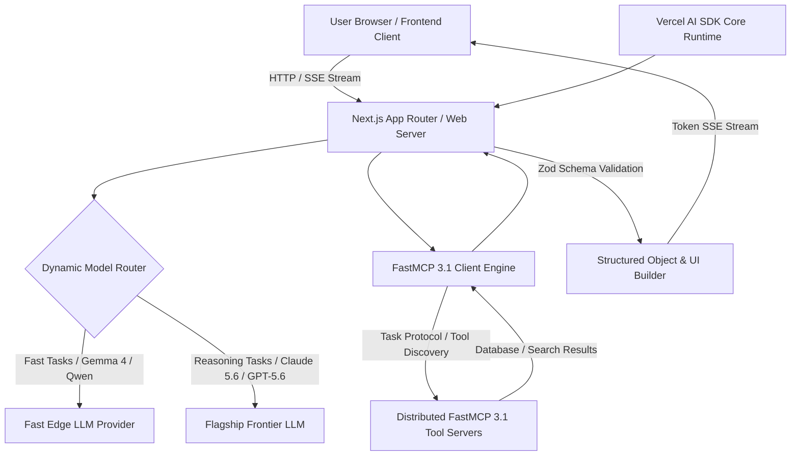

# AI SDK (by Vercel)

## What it is
The Vercel AI SDK (v4.5+) is an open-source, type-safe TypeScript toolkit designed to build AI-powered web applications, generative user interfaces, and autonomous multi-agent systems across Next.js, React, Vue, Svelte, Node.js, and edge runtimes. Operating under early 2027 standards, the AI SDK features native bindings for the **FastMCP 3.1 Task Protocol**, enabling web backends to orchestrate tools hosted on distributed Model Context Protocol servers while consuming frontier models—such as **Claude 5.6**, **GPT-5.6**, **Gemini 4.0 Ultra**, **Llama 4 Maverick**, **DeepSeek-V4**, and **Qwen 3.6 VL**.

By unifying streaming text generation (`streamText`), structured object generation (`generateObject`), dynamic server UI actions (`streamUI`), and multi-step tool execution loops (`maxSteps`), the Vercel AI SDK serves as the primary application-layer SDK for modern AI web engineering.



## What problem it solves
Developing web applications powered by LLMs often involves wrestling with disparate provider APIs, fragmented streaming protocols, brittle custom JSON parsers, and vendor lock-in. Switching models from OpenAI to Anthropic or Google typically requires rewriting API handlers, streaming parsers, and tool-calling interfaces.

The Vercel AI SDK solves these engineering bottlenecks through:
- **Unified Multi-Provider Interface**: Standardizing model declarations across dozens of LLM providers with single-line configuration updates (`openai('gpt-5.6')`, `anthropic('claude-5-6-sonnet')`, `google('gemini-4.0-ultra')`).
- **First-Class Streaming & Generative UI**: Abstracting token-by-token Server-Sent Events (SSE) streaming and React Server Component (RSC) rendering with hooks like `useChat`, `useCompletion`, and `streamUI`.
- **Type-Safe Structured Output**: Integrating directly with Zod, ArkType, and JSON Schema to guarantee that LLM output objects adhere strictly to application TypeScript types (`generateObject`, `streamObject`).
- **Native FastMCP 3.1 Integration**: Allowing server-side web backends to discover, authenticate, and execute tools exposed by FastMCP 3.1 servers in recursive agent loops.

## Where it fits in the stack
**Category**: [Development & Ops](index.md) / AI Application SDK & Frontend Integration.

The Vercel AI SDK sits at the **Application & Presentation Layer**, bridging user-facing frontend components (React, Next.js, Vue, Svelte) with foundational LLMs and distributed FastMCP 3.1 tool microservices.

```
+-----------------------------------------------------------------------+
|                    Frontend UI Layer (Browser / App)                  |
|          (React Server Components / useChat / Generative UI)          |
+-----------------------------------------------------------------------+
                                    |
                                    v (HTTP SSE / React Server Actions)
+-----------------------------------------------------------------------+
|                       Vercel AI SDK Application Layer                 |
|  +-----------------------+  +-------------------+  +---------------+  |
|  | streamText / Chat     |  | generateObject    |  | FastMCP Client|  |
|  +-----------------------+  +-------------------+  +---------------+  |
|  +-----------------------------------------------------------------+  |
|  |             Zod / ArkType Schema Validation Middleware          |  |
|  +-----------------------------------------------------------------+  |
+-----------------------------------------------------------------------+
                                    |
                        +-----------+-----------+
                        |                       |
                        v                       v
+-----------------------------------+   +-------------------------------+
|     Frontier Model Providers      |   |   FastMCP 3.1 Tool Servers    |
| (Claude 5.6, GPT-5.6, Gemini 4)  |   | (Azure Search, PostHog, SQL)  |
+-----------------------------------+   +-------------------------------+
```

## Typical use cases
- **Generative UI Applications**: Dynamically rendering interactive React components (charts, forms, dashboards) on the fly based on streamed model output.
- **Autonomous Multi-Step Agent Backends**: Constructing server-side agentic loops (`maxSteps: 10`) that automatically execute tools until a complex workflow reaches completion.
- **Type-Safe API Data Extraction**: Converting raw, unstructured PDF text, email threads, or web pages into validated JSON data structures for database insertion.
- **Low-Latency Edge AI Interfaces**: Deploying streaming chat assistants to global Vercel Edge networks with sub-100ms time-to-first-token latency.

## Strengths
- **Native FastMCP 3.1 Client Engine**: Effortlessly discovers and executes tools hosted on external FastMCP servers with full schema validation.
- **Unified Multi-Provider Abstraction**: Swap between Claude 5.6, GPT-5.6, Gemini 4.0 Ultra, DeepSeek-V4, and open-weights models without changing application business logic.
- **Deep React & Web Framework Integration**: Provides production-ready UI hooks (`useChat`, `useCompletion`, `useObject`) optimized for modern web frameworks.
- **Zero-Boilerplate Streaming Primitives**: Handles Server-Sent Events, stream transformers, and edge runtime token buffers automatically.
- **Type Safety End-to-End**: Autocomplete and compile-time TypeScript type checking from model inputs to UI rendering.

## Limitations
- **TypeScript / JavaScript Ecosystem Centric**: Designed primarily for Node.js, Deno, Bun, and browser environments; Python backends require separate tools like [Pydantic AI](../frameworks/pydantic-ai.md).
- **Rapid Version Evolution**: High-frequency feature updates require active dependency maintenance to leverage the latest model capabilities.
- **Client Key Security Management**: Requires executing model logic inside server actions or API routes to prevent exposing provider API keys to client browsers.

## When to use it
- When building modern web applications in React, Next.js, Vue, or Svelte that require streaming LLM responses or generative UI.
- When orchestrating complex agentic workflows in Node.js that combine multiple model providers and FastMCP 3.1 tools.
- When building enterprise interfaces where typed JSON schema outputs are required for backend processing.

## When not to use it
- For Python-exclusive backend microservices (use [Pydantic AI](../frameworks/pydantic-ai.md) or [FastAPI](../frameworks/fastapi.md) wrappers).
- For simple CLI utility scripts where a lightweight direct fetch request is sufficient.
- When working on offline-only embedded C/C++ applications without JavaScript runtime support.

## Getting started

### Installation
Install the core AI SDK alongside provider adapters and Zod validation:

```bash
npm install ai @ai-sdk/openai @ai-sdk/anthropic @ai-sdk/google zod
```

### Environment Configuration
Configure your API credentials in `.env.local`:

```bash
OPENAI_API_KEY=your-openai-api-key
ANTHROPIC_API_KEY=your-anthropic-api-key
GOOGLE_GENERATIVE_AI_API_KEY=your-google-api-key
```

### Basic Streaming Text Generation (TypeScript / Node.js)
Execute a streaming prompt using Claude 5.6:

```typescript
import { streamText } from 'ai';
import { anthropic } from '@ai-sdk/anthropic';

async function main() {
  const result = streamText({
    model: anthropic('claude-5-6-sonnet'),
    prompt: 'Explain the core architectural benefits of FastMCP 3.1 for multi-agent systems.',
  });

  for await (const textPart of result.textStream) {
    process.stdout.write(textPart);
  }
}

main();
```

## CLI examples

Below are common Vercel CLI and package runner commands for deploying AI SDK applications and initializing agentic starter templates.

```bash
# 1. Initialize a modern Next.js AI Chatbot template with Vercel AI SDK
npx create-next-app@latest --example https://github.com/vercel/ai-chatbot my-agent-app

# 2. Add API key environment secrets to Vercel production deployment
vercel env add ANTHROPIC_API_KEY production

# 3. Deploy the AI SDK web application to Vercel Edge Network
vercel --prod

# 4. Inspect streaming server logs on active Vercel deployment
vercel logs my-agent-app --follow
```

## API examples

### Multi-Step Agentic Tool Calling with FastMCP 3.1 (Next.js / TypeScript)
The TypeScript example below demonstrates configuring a multi-step agent loop (`maxSteps: 5`) using the Vercel AI SDK, executing custom tools and returning validated results.

```typescript
import { generateText, tool } from 'ai';
import { openai } from '@ai-sdk/openai';
import { z } from 'zod';

export async function runAgenticTask(userPrompt: string) {
  const { text, steps } = await generateText({
    model: openai('gpt-5.6-preview'),
    maxSteps: 5,
    system: 'You are an enterprise operations assistant capable of executing system tasks.',
    prompt: userPrompt,
    tools: {
      checkServerHealth: tool({
        description: 'Check operational status and CPU metrics for a server node.',
        parameters: z.object({
          hostname: z.string().describe('Target hostname or IP address'),
          includeMetrics: z.boolean().default(true),
        }),
        execute: async ({ hostname, includeMetrics }) => {
          // Simulated tool execution logic
          return {
            hostname,
            status: 'HEALTHY',
            cpuUsagePercent: 14.2,
            memoryFreeMB: 8192,
            timestamp: new Date().toISOString(),
          };
        },
      }),
      restartService: tool({
        description: 'Restart a specified system service daemon.',
        parameters: z.object({
          serviceName: z.string(),
          force: z.boolean().default(false),
        }),
        execute: async ({ serviceName, force }) => {
          return {
            serviceName,
            restarted: true,
            actionCode: force ? 'FORCE_RESTART' : 'GRACEFUL_RESTART',
          };
        },
      }),
    },
  });

  console.log(`Agent finished execution in ${steps.length} steps.`);
  return { finalAnswer: text, executionSteps: steps };
}
```

### Python / Pydantic v2 Schema Validation for Heterogeneous Services
When a Vercel AI SDK Node.js application passes structured JSON responses (`generateObject`) to a Python analytics service, define matching Pydantic v2 schemas for verification:

```python
from pydantic import BaseModel, Field, conint, field_validator
from typing import List, Literal, Optional
import json

class TaskAssignmentSchema(BaseModel):
    task_id: str = Field(..., alias="taskId", pattern=r"^TASK-[0-9]+$")
    title: str = Field(..., min_length=3)
    priority: Literal["critical", "high", "medium", "low"]
    assigned_agent: str = Field(..., alias="assignedAgent")
    estimated_hours: conint(ge=1, le=100) = Field(..., alias="estimatedHours")
    mcp_tool_required: bool = Field(default=True, alias="mcpToolRequired")

    class Config:
        populate_by_name = True

class VercelAIObjectPayload(BaseModel):
    timestamp: str
    generated_tasks: List[TaskAssignmentSchema] = Field(..., alias="generatedTasks")

# Simulation of validating JSON payload generated by Vercel AI SDK generateObject()
raw_sdk_json_output = """
{
  "timestamp": "2027-01-07T14:32:00Z",
  "generatedTasks": [
    {
      "taskId": "TASK-101",
      "title": "Migrate backend tools to FastMCP 3.1 Task Protocol",
      "priority": "critical",
      "assignedAgent": "agent-claude-dev",
      "estimatedHours": 6,
      "mcpToolRequired": true
    }
  ]
}
"""

if __name__ == "__main__":
    validated_data = VercelAIObjectPayload.model_validate_json(raw_sdk_json_output)
    print("Vercel AI SDK payload verified with Pydantic v2:")
    print(f"Timestamp: {validated_data.timestamp}")
    for task in validated_data.generated_tasks:
        print(f"Task: [{task.task_id}] {task.title} | Priority: {task.priority} | Est. Hours: {task.estimated_hours}")
```

## Related tools / concepts
- [Model Context Protocol (MCP)](../automation_orchestration/mcp.md) — Universal protocol for LLM tool integration.
- [Pydantic AI](../frameworks/pydantic-ai.md) — Python agent and validation framework.
- [Firebase Genkit](../frameworks/firebase-genkit.md) — Node.js AI framework from Google.
- [Claude Code](claude-code.md) — Agentic coding assistant.
- [Windsurf](windsurf.md) — FastMCP-ready agentic IDE.
- [OpenCode](opencode.md) — Open-source agentic development framework.

## Sources / references
- [Vercel AI SDK Official Documentation](https://sdk.vercel.ai/docs)
- [GitHub - Vercel AI Repository](https://github.com/vercel/ai)
- [FastMCP 3.1 Specification](https://modelcontextprotocol.io)

## Contribution Metadata
- Last reviewed: 2027-01-07
- Confidence: high
