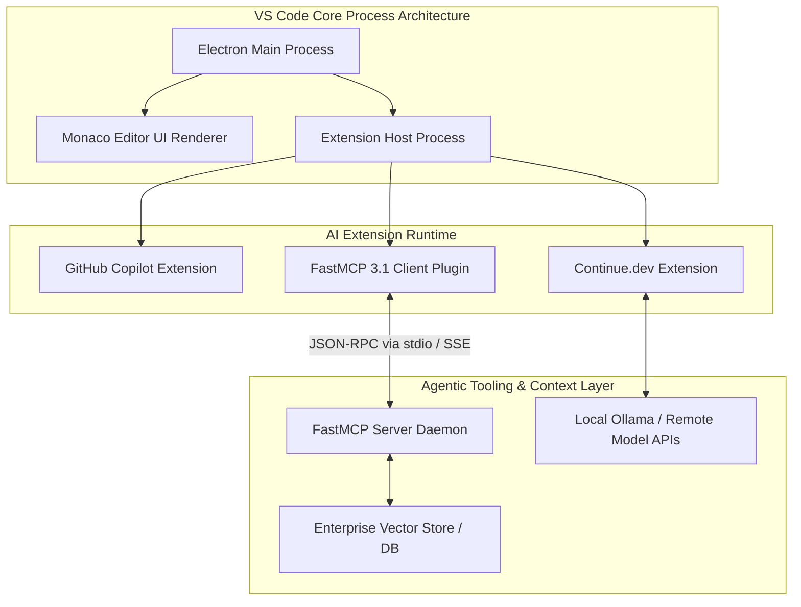

# Visual Studio Code (VS Code)

## What it is
Visual Studio Code is a lightweight but powerful source code editor which runs on your desktop and is available for Windows, macOS, and Linux. It comes with built-in support for JavaScript, TypeScript, Python, and Node.js and has a rich ecosystem of extensions for other languages and runtimes.

## What problem it solves
It provides a highly extensible "middle ground" between a simple text editor and a heavy Integrated Development Environment (IDE). Its vast extension ecosystem makes it the primary platform for AI-powered development tools, allowing developers to mix and match different AI assistants and productivity tools. As of early 2027, it serves as the reference implementation for the **Model Context Protocol (FastMCP 3.1) Task Protocol**, enabling seamless agentic orchestration between the editor and external tools.

## Where it fits in the stack
**Development & Ops / Editor**. It serves as the primary interface for coding and serves as the "host" for various AI extensions like GitHub Copilot Workspace, Continue, and Codeium.

## Typical use cases
- **General-Purpose Coding**: Supporting almost any language via extensions.
- **AI-Enhanced Development**: Running multiple AI assistants simultaneously powered by **Claude 5.1**, **Claude 5.6**, **GPT-5.5**, **GPT-5.6**, and **Gemini 4.0 Pro**.
- **Remote Development**: Connecting to remote servers, containers, or WSL via the Remote Development extension pack.
- **Cloud-Native Dev**: Integrating with Kubernetes, Docker, and various cloud providers (AWS, Azure, GCP).

## Key Features & Capabilities
- **Unrivaled Extension Ecosystem**: Access to tens of thousands of extensions across themes, debuggers, formatters, and AI agents.
- **Native FastMCP 3.1 Host Architecture**: Directly host and orchestrate Model Context Protocol tools, tasks, and resource providers inside the extension runtime.
- **Remote Development Suite (SSH, Containers, WSL)**: Edit code directly on remote cloud servers, inside Docker containers, or in WSL environments seamlessly.
- **Integrated Terminal & Debugging**: Powerful multi-tabbed terminal host with inline debugging, breakpoint hooks, and call stack inspection.
- **Source Control Integration**: Built-in Git/GitHub integration with visual diff views, staging management, and merge conflict resolution.

## Architecture & Internal Mechanics

VS Code is built on Electron, Node.js, and Monaco Editor, enforcing strict process isolation between the core UI renderer and the extension host thread to ensure performance responsiveness.



### Extension Isolation & IPC
1. **Renderer Isolation**: The Monaco Editor UI runs on a dedicated Chromium renderer process, ensuring UI responsiveness never freezes during high-compute background tasks.
2. **Extension Host Execution**: Extensions (including Copilot, Continue, and MCP bridges) run in a separate Node.js process, communicating with the UI via binary IPC streams.
3. **MCP Tool Bridge**: FastMCP 3.1 extensions establish stdio or HTTP/SSE streams to local or remote tool daemons, injecting real-time context back into the editor window.

## Strengths
- **Extensibility**: Unmatched library of plugins and themes.
- **Performance**: Faster than traditional IDEs while being more capable than basic editors.
- **Remote Capabilities**: Best-in-class support for remote development.
- **Ecosystem**: Most AI tools target VS Code as their first integration platform with native FastMCP 3.1 support.

## Limitations
- **Resource Intensity**: Can consume significant memory with many active extensions.
- **Configuration Overhead**: Complex setups (especially with multiple AI tools) can require significant `settings.json` tweaking.
- **Built-in AI**: Unlike [Cursor](cursor.md) or [Zed](zed.md), AI features are secondary additions via extensions rather than natively integrated.

## When to use it
- When you need a versatile, battle-tested editor with the widest possible support for languages and tools.
- When you want to experiment with multiple different AI assistants (e.g., using Aider in the terminal and Copilot in the editor).
- When performing remote development on servers or in Docker containers.

## When not to use it
- When you want an editor that is "AI-native" where the AI has deep access to the editor's internals (consider [Cursor](cursor.md)).
- When you need maximum startup speed and minimal memory footprint (consider [Zed](zed.md)).

## Getting started

To get started with Visual Studio Code, you can install it via package manager and launch a hello-world project.

### Installation
```bash
# On macOS via Homebrew Cask
brew install --cask visual-studio-code

# On Ubuntu/Debian via apt
sudo apt update && sudo apt install code
```

### Hello-World Example
To verify your installation and CLI integration, create a simple Python "hello world" file and open it in VS Code:
```bash
# Create a hello-world file
echo 'print("Hello, World from VS Code!")' > hello_world.py

# Launch VS Code and open the file
code hello_world.py
```

### Key Extensions for AI (Early 2027)
- **GitHub Copilot**: The standard AI completion and agent workspace engine (now with **Claude 5.6** and **Gemini 4.0 Pro** support).
- **Continue**: Open-source autopilot that allows using any LLM (optimized for local Ollama and remote frontier APIs).
- **Codeium / Windsurf**: Fast AI autocomplete and agentic chat extension.
- **FastMCP Extension**: Native support for Model Context Protocol (FastMCP 3.1) servers.

## CLI examples

Visual Studio Code provides a robust command line interface (`code`) for file operations, extension management, and file comparison.

```bash
# 1. Open the current directory in the VS Code window
code .

# 2. Install a specific extension from the marketplace
code --install-extension github.copilot

# 3. Open a side-by-side diff comparing two files
code --diff file1.txt file2.txt

# 4. Disable all extensions for performance troubleshooting
code . --disable-extensions

# 5. Output installed extensions with versions
code --list-extensions --show-versions
```

## API examples

### VS Code Extension API
For developers extending VS Code programmatically, here is a minimal Node.js/TypeScript extension snippet displaying a "Hello World" notification.

```javascript
const vscode = require('vscode');

/**
 * Activates the VS Code extension.
 * @param {vscode.ExtensionContext} context
 */
function activate(context) {
    console.log('Congratulations, your extension "hello-world" is now active!');

    // Register a command that shows an information message box
    let disposable = vscode.commands.registerCommand('extension.helloWorld', () => {
        vscode.window.showInformationMessage('Hello, World from the VS Code API!');
    });

    context.subscriptions.push(disposable);
}

module.exports = {
    activate
};
```

### FastMCP 3.1 VS Code Bridge Implementation (Python)
Expose custom editor diagnostics or environment context to an AI agent via FastMCP 3.1:

```python
import os
import json
from fastmcp import FastMCP, Context

mcp = FastMCP("vscode-workspace-bridge", version="3.1.0")

@mcp.tool(description="Inspect active VS Code settings and extension status for agentic setup")
async def inspect_vscode_environment(workspace_path: str, ctx: Context) -> dict:
    """Reads .vscode/settings.json to return current workspace configurations."""
    settings_file = os.path.join(workspace_path, ".vscode", "settings.json")
    if not os.path.exists(settings_file):
        return {"status": "missing", "settings": {}}

    with open(settings_file, "r") as f:
        content = json.load(f)

    ctx.info(f"Loaded VS Code settings from {settings_file}")
    return {"status": "found", "settings": content}

if __name__ == "__main__":
    mcp.run()
```

### Programmatic VS Code Configuration Manager (Pydantic v2)
Ensure VS Code setting definitions and FastMCP server configurations strictly conform to early 2027 schemas:

```python
from typing import Dict, List, Optional
from pydantic import BaseModel, Field, ConfigDict

class MCPServerConfig(BaseModel):
    model_config = ConfigDict(extra="forbid", populate_by_name=True)

    command: str = Field(..., description="Executable command to run the FastMCP server")
    args: List[str] = Field(default_factory=list, description="Arguments for the executable")
    env: Dict[str, str] = Field(default_factory=dict, description="Environment variables")

class VSCodeAISettings(BaseModel):
    model_config = ConfigDict(extra="forbid", populate_by_name=True)

    inline_suggest_enabled: bool = Field(default=True, alias="editor.inlineSuggest.enabled")
    format_on_save: bool = Field(default=True, alias="editor.formatOnSave")
    copilot_chat_model: str = Field(default="claude-5.6-opus", alias="github.copilot.advanced.model")
    mcp_servers: Dict[str, MCPServerConfig] = Field(default_factory=dict, alias="mcp.servers")

# Validate VS Code AI Configuration
raw_config = {
    "editor.inlineSuggest.enabled": True,
    "editor.formatOnSave": True,
    "github.copilot.advanced.model": "claude-5.6-opus",
    "mcp.servers": {
        "context7": {
            "command": "npx",
            "args": ["-y", "@upstash/mcp-server-context7"],
            "env": {"UPSTASH_REDIS_REST_URL": "https://fake.upstash.io"}
        }
    }
}

settings = VSCodeAISettings.model_validate(raw_config)
print(f"Validated Copilot model: {settings.copilot_chat_model}")
print(f"Registered FastMCP servers: {list(settings.mcp_servers.keys())}")
```

## Production & Workspace Best Practices
- **Workspace Settings Checking**: Commit a sanitized `.vscode/settings.json` and `.vscode/extensions.json` to source repositories to guarantee consistent editor setups, linter settings, and recommended AI plugins across development teams.
- **FastMCP Daemon Isolation**: Run MCP tool servers in containerized processes or isolated virtual environments rather than directly on the developer host to prevent arbitrary command execution vulnerabilities.
- **Extension Profiling**: Periodically execute `Developer: Startup Performance` from the Command Palette (`Cmd+Shift+P` / `Ctrl+Shift+P`) to identify extensions causing high latency during startup or host process loops.
- **Secure Key Management**: Avoid storing cloud API keys directly in `.vscode/settings.json`. Leverage environment variable expansion or system keychains via extensions.

## Related tools / concepts
- [Windsurf](windsurf.md): AI-powered IDE from Codeium.
- [Zed](zed.md): A high-performance, Rust-based alternative.
- [Cursor](cursor.md): A fork of VS Code with deep AI integration.
- [Aider](aider.md): Terminal-based AI coding assistant.
- [Claude Code](claude-code.md): Anthropic's CLI-based coding tool.
- [Codeium](codeium.md): A popular extension for VS Code.
- [Tabnine](tabnine.md): A privacy-focused extension for VS Code.
- [GitHub Copilot](github_copilot.md): The flagship AI extension for VS Code.
- [Model Context Protocol](../automation_orchestration/mcp.md): Standard for tool integration in VS Code.

## Sources / references
- [Official Website](https://code.visualstudio.com/)
- [VS Code Documentation](https://code.visualstudio.com/docs)
- [Remote Development in VS Code](https://code.visualstudio.com/docs/remote/remote-overview)

## Contribution Metadata
- Last reviewed: 2027-01-07
- Confidence: high
