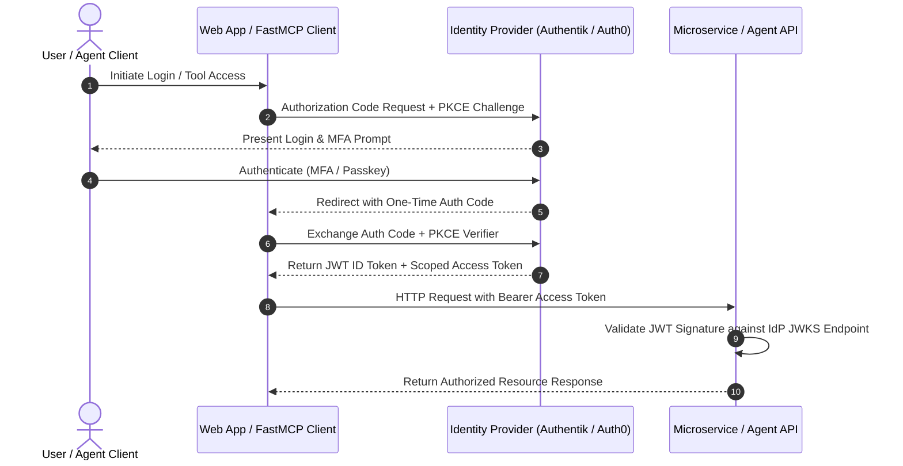

# OAuth 2.0 / OIDC (OpenID Connect)

## What it is
**OAuth 2.0** is the industry-standard delegated authorization framework (RFC 6749) that enables applications to obtain limited access to user resources on an HTTP service without exposing raw credentials. **OpenID Connect (OIDC)** is an identity authentication protocol built directly on top of OAuth 2.0 that allows clients to verify the identity of an end-user based on authentication performed by a central Authorization Server, issuing cryptographically signed JSON Web Tokens (JWT ID Tokens) alongside standard Access Tokens.

In modern enterprise AI architectures, multi-agent microservices, and self-hosted homelab environments, OAuth 2.0 / OIDC provides single sign-on (SSO), short-lived token authorization, role-based access control (RBAC), and cryptographically auditable identity delegation for web applications, FastMCP 3.1 servers, and autonomous agent workloads.

## What problem it solves
Managing static API keys and hardcoded database passwords across dozens of microservices and AI agent tools leads to severe security risks, poor auditability, and token leakage:
- **Credential Exposure & Hardcoding Risk**: Transmitting passwords or long-lived API keys across distributed AI agent tool calls increases the attack surface. OAuth 2.0 exchanges credentials for short-lived, scoped Bearer access tokens.
- **Fragmented Identity & Password Fatigue**: Forcing users to maintain separate user accounts across tools like Open WebUI, Paperless-ngx, Gitea, and Nextcloud creates operational overhead. OIDC standardizes Single Sign-On (SSO) via central Identity Providers ([Authentik](../../services/authentik.md), Keycloak, Okta, Microsoft Entra ID).
- **Coarse-Grained Tool Access**: Unrestricted agent tool access risks unintended database mutations or file deletions. OAuth 2.0 scopes (`read:docs`, `write:tools`, `admin:agents`) enforce fine-grained principle-of-least-privilege access.
- **Non-Standard Token Validation**: Custom session cookies fail across decentralized microservice meshes. OIDC standardizes RSA/ECDSA-signed JWT claims (`sub`, `iss`, `aud`, `exp`) that microservices can validate offline using public keys (JWKS).

## Protocol Flow & Architecture



## Where it fits in the stack
**Category**: Enterprise AI / Security, Identity & Access Management (IAM). Operating at the **Identity & Governance Layer**, OAuth 2.0 / OIDC bridges web gateways, FastMCP 3.1 agent servers, enterprise IdPs ([Authentik](../../services/authentik.md), [Microsoft Entra ID](microsoft-entra-id.md), [Okta](okta.md)), and model routing proxies.

## Key Features & Functional Modules
- **Authorization Code Flow with PKCE**: Secure authorization standard for public clients (single-page apps, mobile apps, CLI agents) that prevents authorization code injection attacks.
- **Standardized JWT ID & Access Tokens**: JSON Web Tokens signed via RS256/ES256 containing cryptographically verifiable user claims and expiration timestamps.
- **JSON Web Key Sets (JWKS)**: Standardized HTTP endpoints (`/.well-known/jwks.json`) publishing public keys for stateless offline token validation.
- **OAuth 2.0 Scopes & RBAC Claims**: Granular permission boundaries embedded directly within token payloads.
- **Token Introspection & Revocation**: Real-time status validation endpoints (RFC 7662) for immediate security revocations.

## Typical use cases
- **Centralized Homelab Single Sign-On (SSO)**: Authenticating users across Open WebUI, Paperless-ngx, and Nextcloud using Authentik or Keycloak as the central IdP.
- **FastMCP 3.1 Bearer Token Authorization**: Securing Model Context Protocol tool endpoints with short-lived, scoped OAuth access tokens.
- **Enterprise Multi-Tenant Delegation**: Integrating internal AI agent portals with corporate IdPs (Okta, Entra ID) using SAML/OIDC federation.
- **Automated Service-to-Service M2M Auth**: Using Client Credentials Grant (`grant_type=client_credentials`) for machine-to-machine background workflows.

## Strengths
- **Delegated Authorization Boundary**: Applications never handle or store user passwords directly.
- **Stateless Microservice Verification**: Downstream APIs validate JWT signatures locally using cached JWKS public keys without querying the IdP on every request.
- **Standardized Ecosystem Interoperability**: Supported by virtually every modern identity provider, web framework, and API gateway.
- **Granular Least-Privilege Scopes**: Limits agent action radius through dynamic scope assignment.

## Limitations
- **PKCE Implementation Rigor**: Implementing code challenge hashing and state verification requires strict compliance to prevent token replay attacks.
- **Revocation Delay for Statistically Validated JWTs**: Short token lifetimes (e.g., 5-15 minutes) or real-time introspection calls are necessary to invalidate compromised tokens immediately.
- **Identity Provider Availability Dependency**: Microservices rely on central IdP availability during initial token issuance or JWKS key rotation.

## When to use it
- When securing multi-user AI web dashboards, FastMCP 3.1 servers, or enterprise APIs.
- When enabling SSO, MFA, and role-based access control (RBAC) across self-hosted or cloud applications.
- When securing agent tool executions with scoped, short-lived Bearer tokens.

## When not to use it
- For single-user, local-only scripts where local environment variables or static local API keys suffice.
- For internal microservice meshes operating inside a fully isolated, zero-trust network perimeter where mutual TLS (mTLS) is preferred.

## Grant Types & Usage Matrix

| Grant Type / Flow | Target Client Type | Primary Use Case | Security Requirement |
| :--- | :--- | :--- | :--- |
| Authorization Code + PKCE | SPAs, Mobile Apps, Native CLI | User-facing web apps & CLI tools | Mandatory PKCE code verifier S256 |
| Client Credentials | M2M Microservices, Background Workers | Service-to-service automated API calls | Secure Client ID & Client Secret storage |
| Refresh Token Flow | Long-Running Clients | Acquiring new Access Tokens without re-prompting | Secure refresh token rotation & storage |
| Device Authorization Grant | Headless Devices, Smart TVs | Authenticating input-constrained devices | User code verification on separate device |

## Getting started

### 1. Initiating OIDC Authorization Request (PKCE)
Format an authorization request URL:
```
https://auth.example.com/application/o/authorize/
  ?response_type=code
  &client_id=ai-workspace-client-id
  &redirect_uri=https://app.example.com/callback
  &scope=openid%20profile%20email%20tools:execute
  &state=c3V3c2VjdXJlX3N0YXRl
  &code_challenge=E9Melhoa2OwvFrEMTJguCHaoeK1t8URWbuGJSstw-cM
  &code_challenge_method=S256
```

### 2. Exchanging Authorization Code for JWT Tokens via cURL
```bash
curl -X POST https://auth.example.com/application/o/token/ \
  -H "Content-Type: application/x-www-form-urlencoded" \
  -d "grant_type=authorization_code" \
  -d "client_id=ai-workspace-client-id" \
  -d "client_secret=YOUR_CLIENT_SECRET" \
  -d "redirect_uri=https://app.example.com/callback" \
  -d "code=AUTHORIZATION_CODE_RECEIVED" \
  -d "code_verifier=YOUR_PKCE_CODE_VERIFIER"
```

## CLI examples

### 1. Inspecting JWT Access Token Payload via CLI
```bash
echo "YOUR_JWT_ACCESS_TOKEN" | jq -R 'split(".") | .[1] | @base64d | fromjson'
```

### 2. Introspecting Token Status via IdP Endpoint
```bash
curl -u "client_id:client_secret" \
  -X POST https://auth.example.com/application/o/introspect/ \
  -d "token=YOUR_JWT_ACCESS_TOKEN"
```

### 3. Fetching Public JWKS Signing Keys
```bash
curl -s https://auth.example.com/application/o/jwks/ | jq .
```

## API examples

### 1. Python PyJWT Token Validation with Pydantic v2 Claims Model
This example demonstrates verifying a Bearer JWT token against an OIDC issuer and validating claims via Pydantic v2:

```python
import jwt
from pydantic import BaseModel, Field, EmailStr
from typing import List, Optional

class OIDCClaimsSchema(BaseModel):
    subject: str = Field(..., alias="sub", description="Unique user identity identifier")
    issuer: str = Field(..., alias="iss", description="Token issuing authority URL")
    audience: str = Field(..., alias="aud", description="Target application client ID")
    expiration: int = Field(..., alias="exp", description="Expiration timestamp (Unix epoch)")
    email: Optional[EmailStr] = None
    scopes: List[str] = Field(default_factory=list, description="Assigned OAuth 2.0 scopes")

def validate_and_parse_oidc_token(
    raw_token: str,
    public_key_pem: str,
    expected_audience: str,
    expected_issuer: str
) -> OIDCClaimsSchema:
    try:
        # Decode and verify JWT signature and standard claims
        decoded_dict = jwt.decode(
            raw_token,
            key=public_key_pem,
            algorithms=["RS256"],
            audience=expected_audience,
            issuer=expected_issuer
        )

        # Parse scope string into array if needed
        if "scope" in decoded_dict and isinstance(decoded_dict["scope"], str):
            decoded_dict["scopes"] = decoded_dict["scope"].split(" ")

        claims = OIDCClaimsSchema.model_validate(decoded_dict)
        print(f"Token successfully validated for user: {claims.subject}")
        return claims
    except jwt.ExpiredSignatureError:
        raise ValueError("JWT access token has expired.")
    except jwt.InvalidTokenError as e:
        raise ValueError(f"Invalid JWT token: {str(e)}")

if __name__ == "__main__":
    # Sample payload structure demonstration
    mock_claims = {
        "sub": "usr_998877",
        "iss": "https://auth.homelab.local/application/o/ai-agent",
        "aud": "fastmcp-gateway-app",
        "exp": 1799280000,
        "email": "agent.admin@homelab.local",
        "scope": "openid profile tools:execute"
    }

    if "scope" in mock_claims:
        mock_claims["scopes"] = mock_claims["scope"].split(" ")

    validated = OIDCClaimsSchema.model_validate(mock_claims)
    print("Parsed OIDC Claims:", validated.model_dump_json(indent=2))
```

### 2. FastMCP 3.1 Bearer Token Authorization Middleware
This pattern demonstrates enforcing OAuth 2.0 Bearer token authorization in a FastMCP 3.1 server:

```python
import asyncio
from pydantic import BaseModel, Field
from typing import Dict, Any, Optional

class FastMCPAuthContext(BaseModel):
    user_id: str
    is_authenticated: bool
    authorized_scopes: list[str]

class SecuredToolRequest(BaseModel):
    action: str = Field(..., description="Action to perform")
    target_resource: str = Field(..., description="Resource path")

class FastMCPOAuthMiddleware:
    def __init__(self, required_scope: str):
        self.required_scope = required_scope

    def authorize_request(self, auth_header: Optional[str]) -> FastMCPAuthContext:
        if not auth_header or not auth_header.startswith("Bearer "):
            raise PermissionError("Missing or malformed Authorization header")

        token = auth_header.split(" ")[1]

        # Simulate JWT token validation & scope inspection
        if token == "valid_agent_token_123":
            scopes = ["openid", "tools:read", "tools:execute"]
            if self.required_scope not in scopes:
                raise PermissionError(f"Insufficient scope. Required: {self.required_scope}")

            return FastMCPAuthContext(
                user_id="user_sec_001",
                is_authenticated=True,
                authorized_scopes=scopes
            )
        raise PermissionError("Invalid or expired OAuth token")

async def execute_secured_mcp_tool(auth_header: str, raw_args: Dict[str, Any]):
    middleware = FastMCPOAuthMiddleware(required_scope="tools:execute")
    context = middleware.authorize_request(auth_header)

    req = SecuredToolRequest.model_validate(raw_args)
    print(f"Authorized user {context.user_id} executing '{req.action}' on '{req.target_resource}'")
    return {"status": "success", "executed_by": context.user_id}

async def main():
    headers = "Bearer valid_agent_token_123"
    args = {"action": "query_database", "target_resource": "db/users"}
    res = await execute_secured_mcp_tool(headers, args)
    print("MCP Execution Result:", res)

if __name__ == "__main__":
    asyncio.run(main())
```

## Related tools / concepts
- [Okta](okta.md) — Enterprise Identity-as-a-Service (IDaaS) platform.
- [Microsoft Entra ID](microsoft-entra-id.md) — Cloud identity and access management service.
- [Authentik](../../services/authentik.md) — Open-source identity provider with OIDC and SAML support.
- [Headscale](../../services/headscale.md) — Open-source Tailscale control plane with OIDC login integration.
- [Vault MCP Server](../automation_orchestration/vault-mcp.md) — Secret management and token issuance integration.

## Sources / references
- [OAuth 2.0 Official Protocol Specification (RFC 6749)](https://oauth.net/2/)
- [OpenID Connect Core 1.0 Specification](https://openid.net/specs/openid-connect-core-1_0.html)
- [OAuth 2.0 for Native Apps & PKCE (RFC 7636)](https://datatracker.ietf.org/doc/html/rfc7636)
- [Authentik OIDC Documentation](https://goauthentik.io/docs/providers/oauth2/)

---
## Contribution Metadata
- Last reviewed: 2027-01-07
- Confidence: high
