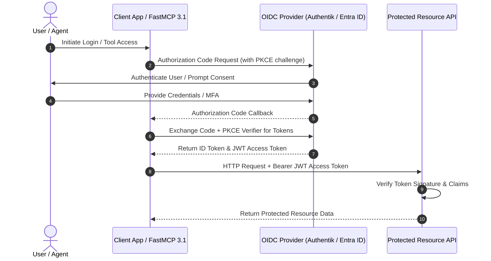

# OAuth 2.0 / OIDC (OpenID Connect)

## What it is
OAuth 2.0 is an industry-standard authorization framework that enables applications to obtain limited access to user accounts on an HTTP service without exposing credentials. OpenID Connect (OIDC) is an identity layer built on top of the OAuth 2.0 protocol that allows clients to verify the identity of an end-user based on authentication performed by an Authorization Server, as well as to obtain basic profile information.

In enterprise AI systems, FastMCP 3.1 task runners, and self-hosted homelab architectures, OAuth 2.0 / OIDC provides centralized identity, Single Sign-On (SSO), and token-based access control for Web applications, APIs, and AI agent workloads.



## What problem it solves
Managing separate username and password credentials across dozens of self-hosted services, LLM API gateways, and internal agent tools leads to credential fatigue, poor auditability, and elevated security risk. OAuth 2.0 and OIDC solve this by delegating authentication to a centralized Identity Provider (IdP) such as Authentik, Keycloak, Okta, or Microsoft Entra ID, enforcing MFA and RBAC across all downstream tools.

Key operational problems solved include:
- **Delegated Authorization**: Allowing FastMCP 3.1 tools and multi-agent frameworks to access enterprise APIs on behalf of users without exposing primary passwords or long-lived static keys.
- **Unified Identity Federation**: Single Sign-On across heterogeneous microservices, AI playgrounds ([Open WebUI](../../services/open-webui.md)), and document management systems ([Paperless-ngx](../../services/paperless-ngx.md)).
- **Cryptographic Auditability**: Standardized JSON Web Tokens (JWT) signed via asymmetric key pairs (RS256/ES256) enable decentralized token verification without continuous database queries.

## Where it fits in the stack
**Enterprise AI / Security & Identity** — serves as the core authentication and token issuance protocol connecting users, microservices, and AI model endpoints.

## Typical use cases
- **Centralized Homelab Single Sign-On (SSO)**: Authenticating users across Open WebUI, Paperless-ngx, Gitea, and Nextcloud using Authentik or Keycloak as the OIDC provider.
- **API Token Authorization**: Issuing scoped OAuth 2.0 Access Tokens (Bearer tokens) to AI agents and Model Context Protocol (MCP) servers for secure API requests.
- **Enterprise Identity Delegation**: Integrating AI workspaces with enterprise IdPs (Okta, Entra ID) using SAML 2.0 / OIDC federation.

## Strengths
- **Delegated Authorization**: Applications never handle user passwords directly, reducing credential exposure.
- **Standardized JWT ID Tokens**: Standardized JSON Web Tokens (JWT) simplify identity verification across decentralized microservices.
- **Granular Scopes & Claims**: Enables fine-grained authorization policies based on OAuth scopes (`openid`, `profile`, `email`) and custom user claims.

## Limitations
- **Protocol Complexity**: Implementing OAuth authorization code flows with PKCE (Proof Key for Code Exchange) requires careful token handling and storage.
- **Token Invalidation Overhead**: Revoking issued access tokens before expiration requires maintaining token revocation lists (CRL/Introspection) or short TTLs.
- **Dependency on Identity Provider**: Service availability depends on the uptime and connectivity of the central IdP server.

## When to use it
- When securing multi-user web dashboards, APIs, or internal automation services.
- When enabling SSO and role-based access control (RBAC) across self-hosted or cloud AI applications.
- When securing AI agent tool calls with scoped Bearer tokens.

## When not to use it
- For simple, isolated single-user scripts or air-gapped local utilities where static API keys or local environment variables suffice.
- When ultra-low latency internal microservice communication without authentication overhead is desired within a isolated private network mesh.

## Getting started

### OIDC Authentication Authorization Code Flow with PKCE
An standard OIDC authorization request URL structure:

```
https://auth.example.com/application/o/authorize/
  ?response_type=code
  &client_id=YOUR_CLIENT_ID
  &redirect_uri=https://app.example.com/callback
  &scope=openid%20profile%20email
  &state=xyz123
  &code_challenge=E9Melhoa2OwvFrEMTJguCHaoeK1t8URWbuGJSstw-cM
  &code_challenge_method=S256
```

### Exchanging Authorization Code for JWT Tokens
Exchanging the returned code for an ID Token and Access Token:

```bash
curl -X POST https://auth.example.com/application/o/token/ \
  -d "grant_type=authorization_code" \
  -d "client_id=YOUR_CLIENT_ID" \
  -d "client_secret=YOUR_CLIENT_SECRET" \
  -d "redirect_uri=https://app.example.com/callback" \
  -d "code=AUTHORIZATION_CODE_RECEIVED" \
  -d "code_verifier=VERIFIER_STRING"
```

## CLI examples

### Inspect JWT Access Token Claims via CLI
Decode and format JWT access token payload without signature verification:
```bash
echo "YOUR_JWT_ACCESS_TOKEN" | jq -R 'split(".") | .[1] | @base64d | fromjson'
```

### Perform Token Introspection Request
Verify token validity against OIDC Identity Provider introspection endpoint:
```bash
curl -u "client_id:client_secret" \
  -X POST https://auth.example.com/application/o/introspect/ \
  -d "token=YOUR_JWT_ACCESS_TOKEN"
```

### Request OpenID Configuration Discovery Document
Fetch standard OpenID Connect provider configuration metadata:
```bash
curl -s https://auth.example.com/application/o/10/.well-known/openid-configuration | jq .
```

## API examples

### Python OIDC JWT Bearer Token Verification with Pydantic v2
This Python script demonstrates verifying an OIDC JWT access token and parsing validated claims into a strict Pydantic v2 data model for FastMCP 3.1 authorization context:

```python
import jwt
from typing import List, Dict, Any, Optional
from pydantic import BaseModel, Field, EmailStr, field_validator

class OIDCUserClaims(BaseModel):
    subject_id: str = Field(..., alias="sub", description="Unique subject ID")
    email: EmailStr = Field(..., description="Authenticated user email")
    roles: List[str] = Field(default_factory=list, description="Assigned RBAC roles")
    issuer: str = Field(..., alias="iss")
    audience: str = Field(..., alias="aud")
    expiration: int = Field(..., alias="exp")

    @field_validator('roles')
    @classmethod
    def validate_roles(cls, v: List[str]) -> List[str]:
        if not v:
            print("Warning: User token has no assigned enterprise roles.")
        return v

def verify_and_parse_oidc_token(
    token: str,
    public_key: str,
    expected_audience: str,
    expected_issuer: str
) -> OIDCUserClaims:
    """Decodes and validates an OIDC JWT access token and validates claims via Pydantic v2."""
    try:
        decoded_raw = jwt.decode(
            token,
            key=public_key,
            algorithms=["RS256"],
            audience=expected_audience,
            issuer=expected_issuer
        )
        validated_claims = OIDCUserClaims.model_validate(decoded_raw)
        print(f"OIDC Token Verified for subject: {validated_claims.subject_id}")
        return validated_claims
    except jwt.ExpiredSignatureError:
        raise ValueError("OIDC access token has expired.")
    except jwt.InvalidTokenError as e:
        raise ValueError(f"Invalid OIDC access token: {str(e)}")

# Simulated verification test
if __name__ == "__main__":
    mock_decoded = {
        "sub": "user_2027_9941",
        "email": "admin@homelab.local",
        "roles": ["admin", "agent_operator"],
        "iss": "https://auth.homelab.local/application/o/agent-app",
        "aud": "fastmcp-3.1-gateway",
        "exp": 1893456000
    }
    claims = OIDCUserClaims.model_validate(mock_decoded)
    print("Parsed OIDC Claims:")
    print(f"  Subject: {claims.subject_id}")
    print(f"  Email: {claims.email}")
    print(f"  Roles: {claims.roles}")
```

## Related tools / concepts
- [Okta](okta.md)
- [Microsoft Entra ID](microsoft-entra-id.md)
- [Authentik](../../services/authentik.md)
- [Headscale](../../services/headscale.md)
- [Tailscale](../../services/tailscale.md)
- [Vault MCP Server](../automation_orchestration/vault-mcp.md)
- [SSO Comparison](../../knowledge_base/sso-comparison.md)

## Sources / references
- [OAuth 2.0 Official Protocol Specification](https://oauth.net/2/)
- [OpenID Connect Foundation Specifications](https://openid.net/connect/)

## Contribution Metadata
- Last reviewed: 2027-01-07
- Confidence: high
