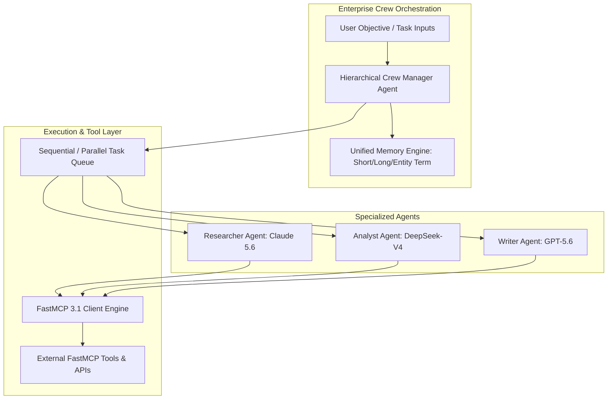

# CrewAI

## What it is
CrewAI is an open-source, enterprise-grade multi-agent framework designed for orchestrating autonomous, role-playing AI agents. It enables developers to define specialized agent personas with distinct roles, backstories, tools, and goals, assembling them into coordinated "crews" to execute complex, multi-step tasks across sequential, hierarchical, or consensual processes.

In 2027, **CrewAI Core & Enterprise v1.42+** features native integration with **FastMCP 3.1** (Model Context Protocol), streaming multi-modal reasoning loops, automated short/long-term/entity memory synchronization, and self-healing agent loops powered by frontier models such as **Claude 5.6**, **GPT-5.6**, **Gemini 4.0 Ultra**, **Gemma 4**, **DeepSeek-V4**, and **Llama 4 Maverick**.



## What problem it solves
Developing robust multi-agent systems from scratch involves significant engineering friction around thread concurrency, state persistence, error recovery, and context hand-off between specialized roles:

1. **State Drift and Context Bloat**: When a single LLM attempts to handle research, coding, writing, and review simultaneously, context window overload causes reasoning degradation. CrewAI solves this by enforcing role separation—each agent operates within its own focused context while delegating sub-tasks.
2. **Boilerplate Agent Communication**: Managing hand-off protocols, delegation loops, and structured JSON output validation between multiple LLMs requires extensive glue code. CrewAI abstracts task execution through declarative process engines (`Process.sequential`, `Process.hierarchical`).
3. **Brittle Tool Invocation**: Loose tool definitions cause frequent agent hallucination. CrewAI integrates strict **Pydantic v2** schema validation and **FastMCP 3.1** binding, guaranteeing tool inputs adhere to expected types before execution.
4. **Lack of Enterprise Memory Persistence**: Agents often forget critical entity facts across multi-turn runs. CrewAI includes built-in RAG-backed vector memory (Short-Term, Long-Term, and Entity Memory) to store corporate context persistently.

## Where it fits in the stack
**Category**: Framework / Multi-Agent Orchestration Engine.

In the 2027 technology ecosystem, CrewAI sits at the top of the application stack, serving as the cognitive coordination layer between high-level user goals and lower-level execution models, databases, and FastMCP 3.1 tools.

```
+-----------------------------------------------------------------------+
|                    Enterprise Multi-Agent Application                 |
+-----------------------------------------------------------------------+
                                    |
                                    v
+-----------------------------------------------------------------------+
|                        CrewAI v1.42+ Framework                        |
|  - Role-Playing Personas & Backstories                                |
|  - Hierarchical & Sequential Process Controllers                      |
|  - Short-Term / Long-Term RAG Entity Memory                          |
|  - FastMCP 3.1 Multiplexed Tool Binding                               |
+-----------------------------------------------------------------------+
        |                           |                           |
        v                           v                           v
+------------------+     +--------------------+     +-------------------+
|  Frontier LLMs   |     | FastMCP 3.1 Tools  |     | Persistent Memory |
| (Claude 5.6,     |     | (SQL, GitHub, Web  |     | (Chroma, Qdrant,  |
|  GPT-5.6, Gemma) |     |  Browsing, vLLM)   |     |  LanceDB, Redis)  |
+------------------+     +--------------------+     +-------------------+
```

## Typical use cases
- **Automated Software Factory**: Coordinating an Architect Agent, Coder Agent, Tester Agent, and Code Reviewer Agent to implement end-to-end features from GitHub issues.
- **Investment & Market Intelligence**: Deploying parallel researcher and data extraction agents to scrape news, analyze SEC filings, calculate valuation metrics, and publish structured markdown briefs.
- **Enterprise Regulatory Compliance**: Hierarchical audit crews that evaluate legal contracts against regulatory rules, delegating redline checks to domain-specialist sub-agents.
- **Multi-Source Content Publishing**: Grouping research, drafting, SEO optimization, and editorial agents into a unified pipeline with strict JSON schema outputs.

## Strengths
- **Intuitive Role-Based Abstraction**: Defining agents via `role`, `goal`, `backstory`, and `tools` closely mirrors human organizational structures.
- **FastMCP 3.1 Native Integration**: Instant tool registration and asynchronous tool execution via Model Context Protocol servers.
- **Flexible Execution Workflows**: Built-in support for sequential task execution (`Process.sequential`), manager-delegated hierarchies (`Process.hierarchical`), and consensual agreement patterns.
- **Strict Pydantic v2 Output Validation**: Ensures agents emit fully parsed, type-safe Python models or JSON objects without post-processing hacks.
- **Persistent Multi-Layered Memory**: Built-in short-term conversation memory, long-term historical task memory, and entity knowledge graph persistence.

## Limitations
- **Token Consumption in Hierarchical Mode**: Manager agents continuously reviewing sub-agent outputs can rapidly consume API tokens if iteration limits (`max_iter`) are not constrained.
- **Debugging Non-Deterministic Loops**: Diagnosing unexpected agent delegation loops or hallucinated tool parameters requires detailed tracing tools (e.g., Datadog LLMObs or Langfuse).
- **Latency in Serial Processes**: Long sequential agent chains add cumulative latency, requiring asynchronous task execution for user-facing applications.

## When to use it
- When a complex task requires distinct domain skill sets (e.g., security auditing + code generation + technical writing).
- When you want to build multi-agent applications rapidly using high-level abstractions without manually managing raw message arrays or thread state.
- When native FastMCP 3.1 tool binding and persistent corporate memory are required out of the box.

## When not to use it
- For simple single-prompt query-response workflows where a direct model API call is sufficient.
- If you need low-level, graph-node-level state control over every individual message state transition (consider [LangGraph](langgraph.md) instead).

## Getting started

### Installation
Install CrewAI along with Pydantic v2 and FastMCP support:

```bash
pip install crewai crewai-tools pydantic fastmcp
```

### Basic Crew Creation CLI Quickstart
Initialize a pre-configured multi-agent project template:

```bash
# Create a new crew project structure
crewai create crew enterprise_researcher

cd enterprise_researcher
# Run the local crew execution
crewai run
```

## CLI examples

### 1. Training a Crew for Performance Optimization
Train agents across repeated runs to improve task delegation and tool invocation precision:

```bash
# Train crew across 5 iterations with user feedback logging
crewai train -n 5 -f training_results.json
```

### 2. Testing and Benchmarking Crew Execution
Evaluate task completion success rates against target output criteria:

```bash
# Run automated benchmark evaluation on current crew setup
crewai test -n 3 --model claude-5-6-sonnet
```

### 3. Replaying Failed Task Runs
Debug specific task failures by replaying execution from a saved checkpoint:

```bash
# Replay crew execution starting from task ID
crewai replay -t task_88291_research_validation
```

## API examples

### CrewAI Multi-Agent Setup with FastMCP 3.1 & Hierarchical Manager
This script configures a hierarchical crew overseen by a manager agent running **Claude 5.6**, utilizing FastMCP 3.1 tools for automated data analysis.

```python
import os
from crewai import Agent, Task, Crew, Process
from crewai.tools import BaseTool
from fastmcp import FastMCP
from pydantic import BaseModel, Field

# 1. Define Output Schema using Pydantic v2
class ResearchReport(BaseModel):
    title: str = Field(..., description="Report title")
    key_insights: list[str] = Field(..., description="Top 3-5 technical findings")
    risk_score: float = Field(..., ge=0.0, le=10.0, description="Evaluated risk score out of 10")
    executive_summary: str = Field(..., min_length=50, description="Detailed summary")

# 2. Define Custom FastMCP Tool Wrapper
class DatabaseQuerySchema(BaseModel):
    table_name: str = Field(..., description="Target database table")
    filter_query: str = Field(..., description="SQL filter clause")

class EnterpriseDatabaseTool(BaseTool):
    name: str = "Enterprise Database Reader"
    description: str = "Queries enterprise PostgreSQL tables for system metrics."
    args_schema: type[BaseModel] = DatabaseQuerySchema

    def _run(self, table_name: str, filter_query: str) -> str:
        # Simulated database query execution
        return f"Retrieved 42 rows from {table_name} matching filter '{filter_query}'."

# 3. Instantiate Agents
researcher = Agent(
    role="Lead Research Specialist",
    goal="Gather and analyze technical telemetry from {target_system}",
    backstory="Senior staff engineer specialized in distributed systems observability.",
    tools=[EnterpriseDatabaseTool()],
    verbose=True,
    memory=True
)

writer = Agent(
    role="Technical Communications Lead",
    goal="Synthesize raw research data into structured executive briefs",
    backstory="Principal technical writer with expertise in enterprise governance.",
    verbose=True,
    memory=True
)

# 4. Define Tasks with Output Validation
task_research = Task(
    description="Query internal database tables for {target_system} and identify performance bottlenecks.",
    expected_output="Raw list of top performance bottlenecks with metric scores.",
    agent=researcher
)

task_write = Task(
    description="Synthesize research findings into an executive report for system {target_system}.",
    expected_output="Fully validated ResearchReport JSON object.",
    output_json=ResearchReport,
    agent=writer
)

# 5. Assemble Hierarchical Crew
crew = Crew(
    agents=[researcher, writer],
    tasks=[task_research, task_write],
    process=Process.hierarchical,
    manager_llm="anthropic/claude-5-6-sonnet",
    verbose=True,
    memory=True
)

if __name__ == "__main__":
    result = crew.kickoff(inputs={"target_system": "Payment Gateway v3"})
    print("\n--- CREW EXECUTION RESULT ---")
    print(result.raw)
```

### Production Pydantic v2 Schema for Crew Agent Configuration & Task Audit
This production script enforces strict Pydantic v2 validation for agent properties, task delegations, and execution outputs prior to running enterprise crew pipelines.

```python
from datetime import datetime
from enum import Enum
from typing import List, Optional, Dict, Any
from pydantic import BaseModel, Field, field_validator, ConfigDict

class ProcessType(str, Enum):
    SEQUENTIAL = "sequential"
    HIERARCHICAL = "hierarchical"

class AgentConfig(BaseModel):
    role: str = Field(..., min_length=2, max_length=100)
    goal: str = Field(..., min_length=10)
    backstory: str = Field(..., min_length=20)
    allow_delegation: bool = Field(default=True)
    max_iter: int = Field(default=15, ge=1, le=50)
    llm_model: str = Field(default="anthropic/claude-5-6-sonnet")

class TaskConfig(BaseModel):
    description: str = Field(..., min_length=10)
    expected_output: str = Field(..., min_length=10)
    async_execution: bool = Field(default=False)
    agent_role: str = Field(..., description="Role of assigned agent")

class CrewPipelineSpec(BaseModel):
    model_config = ConfigDict(extra="ignore")

    crew_name: str = Field(..., pattern=r"^[a-zA-Z0-9_-]+$")
    process: ProcessType = Field(default=ProcessType.SEQUENTIAL)
    agents: List[AgentConfig] = Field(..., min_items=1)
    tasks: List[TaskConfig] = Field(..., min_items=1)
    memory_enabled: bool = Field(default=True)
    mcp_protocol_version: str = Field(default="3.1")
    created_at: datetime = Field(default_factory=datetime.utcnow)

    @field_validator("tasks")
    @classmethod
    def validate_task_agent_mapping(cls, tasks: List[TaskConfig], info) -> List[TaskConfig]:
        agents = info.data.get("agents", [])
        known_roles = {a.role for a in agents}
        for task in tasks:
            if task.agent_role not in known_roles:
                raise ValueError(f"Task assigned to unknown agent role: '{task.agent_role}'")
        return tasks

# Example Validation
if __name__ == "__main__":
    spec_data = {
        "crew_name": "security-audit-crew",
        "process": "hierarchical",
        "agents": [
            {
                "role": "Security Analyst",
                "goal": "Identify vulnerabilities in smart contract codebase",
                "backstory": "CertiK lead auditor with 10 years experience in Web3 security.",
                "allow_delegation": False,
                "max_iter": 10
            },
            {
                "role": "Remediation Lead",
                "goal": "Generate patch code for identified vulnerabilities",
                "backstory": "Senior Rust and Solidity core developer.",
                "allow_delegation": True,
                "max_iter": 20
            }
        ],
        "tasks": [
            {
                "description": "Perform static analysis on core contract repository.",
                "expected_output": "List of high/medium/low severity findings.",
                "agent_role": "Security Analyst"
            },
            {
                "description": "Write unit tests and patch code for high severity findings.",
                "expected_output": "Pull request diff and pass status.",
                "agent_role": "Remediation Lead"
            }
        ],
        "memory_enabled": True
    }

    pipeline = CrewPipelineSpec.model_validate(spec_data)
    print(f"Validated Crew Pipeline: {pipeline.crew_name} ({len(pipeline.agents)} agents, {len(pipeline.tasks)} tasks)")
    print(f"Spec JSON:\n{pipeline.model_dump_json(indent=2)}")
```

## Related tools / concepts
- [AutoGen](autogen.md) — Multi-agent conversational framework from Microsoft.
- [LangChain](../../tools/ai_knowledge/langchain.md) — Fundamental LLM application development framework.
- [LangGraph](./langgraph.md) — Graph-based agent workflow orchestration.
- [Multi-Agent Systems](../../architecture/multi_agent_knowledgeops.md) — Architectural patterns for multi-agent systems.
- [Agent Protocols](../../knowledge_base/agent_protocols.md) — Communication specifications between autonomous agents.
- [Smolagents](smolagents.md) — Lightweight code-centric agent library from Hugging Face.
- [PydanticAI](pydantic-ai.md) — Production-grade AI agent framework by Pydantic.
- [Model Context Protocol (MCP)](../../tools/automation_orchestration/mcp.md) — Universal protocol for tools and resources.

## Sources / references
- [CrewAI Official Website](https://www.crewai.com/)
- [CrewAI Documentation](https://docs.crewai.com/)
- [CrewAI GitHub Repository](https://github.com/joaomdmoura/crewAI)
- [CrewAI Enterprise Features & Multi-Agent Architecture](https://www.crewai.com/enterprise)

## Contribution Metadata
- Last reviewed: 2027-01-07
- Confidence: high
