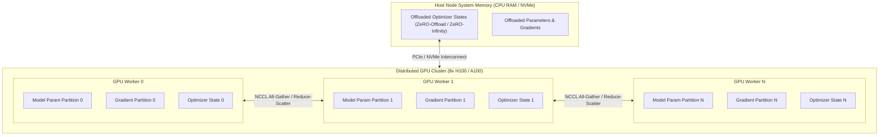

# DeepSpeed

## What it is
DeepSpeed is an open-source deep learning optimization library developed by Microsoft. It delivers extreme-scale distributed training and inference speedups for deep learning models, enabling training of models with hundreds of billions of parameters on limited GPU memory hardware.

In modern AI engineering pipelines, DeepSpeed provides memory-saving ZeRO (Zero Redundancy Optimizer) memory partitioning techniques, 3D parallelism (Tensor, Pipeline, and Sequence Parallelism), low-precision FP16/BF16/FP8 training, and optimized inference engines for LLM fine-tuning toolkits like Axolotl, Llama-Factory, and Hugging Face Trainer.



## What problem it solves
Training modern Large Language Models (LLMs) like Llama 4, DeepSeek-V4, and Qwen 3.6 requires massive memory footprints for model parameters, optimizer states (e.g., AdamW FP32 states require 12 bytes per parameter), and activations. Standard data parallelism replicates the entire model state across every GPU, causing out-of-memory (OOM) failures on multi-billion parameter architectures.

DeepSpeed addresses memory bottlenecks through innovative memory partitioning and compute optimizations:
- **Optimizer State Memory Overhead**: ZeRO-Stage 1 shards optimizer states across data-parallel processes, reducing memory footprint by 4x.
- **Gradient Overhead**: ZeRO-Stage 2 shards both optimizer states and gradients, yielding up to an 8x memory reduction.
- **Parameter Overhead**: ZeRO-Stage 3 shards optimizer states, gradients, and model parameters across all GPUs, enabling linear memory scaling across worker nodes.
- **Hardware RAM Limits**: ZeRO-Offload and ZeRO-Infinity offload parameters and optimizer states to host CPU RAM or NVMe storage, allowing fine-tuning 70B+ models on commodity workstations.

## Where it fits in the stack
**Agent & LLM Frameworks / Distributed Training & Optimization**. DeepSpeed acts as the underlying execution and memory optimization engine for LLM fine-tuning, RLHF alignment training, and high-throughput inference servers across cloud and on-premise infrastructure.

```
+-----------------------------------------------------------------------+
|                    Fine-Tuning & Training Workflows                   |
|           (Axolotl / Llama-Factory / Hugging Face Trainer)            |
+-----------------------------------------------------------------------+
                                   |
                                   v
+-----------------------------------------------------------------------+
|                           DeepSpeed Engine                            |
|             - ZeRO-1 / ZeRO-2 / ZeRO-3 Memory Sharding               |
|             - CPU / NVMe Offload & Communication Scheduler            |
|             - FP16 / BF16 / FP8 Precision Manager                     |
+-----------------------------------------------------------------------+
                                   |
                         NCCL / PyTorch Distributed
                                   v
+-----------------------------------------------------------------------+
|                       Hardware Accelerator Layer                      |
|            (NVIDIA H100 / A100 / RTX 4090 / AMD MI300X)              |
+-----------------------------------------------------------------------+
```

## Typical use cases
- **Large Language Model Fine-Tuning**: Accelerating instruction tuning and domain adaptation of Llama 4, Qwen 3.6, and DeepSeek-V4 models using Axolotl or Hugging Face Transformers.
- **ZeRO-Offload Workstation Training**: Training multi-billion parameter LLMs on single or dual-GPU workstations with system CPU RAM offloading.
- **RLHF & Direct Preference Optimization (DPO)**: Distributing memory load for multi-model actor-critic RLHF training pipelines (e.g., DeepSpeed-Chat).
- **Extreme Scale Trillion-Parameter Pre-training**: Utilizing ZeRO-3 with 3D Parallelism across hundreds of GPU nodes.

## Strengths
- **ZeRO Memory Efficiency**: Eliminates memory redundancies by sharding model weights, gradients, and optimizer states across distributed nodes.
- **NVMe & CPU Offloading**: ZeRO-Infinity offloads memory to system RAM or NVMe SSDs to train massive models without hardware upgrades.
- **Seamless Framework Integration**: Out-of-the-box integration into Hugging Face `Trainer`, Axolotl, and Llama-Factory via standard JSON configuration files.
- **Advanced Parallelism**: Supports hybrid combinations of ZeRO-powered data parallelism, Megatron-LM tensor parallelism, and pipeline parallelism.

## Limitations
- **Inter-Node Bandwidth Dependencies**: ZeRO-3 introduces frequent all-gather communications during forward and backward passes, requiring high-bandwidth interconnects (e.g., InfiniBand or NVLink) to prevent GPU starvation.
- **NVMe Offload Latency**: High PCI-e/NVMe latency can slow down training throughput if host CPU memory bandwidth is constrained.
- **Debugging Complexity**: Distributed trace errors across multi-node ZeRO workers can be difficult to diagnose compared to single-GPU training.

## When to use it
- When fine-tuning 7B to 70B+ LLMs on multi-GPU clusters or single multi-GPU nodes (e.g., 8x H100/A100 or 4x RTX 4090).
- When optimizer memory consumption exceeds available VRAM during standard PyTorch data-parallel training.
- When running distributed RLHF or DPO training workflows requiring multiple simultaneous model instances in memory.

## When not to use it
- For small neural networks or single-GPU fine-tuning tasks (e.g., PEFT/LoRA on small models) where standard PyTorch or Unsloth offers faster execution with lower setup complexity.
- When target deployment requires lightweight inference-only runtimes (use [vLLM](../infrastructure/vllm.md), TensorRT-LLM, or [SGLang](../infrastructure/sglang.md) instead).

## Getting started

### Installation
Install DeepSpeed via pip with CUDA extensions enabled:

```bash
pip install deepspeed pydantic>=2.0 torch
```

### DeepSpeed Configuration File (`ds_config_zero3.json`)
A typical production ZeRO-3 configuration file with CPU offloading for 70B parameter model fine-tuning:

```json
{
  "train_batch_size": "auto",
  "train_micro_batch_size_per_gpu": "auto",
  "gradient_accumulation_steps": "auto",
  "bf16": {
    "enabled": true
  },
  "zero_optimization": {
    "stage": 3,
    "offload_optimizer": {
      "device": "cpu",
      "pin_memory": true
    },
    "offload_param": {
      "device": "cpu",
      "pin_memory": true
    },
    "overlap_comm": true,
    "contiguous_gradients": true,
    "sub_group_size": 1e9,
    "reduce_bucket_size": "auto",
    "stage3_prefetch_bucket_size": "auto",
    "stage3_param_persistence_threshold": "auto"
  },
  "gradient_clipping": 1.0
}
```

## CLI examples

### 1. Multi-GPU DeepSpeed Execution Launcher
Launch a training script across 4 local GPUs using DeepSpeed ZeRO-2:

```bash
deepspeed --num_gpus=4 train_llm.py \
          --deepspeed ds_config_zero2.json \
          --model_name_or_path meta-llama/Llama-4-70b \
          --output_dir ./checkpoints
```

### 2. Multi-Node Distributed Training with Hostfile
Execute distributed ZeRO-3 training across multiple physical nodes:

```bash
deepspeed --hostfile=/etc/deepspeed/hosts \
          --num_nodes=2 \
          --num_gpus=8 \
          train_llm.py \
          --deepspeed ds_config_zero3.json
```

### 3. Environment Environment Inspection & CUDA Diagnostics
Verify DeepSpeed system setup, CUDA driver extensions, and op build status:

```bash
deepspeed --env_report
```

## API examples

### Python (DeepSpeed Initialization & Pydantic v2 Config Validation)
This Python script demonstrates validating a DeepSpeed ZeRO-3 configuration using strict **Pydantic v2** models before initializing PyTorch execution through `deepspeed.initialize()`:

```python
import os
import json
from typing import Dict, Any, Optional
import torch
import torch.nn as nn
from pydantic import BaseModel, Field, ValidationError
import deepspeed

# 1. Define Pydantic v2 configuration validation models
class ZeROOffloadConfig(BaseModel):
    device: str = Field("cpu", pattern="^(cpu|nvme)$")
    pin_memory: bool = Field(True)

class ZeROOptimizationConfig(BaseModel):
    stage: int = Field(..., ge=0, le=3)
    offload_optimizer: Optional[ZeROOffloadConfig] = None
    offload_param: Optional[ZeROOffloadConfig] = None
    overlap_comm: bool = Field(True)
    contiguous_gradients: bool = Field(True)

class DeepSpeedMasterConfig(BaseModel):
    train_micro_batch_size_per_gpu: int = Field(..., gt=0)
    gradient_accumulation_steps: int = Field(..., gt=0)
    bf16: Dict[str, bool] = Field(default_factory=lambda: {"enabled": True})
    zero_optimization: ZeROOptimizationConfig

# 2. Sample neural network model
class SimpleLLMHead(nn.Module):
    def __init__(self, hidden_dim: int = 4096, vocab_size: int = 32000):
        super().__init__()
        self.fc = nn.Linear(hidden_dim, vocab_size)

    def forward(self, x):
        return self.fc(x)

def initialize_deepspeed_pipeline(raw_config: Dict[str, Any]):
    # Validate configuration against Pydantic v2 schema
    try:
        validated_config = DeepSpeedMasterConfig.model_validate(raw_config)
        print("--- DeepSpeed Configuration Validated Successfully ---")
        print(f"ZeRO Stage: {validated_config.zero_optimization.stage}")
        print(f"Micro Batch Size: {validated_config.train_micro_batch_size_per_gpu}")
    except ValidationError as err:
        print(f"Config Validation Error: {err.json()}")
        return

    # Initialize PyTorch Model
    model = SimpleLLMHead()
    parameters = filter(lambda p: p.requires_grad, model.parameters())

    # DeepSpeed engine setup
    model_engine, optimizer, _, _ = deepspeed.initialize(
        model=model,
        model_parameters=parameters,
        config=validated_config.model_dump()
    )

    print("DeepSpeed engine successfully initialized.")

if __name__ == "__main__":
    sample_config = {
        "train_micro_batch_size_per_gpu": 2,
        "gradient_accumulation_steps": 4,
        "bf16": {"enabled": True},
        "zero_optimization": {
            "stage": 2,
            "offload_optimizer": {
                "device": "cpu",
                "pin_memory": True
            },
            "overlap_comm": True,
            "contiguous_gradients": True
        }
    }

    # Set mock rank variables for standalone testing
    os.environ["RANK"] = "0"
    os.environ["WORLD_SIZE"] = "1"
    os.environ["MASTER_ADDR"] = "localhost"
    os.environ["MASTER_PORT"] = "29500"

    print("DeepSpeed Module Execution Test Initiated.")
    initialize_deepspeed_pipeline(sample_config)
```

## Related tools / concepts
- [Axolotl](axolotl.md) — Declarative LLM fine-tuning framework.
- [Llama-Factory](llama-factory.md) — Unified LLM training dashboard and suite.
- [Unsloth](unsloth.md) — High-performance single-GPU fine-tuning.
- [vLLM](../infrastructure/vllm.md) — High-throughput inference engine.
- [SGLang](../infrastructure/sglang.md) — Structured execution engine.

## Sources / references
- [DeepSpeed Official Website & Documentation](https://www.deepspeed.ai/?ref=2026-09-21-audit)
- [DeepSpeed GitHub Repository](https://github.com/microsoft/DeepSpeed)
- [ZeRO Paper: Memory Optimizations Toward Training Trillion Parameter Models](https://arxiv.org/abs/1910.02054)

## Contribution Metadata
- Last reviewed: 2027-01-07
- Confidence: high
