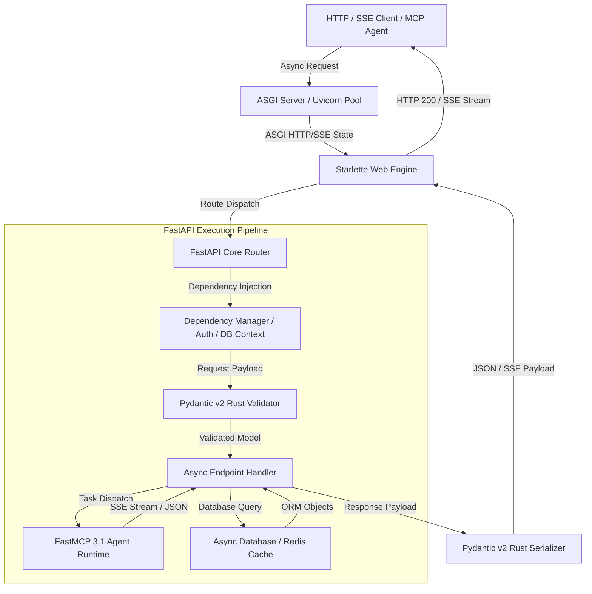

# FastAPI

## What it is
FastAPI is a modern, high-performance web framework for building APIs with Python 3.10+ based on standard Python type hints. It is designed to be easy to use, fast to code, and production-ready for serving high-throughput web applications, multi-agent orchestrators, real-time AI streaming services, and Model Context Protocol ([FastMCP 3.1](../automation_orchestration/mcp.md)) endpoints. Created by Sebastián Ramírez in 2018, FastAPI leverages **Starlette** for high-speed ASGI web tooling and **Pydantic v2** for ultra-fast, type-safe schema validation and serialization powered by Rust.

In modern AI engineering ecosystems (spanning 2026 and 2027), FastAPI has solidified its place as the foundational backend standard for Python-based AI applications. Whether routing complex multi-agent execution graphs, serving token-by-token Server-Sent Events (SSE) streaming output from frontier models (e.g., Claude 5.6, GPT-5.6, Gemini 4.0 Ultra), or serving vector retrieval middleware across local homelab nodes, FastAPI provides the asynchronous runtime core required for minimal latency and maximum throughput.

## Architecture & Data Flow



## What problem it solves
Building robust, high-throughput REST and streaming APIs in Python historically involved trade-offs between speed, developer experience, and maintainability. Traditional frameworks like Flask or Django were built primarily around synchronous request-response execution, requiring complex extensions or external task workers (e.g., Celery) to handle long-lived connections, asynchronous I/O, and streaming responses. Furthermore, manually parsing, validating, and documenting incoming HTTP request payloads created significant boilerplate and introduced frequent runtime errors.

FastAPI eliminates these bottlenecks by solving key architectural challenges:
1. **Asynchronous Execution First**: Built natively on Python's `asyncio` and ASGI standard, enabling thousands of concurrent connections (e.g., waiting on slow LLM inference streams or vector database queries) without blocking worker processes.
2. **Automated Schema Validation & Serialization**: Integrates deeply with Pydantic v2, enforcing strict type constraints, transforming raw request bodies into validated Python objects, and serializing responses at Rust-accelerated speeds.
3. **Zero-Maintenance Interactive Documentation**: Automatically generates compliant OpenAPI (formerly Swagger), JSON Schema, and interactive Swagger UI / ReDoc endpoints directly from standard Python type annotations.
4. **Structured Dependency Injection**: Provides a intuitive, modular dependency injection framework (`Depends`) that manages database connections, authentication tokens, rates limits, and shared AI model instances cleanly without global variables or messy singletons.
5. **Seamless Agent & Protocol Integration**: Serves as the native hosting environment for Model Context Protocol ([FastMCP 3.1](../automation_orchestration/mcp.md)) endpoints, allowing agents like Claude Code or OpenClaw to register and execute tools over HTTP/SSE.

## Where it fits in the stack
**Framework / Backend & AI Serving Layer**. FastAPI serves as the primary backend orchestration and web execution layer for AI agents, autonomous agent networks, [FastMCP 3.1](../automation_orchestration/mcp.md) servers, and microservices. It bridges Python's rich AI/ML ecosystem (including LangChain, LlamaIndex, PyTorch, and Hugging Face) with web-standard REST, GraphQL, WebSockets, and Server-Sent Events (SSE) streaming architectures.

In homelab and enterprise AI stacks, FastAPI operates between frontend clients (e.g., Next.js dashboards, Open WebUI, mobile apps) and underlying infrastructure (e.g., Ollama model servers, PostgreSQL / pgvector databases, Redis message queues).

```
+-----------------------------------------------------------------------+
|                       Clients & AI Interfaces                          |
|    (Next.js UI, Open WebUI, Mobile Apps, Claude Code, Autonomous Agents)   |
+-----------------------------------------------------------------------+
                                    |
                                    v
+-----------------------------------------------------------------------+
|                    FastAPI Backend & API Gateway                      |
|  - Dependency Injection & Security (OAuth2 / JWT)                     |
|  - Pydantic v2 Data Validation & OpenAPI Generation                    |
|  - Async Route Handlers & SSE Token Streamers                         |
|  - FastMCP 3.1 Tool Servers & Agent Endpoint Routers                  |
+-----------------------------------------------------------------------+
                                    |
            +-----------------------+-----------------------+
            |                                               |
            v                                               v
+---------------------------------------+ +-----------------------------------+
|     AI & ML Inference Engines         | |     Databases & Vector Stores     |
| (Ollama, vLLM, OpenAI/Claude APIs)    | | (PostgreSQL/pgvector, Qdrant)    |
+---------------------------------------+ +-----------------------------------+
```

## Typical use cases
- **Multi-Agent Framework Gateway**: Hosting API interfaces for multi-agent workflows built with frameworks like Agno, CrewAI, or LangGraph.
- **FastMCP 3.1 Tool Servers**: Exposing local home automation functions, system commands, and document retrieval endpoints to AI agents via FastMCP 3.1 SSE servers.
- **Real-Time LLM Token Streaming**: Servicing low-latency streaming endpoints that stream token outputs directly from local Ollama instances or frontier cloud APIs to web clients using `StreamingResponse`.
- **Microservices & Webhooks**: Building asynchronous webhook receiver services for systems like n8n, GitHub, Home Assistant, and Supabase.
- **Enterprise RAG Gateways**: Operating high-performance retrieval-augmented generation backends that handle text embedding generation, hybrid search routing, and citation re-ranking concurrently.
- **Secure Authentication & AuthZ**: Implementing OAuth2 with Password hashing, JWT tokens, and fine-grained API key scopes for self-hosted tools.

## Strengths
- **Unrivaled Performance**: Built on ASGI (Uvicorn and Starlette), delivering performance on par with Node.js and Go for I/O-bound asynchronous workloads.
- **Pydantic v2 Engine**: Leverages Pydantic v2's Rust-written core (`pydantic-core`) for parsing and validating data up to 20x faster than traditional Python validation libraries.
- **Developer Productivity**: Developer experience features like auto-completion in IDEs, instant inline type error detection, and automatic interactive documentation reduce setup time.
- **Automatic OpenAPI Generation**: Generates full OpenAPI specifications out of the box, allowing client SDKs and agent tool schemas to be generated automatically.
- **Robust Dependency Injection**: Simplifies complex dependency graphs (e.g., database session management, rate limit verification, user authentication) using a clean `Depends()` syntax.
- **Native Async & SSE**: Full support for `async def` endpoints, WebSocket channels, and `StreamingResponse` for SSE, making it ideal for modern streaming AI interfaces.

## Limitations
- **Async Event Loop Starvation**: Calling synchronous, CPU-bound, or blocking file/network operations inside an `async def` function blocks the entire event loop, severely degrading performance unless offloaded to a thread pool (`anyio.to_thread.run_sync`).
- **Python Ecosystem Constraints**: While performance is exceptional for Python, heavy raw numeric computation still requires C/Rust bindings or offloading to dedicated C++ runtimes.
- **Boilerplate Type Annotations**: Complex nested generics and strict Pydantic models can occasionally lead to verbose type annotations across large codebases.
- **Version Compatibility**: Upgrading between major Pydantic versions (e.g., Pydantic v1 to v2) requires care due to syntax and validator behavior changes.

## When to use it
- When building asynchronous microservices, REST APIs, or agent serving backends in Python.
- When creating custom tool servers and remote resources exposed to AI agents via [FastMCP 3.1](../automation_orchestration/mcp.md) or Pydantic AI.
- When real-time token-by-token streaming over Server-Sent Events (SSE) or WebSockets is required for AI chat apps.
- When you want zero-boilerplate OpenAPI specification generation and interactive Swagger UI endpoints for client teams or automated agents.
- When building high-concurrency applications that perform heavy I/O operations across multiple downstream databases and external APIs.

## When not to use it
- For traditional monolithic, server-rendered HTML applications where frameworks like Django with built-in admin tools and template engines are better suited.
- For simple single-file offline scripts or command-line utilities where the Python standard library is sufficient.
- When working entirely outside the Python ecosystem in teams standardized on Go, Rust, or Node.js/TypeScript stack frameworks.

## Getting started

### Environment Requirements & Installation
FastAPI requires Python 3.10 or higher. Install FastAPI along with the standard production dependencies (including Uvicorn as the ASGI server and Pydantic v2):

```bash
# Install FastAPI with standard recommended extras
pip install "fastapi[standard]>=0.115.0" pydantic>=2.10.0 uvicorn[standard] httpx
```

### Basic Application Setup
Create a file named `main.py`:

```python
from fastapi import FastAPI, Query
from pydantic import BaseModel, Field

app = FastAPI(
    title="Homelab AI Gateway",
    description="Asynchronous API Gateway for local AI agents and homelab automation",
    version="2027.1.0"
)

class StatusResponse(BaseModel):
    status: str = Field(..., description="Service operational status")
    environment: str = Field(..., description="Running environment")
    active_agents: int = Field(..., description="Number of connected agent instances")

@app.get("/health", response_model=StatusResponse, tags=["System"])
async def health_check(verbose: bool = Query(default=False, description="Include diagnostic details")):
    return StatusResponse(
        status="healthy",
        environment="production-homelab",
        active_agents=4
    )

if __name__ == "__main__":
    import uvicorn
    uvicorn.run("main:app", host="0.0.0.0", port=8000, reload=True)
```

Run the development server using the CLI:
```bash
fastapi dev main.py --port 8000
```
Open your browser and navigate to `http://localhost:8000/docs` to view the automatically generated interactive Swagger UI documentation.

## CLI examples

FastAPI includes a CLI utility (`fastapi`) for managing development and production deployments.

```bash
# Launch a development server with live auto-reloading enabled
fastapi dev main.py --host 0.0.0.0 --port 8000

# Launch a production server with Uvicorn process workers
fastapi run main.py --host 0.0.0.0 --port 8000 --workers 4

# Export the raw generated OpenAPI JSON schema to a file
python3 -c "import json; from main import app; print(json.dumps(app.openapi()))" > openapi_schema.json

# Test API endpoints using HTTPie or cURL
curl -s -X GET "http://localhost:8000/health?verbose=true" | jq .

# Send a POST payload to a task execution endpoint
curl -s -X POST "http://localhost:8000/api/v1/agent/run" \
  -H "Content-Type: application/json" \
  -d '{"agent_id": "agent_alpha", "query": "Summarize latest homelab alerts", "max_steps": 5}'
```

## API examples

### Pydantic v2 Request Validation & Error Handling Schema
This example demonstrates strict request parsing, custom field validation rules, and error handling with Pydantic v2 and FastAPI.

```python
from datetime import datetime
from typing import List, Optional, Literal
from fastapi import FastAPI, HTTPException, status, Depends
from pydantic import BaseModel, Field, field_validator, ConfigDict

class ToolParameter(BaseModel):
    name: str = Field(..., min_length=1, description="Parameter name")
    param_type: str = Field(..., description="Parameter data type (e.g. string, integer)")
    required: bool = Field(default=True, description="Whether parameter is mandatory")

class ToolRegistrationRequest(BaseModel):
    model_config = ConfigDict(str_strip_whitespace=True)

    tool_id: str = Field(..., description="Unique tool ID, must begin with 'tool_'")
    name: str = Field(..., min_length=3, max_length=50, description="Display name")
    description: str = Field(..., min_length=10, description="Tool execution description")
    category: Literal["automation", "database", "ai", "utility"] = Field(...)
    parameters: List[ToolParameter] = Field(default_factory=list)

    @field_validator("tool_id")
    @classmethod
    def validate_tool_prefix(cls, v: str) -> str:
        if not v.startswith("tool_"):
            raise ValueError("tool_id must start with prefix 'tool_'")
        return v

class ToolRegistrationResponse(BaseModel):
    success: bool
    tool_id: str
    registered_at: datetime
    total_parameters: int

app = FastAPI(title="Tool Registry Service")

# Mock database store
REGISTERED_TOOLS = {}

@app.post(
    "/api/v1/tools/register",
    response_model=ToolRegistrationResponse,
    status_code=status.HTTP_201_CREATED,
    tags=["Tool Management"]
)
async def register_tool(payload: ToolRegistrationRequest):
    if payload.tool_id in REGISTERED_TOOLS:
        raise HTTPException(
            status_code=status.HTTP_409_CONFLICT,
            detail=f"Tool with ID '{payload.tool_id}' is already registered."
        )

    REGISTERED_TOOLS[payload.tool_id] = payload
    return ToolRegistrationResponse(
        success=True,
        tool_id=payload.tool_id,
        registered_at=datetime.utcnow(),
        total_parameters=len(payload.parameters)
    )
```

### Async SSE Token Streaming Endpoint
This example shows how to build an asynchronous Server-Sent Events (SSE) streaming endpoint for streaming LLM response tokens directly to web clients.

```python
import asyncio
import json
from typing import AsyncGenerator
from fastapi import FastAPI, Query
from fastapi.responses import StreamingResponse

app = FastAPI(title="LLM Streaming Engine")

async def generate_llm_stream(prompt: str, model: str) -> AsyncGenerator[str, None]:
    """Simulates an asynchronous token generation stream from an LLM model."""
    tokens = [
        "FastAPI", " provides", " ultra-low", " latency", " streaming",
        " capabilities", " for", " AI", " agent", " architectures",
        " in", " 2027."
    ]

    # Emit initial connection event
    init_payload = json.dumps({"event": "start", "model": model, "prompt": prompt})
    yield f"event: control\ndata: {init_payload}\n\n"

    for idx, token in enumerate(tokens):
        await asyncio.sleep(0.08)  # Simulate model inference latency
        data = json.dumps({"token_id": idx, "text": token})
        yield f"event: message\ndata: {data}\n\n"

    # Emit completion event
    done_payload = json.dumps({"event": "stop", "total_tokens": len(tokens)})
    yield f"event: control\ndata: {done_payload}\n\n"

@app.get("/api/v1/chat/stream", tags=["LLM Ingest"])
async def stream_chat_completion(
    prompt: str = Query(..., min_length=1, description="User prompt"),
    model: str = Query(default="claude-5.6-sonnet", description="Target model engine")
) -> StreamingResponse:
    """Streams token completions using Server-Sent Events (SSE)."""
    return StreamingResponse(
        generate_llm_stream(prompt=prompt, model=model),
        media_type="text/event-stream",
        headers={
            "Cache-Control": "no-cache",
            "Connection": "keep-alive",
            "X-Accel-Buffering": "no"
        }
    )
```

### FastMCP 3.1 HTTP Server Integration with FastAPI
This example demonstrates mounting a Model Context Protocol ([FastMCP 3.1](../automation_orchestration/mcp.md)) server directly inside a FastAPI application for exposing tools to autonomous AI agents.

```python
from fastapi import FastAPI
from mcp.server.fastmcp import FastMCP
from pydantic import BaseModel, Field

# Initialize FastMCP 3.1 Server Instance
mcp = FastMCP("Homelab Control MCP", dependencies=["pydantic>=2.10.0"])

class ServerStatusInput(BaseModel):
    node_name: str = Field(..., description="Target homelab node identifier")

@mcp.tool(name="check_node_status", description="Query hardware status for a specific homelab node")
async def check_node_status(node_name: str) -> str:
    """FastMCP 3.1 Tool executed by external AI agents."""
    valid_nodes = {"node-01": "ONLINE - CPU: 12%, RAM: 42%", "node-02": "ONLINE - CPU: 34%, RAM: 68%"}
    return valid_nodes.get(node_name.lower(), f"Node '{node_name}' not found in cluster inventory.")

# Main FastAPI App
app = FastAPI(title="Integrated Agent API Gateway")

@app.get("/api/v1/system/summary")
async def system_summary():
    return {"cluster": "homelab-primary", "nodes_online": 2, "mcp_status": "active"}

# Note: FastMCP 3.1 SSE and HTTP transport endpoints can be bound to FastAPI routes
# using mcp.sse_app() or mounted as a sub-application.
app.mount("/mcp", mcp.sse_app())

if __name__ == "__main__":
    import uvicorn
    uvicorn.run(app, host="0.0.0.0", port=8000)
```

## Related tools / concepts
- [Pydantic AI](pydantic-ai.md) — Production-ready agent framework built directly on Pydantic v2 and FastAPI design patterns.
- [FastMCP 3.1](../automation_orchestration/mcp.md) — High-level Python framework for building Model Context Protocol servers natively integrated with FastAPI.
- [Agno](../agents/agno.md) — High-speed lightweight agent framework designed for deployment in FastAPI microservices.
- [LangGraph](langgraph.md) — Graph-based agent orchestration library frequently served behind FastAPI web backends.
- [Docker](../infrastructure/docker.md) — Containerization engine standard for packaging FastAPI applications into production microservices.
- [Supabase](../infrastructure/supabase.md) — Postgres-backed open source backend platform integrated with FastAPI webhooks.
- [Ollama](../../services/ollama.md) — Local LLM serving runtime connected via FastAPI async client proxies.

## Sources / references
- [FastAPI Official Documentation](https://fastapi.tiangolo.com/)
- [FastAPI GitHub Repository](https://github.com/fastapi/fastapi)
- [Pydantic v2 Documentation](https://docs.pydantic.dev/latest/)
- [Starlette ASGI Framework Documentation](https://www.starlette.io/)
- [Uvicorn ASGI Server Documentation](https://www.uvicorn.org/)

## Contribution Metadata
- Last reviewed: 2027-01-07
- Confidence: high
