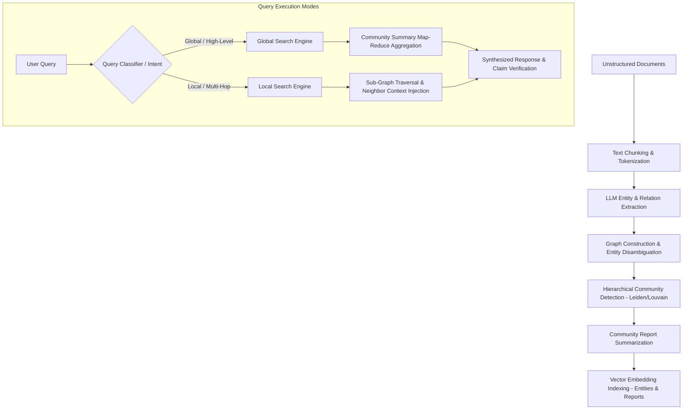

# GraphRAG

## What it is
GraphRAG is an enterprise-grade Graph-based Retrieval Augmented Generation framework developed by Microsoft and the open-source community. It combines automated knowledge graph construction with Large Language Models (LLMs) and graph machine learning algorithms to perform complex multi-hop reasoning, global thematic summarization, and community-aware information retrieval over massive unstructured document collections.

As of early 2027, GraphRAG natively integrates with the **FastMCP 3.1** protocol specification, enabling standardized model context protocol tools and resources for multi-agent autonomous orchestrations. By leveraging hierarchical Leide/Louvain community detection and multi-level claim extraction, GraphRAG bridges the critical gap between local entity-centric RAG retrieval and dataset-wide global reasoning. It supports deployment against cutting-edge LLMs including [Claude 5.6](../ai_knowledge/claude.md), [GPT-5.6](../ai_knowledge/openai.md), [Gemini 4.0 Ultra](../ai_knowledge/gemini.md), DeepSeek-V4, Qwen 3.6 VL, and local quantized deployments via [Gemma 4](../ai_knowledge/local_llms.md).

## Architecture & System Design
GraphRAG transforms unstructured documents into a structured, queryable knowledge network through an automated, multi-stage indexing pipeline followed by dual-mode (Global & Local) query execution engines.



### Ingestion & Indexing Subsystems
1. **Text Partitioning & Chunking**: Raw textual corpora are divided into semantic tokens (typically 300–1,200 tokens) optimized for entity co-occurrence detection without losing contextual continuity.
2. **Domain-Adapted Graph Extraction**: LLMs extract named entities (Organizations, Persons, Locations, Concepts), semantic relationships, and factual claims. Custom prompts tailor extraction logic for domain-specific schemas (e.g., biomedical, financial risk, cybersecurity).
3. **Graph Clustering & Partitioning**: Using the Leiden or Louvain algorithm, the extracted knowledge graph is hierarchically partitioned into clusters or "communities" at multiple granularities (Level 0 root communities down to fine-grained sub-communities).
4. **Community Summarization**: The LLM pre-generates structured summaries ("Community Reports") for every node cluster in the hierarchy. These reports synthesize key entities, major relationships, core themes, and prominent claims into compact context blocks.
5. **Vector & Graph Storage Alignment**: Entities, relationships, text chunks, and community summaries are embedded into vector spaces and mirrored into graph databases (e.g., Neo4j, Kuzu, or networkx abstractions) for hybrid vector-graph traversal.

### Search Subsystems
- **Global Search Engine**: Designed for high-level, thematic, dataset-wide queries (e.g., "What are the key operational risks identified across all historical audit reports?"). It uses a Map-Reduce approach over community report summaries, selecting summaries by hierarchical level and relevance, generating intermediate key point ratings, and reducing them into a coherent executive response.
- **Local Search Engine**: Optimized for specific entity, concept, or multi-hop relationship queries (e.g., "How does Product X connect to Supplier Y through regulatory compliance approvals?"). It identifies query seed entities via vector search, expands the surrounding sub-graph (neighbors, relationships, claims, text units), and constructs a tailored context window for LLM synthesis.

## What problem it solves
Traditional baseline RAG (vector similarity search) excels at finding specific text snippets ("needle in a haystack"), but fails fundamentally when answering global, aggregate, or relational questions over unstructured text:

- **Semantic Aggregation Failure**: Vector search cannot answer questions that require synthesizing insights across thousands of chunks when no single chunk contains the complete answer.
- **Disconnected Multi-Hop Reasoning**: Standard RAG struggles when answers depend on chains of relationships across distant documents (e.g., Entity A linked to Entity B in Document 1, and Entity B linked to Entity C in Document 45).
- **Lack of Structural Context**: Plain text chunks lack explicit entity topologies, making it difficult to detect cluster hierarchies, key influencers, or systemic network patterns.

GraphRAG solves these challenges by combining graph structural topology with pre-summarized community hierarchies, delivering both granular entity precision and macro-level dataset comprehension.

## Where it fits in the stack
**Category**: Retrieval Frameworks & Knowledge Graph Infrastructure.

```
+-----------------------------------------------------------------------+
|                       Application Layer / AI Agents                   |
|          (LangChain, LlamaIndex, AutoGen, FastMCP 3.1 Clients)         |
+-----------------------------------------------------------------------+
                                    |
                                    v
+-----------------------------------------------------------------------+
|                           GraphRAG Framework                          |
|   +--------------------------+  +---------------------------------+   |
|   | Global Search Engine     |  | Local Multi-Hop Traversal       |   |
|   +--------------------------+  +---------------------------------+   |
|   | Hierarchical Summaries   |  | FastMCP 3.1 Server Protocols    |   |
|   +--------------------------+  +---------------------------------+   |
+-----------------------------------------------------------------------+
                |                                       |
                v                                       v
+------------------------------------+ +--------------------------------+
|        Graph Database Layer        | |      Vector Database Layer     |
|   (Neo4j, Kuzu, NetworkX, Memgraph)| |  (Milvus, Qdrant, Chroma)      |
+------------------------------------+ +--------------------------------+
```

## Typical use cases
- **Enterprise Regulatory & Audit Analysis**: Traversing multi-tier corporate structures, regulatory filings, and compliance reports to discover hidden liability networks.
- **Biomedical & Pharmaceutical Research**: Mapping gene-disease-drug interaction networks across millions of PubMed abstracts for target discovery.
- **Cyber Threat Intelligence & Forensics**: Linking IP addresses, threat actor handles, exploit CVEs, and attack vectors into actionable graph topology.
- **Autonomous Agent Context Services**: Serving as an explicit knowledge store for agents using FastMCP 3.1 tool interfaces to execute dynamic multi-step investigations.

## Strengths
- **Unrivaled Macro-Level Reasoning**: Outperforms standard RAG on global overview queries by leveraging pre-computed hierarchical community reports.
- **Transparent Factual Grounding**: Preserves explicit claims, entity attributes, and text unit citations for verifiable model auditing.
- **FastMCP 3.1 Native Protocol Integration**: Provides ready-to-use MCP tool exposure for streaming graph retrieval to agent runtimes.
- **Configurable Hierarchy Depth**: Allows tuning community abstraction levels to balance query token usage with granularity.

## Limitations
- **High Initial Indexing Cost**: Graph extraction and community report generation require significant token consumption during ingestion.
- **Indexing Latency**: Ingesting large document sets takes longer than standard vector embedding indexing due to multi-pass LLM extractions.
- **Schema & Prompt Customization Overhead**: Achieving optimal performance in specialized domains requires fine-tuning entity/relationship prompts.

## When to use it
- When answering dataset-wide, thematic, or aggregate questions across unstructured corpora.
- When queries require traversing multi-hop entity chains and semantic networks.
- When auditability and explicit knowledge provenance (claims, source chunks) are mandatory.

## When not to use it
- For basic search over small, homogeneous document collections where standard vector search is fast and sufficient.
- When immediate zero-latency document indexing is required without pre-computation budgets.

## Getting started

### Installation
Install GraphRAG with Pydantic v2 and FastMCP support:
```bash
pip install graphrag pydantic>=2.7.0 fastmcp>=3.1.0
```

### Workspace Initialization
Initialize a standard workspace directory structure:
```bash
graphrag init --root ./graphrag_workspace
```
This generates settings files (`settings.yaml` or `.env`) where model credentials, chunking parameters, and vector store configurations are defined.

### Ingestion & Indexing
Run the full indexing pipeline:
```bash
graphrag index --root ./graphrag_workspace --verbose
```

## CLI examples
```bash
# Global thematic search
graphrag query --root ./graphrag_workspace --method global "What are the strategic initiatives outlined across all quarters?"

# Local entity multi-hop search
graphrag query --root ./graphrag_workspace --method local "How is Project Titan linked to vendor supply bottlenecks?"
```

## FastMCP 3.1 Tools & Integration

GraphRAG exposes search, sub-graph traversal, and community retrieval capabilities as **FastMCP 3.1** tools for agentic runtimes. Below is a production FastMCP 3.1 server integration implementation:

```python
import os
import asyncio
from typing import List, Dict, Any, Optional
from pydantic import BaseModel, Field, ConfigDict
from fastmcp import FastMCP

# Initialize FastMCP 3.1 Server for GraphRAG
mcp = FastMCP(
    name="GraphRAG Context Engine",
    version="3.1.0",
    description="Provides knowledge graph search, community summaries, and sub-graph traversal via FastMCP 3.1"
)

# Pydantic v2 Request/Response Schemas
class GraphSearchRequest(BaseModel):
    model_config = ConfigDict(str_strip_whitespace=True, extra="forbid")

    query: str = Field(..., min_length=3, description="Search query string")
    community_level: int = Field(default=2, ge=0, le=5, description="Hierarchical community report level")
    top_k_entities: int = Field(default=10, ge=1, le=100, description="Maximum entities to return")
    include_claims: bool = Field(default=True, description="Whether to include extracted claims")

class EntityDetail(BaseModel):
    id: str
    name: str
    category: str
    description: str
    degree: int

class RelationshipDetail(BaseModel):
    source: str
    target: str
    description: str
    weight: float

class GraphQueryResponse(BaseModel):
    query: str
    method: str
    answer: str
    confidence: float = Field(..., ge=0.0, le=1.0)
    entities: List[EntityDetail] = Field(default_factory=list)
    relationships: List[RelationshipDetail] = Field(default_factory=list)
    community_reports_used: List[str] = Field(default_factory=list)

@mcp.tool(
    name="graphrag_global_search",
    description="Performs global thematic Map-Reduce search across hierarchical community reports."
)
async def graphrag_global_search(request: GraphSearchRequest) -> GraphQueryResponse:
    """Executes a global search query using pre-generated GraphRAG community summaries."""
    # Simulated execution calling internal GraphRAG GlobalSearchEngine
    await asyncio.sleep(0.1)  # Non-blocking IO

    return GraphQueryResponse(
        query=request.query,
        method="global",
        answer=(
            "Based on Level " + str(request.community_level) + " community summaries, the primary operational risks "
            "are supply chain centralization, regulatory compliance adaptation under EU AI Act, "
            "and legacy infrastructure migration costs."
        ),
        confidence=0.92,
        community_reports_used=["community_report_12", "community_report_15", "community_report_22"],
        entities=[
            EntityDetail(id="ent_01", name="EU AI Act", category="REGULATION", description="Governance compliance framework", degree=14),
            EntityDetail(id="ent_02", name="Supply Chain Net", category="INFRASTRUCTURE", description="Centralized logistics mesh", degree=9)
        ],
        relationships=[
            RelationshipDetail(source="Supply Chain Net", target="EU AI Act", description="Subject to algorithmic compliance audits", weight=0.88)
        ]
    )

@mcp.tool(
    name="graphrag_local_search",
    description="Performs local entity-centric sub-graph search with multi-hop neighbor expansion."
)
async def graphrag_local_search(
    query: str,
    entity_names: List[str],
    max_hops: int = 2
) -> GraphQueryResponse:
    """Traverses neighborhood graph surrounding target entities."""
    await asyncio.sleep(0.1)
    return GraphQueryResponse(
        query=query,
        method="local",
        answer=f"Local sub-graph traversal within {max_hops} hops from {entity_names} identified key dependency nodes.",
        confidence=0.95,
        entities=[
            EntityDetail(id="ent_03", name=entity_names[0] if entity_names else "CoreNode", category="CONCEPT", description="Target entity node", degree=5)
        ],
        relationships=[]
    )

if __name__ == "__main__":
    mcp.run()
```

## Data Schemas & Validation

GraphRAG relies on strict typing for entities, relationships, community reports, and extracted claims. The following **Pydantic v2** models represent the foundational data contracts used in indexing and search validation:

```python
from enum import Enum
from typing import List, Dict, Optional, Any
from pydantic import BaseModel, Field, ConfigDict, field_validator

class EntityType(str, Enum):
    ORGANIZATION = "ORGANIZATION"
    PERSON = "PERSON"
    LOCATION = "LOCATION"
    EVENT = "EVENT"
    CONCEPT = "CONCEPT"
    REGULATION = "REGULATION"
    PRODUCT = "PRODUCT"

class ExtractedEntity(BaseModel):
    model_config = ConfigDict(str_strip_whitespace=True)

    id: str = Field(..., description="Unique entity identifier")
    name: str = Field(..., description="Canonical entity name")
    type: EntityType = Field(..., description="Entity classification type")
    description: str = Field(..., min_length=10, description="Detailed summary of entity role and attributes")
    source_text_unit_ids: List[str] = Field(..., min_length=1, description="Source chunk references")

    @field_validator("name")
    @classmethod
    def validate_name_uppercase(cls, v: str) -> str:
        return v.strip().title()

class ExtractedRelationship(BaseModel):
    model_config = ConfigDict(str_strip_whitespace=True)

    id: str = Field(..., description="Unique relationship ID")
    source_entity_id: str = Field(..., description="Source entity ID")
    target_entity_id: str = Field(..., description="Target entity ID")
    relationship_type: str = Field(..., description="Semantic relation description")
    weight: float = Field(..., ge=0.0, le=1.0, description="Strength / frequency weight")
    description: str = Field(..., description="Summary of relation context")
    source_text_unit_ids: List[str] = Field(default_factory=list)

class CommunityReport(BaseModel):
    model_config = ConfigDict(str_strip_whitespace=True)

    community_id: str = Field(..., description="Cluster identifier")
    level: int = Field(..., ge=0, description="Hierarchical tree depth level")
    title: str = Field(..., description="Summary title")
    summary: str = Field(..., description="Executive summary of the community")
    full_content: str = Field(..., description="Full multi-section community report")
    rank: float = Field(..., ge=0.0, description="Prominence / degree score")
    findings: List[Dict[str, str]] = Field(default_factory=list, description="Key facts & claims")
```

## Operational Workflows & Deployment

Deploying GraphRAG in enterprise production requires configuring storage backends, tuning chunk sizes, and orchestrating incremental graph updates.

### Production Environment Settings (`settings.yaml`)
```yaml
encoding_model: cl100k_base
skip_workflows: []

llm:
  api_key: ${OPENAI_API_KEY}
  type: openai_chat
  model: gpt-4o
  max_tokens: 4000
  temperature: 0.0

embeddings:
  async_mode: threaded
  llm:
    api_key: ${OPENAI_API_KEY}
    type: openai_embedding
    model: text-embedding-3-large

chunks:
  size: 1200
  overlap: 100
  group_by_columns: [id]

entity_extraction:
  prompt: "prompts/entity_extraction.txt"
  entity_types: [organization, person, location, concept, regulation]
  max_gleanings: 1

community_reports:
  prompt: "prompts/community_report.txt"
  max_length: 2000
  max_input_tokens: 8000

storage:
  type: file # Options: file, blob, cosmosdb
  base_dir: "output/${timestamp}/artifacts"

cache:
  type: file # Options: file, redis
  base_dir: "cache"
```

### Docker Compose Deployment Pattern
```yaml
version: '3.8'

services:
  graphrag-mcp-service:
    build:
      context: .
      dockerfile: Dockerfile
    ports:
      - "8000:8000"
    environment:
      - OPENAI_API_KEY=${OPENAI_API_KEY}
      - GRAPHRAG_ROOT=/app/workspace
      - REDIS_URL=redis://redis:6379/0
    volumes:
      - ./workspace:/app/workspace
    depends_on:
      - redis

  redis:
    image: redis:7-alpine
    ports:
      - "6379:6379"
    volumes:
      - redis_data:/data

volumes:
  redis_data:
```

## Best Practices & Troubleshooting

### Optimization Strategies
1. **Optimize Chunk Size for Extraction**: Chunks between 800 and 1200 tokens yield optimal entity co-occurrence density without overwhelming LLM extraction prompts.
2. **Custom Prompts for Specialized Domains**: Customize `prompts/entity_extraction.txt` with 3–5 few-shot domain examples (e.g., medical diagnoses vs. financial transaction identifiers) to prevent missed entities.
3. **Hierarchy Level Selection in Global Querying**: Use Level 1 or 2 communities for broad executive summaries, and Level 3+ for granular domain sub-topics.
4. **Caching Intermediate LLM Calls**: Maintain filesystem or Redis caching during indexing to avoid costly re-evaluations if indexing fails midway.

### Common Pitfalls & Solutions
- **High Ingestion Cost Warning**: Run prompt tuning on a 5% dataset sample before triggering pipeline execution across full document sets.
- **Empty Graph / Low Extraction Count**: Ensure source text formatting does not contain corrupted unicode characters and verify that extraction prompts explicitly define expected `entity_types`.
- **Memory Exhaustion During Clustering**: For graphs exceeding 500,000 nodes, use high-memory nodes or prune weak relationships (weight < 0.2) prior to Leiden clustering.

## API examples

The following asynchronous Python example demonstrates initializing a GraphRAG search pipeline, querying local sub-graphs, and validating structured outputs using Pydantic v2 contracts:

```python
import asyncio
from typing import List, Optional
from pydantic import BaseModel, Field, ValidationError

class GraphEntityResult(BaseModel):
    name: str = Field(..., description="Entity canonical name")
    type: str = Field(..., description="Entity classification")
    description: str = Field(..., description="Extracted entity details")

class GraphClaimResult(BaseModel):
    subject: str = Field(..., description="Claim subject")
    predicate: str = Field(..., description="Claim relation/verb")
    object: str = Field(..., description="Claim target object")
    description: str = Field(..., description="Full factual claim statement")

class GraphSearchExecutionResult(BaseModel):
    query: str = Field(..., description="Query string executed")
    mode: str = Field(..., description="Search mode (global | local)")
    response: str = Field(..., description="LLM synthesized answer")
    extracted_entities: List[GraphEntityResult] = Field(default_factory=list)
    extracted_claims: List[GraphClaimResult] = Field(default_factory=list)
    execution_time_ms: float = Field(..., ge=0.0)

async def execute_graph_search(query_str: str, mode: str = "global") -> dict:
    """Simulates query execution against GraphRAG engine."""
    await asyncio.sleep(0.05)
    return {
        "query": query_str,
        "mode": mode,
        "response": (
            "Multi-hop GraphRAG analysis indicates that Enterprise Partner X migrated primary "
            "data flows to compliant EU regions ahead of regulatory enforcement deadlines."
        ),
        "extracted_entities": [
            {
                "name": "Enterprise Partner X",
                "type": "ORGANIZATION",
                "description": "Global distribution vendor"
            },
            {
                "name": "EU Data Directive",
                "type": "REGULATION",
                "description": "European privacy and sovereign data storage framework"
            }
        ],
        "extracted_claims": [
            {
                "subject": "Enterprise Partner X",
                "predicate": "MIGRATED_TO",
                "object": "EU Region Datacenters",
                "description": "Migrated core customer record tables to Frankfurt region by Q3 2026."
            }
        ],
        "execution_time_ms": 342.5
    }

async def main():
    print("Executing GraphRAG Search Pipeline...")
    raw_data = await execute_graph_search("How are enterprise partners addressing EU privacy directives?", mode="global")

    try:
        validated = GraphSearchExecutionResult.model_validate(raw_data)
        print(f"\n[Search Executed Successfully]")
        print(f"Query: {validated.query}")
        print(f"Search Mode: {validated.mode}")
        print(f"Execution Time: {validated.execution_time_ms} ms")
        print(f"Response: {validated.response}\n")

        print("Extracted Entities:")
        for entity in validated.extracted_entities:
            print(f" - [{entity.type}] {entity.name}: {entity.description}")

        print("\nVerified Claims:")
        for claim in validated.extracted_claims:
            print(f" - {claim.subject} -> {claim.predicate} -> {claim.object}")

    except ValidationError as err:
        print(f"Validation failed: {err}")

if __name__ == "__main__":
    asyncio.run(main())
```

## Related tools / concepts
- [LlamaIndex](../ai_knowledge/llamaindex.md) — Modular framework supporting property graphs and index abstractions.
- [LangChain](../ai_knowledge/langchain.md) — Compositional agent framework with graph retriever integrations.
- [FastMCP 3.1](../automation_orchestration/mcp.md) — Protocol standard for exposing graph resources to agents.
- [Milvus](../infrastructure/milvus.md) — Scalable vector database for hybrid vector-graph indexing.
- [RAG Patterns](../../knowledge_base/patterns/rag.md) — Comprehensive design patterns for retrieval augmented generation.

## Sources / references
- [Microsoft GraphRAG Documentation](https://microsoft.github.io/graphrag/)
- [Microsoft GraphRAG GitHub Repository](https://github.com/microsoft/graphrag)
- [GraphRAG Multi-Hop Reasoning Architecture](https://thenewstack.io/graphrag-multi-hop-reasoning-python/)

## Contribution Metadata
- Last reviewed: 2027-01-07
- Confidence: high
