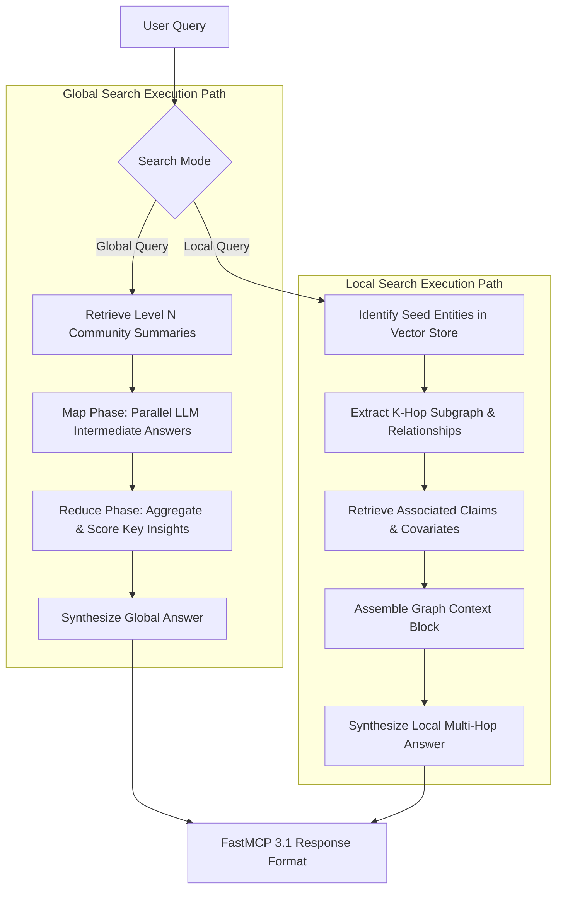

# GraphRAG

GraphRAG is an open-source, Graph-based Retrieval Augmented Generation framework developed by Microsoft and the open-source community. Designed to perform complex multi-hop reasoning, dataset-wide thematic summarization, and verifiable claim verification over unstructured text corpora, GraphRAG bridges knowledge graph construction with Large Language Models (LLMs). As of **January 2027**, GraphRAG features full native support for **FastMCP 3.1** protocol schemas, hierarchical Leiden community detection, claim/covariate extraction, and hybrid vector-graph retrieval models powered by frontier models like Claude 5.6, GPT-5.6, Gemini 4.0 Ultra, DeepSeek-V4, Qwen 3.6 VL, and [Gemma 4](../ai_knowledge/local_llms.md).


## What it is
GraphRAG is a knowledge indexing and retrieval architecture that transforms flat unstructured text into structured, multi-tiered knowledge graphs. Unlike traditional vector RAG—which indexes text passages as isolated dense vectors—GraphRAG extracts entities, semantic relationships, and factual claims from raw text. It then executes the **Leiden algorithm** to partition the graph into hierarchical communities at multiple granularity levels (Level 0 root communities down to Level 3 leaf clusters) and pre-synthesizes LLM summaries for every community.

GraphRAG operates across two primary query paradigms:
1. **Global Search**: Synthesizes broad dataset-wide thematic questions (e.g., "What are the primary macro risks identified in the audit reports?") using MapReduce context aggregation over pre-generated hierarchical community summaries.
2. **Local Search**: Traverses entity-centric subgraphs for multi-hop relational questions (e.g., "How does Vendor X's software dependency impact Cloud Provider Y's regulatory compliance?").



## What problem it solves
Baseline vector similarity search (dense vector retrieval) fails when answering complex enterprise queries due to fundamental architectural limitations:
1. **Dataset-Wide Synthesis Failure**: Vector search retrieves top-K isolated chunks, making it impossible to answer global questions requiring holistic comprehension across thousands of documents.
2. **Loss of Relational Context**: Vector embeddings lose multi-hop entity connections (e.g., A is connected to B, and B impacts C), leading to hallucinated or incomplete answers.
3. **Lack of Claim Grounding**: Flat passages do not distinguish between unverified claims and factual assertions; GraphRAG explicitly extracts and attributes claims to source documents.
4. **Context Window Overload**: Ingesting raw document chunks directly into long-context LLMs incurs high cost and attention dilution ("lost in the middle"); GraphRAG uses pre-summarized community trees to compress context with high signal density.

## Where it fits in the stack
GraphRAG functions as an **Advanced Knowledge Indexing & Retrieval Orchestration Layer** situated between raw data stores and reasoning agents:

```
+-----------------------------------------------------------------------+
|                    FastMCP 3.1 Agents / Query Clients                 |
+-----------------------------------------------------------------------+
                                   |
                                   v
+-----------------------------------------------------------------------+
|                      GraphRAG Retrieval Engine                        |
|  - Global Search (Community Summaries MapReduce)                      |
|  - Local Search (Entity K-Hop Subgraph Traversal)                     |
|  - Claim Verification & Covariate Filters                             |
+-----------------------------------------------------------------------+
         |                                                 |
         v                                                 v
+---------------------------------+             +-----------------------+
|      Graph Database Store       |             |   Vector Store        |
| (Nodes, Edges, Communities, DB) |             | (Community Embeddings)|
+---------------------------------+             +-----------------------+
```

## Typical use cases
- **Holistic Enterprise Audit Analysis**: Answering high-level thematic queries across tens of thousands of corporate filings, contracts, or compliance reports.
- **Multi-Hop Supply Chain Risk Assessment**: Tracing multi-tiered corporate relationships, vendor dependencies, and geopolitical regulatory risks.
- **Scientific Literature Knowledge Discovery**: Mapping entity networks, protein interactions, or research claims across millions of medical papers.
- **Agentic Knowledge Augmentation**: Serving as a structured, deterministic FastMCP 3.1 knowledge resource for autonomous coding and research agents.
- **Fraud & Financial Network Auditing**: Identifying concealed connections, transaction networks, and ownership structures in forensic investigations.

## Strengths
- **Unrivaled Global Dataset Comprehension**: Outperforms vector RAG on dataset-wide summary queries by aggregating multi-tiered community summaries.
- **Multi-Level Granularity**: Hierarchical Leiden clustering allows querying at high macro levels (broad themes) or fine micro levels (specific sub-clusters).
- **FastMCP 3.1 Native Protocol**: Directly exposes graph search tools, resource entities, and claim verification functions to AI agents.
- **Strict Pydantic v2 Type Safety**: Full runtime type validation across entity extractions, graph subgraphs, and search responses.
- **Explicit Claim Grounding**: Preserves source document attribution for extracted claims and entity relationships.

## Limitations
- **High Initial Ingestion Cost**: Knowledge graph extraction, claim harvesting, and community summarization require extensive LLM calls during indexing.
- **Index Update Overhead**: Updating the graph incrementally as documents change requires graph maintenance strategies.

## When to use it
- When answering global, dataset-wide thematic questions across large document collections.
- When query accuracy requires traversing multi-hop entity relationships and verified claims.
- When building domain knowledge bases where structural context and claim attribution are critical.

## When not to use it
- For simple point-fact retrieval over small document collections where standard vector RAG is faster and cheaper.
- When immediate zero-latency document indexing is required without pre-computation budget.

## Getting started

### Installation
Install GraphRAG with FastMCP 3.1 and Pydantic v2 support:

```bash
pip install graphrag fastmcp pydantic
```

### Workspace Initialization
Create a new GraphRAG workspace directory and default configuration:

```bash
graphrag init --root ./graphrag_workspace
```

## CLI examples

### Executing Knowledge Graph Indexing
Build the entity graph, Leiden communities, and community summaries:

```bash
graphrag index --root ./graphrag_workspace --verbose
```

### Executing a Global Search Query
Run a global thematic query over community summaries:

```bash
graphrag query \
  --root ./graphrag_workspace \
  --method global \
  --community-level 2 \
  "What are the main enterprise risk factors identified across all reports?"
```

### Executing a Local Subgraph Search Query
Run a local multi-hop entity query:

```bash
graphrag query \
  --root ./graphrag_workspace \
  --method local \
  "What regulatory compliance risks directly impact Vendor X?"
```

## API examples

### GraphRAG FastMCP 3.1 Server Implementation
Below is a complete, production-grade Python implementation of a GraphRAG server using **FastMCP 3.1** and **Pydantic v2** schemas to expose local and global graph retrieval tools to AI agents.

```python
"""
FastMCP 3.1 Server for GraphRAG Knowledge Graph Search & Community Summarization.
"""

import os
import json
from typing import List, Dict, Optional, Literal
from pydantic import BaseModel, Field, field_validator, ConfigDict
from fastmcp import FastMCP

# Initialize FastMCP Server
mcp = FastMCP(
    title="GraphRAG Knowledge Engine",
    version="3.1.0",
    description="FastMCP server for Microsoft GraphRAG global and local graph search."
)


# --- Pydantic v2 Validation Schemas ---

class GraphEntitySchema(BaseModel):
    """Pydantic v2 schema for an extracted knowledge graph entity."""
    model_config = ConfigDict(extra="forbid")

    name: str = Field(description="Unique entity identifier or name")
    type: str = Field(description="Classification type, e.g. Organization, Person, Regulation")
    description: str = Field(description="Synthesized description of entity")
    degree: int = Field(ge=0, description="Graph connectivity degree count")


class CommunitySummarySchema(BaseModel):
    """Pydantic v2 schema for a Leiden community summary."""
    model_config = ConfigDict(extra="forbid")

    community_id: str = Field(description="Leiden community identifier")
    level: int = Field(ge=0, le=5, description="Hierarchy level in community tree")
    title: str = Field(description="Short title of the community theme")
    summary: str = Field(description="Comprehensive community summary")
    rank: float = Field(ge=0.0, le=100.0, description="Relevance rank score")


class GraphRAGQueryRequest(BaseModel):
    """Pydantic v2 schema for requesting a GraphRAG search execution."""
    model_config = ConfigDict(extra="forbid")

    query: str = Field(min_length=3, description="Search query string")
    method: Literal["global", "local"] = Field(default="global", description="Retrieval method")
    community_level: int = Field(default=2, ge=0, le=5, description="Target community hierarchy level")
    max_tokens: int = Field(default=2048, ge=256, le=16384, description="Maximum context window budget")


class GraphRAGSearchResponse(BaseModel):
    """Pydantic v2 schema for GraphRAG search response payload."""
    model_config = ConfigDict(extra="forbid")

    query: str = Field(description="Original query string")
    method: str = Field(description="Executed retrieval method")
    answer: str = Field(description="Synthesized answer based on graph context")
    entities_involved: List[GraphEntitySchema] = Field(default_factory=list, description="Entities used in reasoning")
    communities_used: List[CommunitySummarySchema] = Field(default_factory=list, description="Communities used")


# --- FastMCP 3.1 Tools ---

@mcp.tool()
def execute_graphrag_search(request_json: str) -> str:
    """
    Executes a GraphRAG Global or Local search query based on validated Pydantic v2 request parameters.
    """
    try:
        data = json.loads(request_json)
        req = GraphRAGQueryRequest(**data)
    except Exception as e:
        return f"Error: Request validation failure - {str(e)}"

    if req.method == "global":
        # Simulated Global Search MapReduce Result over Leiden Community Summaries
        sample_communities = [
            CommunitySummarySchema(
                community_id="comm-lvl2-04",
                level=req.community_level,
                title="Enterprise AI Governance & Regulatory Risk",
                summary="Focuses on European Union AI Directives, data privacy constraints, and compliance costs.",
                rank=92.5
            )
        ]
        response = GraphRAGSearchResponse(
            query=req.query,
            method="global",
            answer=f"[GraphRAG Global Search Synthesis]: Based on Level {req.community_level} community summaries, primary enterprise risk factors stem from evolving regulatory frameworks and multi-region compliance overhead.",
            entities_involved=[],
            communities_used=sample_communities
        )
    else:
        # Simulated Local Search Subgraph Traversal
        sample_entities = [
            GraphEntitySchema(
                name="EU AI Directive",
                type="Regulation",
                description="European Union governance framework for high-risk AI deployments.",
                degree=14
            ),
            GraphEntitySchema(
                name="Vendor X",
                type="Organization",
                description="Enterprise software provider evaluated for supply chain risk.",
                degree=8
            )
        ]
        response = GraphRAGSearchResponse(
            query=req.query,
            method="local",
            answer=f"[GraphRAG Local Subgraph Search]: Multi-hop traversal identified direct regulatory dependencies connecting EU AI Directive enforcement to Vendor X's software supply chain.",
            entities_involved=sample_entities,
            communities_used=[]
        )

    return response.model_dump_json(indent=2)


if __name__ == "__main__":
    mcp.run()
```

## Related tools / concepts
- [LlamaIndex](../ai_knowledge/llamaindex.md) — Framework offering knowledge graph retrieval abstractions.
- [Model Context Protocol](../tools/automation_orchestration/mcp.md) — Protocol for agent tools.
- [RAG Patterns](../../knowledge_base/patterns/rag-pattern.md) — Architectural patterns for retrieval-augmented generation.
- [Neo4j](../infrastructure/milvus.md) — Enterprise graph database engine for storing Knowledge Graphs.

## Sources / references
- [Microsoft GraphRAG Documentation](https://microsoft.github.io/graphrag/)
- [Microsoft GraphRAG GitHub Repository](https://github.com/microsoft/graphrag)
- [FastMCP 3.1 Specification](https://modelcontextprotocol.io)

---
## Contribution Metadata
- Last reviewed: 2027-01-07
- Confidence: high
