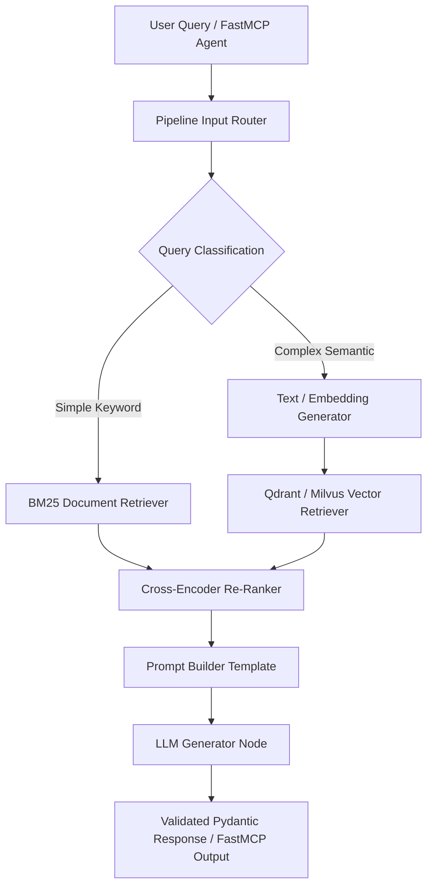

# Haystack

## What it is
Haystack is an open-source framework developed by deepset for building production-ready search applications, Retrieval-Augmented Generation (RAG) pipelines, and state-of-the-art agentic workflows. Operating under early 2027 standards, **Haystack 2.x** centers around a flexible Directed Acyclic Graph (DAG) architecture where data processing, vector embeddings, document retrieval, conditional routing, and LLM inference nodes are explicitly connected, serialized, and scaled.

Haystack connects seamlessly with frontier LLM engines—such as **Claude 5.6**, **GPT-5.6**, **Gemini 4.0 Ultra**, **Llama 4 Maverick**, and **Qwen 3.6 VL**—and features native connectors for the **FastMCP 3.1 Task Protocol**, allowing developers to expose complete Haystack RAG pipelines as standardized agent tools and resources.



## What problem it solves
Building enterprise-grade RAG and search architectures often results in brittle, monolithic scripts or overly abstract, opaque chains where data flow and error handling are hidden from developers. As retrieval pipelines scale to millions of documents across heterogeneous vector engines and LLM providers, pipeline serialization, type safety, and graph visibility become essential.

Haystack solves these challenges through:
- **Explicit DAG Graph Pipeline Architecture**: Eliminating hidden abstractions by requiring developers to explicitly define pipeline nodes (`pipeline.add_component()`) and data flow edges (`pipeline.connect()`).
- **Native YAML / JSON Pipeline Serialization**: Allowing entire production retrieval pipelines to be serialized to static YAML manifests for version control, CI/CD testing, and multi-environment deployment.
- **Strict Runtime Component Typing**: Enforcing typed input and output contracts between pipeline nodes to prevent runtime schema mismatches.
- **FastMCP 3.1 Connector Protocol**: Exposing complex RAG DAG graphs as standardized FastMCP tools that can be invoked seamlessly by autonomous agent frameworks ([Claude Code](../development_ops/claude-code.md), [Windsurf](../development_ops/windsurf.md), [Aider](../development_ops/aider.md)).

## Where it fits in the stack
**Category**: [Frameworks & RAG Orchestration](index.md) / Component Graph Pipeline Engine.

Haystack sits directly between underlying storage layers (e.g., [Qdrant](../infrastructure/qdrant.md), [ClickHouse](../process_understanding/clickhouse.md), Elasticsearch, Pinecone) and agent orchestration or application frontends.

```
+-----------------------------------------------------------------------+
|                    Agent & Application Frontend                       |
|        (Claude Code / FastMCP 3.1 Clients / React / Next.js)          |
+-----------------------------------------------------------------------+
                                    |
                                    v (FastMCP 3.1 Tool Invocation)
+-----------------------------------------------------------------------+
|                       Haystack 2.x DAG Pipeline                       |
|  +-----------------------+  +-------------------+  +---------------+  |
|  | Document Embedders    |  | Hybrid Retrievers |  | Cross-Ranker  |  |
|  +-----------------------+  +-------------------+  +---------------+  |
|  +-----------------------------------------------------------------+  |
|  |            YAML Serialization & Pydantic Schema Validation       |  |
|  +-----------------------------------------------------------------+  |
+-----------------------------------------------------------------------+
                                    |
                        +-----------+-----------+
                        |                       |
                        v                       v
+-----------------------------------+   +-------------------------------+
|     Vector Databases & Search     |   |    Frontier Model Engines     |
|   (Qdrant, Milvus, Azure Search)  |   | (Claude 5.6, GPT-5.6, Gemini) |
+-----------------------------------+   +-------------------------------+
```

## Typical use cases
- **Enterprise Multimodal RAG**: Constructing production pipelines that ingest, parse, chunk, embed, retrieve, and synthesize context across millions of corporate documents.
- **Conditional Agent Query Routing**: Utilizing `ConditionalRouter` nodes to dynamically route queries between lightweight edge models (**Qwen 3.6**) and deep reasoning models (**Claude 5.6**).
- **Serialized CI/CD RAG Deployments**: Defining retrieval configurations in YAML manifests that are validated and tested automatically in staging pipelines before cloud deployment.
- **FastMCP Search Tool Endpoints**: Packaging enterprise knowledge pipelines as FastMCP 3.1 tools for internal developer assistants.

## Strengths
- **Transparent Graph Architecture**: Every component, data edge, and transformation is explicitly visible and debuggable.
- **Production Serialization**: Full support for dumping pipelines to YAML and loading them at runtime without python code modifications.
- **Extensive Component Ecosystem**: Broad library of pre-built integrations for Qdrant, Milvus, Azure Search, Anthropic, OpenAI, Cohere, and Hugging Face.
- **FastMCP 3.1 Compatibility**: Readily exposes pipelines as FastMCP tool calls for autonomous multi-agent swarms.
- **Robust Component Customization**: Creating custom pipeline nodes requires decorating a Python class with `@component`.

## Limitations
- **Haystack 1.x vs 2.x Migration Gap**: Code written for legacy Haystack 1.x requires complete refactoring for the 2.x component pipeline model.
- **Smaller Community Ecosystem Than LangChain**: Fewer experimental community packages compared to larger frameworks, focusing instead on core production stability.
- **Strict Type Checking Requirement**: Misaligned output types between connected component ports result in pipeline initialization errors.

## When to use it
- When building enterprise production RAG systems where pipeline graph transparency, type safety, and YAML serialization are mandatory.
- When you require deterministic control over how context chunks are retrieved, re-ranked, and passed to LLM generators.
- When deploying search backends that must be exposed as FastMCP 3.1 tools to AI agents.

## When not to use it
- For quick, throwaway single-prompt scripts where a simple API client call (`openai` or `anthropic`) is faster.
- If your team is already standardized on another framework like [LlamaIndex](../ai_knowledge/llamaindex.md) without requiring pipeline graph serialization.
- For simple utility functions that do not involve data retrieval, document processing, or graph routing.

## Getting started

### Prerequisites and Installation
Install Haystack 2.x alongside vector database connectors, FastMCP, and Pydantic:

```bash
pip install "haystack-ai>=2.8.0" fastmcp pydantic "qdrant-haystack>=3.0.0"
```

### Minimal Python DAG Pipeline Example
The example below demonstrates constructing, connecting, and executing a basic Haystack 2.x pipeline:

```python
from haystack import Pipeline
from haystack.components.builders import PromptBuilder
from haystack.components.generators import OpenAIGenerator

prompt_template = "Summarize the key architectural benefits of {{topic}} in 3 bullet points."

pipeline = Pipeline()
pipeline.add_component("prompt_builder", PromptBuilder(template=prompt_template))
pipeline.add_component("llm", OpenAIGenerator(model="gpt-5.6-preview"))
pipeline.connect("prompt_builder", "llm")

result = pipeline.run({"prompt_builder": {"topic": "FastMCP 3.1 Task Protocol"}})
print(result["llm"]["replies"][0])
```

## CLI examples

Below are common CLI commands for serializing, running, and inspecting Haystack pipelines.

```bash
# 1. Export a Python-defined Haystack pipeline to a YAML configuration file
python3 build_pipeline.py --export-yaml pipeline.yaml

# 2. Run a serialized Haystack pipeline directly from the command line
haystack-run --config pipeline.yaml --input "What are the core concepts of Haystack 2.x?"

# 3. Validate pipeline schema configuration against Haystack 2.x specs
haystack-validate --file pipeline.yaml

# 4. Benchmark pipeline execution latency across sample queries
haystack-benchmark --config pipeline.yaml --dataset ./eval_queries.json
```

## API examples

### FastMCP 3.1 Tool Integration with Haystack RAG Pipeline
The following production-ready Python script wraps a complete Haystack 2.x retrieval DAG inside a **FastMCP 3.1** server tool endpoint.

```python
import os
from typing import List, Optional
from pydantic import BaseModel, Field
from fastmcp import FastMCP
from haystack import Pipeline, component
from haystack.components.builders import PromptBuilder
from haystack.components.generators import AnthropicGenerator

mcp = FastMCP("Haystack Knowledge Gateway")

class RAGQueryRequest(BaseModel):
    query: str = Field(..., min_length=3, description="Search and retrieval query string")
    max_tokens: int = Field(default=500, ge=50, le=2000)

class RAGQueryResponse(BaseModel):
    query: str
    synthesized_answer: str
    pipeline_status: str

# Custom mock retrieval component for demonstration
@component
class MockDocumentRetriever:
    @component.output_types(documents=List[str])
    def run(self, query: str):
        # Simulated document retrieval
        docs = [
            f"Document chunk 1 regarding: {query}",
            f"Document chunk 2 detailing FastMCP 3.1 protocol rules for: {query}"
        ]
        return {"documents": docs}

def build_haystack_rag_pipeline() -> Pipeline:
    prompt_template = """
    Synthesize a concise response based on the retrieved documents:
    
      - {{ doc }}
    

    Query: {{ query }}
    """

    pipeline = Pipeline()
    pipeline.add_component("retriever", MockDocumentRetriever())
    pipeline.add_component("prompt_builder", PromptBuilder(template=prompt_template))
    pipeline.add_component("generator", AnthropicGenerator(model="claude-5-6-sonnet"))

    pipeline.connect("retriever.documents", "prompt_builder.documents")
    pipeline.connect("generator", "generator") # Handled internally by prompt connector

    return pipeline

@mcp.tool()
def search_and_synthesize(query_text: str) -> str:
    """
    Executes a Haystack 2.x RAG pipeline to retrieve documents and synthesize
    a context-grounded response for FastMCP 3.1 agents.
    """
    try:
        request = RAGQueryRequest(query=query_text)

        prompt_template = """
        Context documents:
        
          - {{ doc }}
        

        User Query: {{ query }}
        """

        pipeline = Pipeline()
        pipeline.add_component("retriever", MockDocumentRetriever())
        pipeline.add_component("prompt_builder", PromptBuilder(template=prompt_template))
        pipeline.add_component("llm", AnthropicGenerator(model="claude-5-6-sonnet"))

        pipeline.connect("retriever.documents", "prompt_builder.documents")
        pipeline.connect("prompt_builder", "llm")

        result = pipeline.run({
            "retriever": {"query": request.query},
            "prompt_builder": {"query": request.query}
        })

        answer = result["llm"]["replies"][0]

        response = RAGQueryResponse(
            query=request.query,
            synthesized_answer=answer,
            pipeline_status="SUCCESS"
        )

        return response.model_dump_json(indent=2)

    except Exception as err:
        return f"Error executing Haystack RAG pipeline: {str(err)}"

if __name__ == "__main__":
    mcp.run()
```

### Custom Component with Pydantic v2 Input Validation
Below is an example of creating a custom Haystack 2.x component that validates incoming query arguments using **Pydantic v2** schemas.

```python
from pydantic import BaseModel, Field, field_validator
from haystack import component
from typing import Dict, Any

class QueryValidationSchema(BaseModel):
    user_query: str = Field(..., min_length=3, description="Incoming search text")
    user_role: str = Field(default="developer")

    @field_validator("user_query")
    @classmethod
    def check_query_safety(cls, v: str) -> str:
        forbidden_keywords = ["DROP DATABASE", "DELETE FROM", "RM -RF"]
        for kw in forbidden_keywords:
            if kw in v.upper():
                raise ValueError(f"Forbidden query keyword detected: {kw}")
        return v.strip()

@component
class ValidatedQuerySanitizer:
    @component.output_types(sanitized_query=str, role=str)
    def run(self, raw_query: str, role: str = "developer") -> Dict[str, Any]:
        """
        Custom Haystack component that validates and sanitizes input queries
        before passing them downstream in the pipeline graph.
        """
        validated = QueryValidationSchema(user_query=raw_query, user_role=role)
        return {
            "sanitized_query": validated.user_query,
            "role": validated.user_role
        }

# Execution Verification
if __name__ == "__main__":
    sanitizer = ValidatedQuerySanitizer()
    out = sanitizer.run(raw_query="How do I configure FastMCP 3.1 tool authentication?")
    print("Custom Haystack component executed successfully:")
    print(f"Sanitized Query: '{out['sanitized_query']}' | Role: {out['role']}")
```

## Related tools / concepts
- [LangChain](../ai_knowledge/langchain.md) — Framework for building applications with LLMs.
- [LlamaIndex](../ai_knowledge/llamaindex.md) — Indexing and retrieval framework for agentic RAG.
- [DSPy](dspy.md) — Declarative prompt compilation and optimization framework.
- [Qdrant](../infrastructure/qdrant.md) — High-performance vector database with Haystack integrations.
- [Model Context Protocol (MCP)](../automation_orchestration/mcp.md) — Protocol for connecting models to tools.

## Sources / references
- [Haystack Official Website](https://haystack.deepset.ai/)
- [Haystack GitHub Repository](https://github.com/deepset-ai/haystack)
- [Haystack 2.x Official Documentation](https://docs.haystack.deepset.ai/docs/intro)

## Contribution Metadata
- Last reviewed: 2027-01-07
- Confidence: high
