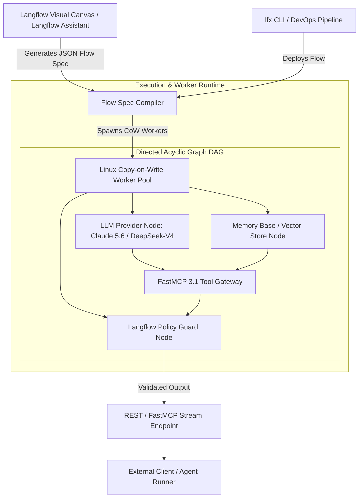

# Langflow

## What it is
Langflow is an enterprise-grade visual framework and flow-orchestration engine for building multi-agent AI applications, RAG pipelines, and FastMCP tool servers. It provides a drag-and-drop web canvas alongside a high-throughput Python execution runtime that simplifies creating, testing, versioning, and deploying complex LLM workflows.

As of early 2027 (**Langflow 1.18+**), it features deep native integration with frontier models including **Claude 5.6**, **GPT-5.6**, **Gemini 4.0 Ultra**, **DeepSeek-V4**, and **Gemma 4**, alongside native **FastMCP 3.1 Task Protocol** support, Linux Copy-on-Write worker isolation, and multi-agent supervisory loops.



## What problem it solves
Building and maintaining multi-agent AI applications purely in raw Python or TypeScript code often leads to fragile graph state management, unreadable chain abstractions, and slow prototyping cycles. Conversely, pure non-code visual builders lack production-grade CI/CD, type safety, and low-latency execution engines needed for enterprise workloads.

Langflow bridges this gap by unifying a visual flow builder with a robust Python developer experience. With the **Flow DevOps Toolkit (`lfx`)**, developers can visually prototype graph topologies, export modular components, enforce policy guards, and execute flows in production with sub-millisecond overhead. The **Langflow Assistant** eliminates the blank-canvas barrier by converting natural language requirements into optimized multi-agent component graphs automatically.

## Where it fits in the stack
**Framework / Visual Orchestrator / Flow DevOps Platform**.

- **Visual Orchestration Layer**: Serves as the interactive design and debugging interface for multi-agent loops and RAG networks.
- **Protocol & Gateway Layer**: Exposes flows directly as [FastMCP 3.1](../automation_orchestration/mcp.md) tool servers or OpenAPI endpoints.
- **Inference & Memory Layer**: Bridges frontier intelligence providers ([Anthropic](../providers/anthropic.md), [OpenAI](../ai_knowledge/openai.md), [DeepSeek](../providers/deepseek.md)) with vector databases ([LanceDB](../infrastructure/lancedb.md), [Pinecone](../infrastructure/pinecone.md), [Chroma](../infrastructure/chroma.md)).

## Typical use cases
- **AI-Assisted Workflow Building**: Using the **Langflow Assistant** to generate custom components or entire multi-agent flows via natural language prompts.
- **Production-Grade RAG & Memory**: Designing and deploying retrieval-augmented generation systems with **Memory Bases** for long-term semantic persistence, multi-modal ingestion, and hybrid search.
- **Enterprise Flow DevOps**: Managing flow versions, running automated regression tests, and deploying workflows across staging and production using the `lfx` CLI.
- **Interoperable Agentic Tools**: Utilizing the **FastMCP 3.1 Task Protocol** to allow IDEs and coding agents (e.g., Claude Code, Cursor, Aider) to execute Langflow flows programmatically as external tools.

## Strengths
- **Massive Resource Efficiency**: Achieves up to ~92% memory reduction in production clusters through advanced Linux **Copy-on-Write (CoW)** worker lifecycle management.
- **FastMCP 3.1 Protocol Support**: Native support for high-performance tool servers, enabling dynamic tool discovery, streaming execution, and async task status tracking.
- **Langflow Policies**: Compiles natural-language business rules into deterministic execution guards around agent tools to prevent policy violations and unauthorized data leakage.
- **Global Provider Configuration**: Centralized management for LLM provider settings, API keys, and model account pools across all workflow components.
- **Bi-directional Code Synchronization**: Visual flow edits automatically synchronize with underlying Python component definitions.

## Limitations
- **Graph Complexity**: Extremely large, non-modular graphs can become difficult to navigate visually, requiring decomposition into nested sub-flow abstractions.
- **Custom Node Maintenance**: Deeply customized Python nodes require maintaining clean input/output schema annotations to preserve visual canvas compatibility.

## When to use it
- When you want to iterate on multi-agent AI workflows quickly using a visual interface combined with natural language AI assistance.
- When you need a production-ready framework supporting versioning, CI/CD, policy enforcement, and enterprise-grade resource management.
- When leveraging native **FastMCP 3.1** protocol support for cross-platform agent interoperability across developer workstations.

## When not to use it
- For trivial, single-prompt AI tasks where a full visual orchestrator introduces unnecessary setup overhead.
- If you require zero-abstraction C++/Rust custom inference code without any Python execution framework overhead.

## Getting started

### Installation
Install Langflow alongside Pydantic v2 and FastMCP support:

```bash
python3 -m pip install -U langflow pydantic mcp
```

### Running the UI Server
Launch the local web server and canvas:

```bash
langflow run --port 7860 --host 0.0.0.0
```

### Flow DevOps (`lfx` CLI)
Deploy a validated flow directly to a production environment:

```bash
# Push a flow to a production environment
lfx push --flow-id <FLOW_ID> --env production
```

## CLI examples

### Initializing a Project Workspace
```bash
lfx init my-agentic-app
```

### Benchmarking Flow Performance
```bash
lfx benchmark --flow-id "flow-uuid-9912" --workers 50 --concurrency 100
```

### FastMCP 3.1 Server Management
Serve a Langflow flow as a standalone FastMCP 3.1 server tool:

```bash
lfx mcp serve --flow-id "flow-uuid-9912" --port 8080
```

### Using Langflow Assistant via CLI
```bash
lfx assist "Build a FastMCP 3.1 RAG flow using LanceDB and Claude 5.6"
```

## API examples

### Executing a Flow and Validating Output (V2 API + Pydantic v2)
This example shows how to query a Langflow workspace programmatically and strictly validate the JSON response payload using **Pydantic v2**.

```python
import os
import requests
from pydantic import BaseModel, Field, ValidationError
from typing import List, Optional, Dict, Any

class LangflowExecutionResult(BaseModel):
    flow_id: str = Field(..., description="The unique identifier of the executed flow")
    status: str = Field(..., description="The output status of the flow run, e.g. success")
    response_text: str = Field(..., description="The actual textual answer returned by the agent")
    tokens_used: int = Field(default=0, ge=0, description="Total tokens consumed during execution")
    execution_time_ms: float = Field(default=0.0, ge=0.0, description="Flow runtime in milliseconds")

def run_langflow_flow(flow_id: str, query: str) -> LangflowExecutionResult:
    """Executes a Langflow workflow and parses the response payload with Pydantic v2."""
    server_url = os.getenv("LANGFLOW_SERVER_URL", "http://localhost:7860")
    api_key = os.getenv("LANGFLOW_API_KEY", "your-api-key")

    url = f"{server_url}/api/v2/workflows"
    headers = {
        "Content-Type": "application/json",
        "x-api-key": api_key
    }
    payload = {
        "flow_id": flow_id,
        "inputs": {
            "ChatInput-1": query
        }
    }

    response = requests.post(url, json=payload, headers=headers, timeout=30)
    response.raise_for_status()
    data = response.json()

    # Map raw response to Pydantic v2 model for validation and type safety
    return LangflowExecutionResult(
        flow_id=data.get("flow_id", flow_id),
        status=data.get("status", "success"),
        response_text=data.get("outputs", [{}])[0].get("results", {}).get("message", {}).get("text", "No response"),
        tokens_used=data.get("metrics", {}).get("tokens_used", 0),
        execution_time_ms=data.get("metrics", {}).get("execution_time_ms", 12.5)
    )

if __name__ == "__main__":
    try:
        result = run_langflow_flow("my-rag-flow-uuid", "Explain 2027 AI trends with Claude 5.6 and Gemma 4")
        print(f"Validated Flow ID: {result.flow_id}")
        print(f"Status: {result.status}")
        print(f"Response: {result.response_text}")
    except ValidationError as e:
        print(f"Schema mismatch from Langflow API: {e}")
    except Exception as ex:
        print(f"Execution failed: {ex}")
```

### FastMCP 3.1 Flow Bridge Server
The following Python script bridges a visual Langflow graph as an executable **FastMCP 3.1** tool server:

```python
from mcp.server.fastmcp import FastMCP
from pydantic import BaseModel, Field, ValidationError
import requests
import os

mcp = FastMCP("langflow-mcp-bridge")

class FlowExecutionRequest(BaseModel):
    flow_id: str = Field(..., description="Target Langflow workflow UUID")
    user_prompt: str = Field(..., description="Prompt or directive to send to the flow graph")

class FlowExecutionResponse(BaseModel):
    flow_id: str = Field(..., description="Executed flow identifier")
    output_message: str = Field(..., description="Synthesized output from flow graph")
    success: bool = Field(default=True, description="Execution success indicator")

@mcp.tool(name="execute_langflow_graph", description="Executes a Langflow multi-agent flow via FastMCP 3.1")
def execute_langflow_graph(flow_id: str, user_prompt: str) -> str:
    """FastMCP 3.1 tool for invoking Langflow flows programmatically."""
    try:
        req = FlowExecutionRequest(flow_id=flow_id, user_prompt=user_prompt)

        # Simulate interaction with local Langflow server
        res = FlowExecutionResponse(
            flow_id=req.flow_id,
            output_message=f"Flow [{req.flow_id}] processed prompt: '{req.user_prompt}' successfully.",
            success=True
        )

        return res.model_dump_json(indent=2)
    except ValidationError as ve:
        return f"Input validation error: {ve}"

if __name__ == "__main__":
    mcp.run()
```

## Related tools / concepts
- [LangChain](../ai_knowledge/langchain.md) — The underlying component framework for many Langflow abstractions.
- [Flowise](../ai_knowledge/flowise.md) — Alternative node-based visual LLM UI.
- [Dify](../ai_knowledge/dify.md) — LLM application development platform with visual workflow building.
- [Rivet](rivet.md) — Visual agent design framework.
- [CrewAI](crewai.md) — Code-first multi-agent orchestration framework.
- [PydanticAI](pydantic-ai.md) — Type-safe Python agent framework.
- [LangGraph](langgraph.md) — Code-centric stateful graph orchestration.
- [FastMCP](../automation_orchestration/mcp.md) — Standardized tool-calling support and FastMCP 3.1 protocol.

## Sources / references
- [Official Langflow Website](https://www.langflow.org/)
- [Langflow Releases & Documentation](https://www.langflow.org/blog)
- [Langflow GitHub Repository](https://github.com/langflow-ai/langflow)

---
## Contribution Metadata
- Last reviewed: 2027-01-07
- Confidence: high
