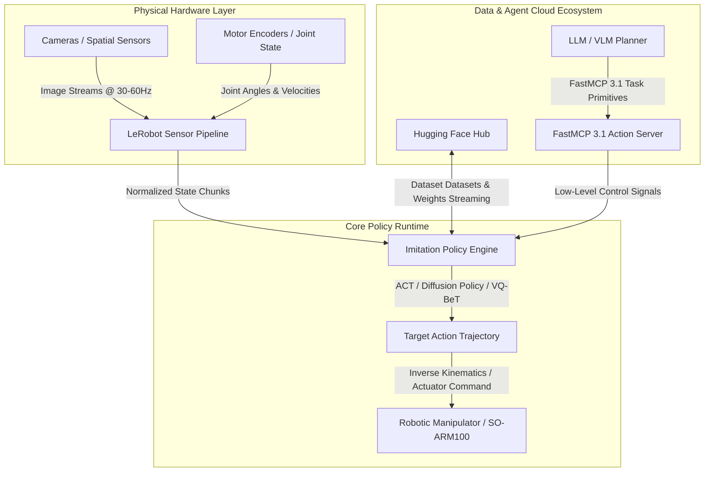

# LeRobot

## What it is
LeRobot is an open-source end-to-end robotics learning framework developed by Hugging Face (v0.4.0+). It provides real-world and simulated robotics data collection tools, pretrained imitation learning and reinforcement learning policy models, standard sensor and actuator interface adapters, and hardware control loops designed for physical AI applications. As of early 2027, LeRobot serves as a primary open-source foundation for training low-latency Vision-Language-Action (VLA) models and deploying embodied AI agents on consumer, industrial, and edge robotics platforms.

## System Architecture



## What problem it solves
Robotics development historically suffered from extreme fragmentation, proprietary hardware abstraction layers, and a lack of standardized dataset formats for AI training loops. LeRobot standardizes dataset schema ingestion, policy model architectures (such as Diffusion Policy, ACT, and VQ-BeT), and real-time inference loops on consumer or edge computing hardware. It solves the fragmentation challenge by enforcing unified schemas for visual frames, robot state trajectories, and high-frequency motor torque commands.

## Where it fits in the stack
**Category**: Frameworks / Physical AI & Robotics. It sits at the **Execution & Control Layer**, bridging high-level LLM and VLM reasoning agent architectures with low-level actuator motor commands and sensor teleoperation loops.

## Typical use cases
- **Streaming Data Collection & Teleoperation**: Logging streaming camera frames and arm joint states into standard Hugging Face LeRobot dataset formats using low-cost hardware (e.g., SO-ARM100, Koch v1.1).
- **Imitation Learning Policy Training**: Training neural policies to perform complex dexterous manipulation tasks using physical demonstration data and PyTorch distributed training pipelines.
- **Edge Deployment & Real-Time Inference**: Running optimized policy control loops at 30-100Hz on local NVIDIA Jetson, Mac Studio, or edge AI gateways.
- **Multimodal Agent Control Integration**: Connecting frontier vision-language models (e.g. Gemini 4.0 Pro, Claude 5.1) to physical robotic arms via FastMCP 3.1 action primitives.
- **Sim-to-Real Benchmark Testing**: Evaluating trained policies across simulated environments (Isaac Gym, MuJoCo) before zero-shot or fine-tuned deployment on physical robotic arms.

## Strengths
- **Native Hugging Face Ecosystem Integration**: Directly streams datasets and model weights to and from the Hugging Face Hub using standard parquet and zarr formats.
- **Broad Model Policy Zoo**: Includes built-in implementations of Action Chunking with Transformers (ACT), Diffusion Policy, VQ-BeT, and Vision-Language-Action (VLA) models.
- **Lightweight Hardware Requirements**: Operates on low-cost open hardware arms (e.g., SO-ARM100, Koch v1.1) as well as commercial industrial manipulators.
- **Modular Data Format**: Enforces rigid dataset schemas with built-in video decoding, state chunking, and spatial coordinate transforms.
- **Sub-20ms Execution Latency**: Optimized PyTorch execution runtime tailored for local inference without cloud round-trip overhead.

## Limitations
- **Hardware Calibration Required**: High precision physical actions require careful motor joint calibration and hardware-specific latency tuning.
- **Real-Time Latency Sensitivity**: Real-world teleoperation requires low-latency local execution loops, making network-dependent architectures challenging.
- **Continuous Domain Gap**: Sim-to-real transfer requires fine-tuning or domain randomization when trained purely in synthetic simulation environments.
- **Thermal & Hardware Strain**: Continuous high-frequency inference requires monitoring motor temperatures and mechanical backlash over extended training sessions.

## When to use it
- When training, evaluating, or deploying physical AI and imitation learning policies for robotic manipulators.
- When collecting streaming sensor and action teleoperation datasets for open-source sharing on Hugging Face Hub.
- When orchestrating physical robotics execution workflows alongside LLM planning agents using FastMCP 3.1.

## When not to use it
- For purely web-based, software-only software automation (use [Browser Use](../automation_orchestration/browser-use.md) or [Playwright](../automation_orchestration/puppeteer.md)).
- For classical industrial PLC ladder logic control with fixed deterministic motion trajectories requiring microsecond-level hard real-time guarantees.

## Getting started

### Installation
Install LeRobot via pip from source or PyPI with physical robot hardware support:
```bash
pip install lerobot torch torchvision
```

### Basic Hardware Initialization & Policy Evaluation
Evaluate a pretrained policy on local hardware or simulation environment:
```python
import lerobot
from lerobot.common.policies.act.modeling_act import ACTPolicy

# Load pretrained policy model from Hugging Face Hub
policy = ACTPolicy.from_pretrained("lerobot/act_so100_real")
policy.eval()
print("LeRobot ACT Policy successfully loaded.")
```

## CLI examples

### Recording Teleoperation Dataset
Record 50 episodes of motor manipulation demonstrations to a local dataset repository:
```bash
lerobot-record \
  --robot.type=so100 \
  --fps=30 \
  --repo-id=user/so100-button-press \
  --num-episodes=50 \
  --push-to-hub=true
```

### Training Imitation Policy
Train a Diffusion Policy on recorded dataset using CUDA acceleration:
```bash
lerobot-train \
  --policy.type=diffusion \
  --dataset.repo_id=user/so100-button-press \
  --env.type=real \
  --batch-size=64 \
  --steps=100000 \
  --eval-freq=5000
```

### Policy Replay & Evaluation
Replay a trained policy model on real hardware to evaluate target completion rate:
```bash
lerobot-eval \
  --policy.path=user/so100-diffusion-button-press \
  --robot.type=so100 \
  --num-eval-episodes=10
```

## API examples

### FastMCP 3.1 Server Integration & Pydantic v2 Telemetry Verification
The following complete script demonstrates creating a **FastMCP 3.1** server that exposes LeRobot physical robot commands to higher-level AI agents, validating input commands and sensor telemetry using **Pydantic v2**:

```python
import time
from typing import List, Optional
from mcp.server.fastmcp import FastMCP
from pydantic import BaseModel, Field, conlist

# Initialize FastMCP 3.1 Server for LeRobot Control
mcp = FastMCP("LeRobot-Robotics-Gateway")

class JointState(BaseModel):
    joint_positions: conlist(float, min_length=6, max_length=6) = Field(
        ..., description="6-DOF motor joint angles in radians"
    )
    joint_velocities: conlist(float, min_length=6, max_length=6) = Field(
        ..., description="Motor joint velocities in rad/s"
    )
    gripper_open: bool = Field(..., description="Boolean status of end-effector gripper")

class TeleoperationFrame(BaseModel):
    timestamp: float = Field(..., description="Unix timestamp of sensor reading")
    episode_index: int = Field(..., ge=0, description="Active demonstration episode ID")
    robot_state: JointState = Field(..., description="State telemetry")
    action_command: JointState = Field(..., description="Target action state")

class RobotCommandRequest(BaseModel):
    target_positions: conlist(float, min_length=6, max_length=6) = Field(
        ..., description="Target joint angles for physical arm movement"
    )
    gripper_target: bool = Field(True, description="Target gripper position (True=Open, False=Closed)")
    max_velocity_scaling: float = Field(0.5, ge=0.1, le=1.0, description="Safety velocity scaling factor")

@mcp.tool()
def execute_robot_action(request_data: dict) -> dict:
    """Validate and dispatch physical robot movement command via LeRobot control loop."""
    try:
        command = RobotCommandRequest.model_validate(request_data)

        # Simulate local LeRobot policy step execution
        frame = TeleoperationFrame(
            timestamp=time.time(),
            episode_index=1,
            robot_state=JointState(
                joint_positions=[0.0, -0.45, 1.2, 0.0, 0.8, 0.0],
                joint_velocities=[0.0, 0.0, 0.0, 0.0, 0.0, 0.0],
                gripper_open=True
            ),
            action_command=JointState(
                joint_positions=command.target_positions,
                joint_velocities=[v * command.max_velocity_scaling for v in [0.05, 0.03, -0.02, 0.0, 0.0, 0.0]],
                gripper_open=command.gripper_target
            )
        )

        return {
            "status": "executed",
            "timestamp": frame.timestamp,
            "validated_action": frame.action_command.model_dump()
        }
    except Exception as err:
        return {"status": "error", "error_message": str(err)}

if __name__ == "__main__":
    # Test local execution
    sample_cmd = {
        "target_positions": [0.05, -0.42, 1.18, 0.0, 0.8, 0.0],
        "gripper_target": False,
        "max_velocity_scaling": 0.4
    }
    res = execute_robot_action(sample_cmd)
    print("FastMCP LeRobot Action Execution Result:", res)
```

## Related tools / concepts
- [Hugging Face Ecosystem](../providers/huggingface.md)
- [Pydantic AI](../frameworks/pydantic-ai.md)
- [FastMCP 3.1](../automation_orchestration/mcp.md)
- [Browser Use](../automation_orchestration/browser-use.md)
- [OpenCode](../development_ops/opencode.md)
- [Claude Code](../development_ops/claude-code.md)
- [vLLM](../infrastructure/vllm.md)

## Sources / references
- [Hugging Face LeRobot Announcement](https://huggingface.co/blog/amazon/strands-lerobot-streaming-data-loop)
- [GitHub - Hugging Face LeRobot Repository](https://github.com/huggingface/lerobot)
- [LeRobot Official Documentation](https://huggingface.co/docs/lerobot)

---
## Contribution Metadata
- Last reviewed: 2027-01-07
- Confidence: high
