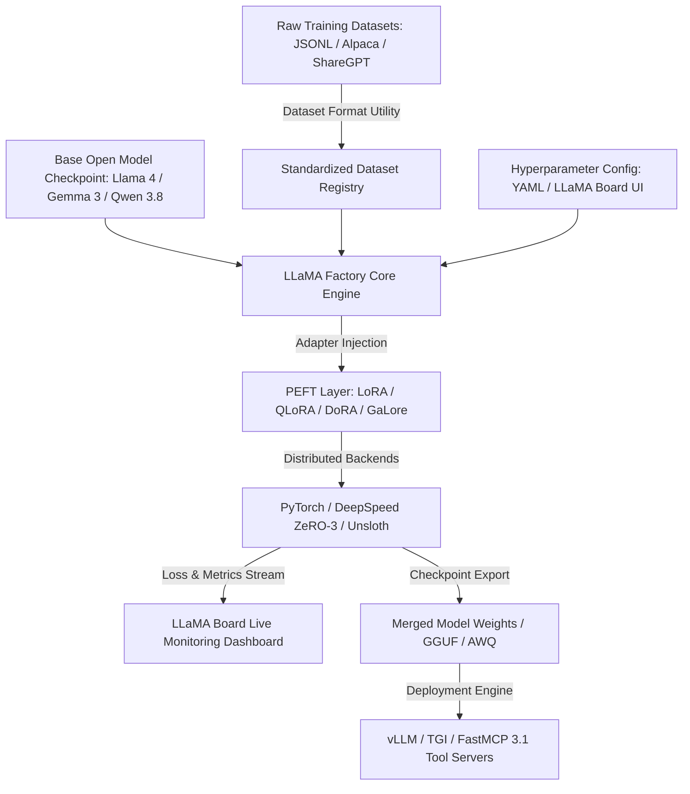

# LLaMA Factory

## What it is
LLaMA Factory is a unified, high-efficiency fine-tuning framework that supports over 100 open-source Large Language Model (LLM) architectures. It provides a standardized command-line and graphical web interface ("LLaMA Board") for fine-tuning models ranging from **Llama 4**, **Gemma 3**, and **Qwen 3.8** to specialized MoE (Mixture-of-Experts) architectures on modern NVIDIA Blackwell and Rubin GPUs.

## Architecture & System Flow
LLaMA Factory orchestrates dataset transformation, parameter-efficient adapter injection, distributed training runtimes, and post-training checkpoint validation across heterogeneous GPU clusters.

```
+-----------------------------------------------------------------------------------+
|                            LLaMA Factory System Flow                              |
+-----------------------------------------------------------------------------------+
|                                                                                   |
|  [ Data Sources ]                                                                 |
|  Raw Training Datasets (JSONL / Alpaca / ShareGPT / Function Call Logs)           |
|         │                                                                         |
|         ▼                                                                         |
|  [ Dataset Formatting & Tokenization Engine ]                                     |
|  Normalizes ShareGPT/Alpaca formats, applies prompt templates & loss masks        |
|         │                                                                         |
|         ├─────────────────────────────────────────┐                               |
|         ▼                                         ▼                               |
|  [ Foundation Models ]                   [ Hyperparameter Configuration ]          |
|  Llama 4 / Gemma 3 / Qwen 3.8 / MoE       YAML Specs / LLaMA Board Web UI         |
|         │                                         │                               |
|         └────────────────────┬────────────────────┘                               |
|                              ▼                                                    |
|  [ Parameter-Efficient Adapter Injection ]                                       |
|  LoRA / QLoRA / DoRA / GaLore / BAdam Layer Modifications                         |
|                              │                                                    |
|                              ▼                                                    |
|  [ Distributed Training Execution Runtimes ]                                      |
|  PyTorch / DeepSpeed ZeRO-3 / Unsloth Kernel Acceleration / FSDP                  |
|         │                                         │                               |
|         ▼                                         ▼                               |
|  [ Metrics & Loss Stream ]               [ Checkpoint Processing & Export ]       |
|  LLaMA Board / WandB Real-time Dashboard  Adapter Merging / GGUF / AWQ Quant        |
|                                                   │                               |
|                                                   ▼                               |
|                                          [ Serving Engine ]                       |
|                                          vLLM / TGI / FastMCP 3.1 Task Servers    |
|                                                                                   |
+-----------------------------------------------------------------------------------+
```



## What problem it solves
Fine-tuning diverse LLM families typically requires writing fragmented, custom boilerplate code across multiple distributed training and quantization libraries (such as PEFT, DeepSpeed, FlashAttention-3, and bitsandbytes). LLaMA Factory eliminates this friction by unifying supervised fine-tuning (SFT), Direct Preference Optimization (DPO), Proximal Policy Optimization (PPO), and ORPO training under a single configuration engine.

## Where it fits in the stack
**Framework / Model Adaptation & Fine-tuning Layer**. LLaMA Factory sits between lower-level acceleration libraries (PyTorch, Triton, DeepSpeed, [Unsloth](../infrastructure/unsloth.md)) and higher-level model serving runtimes ([vLLM](../infrastructure/vllm.md), [TGI](../infrastructure/tgi.md), [NVIDIA NIM](../providers/nvidia.md)). It enables rapid distillation of reasoning traces from frontier APIs like **Claude 5.1** into domain-specific open weights.

## Typical use cases
- **Supervised Fine-Tuning (SFT)**: Adapting open models (**Llama 4 Maverick**, **Qwen 3.8**) on enterprise document schemas or coding tasks.
- **Preference Alignment (DPO / ORPO / KTO)**: Aligning agent outputs with preference datasets to reduce hallucination rates.
- **Agentic Tool-Use Adaptation**: Fine-tuning models to natively emit [FastMCP 3.1](../automation_orchestration/mcp.md) tool invocations using synthetic function-calling datasets.
- **LoRA Adapter Merging & Quantization**: Training parameter-efficient adapters and exporting merged 4-bit / 8-bit GGUF or AWQ checkpoints for deployment.

## Feature Comparison
| Feature / Capability | LLaMA Factory | Unsloth | Hugging Face TRL | Axolotl |
| :--- | :--- | :--- | :--- | :--- |
| **Model Architectures** | 100+ LLM / VLM / MoE | Selected Llama/Qwen/Gemma | All Hugging Face Models | Extensive Open Models |
| **GUI Support** | Built-in LLaMA Board Web UI | None | None | None |
| **Training Methods** | SFT, DPO, PPO, ORPO, KTO | SFT, DPO | SFT, DPO, PPO, GRPO | SFT, DPO, Direct Preference |
| **PEFT Methods** | LoRA, QLoRA, DoRA, GaLore | Fast LoRA, QLoRA | LoRA, QLoRA | LoRA, QLoRA, ReFT |
| **Distributed Scaling** | DeepSpeed ZeRO-2/3, FSDP | Single-GPU / Multi-GPU Beta | DeepSpeed, FSDP, Accelerate | DeepSpeed ZeRO-2/3, FSDP |
| **FastMCP 3.1 Integration**| Native Synthetic Server | Custom Scripting Required | Manual Pipeline | Manual Pipeline |

## Strengths
- **Comprehensive Model Support**: Native compatibility with over 100 model architectures, including Llama 4, Gemma 3, and Qwen 3.8.
- **LLaMA Board Web UI**: No-code web interface for visual hyperparameter configuration, live loss plotting, and interactive chat evaluations.
- **Advanced Parameter Efficiency**: Built-in integration for QLoRA, GaLore, BAdam, DoRA, and Unsloth memory acceleration backends.
- **Multi-GPU & Distributed Training**: DeepSpeed ZeRO-2/ZeRO-3 and FSDP integration out of the box.
- **Dataset Formatting Utilities**: Automated conversion for Alpaca, ShareGPT, and custom OpenAI-style JSONL conversation datasets.

## Limitations
- **Environment Management**: High sensitivity to PyTorch, CUDA, and FlashAttention dependency version alignment.
- **UI Abstraction**: Advanced distributed training configurations or custom loss function modifications require direct YAML/CLI editing rather than the Web UI.
- **Resource Footprint**: Training large 70B+ parameters requires multi-node hardware or aggressive QLoRA quantization.

## When to use it
- When fine-tuning or aligning open-source LLMs without writing custom PyTorch training loops from scratch.
- When evaluating multiple fine-tuning paradigms (e.g., comparing SFT vs. DPO vs. ORPO) on identical datasets.
- When you require a graphical dashboard (LLaMA Board) for non-programmer stakeholders to monitor training progress.

## When not to use it
- If you are building novel neural network architectures or low-level kernel routines from scratch.
- If you only ever fine-tune a single specific model family and require the absolute maximum token/sec training speed of direct [Unsloth](../infrastructure/unsloth.md) Python scripts.
- For pure prompt engineering tasks where weight modification is unnecessary.

## Getting started

### Installation
Clone the official repository and install dependencies with modern PyTorch support:

```bash
git clone --depth 1 https://github.com/hiyouga/LLaMA-Factory.git
cd LLaMA-Factory
pip install -e ".[metrics,bitsandbytes,qwen,deepspeed]" pydantic>=2.10.0 fastmcp>=3.1.0
```

### Hello-world (CLI Status)
Verify the installation status:

```bash
llamafactory-cli version
```

### LLaMA Board (Web UI Launch)
Launch the interactive web dashboard:

```bash
llamafactory-cli webui
```

## CLI examples

### 1. Supervised Fine-Tuning (SFT via YAML Config)
Start a LoRA fine-tuning run using a YAML configuration:

```bash
llamafactory-cli train examples/train_lora/llama4_lora_sft.yaml
```

### 2. Exporting & Merging LoRA Weights
Merge LoRA adapter weights back into the full base checkpoint for serving:

```bash
llamafactory-cli export examples/merge_lora/llama4_lora_sft.yaml
```

### 3. Model Evaluation on Benchmark Sets
Run automated evaluation against standard benchmarking datasets:

```bash
llamafactory-cli eval examples/train_lora/llama4_lora_eval.yaml
```

## API examples

### FastMCP 3.1 Task Protocol Server (`llamafactory_mcp_server.py`)
This executable FastMCP 3.1 server exposes LLaMA Factory fine-tuning orchestration, dataset formatting, and checkpoint validation tools to external agent workflows.

```python
from typing import List, Dict, Any, Optional
from pydantic import BaseModel, Field, ValidationError
from fastmcp import FastMCP

mcp = FastMCP("llama-factory-orchestrator")

class FineTuneRequest(BaseModel):
    model_name_or_path: str = Field(..., description="Base target foundation model path or HuggingFace ID")
    stage: str = Field(default="sft", description="Training stage ('sft', 'dpo', 'ppo', 'orpo')")
    finetuning_type: str = Field(default="lora", description="Fine-tuning method ('lora', 'full', 'freeze')")
    dataset: List[str] = Field(default_factory=list, description="Registered dataset keys")
    cutoff_len: int = Field(default=4096, ge=512, le=131072, description="Max sequence cutoff length")
    learning_rate: float = Field(default=2e-4, gt=0, description="Training learning rate")
    num_train_epochs: float = Field(default=3.0, gt=0, description="Total training epochs")
    mcp_tool_tuning: bool = Field(default=True, description="Enable FastMCP 3.1 synthetic tool tuning")

class TrainingJobStatus(BaseModel):
    job_id: str = Field(..., description="Unique training job ID")
    status: str = Field(..., description="Job execution status ('running', 'completed', 'failed')")
    current_epoch: float = Field(..., description="Current training epoch progress")
    loss: float = Field(..., description="Latest evaluation loss value")
    checkpoint_path: str = Field(..., description="Path to output adapter or merged model weights")

@mcp.tool()
def submit_finetune_job(config: FineTuneRequest) -> Dict[str, Any]:
    """Submit a LLaMA Factory fine-tuning job with Pydantic v2 configuration validation."""
    try:
        validated_config = FineTuneRequest.model_validate(config.model_dump())
        job_id = f"job-{validated_config.stage}-{hash(validated_config.model_name_or_path) % 10000}"
        return {
            "status": "initiated",
            "job_id": job_id,
            "target_model": validated_config.model_name_or_path,
            "stage": validated_config.stage,
            "mcp_enabled": validated_config.mcp_tool_tuning
        }
    except ValidationError as ve:
        return {"status": "error", "errors": ve.errors()}

@mcp.tool()
def get_job_metrics(job_id: str) -> Dict[str, Any]:
    """Retrieve execution metrics and status for an active fine-tuning run."""
    status = TrainingJobStatus(
        job_id=job_id,
        status="running",
        current_epoch=1.5,
        loss=0.342,
        checkpoint_path=f"saves/{job_id}/checkpoint-500"
    )
    return status.model_dump()

if __name__ == "__main__":
    mcp.run()
```

### Python High-Level Inference Interface (`ChatModel`)
```python
from typing import List, Dict, Any
from llamafactory.chat import ChatModel

# Configure fine-tuned model checkpoint loading
args: Dict[str, Any] = {
    "model_name_or_path": "meta-llama/Llama-4-Maverick-8B-Instruct",
    "adapter_name_or_path": "saves/llama4-8b/lora/sft",
    "template": "llama4",
    "finetuning_type": "lora",
}

chat_model = ChatModel(args)

# Execute query against fine-tuned model
messages = [{"role": "user", "content": "Generate a FastMCP 3.1 tool definition for system metrics."}]
responses = chat_model.chat(messages)

for response in responses:
    print("Agent Response:", response.response_text)
```

### Fine-Tuning Config & Training Status Verification via Pydantic v2
```python
from pydantic import BaseModel, Field, ValidationError
from typing import Optional, List

class LLaMAFactoryTrainConfig(BaseModel):
    model_name_or_path: str = Field(..., description="Base target foundation model path")
    stage: str = Field(default="sft", description="Training stage ('sft', 'dpo', 'ppo')")
    finetuning_type: str = Field(default="lora", description="Fine-tuning method ('lora', 'full')")
    dataset: List[str] = Field(default_factory=list, description="Dataset names in registry")
    cutoff_len: int = Field(default=4096, description="Max sequence length")
    learning_rate: float = Field(default=2e-4, description="Training learning rate")
    num_train_epochs: float = Field(default=3.0, description="Number of training epochs")
    mcp_tool_tuning: bool = Field(default=True, description="Enable FastMCP 3.1 synthetic tool tuning")

# Example configuration validation
raw_yaml_dict = {
    "model_name_or_path": "meta-llama/Llama-4-Maverick-8B-Instruct",
    "stage": "sft",
    "finetuning_type": "lora",
    "dataset": ["fastmcp_3_1_tool_calls", "alpaca_en"],
    "learning_rate": 0.0001,
    "num_train_epochs": 2.5
}

try:
    config = LLaMAFactoryTrainConfig.model_validate(raw_yaml_dict)
    print("LLaMA Factory Config Validated:")
    print(f"  Target Model: {config.model_name_or_path}")
    print(f"  Training Stage: {config.stage} ({config.finetuning_type})")
    print(f"  Datasets: {', '.join(config.dataset)}")
    print(f"  FastMCP 3.1 Tuning Enabled: {config.mcp_tool_tuning}")
except ValidationError as ve:
    print("Config Validation Error:", ve)
```

## Operational Guidelines & Best Practices
- **Memory Optimization**: Use QLoRA combined with 4-bit NormalFloat (`nf4`) quantization and paged AdamW optimizers when training 70B+ parameter models on limited GPU VRAM.
- **Dataset Formatting**: Store conversation logs in standardized ShareGPT format with explicitly tagged `tools` and `function_call` keys to maximize MCP protocol alignment.
- **Gradient Accumulation**: Maintain an effective batch size between 64 and 128 by adjusting `gradient_accumulation_steps` based on the available GPU cluster size.
- **Checkpoint Merging**: Always verify post-merge token embeddings and evaluate KL divergence against base checkpoints before deploying merged weights to vLLM.

## Related tools / concepts
- [Fine-tuning Open Models](../../knowledge_base/patterns/fine-tuning-open-models.md) — Enterprise patterns and guidelines.
- [Unsloth](../infrastructure/unsloth.md) — Memory-efficient fine-tuning backend.
- [vLLM](../infrastructure/vllm.md) — High-throughput inference server for fine-tuned checkpoints.
- [PEFT (Parameter-Efficient Fine-Tuning)](../infrastructure/peft.md) — Underlying adapter fine-tuning library.
- [Qwen](../ai_knowledge/qwen.md) — Popular target model family for domain adaptation.
- [FastMCP 3.1](../automation_orchestration/mcp.md) — Protocol target for tool-calling model fine-tuning.

## Sources / references
- [LLaMA Factory GitHub Repository](https://github.com/hiyouga/LLaMA-Factory)
- [LLaMA Factory Official Documentation](https://llama-factory.readthedocs.io/)
- [DeepSpeed Optimization Library](https://www.deepspeed.ai/)

## Contribution Metadata
- Last reviewed: 2026-10-09
- Confidence: high
