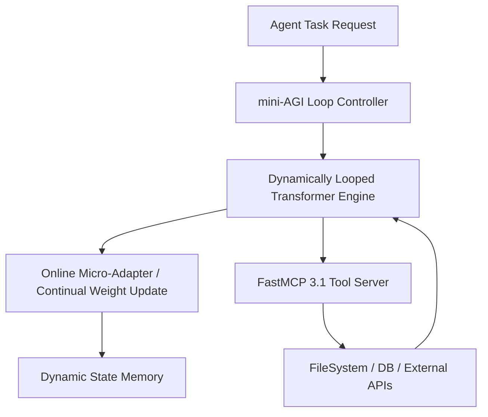

# mini-AGI

## What it is
mini-AGI is a lightweight framework for continual-learning, dynamically-looped transformer agents. As of early 2027, mini-AGI provides an open framework for autonomous recursive reasoning, self-directed fine-tuning loops, and dynamic context caching across iterative multi-step agent trajectories. Designed for edge and server deployments, mini-AGI integrates seamlessly with **FastMCP 3.1** and local model servers to deliver low-latency, continual-learning loops without high infrastructure overhead.

## What problem it solves
Traditional agent frameworks rely on static model weights and external vector memory stores, which can introduce context latency and context degradation in long-horizon agent execution. mini-AGI solves this by introducing dynamically looped transformer architectures where activation states and online micro-adapters update continuously during execution, reducing latency and maintaining continuous state tracking across complex tasks.

## Where it fits in the stack
**Category**: Frameworks / Agentic Frameworks. mini-AGI operates at the **Execution & Orchestration Layer**, bridging lower-level model inference runtimes (e.g., [vLLM](../infrastructure/vllm.md) or [llama.cpp](../infrastructure/llama-cpp.md)) with high-level agent tools and MCP services.



## Typical use cases
- **Continual Learning Agents**: Running persistent background agents that learn task patterns from execution traces without needing manual fine-tuning pipelines.
- **Low-Latency Recursive Planning**: Executing tight loop reasoning for complex math, code generation, and formal verification tasks.
- **Embedded Agent Systems**: Deploying small-footprint autonomous agents on resource-constrained edge nodes or local developer workstations.
- **Autonomous Tool Exploration**: Allowing agents to interactively probe FastMCP 3.1 tool endpoints and continuously refine tool invocation parameters.

## Strengths
- **Low Overhead**: Compact Python and Rust core optimized for minimal memory footprint and high loop throughput.
- **Continual Adaptation**: Native support for online parameter updates and dynamic context persistence.
- **FastMCP 3.1 Ready**: Built-in RPC handlers and adapters for Model Context Protocol servers.
- **Local-First Architecture**: Runs fully offline with open-weights backends like [Llama 4](../ai_knowledge/llama-4.md) and [Gemma 3](../ai_knowledge/local_llms.md).

## Limitations
- **Catastrophic Forgetting Risk**: Continual adaptation requires strict regularization and guardrails to avoid policy drift over extended autonomous loops.
- **Experimental Ecosystem**: Newer framework with smaller community ecosystem compared to [LangGraph](langgraph.md) or [CrewAI](crewai.md).

## When to use it
- When building local-first, low-latency agent loops that require continuous state tracking across steps.
- When experimenting with online fine-tuning and adaptive weight updates during multi-turn execution.
- For embedded or edge deployment where heavy agent orchestration frameworks are too resource-intensive.

## When not to use it
- When requiring out-of-the-box enterprise UI dashboards or visual workflow drag-and-drop builders (consider [Dify](../ai_knowledge/dify.md) or [Langflow](langflow.md)).
- When enterprise SLA governance and rigid multi-tenant isolation are strict prerequisites.

## Getting started

### Installation
Install `mini-agi` and FastMCP dependencies via PyPI:
```bash
pip install mini-agi pydantic mcp
```

### Basic Initialization
Create a basic continual-learning agent instance linked to an MCP tool runner:

```python
from mini_agi import AgentLoop, LoopConfig

config = LoopConfig(
    model_name="mini-agi-6b",
    max_loops=25,
    enable_continual_learning=True
)
agent = AgentLoop(config)
```

## CLI examples

### Starting an Autonomous Agent Loop
Launch mini-AGI directly from the command line:
```bash
mini-agi run --task "Audit codebase for unhandled exceptions" --enable-learning
```

### Inspecting Dynamic Micro-Adapters
Check active online adapter weights and learning trajectories:
```bash
mini-agi inspect --adapters-dir ./checkpoints
```

## API examples

### Python: FastMCP 3.1 Agent Gateway with Pydantic v2
The following script demonstrates integrating mini-AGI continual learning loops with FastMCP 3.1 for programmatic task orchestration and state auditing:

```python
import json
from pydantic import BaseModel, Field
from mcp.server.fastmcp import FastMCP

mcp = FastMCP("mini-AGI Loop Gateway")

class TaskRequestSchema(BaseModel):
    task_id: str = Field(..., description="Unique task identifier")
    prompt: str = Field(..., description="Task prompt for the agent loop")
    max_steps: int = Field(default=10, ge=1, le=100)
    continual_learning: bool = Field(default=True)

class LoopStatusSchema(BaseModel):
    task_id: str
    steps_completed: int
    status: str
    adapter_loss: float

@mcp.tool()
def execute_mini_agi_task(request_json: str) -> str:
    """Executes a mini-AGI recursive task loop and returns structured state report."""
    try:
        data = json.loads(request_json)
        request = TaskRequestSchema(**data)

        # Simulated mini-AGI recursive loop execution
        result = LoopStatusSchema(
            task_id=request.task_id,
            steps_completed=request.max_steps,
            status="completed",
            adapter_loss=0.0142
        )
        return result.model_dump_json(indent=2)
    except Exception as e:
        return json.dumps({"status": "error", "message": str(e)})

if __name__ == "__main__":
    mcp.run()
```

## Related tools / concepts
- [LangGraph](langgraph.md) — Framework for building stateful, multi-actor applications with LLMs.
- [CrewAI](crewai.md) — Role-playing multi-agent autonomous framework.
- [Model Context Protocol](../automation_orchestration/mcp.md) — Standardized tool integration protocol.
- [vLLM](../infrastructure/vllm.md) — High-throughput inference engine for local transformer serving.
- [AutoReason](../agents/autoreason.md) — Specialized agent reasoning loop framework.

## Sources / references
- [mini-AGI GitHub Repository & Discussion](https://www.reddit.com/r/LocalLLaMA/comments/1wnggz5/miniagi_continuallearning_dynamically_looped/)
- [Model Context Protocol Specification](https://modelcontextprotocol.io/introduction)

---
## Contribution Metadata
- Last reviewed: 2027-01-07
- Confidence: high
