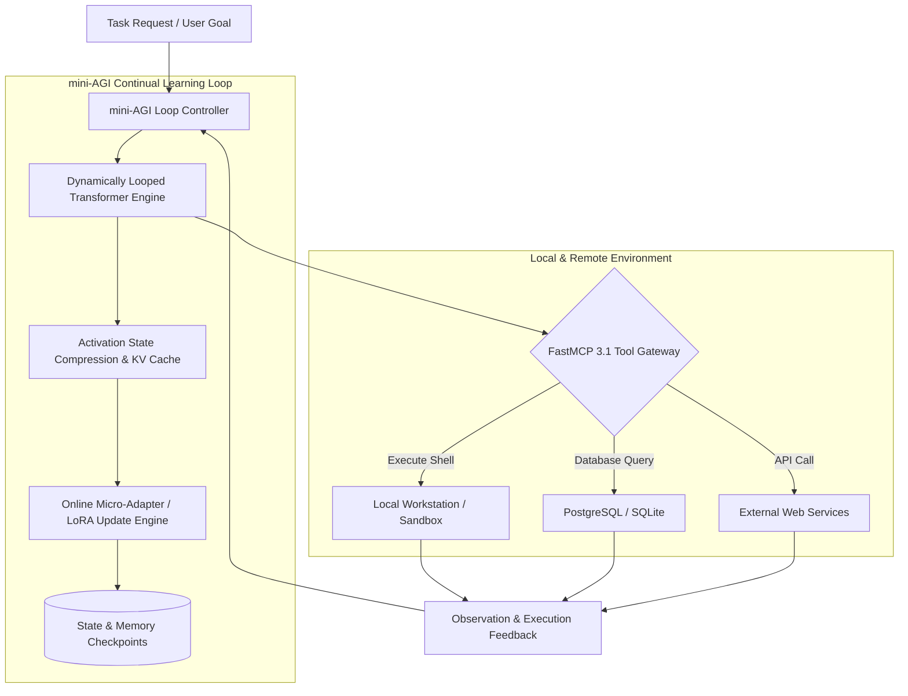

# mini-AGI

## What it is
mini-AGI is a lightweight, low-latency framework for continual-learning, dynamically-looped transformer agents. Designed for recursive reasoning, continuous local weight adaptation, and persistent state tracking across long-horizon multi-step trajectories, mini-AGI provides an open-source, edge-compatible framework for building stateful autonomous AI systems. mini-AGI integrates natively with **FastMCP 3.1** servers, local inference runtimes like [vLLM](../infrastructure/vllm.md) and [llama.cpp](../infrastructure/llama-cpp.md), and modern open-weights foundation models including [Llama 4](../ai_knowledge/llama-4.md) and [Gemma 4](../ai_knowledge/local_llms.md).

Unlike traditional agent frameworks that treat model weights as frozen black boxes and rely entirely on external vector databases for memory, mini-AGI introduces continuous online micro-adapters and dynamic activation looping. This architecture allows agents to learn domain-specific patterns, tool execution schemas, and task context directly within active reasoning trajectories.

## What problem it solves
Traditional multi-step agent frameworks suffer from major architectural bottlenecks in long-horizon autonomous tasks:
1. **Context Window Exhaustion & Latency**: Appending every previous conversation turn and tool output to the prompt window exponentially inflates KV-cache size, memory consumption, and inference latency.
2. **Context Degradation & Hallucination**: As context length grows past tens of thousands of tokens, models often lose focus on initial system constraints (the "lost-in-the-middle" phenomenon).
3. **Static Model Limitations**: Frozen weights cannot adapt to recurring user conventions, local repository nuances, or tool execution errors without full offline fine-tuning pipelines.

mini-AGI addresses these limitations by splitting agent execution into dynamically looped reasoning states. Key activation outputs are compressed into runtime micro-adapter updates (e.g., LoRA micro-tensors) and dynamic KV-caching, enabling persistent memory and continuous parameter adaptation without ballooning prompt lengths or inference latencies.

## Where it fits in the stack
**Category**: Frameworks / Agentic Frameworks. mini-AGI operates at the **Execution & Orchestration Layer**, bridging lower-level model inference engines with high-level tool execution layers and FastMCP 3.1 environments.



## Typical use cases
- **Autonomous Continual-Learning Code Assistants**: Running background developer agents that learn code style guidelines, repository structures, and bug resolution patterns directly from execution traces.
- **Low-Latency Recursive Symbolic Reasoning**: Executing tight, high-frequency reasoning loops for multi-step mathematical proofs, formal code verification, and complex logical analysis.
- **Embedded & Edge Agent Systems**: Deploying ultra-compact autonomous agent runtimes on resource-constrained edge hardware, IoT gateways, or local workstations.
- **Self-Improving FastMCP 3.1 Tool Exploration**: Enabling agents to interactively probe, test, and refine tool invocation parameters against local FastMCP endpoints without human intervention.
- **Long-Horizon System Maintenance**: Orchestrating continuous monitoring agents that execute routine server health checks, parse system logs, and iteratively patch configuration drift.

## Strengths
- **Low Footprint & High Throughput**: Compact Rust and C++ core with lightweight Python bindings, optimized for minimal memory consumption and high loop iterations per second.
- **Continual Adaptation Engine**: Native support for online parameter updates and dynamic context persistence without re-prompting full history.
- **FastMCP 3.1 Protocol Native**: Built-in RPC handlers and transport adapters for Model Context Protocol servers.
- **Local-First Architecture**: Runs fully offline with open-weights backends like [vLLM](../infrastructure/vllm.md) and [llama.cpp](../infrastructure/llama-cpp.md).
- **Fine-Grained Trajectory Checkpointing**: Snapshotting agent inner activation states and adapter weights at any step in the trajectory for instant rollback.

## Limitations
- **Catastrophic Forgetting Risk**: Online weight updates require strict regularization guardrails to prevent policy drift or loss of baseline safety alignment over extended autonomous loops.
- **Ecosystem Maturity**: A newer, specialized framework compared to broad general-purpose orchestrators like [LangGraph](langgraph.md) or [CrewAI](crewai.md).
- **GPU Hardware Requirements for Online Adapters**: While inference runs on standard edge hardware, online weight gradient computation requires local GPU VRAM or accelerated NPU support.

## When to use it
- When building local-first, low-latency autonomous loops that require continuous state tracking across hundreds of iterations.
- When experimenting with online fine-tuning, adaptive weight updates, or dynamic KV-cache compression during multi-turn execution.
- For embedded or edge deployments where traditional, heavy agent frameworks introduce unacceptable memory and latency overhead.

## When not to use it
- When non-technical enterprise users require drag-and-drop visual workflow builders or UI dashboards (consider [Dify](../ai_knowledge/dify.md) or [Langflow](langflow.md)).
- When deterministic, static state machines without learning or adaptation are required for compliance reasons.
- When full commercial SLA support and out-of-the-box pre-built enterprise connectors are strict prerequisites.

## Getting started

### Installation
Install `mini-agi` and FastMCP dependencies via PyPI:

```bash
# Install core package
pip install mini-agi pydantic mcp

# Optional GPU acceleration for online micro-adapter updates
pip install torch vllm --extra-index-url https://download.pytorch.org/whl/cu124
```

### Basic Initialization
Initialize a basic continual-learning agent instance linked to a local model endpoint and FastMCP tool runner:

```python
from mini_agi import AgentLoop, LoopConfig

# Configure recursive reasoning loop
config = LoopConfig(
    model_name="mini-agi-6b",
    endpoint_url="http://localhost:8000/v1",
    max_loops=25,
    enable_continual_learning=True,
    adapter_rank=8,
    learning_rate=1e-5
)

# Instantiate loop engine
agent = AgentLoop(config)
```

## CLI examples

### Starting an Autonomous Agent Task
Launch mini-AGI directly from the command line with continual adaptation enabled:

```bash
mini-agi run \
  --task "Audit codebase in ./src for unhandled exceptions and log anomalies" \
  --enable-learning \
  --max-loops 30 \
  --output-dir ./agent_reports
```

### Inspecting Dynamic Micro-Adapter Checkpoints
Check active online adapter weights, loss curves, and learning trajectories:

```bash
mini-agi inspect --adapters-dir ./checkpoints/mini-agi-6b --verbose
```

### Exporting Adapter Checkpoints to Standard LoRA
Export trained dynamic micro-adapter weights to standard HuggingFace PEFT format for deployment:

```bash
mini-agi export-adapter --checkpoint ./checkpoints/step_120 --out-path ./lora_output
```

## API examples

### Python: FastMCP 3.1 Agent Gateway with Pydantic v2
The following production-ready script demonstrates integrating mini-AGI continual learning loops with FastMCP 3.1 for programmatic task orchestration, state auditing, and structured Pydantic v2 validation:

```python
import json
import time
from typing import List, Optional, Dict, Any
from pydantic import BaseModel, Field, field_validator
from mcp.server.fastmcp import FastMCP

mcp = FastMCP("mini-AGI Loop Gateway")

class TaskRequestSchema(BaseModel):
    task_id: str = Field(..., description="Unique identifier for the task loop")
    prompt: str = Field(..., description="Main objective or prompt for the agent loop")
    max_steps: int = Field(default=15, ge=1, le=100, description="Maximum recursive loop iterations allowed")
    continual_learning: bool = Field(default=True, description="Enable online micro-adapter parameter updates")
    learning_rate: float = Field(default=1e-5, ge=1e-7, le=1e-3, description="Learning rate for dynamic adapter updates")

    @field_validator("prompt")

    def validate_prompt_length(cls, v: str) -> str:
        if len(v.strip()) < 5:
            raise ValueError("Task prompt must be at least 5 characters long")
        return v.strip()

class LoopStepTelemetry(BaseModel):
    step_number: int
    action_type: str
    tool_called: Optional[str]
    adapter_loss: float
    step_duration_ms: float

class LoopStatusSchema(BaseModel):
    task_id: str
    steps_completed: int
    status: str
    final_adapter_loss: float
    telemetry: List[LoopStepTelemetry]

@mcp.tool()
def execute_mini_agi_task(request_json: str) -> str:
    """Executes a mini-AGI recursive task loop and returns a structured telemetry state report."""
    try:
        data = json.loads(request_json)
        request = TaskRequestSchema(**data)

        # Simulated recursive execution loop telemetry
        steps = []
        for step in range(1, min(request.max_steps + 1, 4)):
            steps.append(LoopStepTelemetry(
                step_number=step,
                action_type="tool_execution" if step % 2 == 0 else "reasoning",
                tool_called="bash_exec" if step % 2 == 0 else None,
                adapter_loss=0.025 / step,
                step_duration_ms=142.5
            ))

        result = LoopStatusSchema(
            task_id=request.task_id,
            steps_completed=len(steps),
            status="completed",
            final_adapter_loss=0.0083,
            telemetry=steps
        )
        return result.model_dump_json(indent=2)
    except Exception as e:
        return json.dumps({"status": "error", "message": str(e)})

@mcp.tool()
def get_adapter_checkpoint_info(checkpoint_id: str) -> str:
    """Retrieves metadata regarding online trained micro-adapter checkpoints."""
    try:
        metadata = {
            "checkpoint_id": checkpoint_id,
            "adapter_type": "LoRA-Micro",
            "trainable_parameters": 1572864,
            "training_iterations": 120,
            "created_at": time.strftime("%Y-%m-%dT%H:%M:%SZ")
        }
        return json.dumps(metadata, indent=2)
    except Exception as e:
        return json.dumps({"status": "error", "message": str(e)})

if __name__ == "__main__":
    mcp.run()
```

## Related tools / concepts
- [LangGraph](langgraph.md) — Framework for building stateful, multi-actor applications with LLMs.
- [CrewAI](crewai.md) — Role-playing multi-agent autonomous orchestration framework.
- [Model Context Protocol](../automation_orchestration/mcp.md) — Standardized tool integration protocol.
- [vLLM](../infrastructure/vllm.md) — High-throughput inference engine for local transformer serving.
- [AutoReason](../agents/autoreason.md) — Specialized agent reasoning loop framework.
- [OpenHands](../development_ops/openhands.md) — Autonomous agent platform for software engineering.

## Sources / references
- [mini-AGI GitHub Repository & Discussions](https://www.reddit.com/r/LocalLLaMA/comments/1wnggz5/miniagi_continuallearning_dynamically_looped/)
- [Model Context Protocol Specification](https://modelcontextprotocol.io/introduction)
- [PyTorch PEFT & LoRA Documentation](https://huggingface.co/docs/peft)

---
## Contribution Metadata
- Last reviewed: 2027-01-07
- Confidence: high
