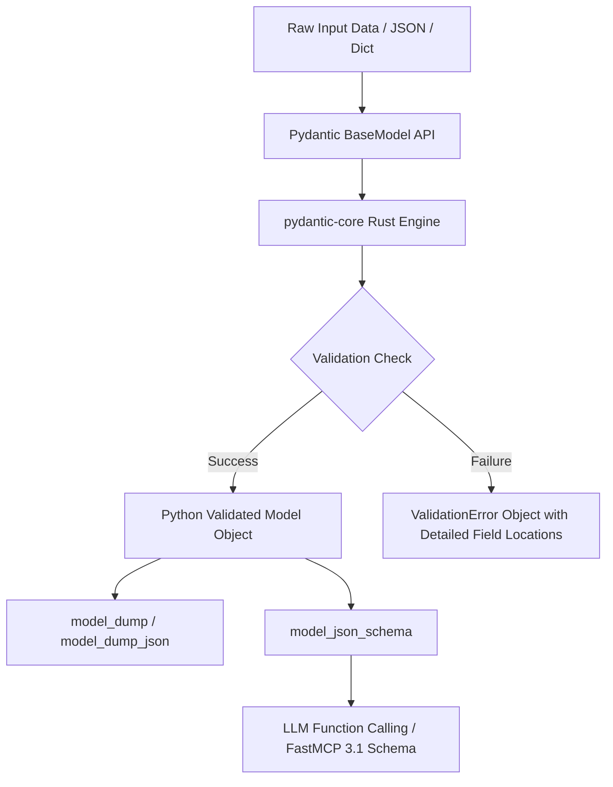

# Pydantic

## What it is
Pydantic is the industry-standard data validation, serialization, and settings management library for Python. Powered by a high-performance C-extension and Rust core (`pydantic-core`), Pydantic enforces type annotations at runtime, provides detailed, user-friendly diagnostic errors when data validation fails, and serializes Python data structures to and from JSON at native speeds.

In modern 2027 AI engineering, autonomous agent development, and Model Context Protocol (FastMCP 3.1) ecosystem designs, Pydantic acts as the universal schema contract engine. It powers structured output generation, agent function calling interfaces, strict payload validation, and system configuration parsing across frameworks like Pydantic AI, FastAPI, Instructor, LangChain, and LlamaIndex.

## What problem it solves
Generative Large Language Models (LLMs) and Vision-Language Models (VLMs) operate probabilistically, producing unstructured text, markdown, or pseudo-JSON strings. Ingesting unvalidated LLM responses directly into downstream application logic leads to parsing exceptions, missing required keys, boundary type errors, and critical runtime failures.

Pydantic solves these challenges by providing:
1. **Deterministic Type Coercion & Validation**: Enforces strict schema constraints, transforming untrusted LLM outputs or raw API payloads into strongly typed, immutable Python objects.
2. **Automated OpenAPI & JSON Schema Generation**: Programmatically translates Python class definitions into standard JSON Schema drafts (`Model.model_json_schema()`), which are consumed directly by LLM function calling APIs (e.g., OpenAI, Anthropic, Gemini, Ollama, LM Studio).
3. **High-Throughput Validation via Rust Core**: Offloads parsing algorithms to compiled Rust primitives, achieving 10x to 50x speedups over traditional pure-Python runtime validation libraries.
4. **FastMCP 3.1 & Agentic Protocol Interoperability**: Serves as the native tool argument validator and serialization engine for Model Context Protocol servers and clients.

## Where it fits in the stack
**Agent Frameworks & Developer Infrastructure / Universal Data Validation & Schemas**. Pydantic operates at the serialization and execution boundary of every tier in modern Python AI stacks:

```
+-----------------------------------------------------------------------+
|                Agent Application & Orchestration Layer                |
|        (Pydantic AI, FastAPI Microservices, Instructor, LangChain)    |
+-----------------------------------------------------------------------+
                                   | (Pydantic Models)
                                   v
+-----------------------------------------------------------------------+
|                            Pydantic Engine                            |
|  +-----------------------------------------------------------------+  |
|  | Python High-Level API (`BaseModel`, `@field_validator`)         |  |
|  +-----------------------------------------------------------------+  |
|  | `pydantic-core` (Rust Validation & Serialization Engine)        |  |
|  +-----------------------------------------------------------------+  |
|  | JSON Schema Generator (`model_json_schema()`)                   |  |
+-----------------------------------------------------------------------+
                                   |
            +----------------------+----------------------+
            | (JSON Schema Input)                         | (Validated Python Objects)
            v                                             v
+-----------------------+                     +-----------------------+
|  LLM Function Calling |                     | Internal App Logic    |
|  (OpenAI, FastMCP)    |                     | (Databases, State)    |
+-----------------------+                     +-----------------------+
```

## Typical use cases
- **Structured LLM Output Parsing**: Guaranteeing that LLM responses match exact nested schemas using OpenAI's `response_format` or Pydantic AI response wrappers.
- **FastMCP 3.1 Tool Definitions**: Automatically generating tool parameters, input validations, and response schemas for Model Context Protocol servers.
- **Microservice API Validation**: Validating REST, gRPC, and WebSocket request/response parameters in FastAPI endpoints for production AI microservices.
- **Enterprise Application Settings**: Managing environment variables, secrets, and connection strings safely using `pydantic-settings`.
- **Synthetic Data Pipeline Generation**: Defining data contracts for multi-stage LLM data processing pipelines with field-level constraints and custom validators.

## Strengths
- **Rust-Powered Core (`pydantic-core`)**: Blazing-fast performance for JSON parsing and serialization, handling tens of thousands of complex model validations per second.
- **Seamless Python Type Annotations**: Works directly with native Python typing features, including generics, unions (`Union`, `|`), literal types, and Annotated types (`Annotated[str, Field(...)]`).
- **Comprehensive Extensibility**: Offers rich customization via `@field_validator`, `@model_validator`, `computed_field`, and custom `GetCoreSchema` implementations.
- **Strict & Lax Validation Modes**: Allows switching between lax mode (which auto-coerces compatible types like string `"123"` to integer `123`) and strict mode (which enforces exact types).
- **Ubiquitous Ecosystem Adoption**: Direct integration with standard Python AI libraries, including FastAPI, Instructor, Pydantic AI, Hugging Face `transformers`, and LangChain.

## Limitations
- **Runtime CPU Footprint on Huge Datasets**: While fast, validating millions of rows per second in data science pipelines can introduce CPU overhead compared to compiled Polars or Arrow C-structs.
- **V1 to V2 Breaking Changes**: Legacy codebases migrating from Pydantic V1 to V2 require updating syntax (e.g., replacing `.dict()` with `.model_dump()` and `@validator` with `@field_validator`).

## When to use it
- When accepting external data from LLM outputs, webhooks, or user input in Python AI applications.
- When creating tools for autonomous agents or FastMCP 3.1 servers.
- When building REST or async APIs with FastAPI where automatic OpenAPI documentation and payload verification are required.

## When not to use it
- For inner-loop GPU tensor allocations or high-frequency numerical computing (use PyTorch tensors or NumPy arrays directly).

## Getting started

### Installation
Install Pydantic V2 alongside settings management:
```bash
pip install pydantic pydantic-settings
```

### Basic Model Definition
```python
from pydantic import BaseModel, Field, EmailStr
from typing import List, Optional

class EnterpriseUser(BaseModel):
    user_id: int = Field(description="Unique internal user ID")
    username: str = Field(min_length=3, max_length=32, description="Display handle")
    email: EmailStr
    department: Optional[str] = Field(default="Engineering")
    roles: List[str] = Field(default_factory=list)

# Instantiate and validate input payload
payload = {
    "user_id": 1001,
    "username": "alex_dev",
    "email": "alex@enterprise.ai",
    "roles": ["admin", "developer"]
}

user = EnterpriseUser.model_validate(payload)
print(f"Validated user: {user.username} ({user.email})")
print("JSON Representation:\n", user.model_dump_json(indent=2))
```

## Architecture / Key Components



### Core Architecture Components
1. **`pydantic-core`**: The Rust validation core compiled into C-Python extension modules, responsible for recursively traversing data structures and applying validator trees.
2. **`BaseModel`**: The base Python class that provides model metadata, lifecycle hooks, serialization methods (`model_dump()`), and JSON Schema export capabilities.
3. **`Field` Metadata**: Allows attaching descriptions, numeric constraints (`ge`, `le`), string pattern regexes, and default factories directly to model attributes.
4. **Validators (`@field_validator`, `@model_validator`)**: Custom Python or C functions triggered during the validation cycle before (pre) or after (post) structural type checking.

## CLI examples
Extracting JSON Schema definitions directly from command-line workflows:

```bash
# Generate JSON Schema for a FastMCP tool argument model
python3 -c "from pydantic import BaseModel, Field;
class SearchArgs(BaseModel):
    query: str = Field(description='Search query string')
    limit: int = Field(default=10, ge=1, le=100);
print(SearchArgs.model_json_schema())"
```

## API examples

The following script demonstrates production usage of Pydantic V2 within a FastMCP 3.1 agentic execution engine, utilizing custom validators, computed fields, strict mode parsing, and dynamic JSON Schema generation:

```python
import json
from typing import List, Optional, Literal
from pydantic import BaseModel, Field, field_validator, model_validator, computed_field, ValidationError

# 1. Define sub-models with field-level constraints
class ResourceAllocation(BaseModel):
    resource_type: Literal["cpu", "gpu_vram", "ram_gb", "storage_gb"]
    amount: float = Field(gt=0.0, description="Amount of resource allocated")
    unit: str = Field(description="Unit of allocation e.g., GB, Cores")

class AgentTaskSpec(BaseModel):
    task_id: str = Field(pattern=r"^TASK-[0-9]{4}$", description="Task ID in format TASK-1234")
    title: str = Field(min_length=5, max_length=100)
    priority: int = Field(default=3, ge=1, le=5, description="Priority scale 1 (Low) to 5 (Critical)")
    allocations: List[ResourceAllocation] = Field(default_factory=list)
    tags: List[str] = Field(default_factory=list)

    @field_validator("tags")
    @classmethod
    def normalize_tags(cls, tags: List[str]) -> List[str]:
        return [t.strip().lower() for t in tags if t.strip()]

    @model_validator(mode="after")
    def validate_high_priority_allocations(self) -> "AgentTaskSpec":
        if self.priority == 5 and not self.allocations:
            raise ValueError("Critical priority tasks (priority 5) must specify at least one resource allocation.")
        return self

    @computed_field
    @property
    def total_memory_gb(self) -> float:
        """Dynamically compute total RAM + VRAM requested."""
        return sum(
            alloc.amount for alloc in self.allocations
            if alloc.resource_type in ("ram_gb", "gpu_vram")
        )

# 2. FastMCP 3.1 Tool Schema Wrapper
class FastMCPToolEnvelope(BaseModel):
    tool_name: str = Field(description="Target FastMCP tool name")
    task_payload: AgentTaskSpec
    execution_timeout_sec: int = Field(default=30, ge=5, le=300)

def process_agent_action():
    raw_llm_json_response = """
    {
        "tool_name": "deploy_agent_worker",
        "task_payload": {
            "task_id": "TASK-8021",
            "title": "Analyze Enterprise Knowledge Vector Index",
            "priority": 5,
            "allocations": [
                {"resource_type": "gpu_vram", "amount": 24.0, "unit": "GB"},
                {"resource_type": "ram_gb", "amount": 64.0, "unit": "GB"}
            ],
            "tags": ["Vector-Search", " RAG ", "DeepSeek "]
        },
        "execution_timeout_sec": 60
    }
    """

    try:
        # Validate raw JSON using Pydantic V2
        envelope = FastMCPToolEnvelope.model_validate_json(raw_llm_json_response)

        print("=== Successfully Parsed Pydantic V2 Object ===")
        print(f"Tool Name: {envelope.tool_name}")
        print(f"Task ID: {envelope.task_payload.task_id}")
        print(f"Normalized Tags: {envelope.task_payload.tags}")
        print(f"Computed Total Memory: {envelope.task_payload.total_memory_gb} GB")

        # Export Schema for FastMCP Tool Registration
        schema = FastMCPToolEnvelope.model_json_schema()
        print("\n=== Exported FastMCP 3.1 JSON Schema ===")
        print(json.dumps(schema, indent=2))

    except ValidationError as e:
        print("Validation Error detected:")
        print(e.json(indent=2))

if __name__ == "__main__":
    process_agent_action()
```

## Related tools / concepts
- [Pydantic AI](pydantic-ai.md)
- [Instructor](instructor.md)
- [FastAPI](fastapi.md)
- [LangChain](langchain.md)
- [LlamaIndex](llama-index.md)

## Sources / references
- [Pydantic Official Documentation](https://docs.pydantic.dev/)
- [Pydantic Core GitHub Repository](https://github.com/pydantic/pydantic-core)
- [FastMCP 3.1 Schema Conventions](https://modelcontextprotocol.io/)

## Contribution Metadata
- Last reviewed: 2027-01-07
- Confidence: high
