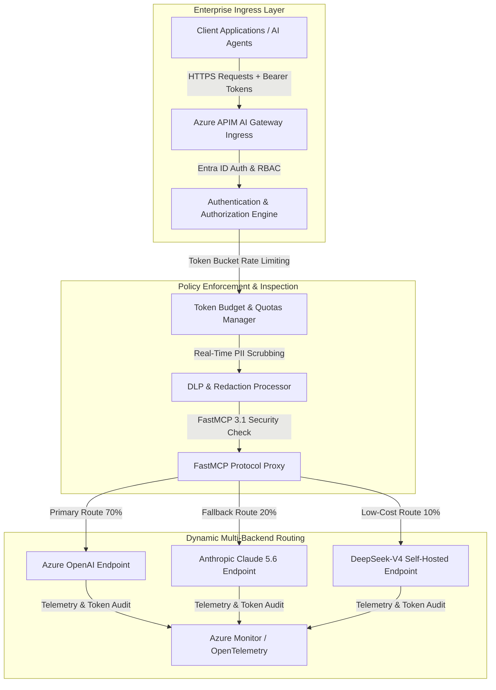

# Azure AI Gateway

## What it is
Azure AI Gateway is an enterprise API Management (APIM) tier designed to govern, secure, load-balance, rate-limit, and audit calls to LLMs, provider endpoints, and Model Context Protocol (FastMCP 3.1) servers. Operating inline at the ingress boundary, it manages credentials, tracks token expenditures, enforces PII data loss prevention rules, and handles dynamic multi-provider routing across models like Claude 5.6, GPT-5.6, Gemini 4.0 Ultra, and DeepSeek-V4. As of early 2027, it serves as a core enterprise control plane for compliance-bound AI workloads running across Azure cloud environments.

## System Architecture



## What problem it solves
Deploying commercial generative AI introduces risks around API availability, provider throttling (HTTP 429), cost overruns, and data leakage. Azure AI Gateway addresses these by providing automated endpoint failover, token-aware rate limiting, real-time PII redaction, and centralized telemetry logging across enterprise multi-model deployments. It eliminates hardcoded API keys in application code and enforces organizational data loss prevention (DLP) policies at the network edge.

## Where it fits in the stack
**Category**: Infrastructure / AI Gateway & API Management. It sits between application clients/agent orchestrators and upstream model providers, securing API traffic and managing execution policies.

## Typical use cases
- **Multi-Provider Load Balancing**: Distributing prompt traffic across Azure OpenAI, Anthropic, and secondary endpoints to maximize throughput and resiliency.
- **Automated Fallback Routing**: Rerouting traffic from throttled or failing endpoints (e.g. failing over from GPT-5.6 to Claude 5.6 or DeepSeek-V4).
- **Token Budget Governance**: Applying user- and team-level token rate limits to manage cloud expenses and prevent unexpected billing spikes.
- **FastMCP 3.1 Gateway Security**: Intercepting and validating outbound tool calls and agent resource access via FastMCP 3.1 protocols.
- **Enterprise DLP & PII Redaction**: Scrubbing sensitive customer identifiers, credit card numbers, and medical data before transmitting prompts to external model providers.

## Strengths
- **Enterprise Security Integration**: Native authentication with Microsoft Entra ID for role-based access control and managed identity support.
- **Sub-Millisecond Policy Overhead**: Low-latency XML/JSON policy enforcement for CORS, rate-limiting, header injection, and payload transforms.
- **Granular Token Telemetry**: Native tracking of prompt and completion tokens routed directly to Azure Monitor, Log Analytics, and OpenTelemetry receivers.
- **FastMCP 3.1 Governance**: Built-in inspection and security validation for MCP tool definitions, resource endpoints, and task payloads.
- **Multi-Region Resiliency**: Automatic global load balancing and zero-downtime health probing across geo-distributed Azure regions.

## Limitations
- **Azure Ecosystem Lock-In**: Requires an active Azure API Management subscription, making air-gapped home-lab deployments non-viable.
- **Policy Configuration Overhead**: Designing multi-backend failover rules requires specialized APIM XML/JSON policy syntax.
- **Cold-Start Policy Latency**: Initial policy compilation during cold APIM provision instances can introduce minor latency spikes.

## When to use it
- When managing enterprise LLM applications requiring multi-region failover and strict compliance auditing.
- For enforcing token quotas and PII scrubbing across multi-team AI initiatives.
- When securing FastMCP 3.1 agent tool execution boundaries in Azure cloud environments.

## When not to use it
- For self-hosted or air-gapped home labs running local runtimes ([Ollama](../infrastructure/ollama.md), [llama.cpp](../infrastructure/llama-cpp.md), [LocalAI](../infrastructure/localai.md)).
- For single-model prototypes where API gateway management adds unnecessary configuration overhead.

## Getting started
1. **Provision Gateway**: Deploy Azure API Management selecting the AI Gateway tier.
2. **Configure Upstream Backends**: Register provider keys in Key Vault and reference them in APIM backends.
3. **Apply Load Balancing Policy**:
   ```xml
   <policies>
       <inbound>
           <base />
           <llm-load-balancer>
               <backend id="openai-primary" weight="70" />
               <backend id="claude-fallback" weight="30" />
           </llm-load-balancer>
           <llm-token-limit counter-key="@(context.Subscription.Id)" tokens-per-minute="100000" />
       </inbound>
   </policies>
   ```

## CLI examples

### Registering APIM Backend
Register an API backend inside Azure AI Gateway using Azure CLI:
```bash
az apim api register-backend \
  --resource-group "rg-ai" \
  --service-name "ai-gateway" \
  --backend-id "openai-primary" \
  --url "https://api.openai.com/v1" \
  --key "sk-..."
```

### Applying Rate-Limiting Policy
Apply token rate-limiting policy to an existing APIM API:
```bash
az apim api policy apply \
  --resource-group "rg-ai" \
  --service-name "ai-gateway" \
  --api-id "llm-api" \
  --policy-file "./policies/token-rate-limit.xml"
```

### Fetching Gateway Telemetry
Retrieve gateway metrics and latency statistics using Azure CLI:
```bash
az monitor metrics list \
  --resource "/subscriptions/sub-123/resourceGroups/rg-ai/providers/Microsoft.ApiManagement/service/ai-gateway" \
  --metric "Requests,Latency,TokenConsumption"
```

## API examples

### FastMCP 3.1 Gateway Integration & Pydantic v2 Telemetry Ingestion
This complete Python example demonstrates fetching, parsing, and auditing token usage telemetry from Azure AI Gateway logs via a **FastMCP 3.1** tool server with **Pydantic v2** validation:

```python
from typing import Optional, List
from mcp.server.fastmcp import FastMCP
from pydantic import BaseModel, Field, ValidationError

# Initialize FastMCP 3.1 Server for Azure AI Gateway Audit
mcp = FastMCP("Azure-AI-Gateway-Audit-Server")

class GatewayUsageMetrics(BaseModel):
    prompt_tokens: int = Field(..., alias="promptTokens", ge=0, description="Prompt token count")
    completion_tokens: int = Field(..., alias="completionTokens", ge=0, description="Completion token count")
    total_tokens: int = Field(..., alias="totalTokens", ge=0, description="Total token consumption")
    latency_ms: float = Field(..., alias="latencyMs", gt=0.0, description="Round-trip latency in ms")

class GatewayLogResponse(BaseModel):
    gateway_id: str = Field(..., alias="gatewayId", description="APIM instance identifier")
    client_app_id: str = Field(..., alias="clientAppId", description="Requestor application ID")
    routing_decision: str = Field(..., alias="routingDecision", description="Selected backend endpoint")
    mcp_protocol_version: str = Field(default="3.1", description="FastMCP protocol standard")
    usage: GatewayUsageMetrics = Field(..., description="Token usage metrics")

@mcp.tool()
def audit_gateway_telemetry(log_payload: dict) -> dict:
    """Validate and audit raw Azure AI Gateway log telemetry using Pydantic v2."""
    try:
        parsed_log = GatewayLogResponse.model_validate(log_payload)

        # Audit logic: check if total tokens exceed alert threshold
        token_alert = parsed_log.usage.total_tokens > 5000

        return {
            "status": "audited",
            "gateway": parsed_log.gateway_id,
            "app_id": parsed_log.client_app_id,
            "route": parsed_log.routing_decision,
            "total_tokens": parsed_log.usage.total_tokens,
            "latency_ms": parsed_log.usage.latency_ms,
            "alert_triggered": token_alert,
            "mcp_version": parsed_log.mcp_protocol_version
        }
    except ValidationError as err:
        return {"status": "validation_error", "errors": err.errors()}

if __name__ == "__main__":
    # Test local execution
    sample_log = {
        "gatewayId": "azure-apim-ai-westus-01",
        "clientAppId": "agent-runner-v5",
        "routingDecision": "claude-5.6-primary-endpoint",
        "mcpProtocolVersion": "3.1",
        "usage": {
            "promptTokens": 1280,
            "completionTokens": 640,
            "totalTokens": 1920,
            "latencyMs": 182.4
        }
    }

    audit_res = audit_gateway_telemetry(sample_log)
    print("FastMCP Gateway Audit Result:", audit_res)
```

## Related tools / concepts
- [Azure OpenAI](../providers/azure-openai.md) — Enterprise OpenAI service hosted on Azure.
- [Vercel AI Gateway](../providers/vercel-ai-gateway.md) — Edge-hosted multi-provider API gateway.
- [FastMCP 3.1](../automation_orchestration/mcp.md) — Protocol for agent tool and resource governance.
- [Baseten](../providers/baseten.md) — High-performance model serving infrastructure.
- [Portkey](../providers/portkey.md) — AI gateway and observability suite.

## Sources / references
- [Azure API Management AI Gateway Documentation](https://learn.microsoft.com/en-us/azure/api-management/)
- [Microsoft Azure APIM Policy Reference](https://learn.microsoft.com/en-us/azure/api-management/api-management-policies)
- [FastMCP 3.1 Specification](https://modelcontextprotocol.io/)

---
## Contribution Metadata
- Last reviewed: 2027-01-07
- Confidence: high
