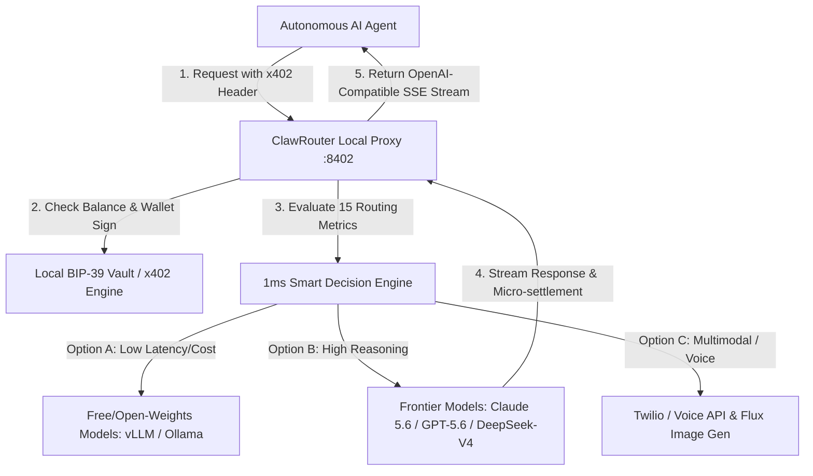

# ClawRouter

## What it is
ClawRouter is an open-source (MIT), agent-native smart LLM router designed for autonomous workflows. It provides a local proxy that analyzes requests across 15 dimensions (cost, latency, reasoning depth, etc.) and routes them to the optimal model in under 1ms.

## What problem it solves
It solves the "autonomous agent payment gap" by using the **x402 protocol** for USDC micropayments and wallet signatures for authentication. This allows agents to operate independently without human-managed API keys, accounts, or credit cards. It also reduces LLM costs by up to 92% through aggressive model routing across frontier models (**Claude 5.6**, **GPT-5.6**, **Gemini 4.0 Ultra**, **DeepSeek-V4**) and local open-weights servers (vLLM, TGI, Ollama).

## Where it fits in the stack
**Infrastructure / Routing Layer**. ClawRouter sits between the AI agent (Claude 5.6, GPT-5.6) and model providers (Anthropic, OpenAI, Google, NVIDIA, etc.), acting as a smart, payment-integrated proxy.



## Typical use cases
- **Autonomous Agent Ops**: Powering agents that need to pay for their own inference via on-chain USDC.
- **Cost-Optimized Coding**: Routing simple code edits to free or low-cost models while using Claude 5.1 for complex architecture.
- **Multi-Modal Orchestration**: Seamlessly switching between specialized models for text, vision, image generation, and voice calls.
- **Agentic Infrastructure**: Providing a local, <1ms routing layer for high-volume agent fleets and FastMCP 3.1 workflows.

## Feature Comparison Matrix

| Feature / Capability | ClawRouter | LiteLLM | OpenRouter | Portkey |
| :--- | :--- | :--- | :--- | :--- |
| **Primary Focus** | Autonomous agent micropayments & smart routing | Model abstraction & enterprise proxy | Hosted API aggregation | Enterprise observability & governance |
| **Authentication** | On-chain wallet signatures (x402) | Static API keys / Virtual keys | API keys | Vault API keys / Service accounts |
| **Billing Model** | Per-request USDC micropayments | Centralized SaaS / Self-hosted provider keys | Deposit account credits | SaaS subscription + usage |
| **Routing Latency** | < 1 ms local execution | < 5 ms local execution | ~50-100 ms cloud hop | ~20-50 ms cloud proxy |
| **Voice / Multimodal** | Native telephony & voice agent routing | LLM text/vision routing only | Text/vision image generation | Text/vision/audio proxying |
| **FastMCP 3.1 Native** | First-class FastMCP 3.1 agent tool backend | Standard REST / OpenAI proxy | REST / OpenAI proxy | REST / Gateway SDK |

## Strengths
- **Agent-First Auth**: Uses wallet signatures instead of API keys, making it truly native to autonomous entities.
- **Cost Efficiency**: Access to 6+ free models (NVIDIA-hosted) and smart routing that targets 90%+ savings.
- **Local & Fast**: Routing logic runs entirely locally with sub-1ms latency and no external routing dependencies.
- **Rich Ecosystem**: Supports 55+ models and integrates features like image generation, video generation, and AI-powered voice calls.
- **Non-Custodial Payments**: Agents pay per-request using USDC via x402 directly from their own local wallets.

## Limitations
- **Ecosystem Focus**: While standalone, its primary integrations are centered around OpenClaw and agent-native environments.
- **Payment Learning Curve**: Requires understanding of USDC micropayments and the x402 protocol for paid tiers.
- **Model Bias**: Routing logic is optimized for agentic workloads, which may differ from general chat requirements.
- **Local Resource Usage**: Running the routing engine and local wallet adds a small memory footprint to the host machine.

## When to use it
- When building autonomous agents that need to manage their own inference costs and payments.
- When model routing is a first-class operational concern for reducing agentic overhead.
- In OpenClaw-heavy stacks where plugin integration provides advanced UI features.

## When not to use it
- When a simpler, provider-agnostic router like [LiteLLM](../../services/litellm.md) is sufficient and payments aren't a priority.
- When you prefer centralized billing and account management over per-request USDC settlement.
- For purely human-driven chat applications where standard API key management is preferred.

## Getting started

To set up ClawRouter in January 2027:

1. **Installation**:
   ```bash
   npx @blockrun/clawrouter
   ```
2. **Wallet Setup**: On first run, a BIP-39 mnemonic and wallet (Base/Solana) are generated. Your address is printed to the console.
3. **Funding**: Optional. Skip for the free tier (6 models). For paid models, send USDC on the Base or Solana network to your address.
4. **Integration**: Point your client (Cursor, Continue, or OpenAI SDK) to `http://localhost:8402/v1/`.

## CLI examples

### Diagnostic Check
Run the "doctor" to verify system, wallet, and network status with AI-powered analysis:

```bash
npx @blockrun/clawrouter doctor
```

### Managing Models
Manually exclude or include models from the smart routing logic:

```bash
# Block expensive models
clawrouter exclude add gpt-5.5-pro
# Verify current exclusions
clawrouter exclude
```

### Phone & Voice Ops
Manage wallet-owned phone numbers for AI voice calls:

```bash
# Buy a US number for agentic calls
clawrouter phone numbers buy US --area-code 415
# List active numbers and expiry
clawrouter phone numbers list
```

## FastMCP 3.1 Integration

The following FastMCP 3.1 server implementation allows autonomous agents to dynamically query ClawRouter status, trigger smart routing decisions, and adjust cost budgets via Model Context Protocol:

```python
import json
import httpx
from pydantic import BaseModel, Field
from mcp.server.fastmcp import FastMCP

mcp = FastMCP("ClawRouter-Control-Plane", version="3.1.0")

CLAWROUTER_BASE_URL = "http://localhost:8402/v1"

class RoutingConfig(BaseModel):
    max_cost_limit_usd: float = Field(0.05, description="Maximum allowed spend in USD per request")
    preferred_provider: str = Field("auto", description="Preferred provider tier or 'auto'")
    latency_sla_ms: int = Field(1500, description="Maximum acceptable latency in ms")

class PromptPayload(BaseModel):
    prompt: str = Field(..., description="User or agent query string")
    system_instruction: str = Field("You are a helpful assistant.", description="System instruction")
    config: RoutingConfig = Field(default_factory=RoutingConfig)

@mcp.tool()
async def route_agent_task(payload: PromptPayload) -> str:
    """Routes an agent task through ClawRouter with x402 micropayment handling."""
    headers = {
        "Content-Type": "application/json",
        "Authorization": "Bearer x402"
    }
    body = {
        "model": "blockrun/auto",
        "messages": [
            {"role": "system", "content": payload.system_instruction},
            {"role": "user", "content": payload.prompt}
        ],
        "metadata": payload.config.model_dump()
    }

    async with httpx.AsyncClient(timeout=30.0) as client:
        response = await client.post(f"{CLAWROUTER_BASE_URL}/chat/completions", json=body, headers=headers)
        if response.status_code == 200:
            res_data = response.json()
            return res_data["choices"][0]["message"]["content"]
        else:
            return f"ClawRouter error ({response.status_code}): {response.text}"

@mcp.tool()
async def get_wallet_telemetry() -> str:
    """Retrieves current USDC balance, active phone numbers, and proxy health."""
    async with httpx.AsyncClient(timeout=5.0) as client:
        try:
            res = await client.get(f"{CLAWROUTER_BASE_URL}/status")
            if res.status_code == 200:
                return json.dumps(res.json(), indent=2)
            return f"Health check failed with status {res.status_code}"
        except Exception as err:
            return f"Failed to reach ClawRouter proxy: {err}"

if __name__ == "__main__":
    mcp.run()
```

## API examples

### Smart Routing Call
The default `blockrun/auto` model automatically selects the best model for each request:

```python
from openai import OpenAI

# ClawRouter local proxy
client = OpenAI(base_url="http://localhost:8402/v1", api_key="x402")

response = client.chat.completions.create(
    model="blockrun/auto",
    messages=[{"role": "user", "content": "Analyze this repo architecture."}]
)
```

### Image Generation (Asynchronous)
Generate high-fidelity images using specialized agent tools:

```bash
curl -X POST http://localhost:8402/v1/images/generations \
  -H "Content-Type: application/json" \
  -d '{
    "model": "flux",
    "prompt": "A futuristic city at sunset, cinematic lighting",
    "size": "1024x1024"
  }'
```

### AI-Powered Voice Call
Initiate a real outbound phone call with automated x402 settlement:

```bash
curl -X POST http://localhost:8402/v1/voice/call \
  -H "Content-Type: application/json" \
  -d '{
    "to": "+14155552671",
    "task": "Confirm the 3pm Thursday meeting.",
    "max_duration": 5
  }'
```

### Programmatic Python Routing & Verification (Pydantic v2)
Verify and check metrics programmatically, enforcing budgets and latency SLAs on self-directed agent runs.

```python
import sys
import time
import requests
from pydantic import BaseModel, Field
from typing import Optional

class RoutingMetadata(BaseModel):
    max_cost_limit_usd: float = Field(default=0.05, ge=0.0, description="Max USD budget per request")
    latency_sla_ms: int = Field(default=1500, ge=100, description="Target max latency in milliseconds")

class ChatMessage(BaseModel):
    role: str
    content: str

class ClawRouterRequest(BaseModel):
    model: str = Field(default="blockrun/auto")
    messages: list[ChatMessage]
    metadata: RoutingMetadata = Field(default_factory=RoutingMetadata)

class UsageInfo(BaseModel):
    estimated_cost_usd: float = Field(default=0.0)

class ChoiceMessage(BaseModel):
    content: str

class Choice(BaseModel):
    message: ChoiceMessage

class ClawRouterResponse(BaseModel):
    model: str
    choices: list[Choice]
    usage: Optional[UsageInfo] = None

def check_clawrouter_health(base_url: str = "http://localhost:8402/v1") -> bool:
    try:
        response = requests.get(f"{base_url}/status", timeout=3)
        if response.status_code == 200:
            status_data = response.json()
            balance = status_data.get("wallet", {}).get("usdc_balance", 0.0)
            network = status_data.get("wallet", {}).get("network", "unknown")
            print(f"ClawRouter is LIVE. Network: {network}. Wallet Balance: {balance} USDC.")
            return True
        return False
    except requests.exceptions.RequestException:
        print("ClawRouter offline or unreachable.")
        return False

def route_with_clawrouter(prompt: str, base_url: str = "http://localhost:8402/v1") -> str:
    headers = {
        "Content-Type": "application/json",
        "Authorization": "Bearer x402"
    }

    req = ClawRouterRequest(
        messages=[ChatMessage(role="user", content=prompt)],
        metadata=RoutingMetadata(max_cost_limit_usd=0.05, latency_sla_ms=1500)
    )

    try:
        start_time = time.time()
        res = requests.post(f"{base_url}/chat/completions", json=req.model_dump(), headers=headers, timeout=10)
        elapsed = time.time() - start_time

        if res.status_code == 200:
            data = ClawRouterResponse.model_validate(res.json())
            completion = data.choices[0].message.content
            cost = data.usage.estimated_cost_usd if data.usage else 0.0
            print(f"Routed to '{data.model}' in {elapsed:.3f}s. Cost: {cost} USDC.")
            return completion
        else:
            print(f"Routing failed: {res.status_code} - {res.text}")
            return ""
    except Exception as e:
        print(f"Routing error: {e}")
        return ""

if __name__ == "__main__":
    if check_clawrouter_health():
        completion = route_with_clawrouter("Draft a python script to calculate Fibonacci series.")
        if completion:
            print(f"Response: {completion[:100]}...")
    else:
        print("Running fallback diagnostics. Ensure 'npx @blockrun/clawrouter' is running locally.")
```

## Operational Best Practices & Troubleshooting

### Wallet Security & Key Management
- **Mnemonic Backup**: Always store the BIP-39 seed phrase generated during `npx @blockrun/clawrouter` in an encrypted password manager or secure vault (`/etc/clawrouter/vault.json`).
- **Low Balance Automation**: Implement automated balance alerts when USDC falls below threshold limits to prevent agent execution halts during long-running batch operations.

### Local Proxy High-Availability
- **Systemd Service Setup**: Run ClawRouter as a background daemon on agent host instances:
  ```ini
  [Unit]
  Description=ClawRouter Agent Proxy
  After=network.target

  [Service]
  ExecStart=/usr/bin/npx @blockrun/clawrouter daemon
  Restart=always
  User=agent
  Environment=CLAWROUTER_PORT=8402

  [Install]
  WantedBy=multi-user.target
  ```
- **Fallback Configurations**: Keep standard provider keys (OpenAI / Anthropic) configured in secondary SDK fallbacks in case local x402 proxy instances undergo maintenance or experience network partition.

## Related tools / concepts
- [OpenClaw](../development_ops/openclaw.md)
- [LiteLLM](../../services/litellm.md)
- [OpenRouter](../ai_knowledge/openrouter.md)
- [Claude 5.6](../providers/anthropic.md)
- [GPT-5.6](../ai_knowledge/openai.md)
- [Llama 4 Maverick](../providers/nvidia.md)
- [Model Context Protocol (MCP)](../automation_orchestration/mcp.md)
- [Aider](../development_ops/aider.md)
- [Zed](../development_ops/zed.md)

## Sources / References
- [GitHub Repository](https://github.com/BlockRunAI/ClawRouter)
- [x402 Protocol Specification](https://x402.org)

## Contribution Metadata
- Last reviewed: 2027-01-07
- Confidence: high
