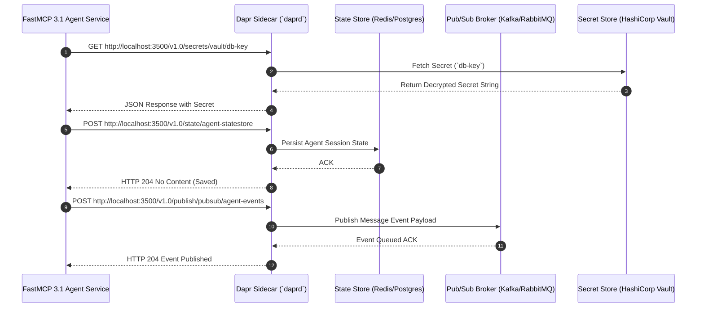

# Dapr (Distributed Application Runtime)

## What it is
Dapr (Distributed Application Runtime) is an open-source, portable, event-driven runtime that simplifies building resilient, microservices-based, and distributed multi-agent application topologies. Exposed via HTTP/1.1 and gRPC sidecar proxies (`daprd`), Dapr provides declarative building block APIs—including State Management, Service-to-Service Invocation, Pub/Sub Eventing, Workflow Orchestration, Secrets Management, Cryptography, Distributed Locking, and Jobs Scheduler—decoupling microservice application logic from underlying cloud provider platforms and messaging infrastructure.

In modern 2027 enterprise infrastructure, edge deployments, Kubernetes clusters (K3s), and distributed FastMCP 3.1 AI agent networks, Dapr acts as a universal cloud-native integration layer. It allows developers to construct polyglot AI microservices that communicate securely via mTLS, maintain resilient distributed memory stores, and route events dynamically across hybrid multi-cloud environments.

## What problem it solves
Developing resilient microservices, asynchronous data processing pipelines, and multi-agent LLM systems requires write-heavy boilerplate code to manage state serialization, retry policies, circuit breakers, service discovery, pub/sub topic routing, secret storage, and distributed locking primitives. Furthermore, hardcoding SDK dependencies for specific message brokers (e.g., Apache Kafka, RabbitMQ, AWS SQS) or databases (e.g., Redis, PostgreSQL, MongoDB, Cassandra) creates vendor lock-in and impedes portability.

Dapr solves these systemic challenges by:
1. **Sidecar API Abstraction**: Decoupling infrastructure capabilities into standard sidecar API contracts accessible from any programming language via HTTP or gRPC.
2. **Pluggable Declarative Components**: Allowing operators to swap state stores, pub/sub brokers, and secret vaults using standard Kubernetes YAML resource manifests without modifying a single line of application code.
3. **Built-in Enterprise Resiliency**: Automatically enforcing mTLS zero-trust communication, circuit breaking, backoff retry policies, and OpenTelemetry tracing across all inter-service calls.
4. **Resilient AI Agent State & Workflows**: Providing distributed actors and durable workflows that persist agent memory and context across long-running multi-step reasoning chains.

## Where it fits in the stack
**Infrastructure / Distributed Middleware & Service Mesh Abstraction**. Dapr operates as an execution sidecar process (`daprd`) running alongside containerized applications in Docker Compose or Kubernetes (K3s/EKS/AKS/GKE) pods:

```
+-----------------------------------------------------------------------+
|                     Application / Agent Microservice                  |
|          (Python FastMCP 3.1 Server, Node.js App, Go Service)         |
+-----------------------------------------------------------------------+
                                   | (gRPC / HTTP Loopback :3500)
                                   v
+-----------------------------------------------------------------------+
|                          Dapr Sidecar (`daprd`)                       |
|  +-----------------------------------------------------------------+  |
|  | State API | Pub/Sub API | Service Invocation | Workflows | Lock  |  |
|  +-----------------------------------------------------------------+  |
|  | Resiliency Policies (Circuit Breakers, Retries, Timeout)        |  |
|  +-----------------------------------------------------------------+  |
|  | mTLS Security Engine & OpenTelemetry Distributed Tracing         |  |
+-----------------------------------------------------------------------+
                                   |
         +-------------------------+-------------------------+
         | (Pluggable YAML Drivers)| (Pluggable YAML Drivers)
         v                         v                         v
+------------------+     +-------------------+     +-------------------+
| State Store      |     | Pub/Sub Broker    |     | Secret Store      |
| (Redis / Postgres|     | (Kafka / RabbitMQ |     | (Vault / AWS Kms  |
| / Vector DBs)    |     | / Azure EventHub) |     | / Azure KeyVault) |
+------------------+     +-------------------+     +-------------------+
```

## Typical use cases
- **Multi-Agent Distributed Memory & State Persistence**: Storing multi-turn agent execution context, conversation memory, and vector metadata across heterogeneous LLM worker nodes via the Dapr State Management API.
- **Asynchronous Event-Driven AI Pipelines**: Triggering downstream document chunking, embedding generation, and vector database indexing tasks asynchronously via Dapr Pub/Sub messaging.
- **Microservice Service Discovery & Zero-Trust Resiliency**: Enabling secure, mTLS-encrypted inter-service RPC with automatic retries and circuit breakers across K3s Kubernetes edge clusters.
- **Long-Running Agentic Workflows**: Orchestrating complex human-in-the-loop reasoning chains, external web scraping jobs, and database sync operations using Dapr Durable Workflows.
- **Distributed Lock Management for Shared AI Compute**: Coordinating exclusive access to specialized hardware resources (e.g., discrete GPU inference locks) using the Dapr Distributed Lock API.

## Strengths
- **Polyglot & Language Agnostic**: Exposed via standard HTTP/1.1 REST and gRPC interfaces, making it natively accessible from Python, Rust, Go, TypeScript, C++, or C#.
- **Zero Vendor Lock-in**: Swap backend state databases, message queues, and key vaults seamlessly by changing YAML component specs.
- **Out-of-the-Box Observability & Security**: Built-in W3C trace context propagation (OpenTelemetry) and automatic SPIFFE/SPIRE mTLS certificate rotation for microservice-to-microservice traffic.
- **FastMCP 3.1 & Agent Interoperability**: Serves as a resilient RPC and event backbone for distributed FastMCP 3.1 tool servers across edge locations.
- **Virtual Actor Pattern**: Provides a robust actor model implementation for managing concurrency and state isolations per active agent or user session.

## Limitations
- **Sidecar Resource Overhead**: Requires running a `daprd` sidecar container alongside each application pod, adding ~20MB-30MB RAM and minor CPU overhead per instance.
- **Component Schema Complexity**: Operators must manage Dapr YAML Component specifications, CRDs, and resiliency policies within Kubernetes deployment pipelines.
- **Asynchronous Ordering Nuances**: Distributed pub/sub processing requires designing application handlers to handle out-of-order or duplicate message delivery gracefully.

## When to use it
- When building distributed microservices or multi-agent AI execution networks on Kubernetes (K3s/EKS) or Docker Compose.
- When abstracting application code from specific cloud vendor state stores, key vaults, or message queues.
- When orchestrating event-driven agent workflows requiring built-in retries, circuit breaking, and OpenTelemetry tracing.

## When not to use it
- For monolithic, single-process desktop applications running on a single local server without microservice boundaries.
- In severely memory-constrained embedded IoT microcontrollers where running sidecar processes is unfeasible.

## Getting started

### Installation & Initialization
Install the Dapr CLI and initialize local standalone components:

```bash
# Download and install Dapr CLI on Linux/macOS
wget -q https://raw.githubusercontent.com/dapr/cli/master/install/install.sh -O - | bash

# Initialize Dapr local environment (launches default Redis state/pubsub containers and Zipkin)
dapr init

# Verify installed Dapr runtime version and CLI
dapr --version
```

### Declarative Component Configuration (`components/statestore.yaml`)
Create a Dapr State Store component targeting Redis or PostgreSQL:

```yaml
apiVersion: dapr.io/v1alpha1
kind: Component
metadata:
  name: agent-statestore
spec:
  type: state.redis
  version: v1
  metadata:
  - name: redisHost
    value: localhost:6379
  - name: redisPassword
    value: ""
  - name: keyPrefix
    value: name
```

## Architecture / Key Components



### Core Architecture Components
1. **`daprd` Engine**: The core C++/Go compiled sidecar daemon responsible for API endpoint binding, component driver execution, mTLS encryption, and telemetry reporting.
2. **Pluggable Components Engine**: Extensible middleware interface handling state stores, pub/sub brokers, secret stores, bindings, and locks.
3. **Placement Service**: Manages virtual actor placement and health status across cluster nodes.
4. **Sentry Service**: Acts as the Certificate Authority (CA) delivering mTLS identities and TLS certificates to all running Dapr sidecars.

## CLI examples
Running applications with Dapr sidecars, publishing events, and managing state directly from CLI:

```bash
# Launch a Python worker application with a Dapr sidecar listening on HTTP port 3500
dapr run --app-id agent-worker \
  --app-port 5000 \
  --dapr-http-port 3500 \
  --components-path ./components \
  python3 app.py

# Save state directly via the Dapr HTTP Sidecar API
curl -X POST http://localhost:3500/v1.0/state/agent-statestore \
  -H "Content-Type: application/json" \
  -d '[
        {
          "key": "session_8842",
          "value": {
            "agent_id": "fastmcp-worker-1",
            "status": "PROCESSING",
            "active_tool": "web_search"
          }
        }
      ]'

# Query state via Dapr Sidecar API
curl http://localhost:3500/v1.0/state/agent-statestore/session_8842

# Publish an event to topic 'task-notifications'
dapr publish --pubsub pubsub --topic task-notifications --data '{"task_id": "TASK-101", "status": "COMPLETED"}'
```

## API examples

The following Python script demonstrates integrating Dapr state management, pub/sub event publishing, and secrets retrieval within a FastMCP 3.1 agentic microservice using Pydantic V2 data validation models and the `dapr-sdk`:

```python
import os
import json
from typing import Optional, Dict, Any
from pydantic import BaseModel, Field
from dapr.clients import DaprClient

STATE_STORE = "agent-statestore"
PUB_SUB = "agent-pubsub"
TOPIC_NAME = "agent-execution-events"

class AgentSessionState(BaseModel):
    session_id: str = Field(description="Unique agent execution session ID")
    agent_name: str = Field(default="FastMCP-Dapr-Agent")
    current_step: int = Field(ge=0)
    memory_context: Dict[str, Any] = Field(default_factory=dict)
    is_completed: bool = False

class AgentExecutionEvent(BaseModel):
    event_type: str = Field(description="EVENT_STARTED, STEP_COMPLETED, EVENT_FINISHED")
    session_id: str
    payload: Dict[str, Any]

def execute_dapr_agent_workflow(session_id: str):
    """Demonstrates Dapr Sidecar APIs for State, Pub/Sub, and Secrets."""
    print("Connecting to local Dapr sidecar...")
    with DaprClient() as client:
        # 1. Fetch API secret via Dapr Secrets API
        try:
            secret_resp = client.get_secret(
                store_name="localsecretstore",
                key="openai-api-key"
            )
            api_key = secret_resp.secret.get("openai-api-key", "default_key")
            print(f"Successfully retrieved secret via Dapr Secret API (Length: {len(api_key)})")
        except Exception as e:
            print(f"Secret fetch fallback (standalone mode): {e}")

        # 2. Save Agent Session State
        initial_state = AgentSessionState(
            session_id=session_id,
            current_step=1,
            memory_context={"user_query": "Analyze Dapr architecture with FastMCP"},
            is_completed=False
        )

        client.save_state(
            store_name=STATE_STORE,
            key=session_id,
            value=initial_state.model_dump_json()
        )
        print(f"Saved initial session state for '{session_id}' via Dapr State API.")

        # 3. Publish Execution Event via Dapr Pub/Sub API
        event = AgentExecutionEvent(
            event_type="STEP_COMPLETED",
            session_id=session_id,
            payload={"step": 1, "output": "Parsed user query and fetched secret."}
        )

        client.publish_event(
            pubsub_name=PUB_SUB,
            topic_name=TOPIC_NAME,
            data=event.model_dump_json(),
            data_content_type="application/json"
        )
        print(f"Published event '{event.event_type}' to topic '{TOPIC_NAME}'.")

        # 4. Read back and validate state using Pydantic V2
        state_response = client.get_state(store_name=STATE_STORE, key=session_id)
        if state_response.data:
            raw_state = json.loads(state_response.data.decode("utf-8"))
            validated_state = AgentSessionState.model_validate(raw_state)
            print("\n=== Verified Persisted State ===")
            print(f"Session ID: {validated_state.session_id}")
            print(f"Current Step: {validated_state.current_step}")
            print(f"Context: {validated_state.memory_context}")

if __name__ == "__main__":
    execute_dapr_agent_workflow("SESSION-2027-X89")
```

## Related tools / concepts
- [Diagrid Catalyst](diagrid-catalyst.md)
- [Kubernetes (K3s)](k3s.md)
- [Docker](docker.md)
- [Temporal](../orchestration/temporal.md)
- [Argo Workflows](../orchestration/argo-workflows.md)
- [OpenTelemetry Collector](../process_understanding/opentelemetry-collector.md)
- [HashiCorp Vault](../automation_orchestration/hashicorp-vault.md)

## Sources / references
- [Dapr Official Documentation](https://dapr.io/)
- [Dapr GitHub Repository](https://github.com/dapr/dapr)
- [Dapr Component Specifications](https://docs.dapr.io/reference/components-reference/)

## Contribution Metadata
- Last reviewed: 2027-01-07
- Confidence: high
