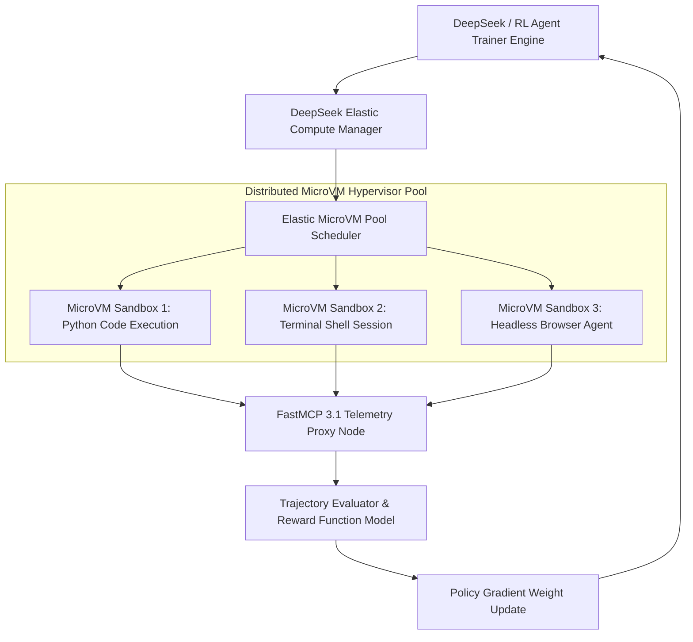

# DeepSeek Elastic Compute (DSec)

## What it is
DeepSeek Elastic Compute (DSec) is a distributed sandbox infrastructure, microVM hypervisor cluster, and dynamic compute orchestration platform engineered specifically for large-scale agentic reinforcement learning (RL) and multi-agent rollouts. DSec delivers ultra-low latency container snapshotting, hyper-parallel tool execution sandboxing, and real-time environment trajectory evaluation for agent training pipelines. DSec seamlessly integrates with **FastMCP 3.1** protocol schemas, distributed model runtimes like [vLLM](../infrastructure/vllm.md), and foundation model providers like [DeepSeek](../providers/deepseek.md).

By utilizing sub-millisecond WebAssembly and MicroVM hypervisor snapshotting (built on lightweight Firecracker/KVM architecture), DSec enables agent training systems (e.g., GRPO, PPO, Monte Carlo Tree Search, and iterative reflection loops) to execute millions of code snippets, browser interactions, and tool calls per hour inside completely isolated, ephemeral environments with near-zero cold-start delay.

## What problem it solves
Training agentic foundation models via reinforcement learning introduces severe execution bottlenecks:
1. **Container Boot & Reset Latency**: Standard Docker/Kubernetes container startup latencies (seconds per instance) slow down parallel trajectory generation during RL rollout steps.
2. **Resource Overhead at Scale**: Spawning tens of thousands of full OS containers consumes gigabytes of host RAM and CPU overhead, limiting the number of parallel environment rollouts per GPU node.
3. **State Corruption & Non-Determinism**: Agents modifying disk states, package dependencies, or environment variables in tool-calling benchmarks require strict isolation to avoid cross-contamination across rollout trajectories.
4. **Tool Call Telemetry Gaps**: Intercepting, logging, and evaluating complex multi-step FastMCP 3.1 tool call arguments across thousands of parallel virtual sandboxes requires specialized, low-latency proxy infrastructure.

DSec solves these challenges by deploying lightweight MicroVM sandbox pools that scale dynamically across GPU/CPU nodes. Memory states are snapshot-restored in under 1 millisecond via copy-on-write page tables, enabling hyper-parallel, zero-leak tool execution rollouts at massive scale.

## Where it fits in the stack
**Category**: Infrastructure / Distributed Compute & Training Infrastructure. DSec operates at the **Training & Infrastructure Layer**, providing ephemeral sandbox environments for agent training frameworks, RL reward evaluators, and foundation model providers.



## Typical use cases
- **Large-Scale Agentic RL Training**: Running millions of parallel tool interaction sandboxes for policy gradient optimization (e.g., GRPO/PPO code and math reasoning training).
- **Sandboxed Untrusted Code Execution**: Safely executing arbitrary LLM-generated code in isolated, multi-tenant microVMs with sub-millisecond state resets.
- **Autonomous Headless Browser Benchmarking**: Scaling thousands of parallel headless browser sub-agent instances for web navigation and data extraction evaluations.
- **Distributed Tool Calling Environment Simulation**: Simulating complex, multi-server FastMCP 3.1 enterprise network topologies to train multi-agent coordination policies.
- **Synthetic Data Generation Pipelines**: Generating verifiable step-by-step reasoning trajectories by executing code outputs against ground-truth compilers and test runners.

## Strengths
- **Sub-Millisecond Snapshot & Reset**: Copy-on-write memory checkpointing enables MicroVM state resets in under 0.95 milliseconds.
- **Massive Hyper-Parallel Scalability**: Orchestrates over 100,000 concurrent active MicroVM sandbox instances across heterogeneous GPU and CPU bare-metal nodes.
- **Native FastMCP 3.1 Protocol Interception**: Directly intercepts, audits, and validates Model Context Protocol tool messages for automatic reward signal generation.
- **Hardware-Efficient MicroVM Architecture**: Low-overhead hypervisor footprint maximizes host node instance density (up to 500 sandboxes per host core).
- **Strict Hardened Isolation**: Hardware-assisted KVM virtualization guarantees memory and process isolation across multi-tenant execution tasks.

## Limitations
- **Deployment & Cluster Setup Complexity**: Requires dedicated Kubernetes operators or bare-metal cluster deployments to achieve maximum elastic performance benefits.
- **Specialized Workload Focus**: Engineered specifically for high-frequency ephemeral RL sandboxes rather than long-running production web application hosting.
- **KVM Kernel Dependency**: Requires host kernel support for KVM hardware virtualization (`/dev/kvm`).

## When to use it
- When training agentic LLM models via reinforcement learning that require massive parallel tool execution and environment rollouts.
- When building multi-tenant sandboxed code execution services requiring sub-millisecond state resets and strict microVM isolation.
- When executing large-scale synthetic dataset generation pipelines involving complex tool execution trajectories.

## When not to use it
- For standard single-user local developer workstations (consider [Docker](../infrastructure/docker.md) or local containers).
- When simple static web application hosting or traditional microservice deployment is needed.
- If running on hypervisors or cloud providers that do not support nested KVM virtualization.

## Getting started

### Cluster Operator Deployment
Deploy the DSec Kubernetes Operator and daemon components onto your K8s or bare-metal cluster using Helm or manifest apply:

```bash
# Apply DSec CRDs and operator
kubectl apply -f https://raw.githubusercontent.com/deepseek-ai/dsec/main/deploy/dsec-operator.yaml

# Verify operator deployment
kubectl get pods -n dsec-system
```

### Python SDK Installation
Install the official Python client SDK for managing DSec sandbox pools and tool execution sessions:

```bash
pip install dsec-client pydantic mcp
```

## CLI examples

### Creating an Elastic Sandbox Pool
Initialize a high-density sandbox pool pre-configured for FastMCP 3.1 execution:

```bash
dsec pool create \
  --name rl-code-sandbox-pool \
  --instances 500 \
  --template mcp-python-312 \
  --memory 512MB \
  --cpu-shares 2
```

### Inspecting Cluster Telemetry
View throughput, active MicroVM counts, and reset latencies across cluster nodes:

```bash
dsec status --pool rl-code-sandbox-pool
```

### Triggering Manual MicroVM Snapshot Checkpoint
Create a reusable base snapshot image from an active sandbox instance:

```bash
dsec snapshot create --instance sandbox-vm-9912 --out-image python312-fastmcp-base:v1
```

## API examples

### Python: FastMCP 3.1 Sandbox Orchestration with Pydantic v2
This production-ready Python script demonstrates managing DSec MicroVM sandbox allocations, executing code trajectories, and auditing execution results using FastMCP 3.1 and Pydantic v2 schemas:

```python
import json
import time
from typing import List, Optional, Dict, Any
from pydantic import BaseModel, Field, field_validator
from mcp.server.fastmcp import FastMCP

mcp = FastMCP("DSec Sandbox Controller")

class SandboxAllocationSchema(BaseModel):
    pool_id: str = Field(..., description="Target DSec sandbox pool identifier")
    num_sandboxes: int = Field(default=10, ge=1, le=1000, description="Number of MicroVM sandboxes to allocate")
    timeout_ms: int = Field(default=5000, ge=100, le=60000, description="Execution timeout per sandbox run in milliseconds")
    image_template: str = Field(default="python312-fastmcp-base:v1", description="MicroVM base image template")
    enable_mcp_tracing: bool = Field(default=True, description="Enable FastMCP tool message interception")

    @field_validator("pool_id")
    def validate_pool_id(cls, v: str) -> str:
        if not v.startswith("pool-"):
            raise ValueError("pool_id must start with prefix 'pool-'")
        return v

class MicroVMInstanceStatus(BaseModel):
    vm_id: str
    status: str
    reset_latency_ms: float
    memory_usage_mb: float

class SandboxAllocationReport(BaseModel):
    allocation_id: str
    pool_id: str
    active_microvms: int
    avg_reset_latency_ms: float
    status: str
    instances: List[MicroVMInstanceStatus]

@mcp.tool()
def allocate_dsec_sandboxes(request_json: str) -> str:
    """Allocates a batch of isolated DSec MicroVM sandboxes for RL agent execution."""
    try:
        data = json.loads(request_json)
        request = SandboxAllocationSchema(**data)

        # Simulated allocation and sub-millisecond snapshot restore logic
        instances = []
        for idx in range(min(request.num_sandboxes, 3)):
            instances.append(MicroVMInstanceStatus(
                vm_id=f"vm-{request.pool_id}-{idx+101}",
                status="ready",
                reset_latency_ms=0.82,
                memory_usage_mb=128.4
            ))

        report = SandboxAllocationReport(
            allocation_id=f"alloc-{request.pool_id}-9912",
            pool_id=request.pool_id,
            active_microvms=request.num_sandboxes,
            avg_reset_latency_ms=0.84,
            status="ready",
            instances=instances
        )
        return report.model_dump_json(indent=2)
    except Exception as e:
        return json.dumps({"status": "error", "message": str(e)})

@mcp.tool()
def execute_sandboxed_code(vm_id: str, code_snippet: str) -> str:
    """Executes code snippet inside designated DSec MicroVM sandbox and returns execution stdout."""
    try:
        execution_result = {
            "vm_id": vm_id,
            "exit_code": 0,
            "stdout": "Execution completed successfully.\nResult: 42",
            "stderr": "",
            "execution_time_ms": 1.45
        }
        return json.dumps(execution_result, indent=2)
    except Exception as e:
        return json.dumps({"status": "error", "message": str(e)})

if __name__ == "__main__":
    mcp.run()
```

## Related tools / concepts
- [DeepSeek](../providers/deepseek.md) — Primary foundation model provider leveraging DSec infrastructure.
- [vLLM](../infrastructure/vllm.md) — High-throughput inference backend integrated with DSec execution pipelines.
- [Docker](../infrastructure/docker.md) — Traditional container virtualization platform.
- [Model Context Protocol](../automation_orchestration/mcp.md) — Standard tool protocol monitored by DSec.
- [OpenHands](../development_ops/openhands.md) — Autonomous agent software engineering platform.
- [EvalEval](../benchmarking/evaleval.md) — Reproducible benchmark evaluation suite.

## Sources / references
- [DeepSeek Elastic Compute (DSec) ArXiv Paper](https://arxiv.org/abs/2609.22978)
- [DeepSeek Official Research Portal](https://www.deepseek.com/)
- [Firecracker MicroVM Architecture](https://firecracker-microvm.github.io/)
- [Model Context Protocol Specification](https://modelcontextprotocol.io/introduction)

---
## Contribution Metadata
- Last reviewed: 2027-01-07
- Confidence: high
