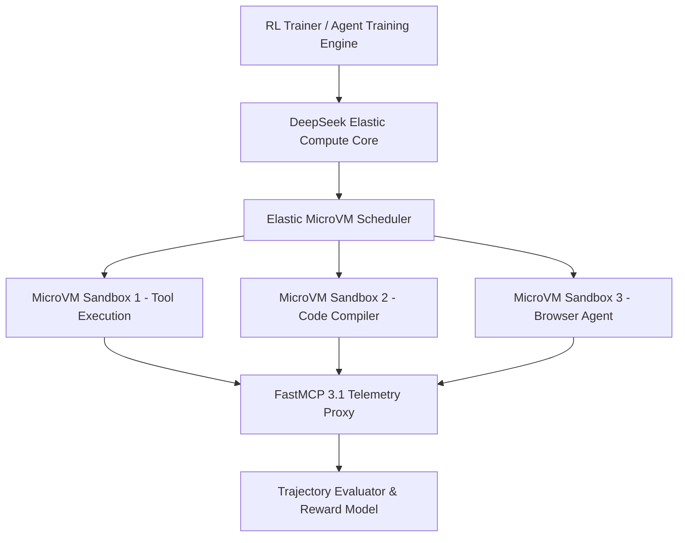

# DeepSeek Elastic Compute (DSec)

## What it is
DeepSeek Elastic Compute (DSec) is a distributed sandbox infrastructure and compute platform designed specifically for large-scale agentic reinforcement learning (RL) and multi-agent training. As of early 2027, DSec provides elastic environment orchestration, high-throughput tool execution sandboxing, and ultra-low latency snapshotting for agent training pipelines. DSec seamlessly integrates with **FastMCP 3.1** protocol schemas and distributed model runtimes like [vLLM](../infrastructure/vllm.md) and [DeepSeek](../providers/deepseek.md).

## What problem it solves
Training agentic LLMs via reinforcement learning (e.g., GRPO, PPO, or Monte Carlo Tree Search) requires executing millions of code snippets, browser interactions, and tool calls per hour inside isolated, reproducible environments. Traditional container runtimes suffer from boot latency and high memory overhead. DSec solves this by utilizing lightweight WebAssembly/MicroVM sandbox pools that scale dynamically, allowing sub-millisecond container snapshotting and hyper-parallel tool trajectory evaluations.

## Where it fits in the stack
**Category**: Infrastructure / Distributed Compute & Training. DSec operates at the **Training & Infrastructure Layer**, providing execution environments for agent training frameworks and model providers.



## Typical use cases
- **Large-Scale Agentic RL Training**: Executing millions of parallel tool interaction sandboxes for policy gradient optimization.
- **Sandboxed Code Execution**: Running untrusted LLM-generated code safely in multi-tenant environments with microsecond state resets.
- **Autonomous Browser Benchmarking**: Scaling headless browser sub-agent evaluations across thousands of parallel virtual nodes.
- **Distributed Tool Calling Simulation**: Simulating complex FastMCP 3.1 enterprise network environments to train multi-agent coordination policies.

## Strengths
- **Sub-Millisecond Snapshotting**: Copy-on-write memory checkpointing for near-instant sandbox resets during RL trajectory rolls.
- **Massive Scalability**: Orchestrates over 100,000 concurrent sandbox instances across heterogeneous GPU/CPU clusters.
- **Native FastMCP 3.1 Telemetry**: Directly intercepts and audits Model Context Protocol tool messages for reward generation.
- **Hardware Efficient**: Low overhead MicroVM hypervisor footprint maximizes host node capacity.

## Limitations
- **High Setup Complexity**: Requires multi-node Kubernetes or Bare Metal cluster setups for full elastic scaling benefits.
- **Specialized Workloads**: Optimized primarily for agent RL environments rather than general web app hosting.

## When to use it
- When training agentic LLM models via RL that require massive parallel tool execution and environment rollouts.
- When building multi-tenant sandboxed code execution services requiring strict microVM isolation.
- When running large-scale synthetic dataset generation pipelines involving complex tool execution trajectories.

## When not to use it
- For standard single-user developer workstations (consider [Docker](../infrastructure/docker.md) or local containers).
- When a simple static web application server or microservice deployment is needed.

## Getting started

### Cluster Prerequisite Setup
Deploy DSec daemon components onto your Kubernetes or bare-metal cluster using Helm or direct manifest apply:

```bash
kubectl apply -f https://raw.githubusercontent.com/deepseek-ai/dsec/main/deploy/dsec-operator.yaml
```

### Python SDK Installation
Install the official Python client for interacting with DSec sandbox clusters:
```bash
pip install dsec-client pydantic mcp
```

## CLI examples

### Creating an Elastic Sandbox Pool
Initialize a sandbox pool configured for FastMCP 3.1 execution:
```bash
dsec pool create --name rl-agent-pool --instances 500 --template mcp-python-312
```

### Auditing Active Sandbox Telemetry
View throughput and execution latencies across cluster nodes:
```bash
dsec status --pool rl-agent-pool
```

## API examples

### Python: FastMCP 3.1 Sandbox Orchestration with Pydantic v2
This production-ready Python script demonstrates managing DSec MicroVM sandbox allocations and auditing execution results using FastMCP 3.1 and Pydantic v2:

```python
import json
from pydantic import BaseModel, Field
from mcp.server.fastmcp import FastMCP

mcp = FastMCP("DSec Sandbox Controller")

class SandboxAllocationSchema(BaseModel):
    pool_id: str = Field(..., description="Target sandbox pool identifier")
    num_sandboxes: int = Field(default=10, ge=1, le=1000)
    timeout_ms: int = Field(default=5000, ge=100, le=60000)
    enable_mcp_tracing: bool = Field(default=True)

class SandboxStatusReport(BaseModel):
    allocation_id: str
    active_microvms: int
    avg_reset_latency_ms: float
    status: str

@mcp.tool()
def allocate_dsec_sandboxes(request_json: str) -> str:
    """Allocates a batch of isolated DSec MicroVM sandboxes for agent execution."""
    try:
        data = json.loads(request_json)
        request = SandboxAllocationSchema(**data)

        # Simulated DSec sandbox allocation logic
        report = SandboxStatusReport(
            allocation_id=f"alloc-{request.pool_id}-9912",
            active_microvms=request.num_sandboxes,
            avg_reset_latency_ms=0.84,
            status="ready"
        )
        return report.model_dump_json(indent=2)
    except Exception as e:
        return json.dumps({"status": "error", "message": str(e)})

if __name__ == "__main__":
    mcp.run()
```

## Related tools / concepts
- [DeepSeek](../providers/deepseek.md) — Primary foundation model provider leveraging DSec.
- [vLLM](../infrastructure/vllm.md) — High-throughput inference backend integrated with DSec.
- [Docker](../infrastructure/docker.md) — Container virtualization engine.
- [Model Context Protocol](../automation_orchestration/mcp.md) — Standard tool protocol monitored by DSec.
- [OpenHands](../development_ops/openhands.md) — Autonomous agent software engineering framework.

## Sources / references
- [DeepSeek Elastic Compute (DSec) ArXiv Paper](https://arxiv.org/abs/2609.22978)
- [DeepSeek Official Research Portal](https://www.deepseek.com/)
- [Model Context Protocol Specification](https://modelcontextprotocol.io/introduction)

---
## Contribution Metadata
- Last reviewed: 2027-01-07
- Confidence: high
