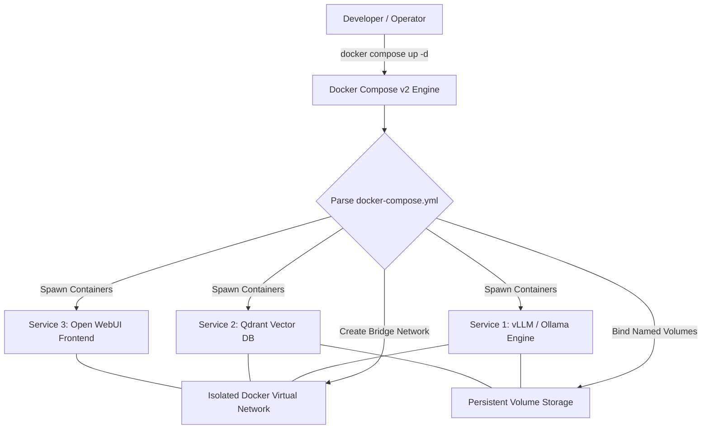

# Docker Compose

## What it is
Docker Compose is a declarative container orchestration tool for defining and running multi-container applications using YAML configuration files. As of 2027, Docker Compose v2 (integrated natively into the Docker CLI as `docker compose`) serves as the standard runtime orchestration standard for local microservice topologies, self-hosted AI stacks, edge deployments, and reproducible development environments.



## What problem it solves
Orchestrating multi-service applications manually via isolated `docker run` commands requires writing complex shell scripts with fragile network port bindings, environment variable passing, volume attachments, container startup ordering, and GPU hardware device allocations. Docker Compose solves this operational complexity by allowing developers to declare complete multi-container architectures—including dependencies (`depends_on` with health checks), custom networks, volume mounts, secret files, and hardware acceleration rules—in a single, version-controlled `docker-compose.yml` manifest.

## Where it fits in the stack
**Infrastructure / Container Orchestration**. Docker Compose operates directly on top of the Docker Daemon or Podman container engine, serving as the single-host orchestration layer for local development workstations, home labs, staging servers, and edge IoT devices.

## Typical use cases
- **Multi-Service AI & Local RAG Stacks**: Spinning up connected local inference engines (Ollama, vLLM), vector databases (Qdrant, Milvus, Chroma), and user interfaces (Open WebUI) in unified topologies.
- **FastMCP Server Environments**: Running Model Context Protocol servers alongside supporting caching layers (Redis, Valkey) and relational storage (PostgreSQL).
- **Homelab Application Management**: Managing self-hosted web applications (Nextcloud, Paperless-ngx, Authentik, Immich) with automated restart policies.
- **Reproducible CI/CD Integration Testing**: Spawning ephemeral multi-container environments in GitHub Actions or GitLab CI for integration test runs.

## Strengths
- **Declarative Infrastructure-as-Code**: Defines all service configurations, ports, networks, and environment variables in a readable YAML manifest.
- **Single-Command Stack Lifecycle**: Spawns, monitors, updates, or teardowns complete multi-container applications with single commands (`docker compose up -d`, `docker compose down`).
- **Automatic Service DNS Resolution**: Automatically creates isolated bridge networks where containers communicate seamlessly using service names as hostname DNS targets.
- **Native GPU & Hardware Passthrough**: Provides direct support for allocating NVIDIA CUDA GPUs, Intel Arc GPUs, or host devices directly to designated container services.

## Limitations
- **Single-Host Boundary**: Designed specifically for single-node container orchestration; not designed to replace multi-node production Kubernetes clusters (e.g., K3s, EKS).
- **No Native Cross-Host Auto-Healing**: Lacks multi-node load balancing, cross-host pod rescheduling, and rolling update strategies available in Kubernetes.
- **YAML Configuration Creep**: Large stacks spanning dozens of microservices can result in unwieldy YAML manifests without modular `include:` directive structuring.

## When to use it
- When your application requires multiple interdependent containerized services running on a single developer machine, homelab server, or cloud VM instance.
- When team consistency across development, staging, and edge environments is critical.
- When building self-contained AI stacks that bundle local inference engines with vector stores and FastMCP servers.

## When not to use it
- For enterprise multi-node production clusters requiring advanced ingress routing, service meshes, zero-downtime rolling updates, and horizontal auto-scaling (use Kubernetes/K3s).
- For isolated single-container applications where a simple `docker run` command or systemd unit file is sufficient.

## Getting started

### Installation
Docker Compose v2 comes pre-packaged with Docker Desktop and standard Docker Engine repository packages (`docker-compose-plugin`). Verify installation:

```bash
docker compose version
```

### Declarative `docker-compose.yml` Stack Architecture
Create a `docker-compose.yml` file in your repository root defining a local RAG stack:

```yaml
name: local-ai-stack

services:
  llm-engine:
    image: ollama/ollama:latest
    container_name: local-ollama
    ports:
      - "11434:11434"
    volumes:
      - ollama_storage:/root/.ollama
    deploy:
      resources:
        reservations:
          devices:
            - driver: nvidia
              count: all
              capabilities: [gpu]
    restart: unless-stopped

  vector-db:
    image: qdrant/qdrant:latest
    container_name: local-qdrant
    ports:
      - "6333:6333"
    volumes:
      - qdrant_storage:/qdrant/storage
    healthcheck:
      test: ["CMD", "curl", "-f", "http://localhost:6333/healthz"]
      interval: 10s
      timeout: 5s
      retries: 3
    restart: unless-stopped

volumes:
  ollama_storage:
  qdrant_storage:
```

## CLI examples

```bash
# Start all services defined in docker-compose.yml in detached background mode
docker compose up -d

# Stream real-time logs for all services or a target service
docker compose logs -f llm-engine

# Stop and remove all containers, networks, and ephemeral volumes created by the stack
docker compose down -v

# Rebuild container images before restarting the stack
docker compose up -d --build
```

## API examples

### Python FastMCP 3.1 & Pydantic v2 Docker Compose Stack Manager
The following code snippet demonstrates managing Docker Compose stacks programmatically via Python within a FastMCP 3.1 server with Pydantic v2 schemas:

```python
import subprocess
from typing import List, Optional
from pydantic import BaseModel, Field
from mcp.server.fastmcp import FastMCP

# Define Pydantic v2 schemas for Docker Compose stack management requests and responses
class StackManageRequest(BaseModel):
    compose_file_path: str = Field(default="docker-compose.yml", description="Path to the docker-compose.yml manifest file.")
    action: str = Field(..., description="Action to execute: 'up', 'down', 'restart', or 'status'.")
    build_images: bool = Field(default=False, description="Whether to force rebuild images before starting services.")

class StackServiceStatus(BaseModel):
    service_name: str = Field(..., description="Name of the service defined in compose.")
    container_id: str = Field(..., description="Docker container ID.")
    status: str = Field(..., description="Current running state (e.g., running, exited).")

class StackManageResponse(BaseModel):
    action: str = Field(..., description="Executed action.")
    success: bool = Field(..., description="Whether command executed successfully.")
    output: str = Field(..., description="STDOUT or STDERR from Docker Compose CLI.")
    services: List[StackServiceStatus] = Field(default_factory=list, description="List of container statuses.")

# Initialize FastMCP 3.1 server
mcp = FastMCP("docker-compose-stack-manager")

@mcp.tool()
async def manage_docker_stack(request: StackManageRequest) -> StackManageResponse:
    """Executes lifecycle management commands for Docker Compose multi-container stacks."""
    cmd = ["docker", "compose", "-f", request.compose_file_path]

    if request.action == "up":
        cmd.extend(["up", "-d"])
        if request.build_images:
            cmd.append("--build")
    elif request.action == "down":
        cmd.extend(["down"])
    elif request.action == "restart":
        cmd.extend(["restart"])
    elif request.action == "status":
        cmd.extend(["ps", "--format", "json"])
    else:
        return StackManageResponse(
            action=request.action,
            success=False,
            output=f"Invalid action '{request.action}'. Supported: up, down, restart, status",
            services=[]
        )

    res = subprocess.run(cmd, capture_output=True, text=True)
    success = (res.returncode == 0)
    output = res.stdout if success else res.stderr

    return StackManageResponse(
        action=request.action,
        success=success,
        output=output.strip(),
        services=[]
    )

if __name__ == "__main__":
    mcp.run()
```

## Related tools / concepts
- [Docker](docker.md) — Single-container engine runtime substrate.
- [Podman](podman.md) — Daemonless container engine alternative.
- [K3s](k3s.md) — Lightweight Kubernetes distribution for multi-node production orchestration.

## Sources / references
- [Docker Compose Documentation](https://docs.docker.com/compose/?ref=2026-09-21-audit)
- [Docker Specification Overview](https://docs.docker.com/engine/)

## Contribution Metadata
- Last reviewed: 2027-01-07
- Confidence: high
