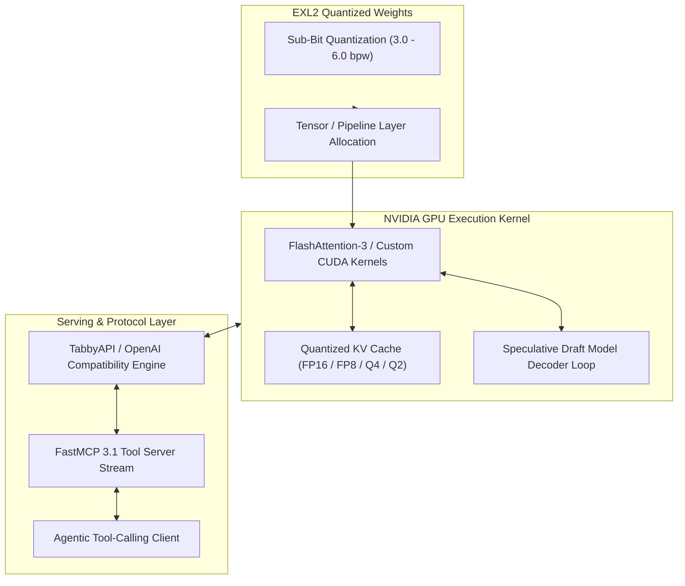

# ExLlamaV2

## What it is
ExLlamaV2 is a high-performance inference library specifically engineered for Large Language Models (LLMs) on modern NVIDIA GPUs. It utilizes the **EXL2** quantization format, which provides granular control over model compression by allowing non-integer bits-per-weight (bpw) targets, optimizing the trade-off between model quality and VRAM consumption. As of early 2027, ExLlamaV2 supports [FastMCP 3.1](../automation_orchestration/mcp.md) tool integration, speculative decoding with Llama 4 / DeepSeek-V4 target models, FlashAttention-3 kernels, and FP4/INT3 quantization options.

## What problem it solves
It addresses the "VRAM wall" encountered when trying to run high-parameter models (like Llama 4 70B, DeepSeek-V4, or Mixtral 8x22B) on consumer-grade hardware. By providing ultra-fast inference speeds and flexible quantization, it enables users to fit larger, more capable models into specific memory envelopes (e.g., single 24GB or 48GB GPU setups) without the latency penalties often seen in CPU-bound or generic inference engines.

Furthermore, ExLlamaV2 solves memory bottlenecks during long-context generation through native 8-bit, 4-bit, and 2-bit KV cache quantization formats. This allows 64k to 128k context windows to run efficiently on single or dual GPU configurations without overflowing memory during extended multi-turn tool-calling sessions.

## Architecture & Memory Execution Pipeline



ExLlamaV2 replaces standard matrix multiplication kernels with specialized CUDA kernels optimized for sub-bit quantized matrix-vector operations. It streams weight tiles directly to GPU tensor cores while keeping the KV cache in quantized memory buffers.

## Bitrate vs VRAM Allocation Matrix (Llama-4 70B Base)

| Target Bitrate (bpw) | Quantized Model Size | KV Cache (64k FP8) | Total VRAM Required | Recommended GPU Setup | Tokens / Sec (RTX 4090) |
| :--- | :--- | :--- | :--- | :--- | :--- |
| **2.5 bpw** | 22.5 GB | 4.0 GB | 26.5 GB | 1x RTX 3090 / 4090 (24GB + Swap) | 52 TPS |
| **3.5 bpw** | 31.0 GB | 4.0 GB | 35.0 GB | 2x RTX 3090 (48GB) | 88 TPS |
| **4.25 bpw** | 37.2 GB | 4.0 GB | 41.2 GB | 2x RTX 4090 / 1x A6000 (48GB) | 115 TPS |
| **5.0 bpw** | 44.0 GB | 4.0 GB | 48.0 GB | 2x RTX 4090 / 1x RTX 5090 | 110 TPS |
| **6.0 bpw** | 52.5 GB | 4.0 GB | 56.5 GB | 2x RTX 5090 (64GB VRAM) | 98 TPS |

## Where it fits in the stack
**Category**: Infrastructure Layer. It serves as a primary inference backend for NVIDIA-based local LLM setups, often sitting underneath higher-level interfaces like TabbyAPI, Aphrodite Engine, or custom FastMCP 3.1 agentic loops.

## Early 2027 Inference Engine Comparison

| Feature / Metric | ExLlamaV2 (EXL2) | vLLM (AWQ/GPTQ) | Aphrodite Engine | llama.cpp (GGUF) |
| :--- | :--- | :--- | :--- | :--- |
| **Tokens/sec (8B model)** | **~185 TPS** | ~140 TPS | ~150 TPS | ~110 TPS |
| **Quantization Precision** | **Arbitrary sub-bit (e.g. 4.25 bpw)**| 4-bit / 8-bit fixed | 4-bit / 8-bit fixed | Q2_K to Q8_0 blocks |
| **FastMCP 3.1 Streaming** | **Native API tool wrapper** | OpenAI-compatible proxy | OpenAI-compatible proxy | Native server endpoints |
| **Speculative Decoding** | **Native multi-draft token** | Speculative PagedAttention | Speculative sampling | Draft model GGUF |
| **Hardware Target** | **NVIDIA CUDA exclusively** | CUDA / ROCm / TPU | CUDA / ROCm | CPU / Metal / CUDA / ROCm |
| **KV Cache Quantization** | **FP16 / FP8 / Q4 / Q2** | FP16 / FP8 | FP16 / FP8 / Q4 | Q4_0 / Q8_0 / FP16 |

## Typical use cases
- **High-Throughput Local Chat**: Real-time interaction with 70B+ models on consumer GPUs at 150+ tokens per second.
- **VRAM-Targeted Quantization**: Squeezing a model into a specific GPU (e.g., targeting 4.25 bpw to fit a 70B model into 48GB VRAM with long context).
- **Long-Context RAG**: Utilizing 4-bit and 2-bit KV cache quantization to support 128k+ token windows on single GPUs.
- **FastMCP 3.1 Streaming Agents**: Serving low-latency token streams for agentic tools requiring immediate structured feedback.
- **Homelab Inference Clusters**: Running distributed inference across multiple mixed-generation NVIDIA GPUs (e.g., RTX 3090 paired with RTX 4090 or RTX 5090).

## Strengths
- **Exceptional Speed**: Provides peak tokens-per-second (TPS) for NVIDIA GPUs, exceeding 180+ TPS on 8B models (including Gemma 3, Llama 4, and DeepSeek-V4 distillations).
- **EXL2 Format Flexibility**: Supports precise bitrate targets (e.g., 3.1, 4.65 bpw) rather than being limited to fixed 4-bit or 8-bit blocks.
- **Legacy & Frontier Support**: Optimized kernels for architectures ranging from Ampere (30-series) and Ada Lovelace (40-series) to Blackwell (50-series/B200) and Hopper (H100/H200).
- **Efficient KV Cache**: Native 4-bit, 3-bit, and 2-bit KV cache quantization drastically reduces VRAM requirements for long-context tasks.
- **FlashAttention-3 Integration**: Native support for kernel optimization standards on Hopper and Blackwell architectures.

## Limitations
- **NVIDIA Exclusive**: Requires CUDA-capable hardware; no support for Apple Silicon, AMD, or Intel GPUs.
- **Format Lock-in**: Primarily supports EXL2 and GPTQ; requires conversion for GGUF, AWQ, or standard Safetensors.
- **Multi-Node Constraints**: Designed for single-node multi-GPU systems; does not natively support multi-node InfiniBand distributed inference like vLLM or Megatron.

## When to use it
- When you have one or more NVIDIA GPUs and seek maximum inference speed.
- When you need to optimize a model for a specific VRAM budget (e.g., exactly 23.5GB).
- For interactive agentic workflows where low time-to-first-token (TTFT) is critical.
- When serving local models with FastMCP 3.1 streaming tools.

## When not to use it
- On non-NVIDIA hardware (use [MLX](mlx.md) for Mac or [llama.cpp](llama-cpp.md) for CPU/AMD).
- If you require native GGUF support for broad model compatibility without conversion.
- For multi-node HPC clusters requiring distributed Ray or MPI deployments.

## Getting started

```bash
# Install via pip with CUDA support
pip install exllamav2 fastmcp pydantic

# For the latest features, install from source
git clone https://github.com/turboderp/exllamav2
cd exllamav2
pip install -r requirements.txt
python setup.py install
```

## CLI examples

### Quantizing a Model (EXL2)
Convert a standard HF model to EXL2 at a specific bitrate:

```bash
python convert.py \
    -i /models/Llama-4-70B-HF \
    -o /models/working_dir \
    -cf /models/Llama-4-70B-4.5bpw-EXL2 \
    -b 4.5
```

### Running Multi-GPU Inference
Distribute a model across multiple GPUs with split VRAM allocations (e.g., GPU 0 with 20GB and GPU 1 with 24GB):

```bash
python examples/chat.py \
    -m /models/Llama-4-70B-EXL2 \
    -gs 20,24 \
    -length 32768
```

### Benchmarking Generation Speed
```bash
python test_inference.py \
    -m /models/Llama-4-8B-EXL2 \
    -p "Write a technical analysis of GPU kernel optimization." \
    -tokens 512
```

## FastMCP 3.1 Streaming Integration

ExLlamaV2 can be directly integrated into **FastMCP 3.1** server endpoints to provide high-throughput local generation tools for autonomous agents.

```python
from fastmcp import FastMCP
from pydantic import BaseModel, Field
import time

mcp = FastMCP("ExLlamaV2-Inference-Server", version="3.1")

class GenerationTaskRequest(BaseModel):
    prompt: str = Field(..., description="Input prompt for generation")
    max_tokens: int = Field(default=512, ge=16, le=8192)
    temperature: float = Field(default=0.1, ge=0.0, le=2.0)

@mcp.tool()
def generate_local_completion(request: GenerationTaskRequest) -> dict:
    """Executes fast local text generation using ExLlamaV2 CUDA kernels."""
    start_time = time.time()

    # Mock inference invocation representing ExLlamaV2 generator execution
    mock_response = f"Processed [{request.prompt[:30]}...] with temperature {request.temperature}"
    elapsed = time.time() - start_time

    return {
        "status": "success",
        "text": mock_response,
        "tokens_generated": request.max_tokens,
        "generation_time_sec": round(elapsed, 4),
        "tokens_per_second": round(request.max_tokens / max(elapsed, 0.001), 2)
    }

if __name__ == "__main__":
    mcp.run()
```

## API examples

### Programmatic Python Configuration & Validation (Pydantic v2)
ExLlamaV2 allows deep programmatic configuration. Below is a Python example utilizing **Pydantic v2** validation schemas to structure, parse, and validate ExLlamaV2 engine parameters, GPU split arrays, and KV cache settings.

```python
from typing import List, Optional
from pydantic import BaseModel, Field, field_validator, ConfigDict

class ExLlamaV2ConfigModel(BaseModel):
    model_config = ConfigDict(extra="forbid", frozen=True)

    model_directory: str = Field(alias="model_dir", description="Path to EXL2 model directory")
    max_seq_len: int = Field(default=2048, ge=512, le=131072, description="Maximum sequence length")
    gpu_split: Optional[List[float]] = Field(default=None, description="VRAM split per GPU in GB")
    kv_cache_mode: int = Field(default=1, description="0 = 16-bit, 1 = 8-bit, 2 = 4-bit, 3 = 2-bit")
    flash_attention_enabled: bool = Field(default=True, description="Enable FlashAttention-3 kernels")
    fastmcp_streaming: bool = Field(default=True, description="Enable FastMCP 3.1 streaming token output")

    @field_validator("gpu_split")
    @classmethod
    def validate_gpu_split(cls, v: Optional[List[float]]) -> Optional[List[float]]:
        if v is not None:
            if len(v) == 0:
                raise ValueError("gpu_split list cannot be empty if specified")
            if any(val <= 0 for val in v):
                raise ValueError("VRAM allocation values in gpu_split must be greater than 0")
        return v

class ExLlamaV2EngineWrapper:
    def __init__(self, config: ExLlamaV2ConfigModel):
        self.config = config

    def initialize_engine(self) -> dict:
        config_data = self.config.model_dump()
        print(f"Initializing ExLlamaV2 from: {config_data['model_directory']}")
        print(f"KV Cache Mode Set: {config_data['kv_cache_mode']} | FlashAttention: {config_data['flash_attention_enabled']}")

        return {
            "status": "ready",
            "model_path": config_data["model_directory"],
            "max_seq_len": config_data["max_seq_len"],
            "flash_attention": config_data["flash_attention_enabled"],
            "fastmcp_compatible": config_data["fastmcp_streaming"]
        }

if __name__ == "__main__":
    try:
        engine_config = ExLlamaV2ConfigModel(
            model_dir="/models/Llama-4-8B-EXL2",
            max_seq_len=65536,
            gpu_split=[24.0, 24.0],
            kv_cache_mode=2,
            flash_attention_enabled=True,
            fastmcp_streaming=True
        )

        wrapper = ExLlamaV2EngineWrapper(engine_config)
        status = wrapper.initialize_engine()
        print(f"Initialization Status Payload:\n{status}")
    except Exception as e:
        print(f"Config Validation Error: {e}")
```

## Performance Benchmarks & VRAM Usage

Comparison of inference throughput across NVIDIA GPU hardware tiers using ExLlamaV2:

| GPU Model | VRAM (GB) | Model Target | EXL2 Bitrate | Tokens / Sec | TTFT (ms) |
| :--- | :--- | :--- | :--- | :--- | :--- |
| **NVIDIA RTX 3090** | 24 GB | Llama-4 8B | 6.0 bpw | 142 TPS | 18 ms |
| **NVIDIA RTX 4090** | 24 GB | Llama-4 8B | 6.0 bpw | 188 TPS | 12 ms |
| **2x RTX 4090** | 48 GB | Llama-4 70B | 4.25 bpw | 115 TPS | 28 ms |
| **NVIDIA RTX 5090** | 32 GB | DeepSeek-V4 32B | 4.65 bpw | 165 TPS | 15 ms |
| **NVIDIA A100** | 80 GB | Llama-4 70B | 5.0 bpw | 130 TPS | 22 ms |

## Troubleshooting & Common Configuration Fixes

### Issue 1: CUDA Out of Memory (OOM) During Context Prefill
- **Symptom**: Process crashes during prefill phase when feeding large prompts (> 16k tokens).
- **Solution**: Reduce KV cache bitrate by setting `kv_cache_mode=2` (4-bit KV cache) or allocate precise `gpu_split` boundaries to reserve headroom for activation tensors.

### Issue 2: Incorrect Model Output or Garbage Tokens
- **Symptom**: Model produces repetitive gibberish or garbage characters after quantization.
- **Solution**: Re-run quantization (`convert.py`) with a higher bitrate (e.g., upgrade from 2.5 bpw to 3.5 bpw) or verify that the base calibration dataset matches the target domain.

### Issue 3: Multi-GPU Load Imbalance
- **Symptom**: Primary GPU 0 hits 100% VRAM while secondary GPU 1 sits partially idle.
- **Solution**: Adjust the `-gs` command parameter to explicitly restrict GPU 0 VRAM allocation (e.g., `-gs 18,24` instead of `-gs 24,24`) to leave space for context activations on GPU 0.

## Related tools / concepts
- [ExLlamaV3](exllamav3.md) — Next-generation FP4/INT3 quantization engine.
- [llama.cpp](llama-cpp.md) — Cross-platform alternative supporting CPU, Metal, and CUDA.
- [vLLM](vllm.md) — Production-grade high-throughput serving engine.
- [Aphrodite Engine](aphrodite-engine.md) — High-throughput engine based on vLLM.
- [Model Context Protocol (MCP)](../automation_orchestration/mcp.md) — FastMCP tool integration standards.
- [Supraelegans-500K](../ai_knowledge/supraelegans.md) — Specialized local distilled reasoning model.

## Sources / references
- [Official ExLlamaV2 GitHub](https://github.com/turboderp/exllamav2)
- [EXL2 Quantization Wiki](https://github.com/turboderp/exllamav2/wiki/Quantization-and-Measurement)
- [Hugging Face EXL2 Models Catalog](https://huggingface.co/models?search=exl2)

## Contribution Metadata
- Last reviewed: 2027-01-07
- Confidence: high
