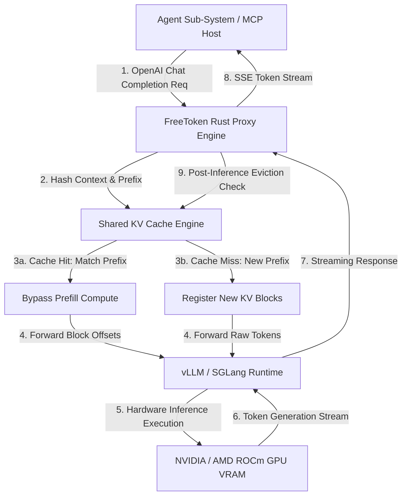

# FreeToken

## What it is
FreeToken is an open-source, high-performance local LLM inference proxy and token-management sidecar daemon designed for zero-latency token recycling, cross-process Key-Value (KV) cache prefix sharing, and dynamic GPU memory (VRAM) optimization. Designed in mid-2026 and widely adopted across enterprise and edge AI deployments in 2027, FreeToken sits directly between AI agent orchestrators and local LLM execution runtimes—such as [vLLM](vllm.md), [SGLang](sglang.md), [llama.cpp](llama-cpp.md), or [Ollama](../../services/ollama.md).

By maintaining shared prefix KV-cache states in GPU and host RAM, FreeToken eliminates redundant prefill phases across multi-agent swarms, lowering Time To First Token (TTFT) by up to 85% for repetitive system prompts and tool schemas.

```
+-----------------------------------------------------------------------------------+
|                           FreeToken Proxy Architecture                            |
+-----------------------------------------------------------------------------------+
|                                                                                   |
|  +-----------------------+                    +--------------------------------+  |
|  | Multi-Agent Swarm     |                    | FreeToken Sidecar Daemon       |  |
|  | - Agent 1 (Planner)   | -- FastMCP 3.1 --> |  - Shared Prefix Token Index   |  |
|  | - Agent 2 (Coder)     |    (OpenAI API)    |  - PagedAttention KV Cache     |  |
|  | - Agent 3 (Auditor)   |                    |  - Dynamic VRAM Reclamation    |  |
|  +-----------------------+                    +---------------+----------------+  |
|                                                               |                   |
|                                                               v                   |
|                                               +--------------------------------+  |
|                                               | Local Inference Backends       |  |
|                                               |  - vLLM Engine Pool            |  |
|                                               |  - llama.cpp / SGLang          |  |
|                                               +---------------+----------------+  |
|                                                               |                   |
|                                                               v                   |
|                                               +--------------------------------+  |
|                                               | Workstation GPU Hardware       |  |
|                                               | (NVIDIA H200/RTX 5090 / ROCm)  |  |
|                                               +--------------------------------+  |
|                                                                                   |
+-----------------------------------------------------------------------------------+
```

## What problem it solves
In modern multi-agent systems and iterative coding pipelines, different AI agents or sub-agent execution loops repeatedly issue requests containing identical context prefixes:
1. **System Prompts**: Lengthy agent instructions, agent persona framing, and security guidelines.
2. **Tool Schemas**: Massive Model Context Protocol (MCP) tool function declarations containing thousands of lines of JSON schema definitions.
3. **Repository Context**: Shared code files, dependency trees, and historical execution context.

Without FreeToken, local LLM serving runtimes must re-process (prefill) these identical prompt prefix tokens for every single request, causing severe GPU compute redundancy, high TTFT latencies, and rapid exhaustion of GPU VRAM due to duplicate KV-cache allocations.

FreeToken solves these problems by:
- **Recycling Prefix Tokens**: Bypassing prefill computation for prompt segments previously processed across any local agent thread.
- **Cross-Process KV-Cache Pooling**: Dynamically mapping shared virtual memory regions across distinct inference processes.
- **Instant VRAM Reclamation**: Purging inactive agent session memory back to host RAM or disk swap within milliseconds of task completion.
- **MCP Schema Aware Caching**: Automatically indexing FastMCP 3.1 tool definitions for zero-prefill tool invocation loops.

## Where it fits in the stack
**Infrastructure & Serving Layer**. FreeToken functions as a lightweight, Rust-backed proxy sidecar sitting in front of local model runtimes. It is transparent to client applications, accepting standard OpenAI-compatible `/v1/chat/completions` API requests and forwarding optimized KV-cache references to underlying engines like vLLM or llama.cpp.

## System Architecture & Technical Deep-Dive



### 1. Radix-Tree Prefix Cache Indexing
FreeToken utilizes an in-memory Radix Tree structure to track token sequences. When an agent submits a prompt, FreeToken computes cryptographic hash signatures for incremental block chunks (typically 16 or 32 tokens per block). If a matching block sequence exists in the KV-cache, FreeToken directs the inference engine to reuse the pre-computed attention matrix blocks.

### 2. Zero-Copy Shared Memory Inter-Process Communication
To prevent copying large floating-point KV matrices over IPC socket connections, FreeToken leverages Linux POSIX shared memory (`shm_open`) and CUDA IPC handles. This allows vLLM or llama.cpp worker processes to read cached attention tensors directly from shared VRAM addresses.

### 3. Dynamic LRU/LFU Memory Eviction
FreeToken maintains real-time GPU VRAM telemetry. When GPU memory pressure exceeds a configurable threshold (e.g., 90% VRAM utilization), FreeToken's background thread selectively evicts the least recently used (LRU) KV blocks from GPU VRAM to host RAM, or releases them entirely if re-computation costs are low.

## Typical use cases
- **Multi-Agent Swarm Orchestration**: Accelerating parallel local agent swarms ([Qwen 3.8](../ai_knowledge/qwen.md), [Llama 4](../ai_knowledge/local_llms.md), [DeepSeek R1](../infrastructure/deepseek-dsec.md)) sharing common system prompts and tool schemas.
- **Local Workstation Memory Optimization**: Managing high-throughput inference on single-GPU workstations (e.g. RTX 4090 / 5090 or Apple Silicon M3/M4 Ultra).
- **Interactive IDE AI Coding Assistants**: Reducing latency in VS Code or [OpenCode](../development_ops/opencode.md) during rapid code editing and multi-file diff suggestions.
- **FastMCP 3.1 Tool Server Acceleration**: Indexing complex multi-tool schemas so agent tool invocations do not incur repeated schema parsing delays.

## Strengths
- **Sub-Millisecond Prefill Skip**: Near-instant TTFT for requests sharing existing prompt prefixes.
- **Cross-Engine Support**: Native binding with vLLM, SGLang, ExLlamaV3, Ollama, and llama.cpp.
- **Low Footprint Rust Core**: Minimal sidecar memory footprint (<30 MB RAM) written in memory-safe Rust.
- **OpenAI API Compatibility**: Seamless drop-in replacement requiring zero modifications to existing agent client code.
- **Telemetry & Cache Metrics**: Comprehensive Prometheus metrics endpoint for monitoring cache hit ratios, saved VRAM, and token recycling throughput.

## Limitations
- **Local Network Loopback Hop**: Adds a negligible <0.5ms network hop for non-cached requests.
- **Eviction Configuration Complexity**: Requires proper tuning of eviction limits and block sizes based on available GPU VRAM.
- **VRAM Fragmentation Risk**: Extremely fragmented multi-agent workloads with completely unique prompts derive less benefit from prefix caching.

## When to use it
- When hosting local AI models on workstation or cluster GPUs for agent workflows.
- When agent workloads involve repetitive system prompts, large project context files, or long MCP tool schema declarations.
- When developer experience requires minimum TTFT for interactive chat or coding autocomplete.

## When not to use it
- When all inference is hosted entirely on cloud API providers (e.g. OpenAI or Anthropic cloud endpoints), where prompt caching is managed remotely.
- When running batch inference with non-repeating, completely unique single-turn prompts.

## Getting started

Installing FreeToken and running it as an OpenAI-compatible proxy daemon:

```bash
# Install FreeToken daemon via Cargo
cargo install freetoken-daemon

# Launch FreeToken daemon bound to port 8080, forwarding to local vLLM on port 8000
freetoken-daemon \
  --port 8080 \
  --backend http://127.0.0.1:8000 \
  --cache-size-gb 8 \
  --enable-fastmcp-indexing
```

Configuring an agent client to route requests through FreeToken:

```bash
export OPENAI_BASE_URL="http://localhost:8080/v1"
export OPENAI_API_KEY="freetoken-local-key"
```

## CLI examples

### 1. Launching Daemon with Custom Block Size and VRAM Memory Caps
```bash
freetoken-daemon \
  --listen-addr 0.0.0.0:8080 \
  --target-backend http://localhost:11434 \
  --block-size 32 \
  --max-vram-mb 16384 \
  --eviction-policy lru
```

### 2. Inspecting Real-Time Token Recycling Statistics
```bash
# Query cache hit ratios and VRAM savings
freetoken-cli stats --json
```

Sample output:
```json
{
  "uptime_seconds": 14200,
  "requests_processed": 5890,
  "cache_hit_ratio": 0.842,
  "total_tokens_recycled": 4120900,
  "gpu_vram_saved_mb": 12480.5
}
```

### 3. Purging Cache for Specific Agent Session ID
```bash
freetoken-cli purge --session-id "coder-agent-task-901"
```

## API examples

### FastMCP 3.1 Python Proxy Server Integration
The following script demonstrates setting up a FastMCP 3.1 proxy server that interfaces with FreeToken to track token recycling metrics and manage context caching:

```python
import time
import requests
from typing import Dict, Any, Optional
from mcp.server.fastmcp import FastMCP
from pydantic import BaseModel, Field

mcp = FastMCP(
    name="FreeToken Orchestration Proxy",
    instructions="FastMCP 3.1 gateway managing local model inference and FreeToken cache recycling"
)

class InferenceRequest(BaseModel):
    model: str = Field(..., description="Target local model identifier (e.g. qwen3.8-27b)")
    system_prompt: str = Field(..., description="System prompt prefix containing agent guidelines and tool schemas")
    user_prompt: str = Field(..., description="User query or subtask context")
    temperature: float = Field(0.2, ge=0.0, le=2.0)

class InferenceResponse(BaseModel):
    response_text: str
    tokens_recycled: int
    ttft_ms: float
    cache_hit: bool

@mcp.tool()
def execute_cached_inference(req_data: Dict[str, Any]) -> Dict[str, Any]:
    """
    Executes a chat completion query through the FreeToken caching proxy.
    """
    try:
        req = InferenceRequest.model_validate(req_data)

        freetoken_url = "http://localhost:8080/v1/chat/completions"
        payload = {
            "model": req.model,
            "messages": [
                {"role": "system", "content": req.system_prompt},
                {"role": "user", "content": req.user_prompt}
            ],
            "temperature": req.temperature
        }

        start_time = time.time()
        res = requests.post(freetoken_url, json=payload, timeout=30.0)
        ttft_ms = (time.time() - start_time) * 1000.0

        if res.status_code == 200:
            data = res.json()
            usage = data.get("usage", {})
            recycled = usage.get("prompt_tokens_details", {}).get("cached_tokens", 0)

            output = InferenceResponse(
                response_text=data["choices"][0]["message"]["content"],
                tokens_recycled=recycled,
                ttft_ms=round(ttft_ms, 2),
                cache_hit=recycled > 0
            )
            return output.model_dump()
        else:
            return {"error": f"FreeToken returned status {res.status_code}: {res.text}"}

    except Exception as err:
        return {"error": f"Inference dispatch failed: {str(err)}"}

if __name__ == "__main__":
    mcp.run()
```

### Pydantic v2 Telemetry & Cache Configuration Validator
This module provides strict **Pydantic v2** validation of FreeToken metrics, session states, and proxy configuration parameters.

```python
import sys
from typing import List, Optional
from pydantic import BaseModel, Field, ValidationError, field_validator

class FreeTokenBackendConfig(BaseModel):
    backend_url: str = Field(..., description="URL of downstream inference server (vLLM/Ollama)")
    port: int = Field(8080, ge=1024, le=65535, description="Proxy listening port")
    cache_size_gb: float = Field(..., gt=0.0, le=128.0, description="Max RAM allocated for prefix caching")
    enable_mcp_indexing: bool = Field(True, description="Enable automatic indexing of FastMCP tool schemas")

class FreeTokenSessionMetrics(BaseModel):
    session_id: str
    active_tokens: int = Field(..., ge=0)
    cached_blocks: int = Field(..., ge=0)
    hit_ratio: float = Field(..., ge=0.0, le=100.0)
    vram_saved_mb: float = Field(..., ge=0.0)

    @field_validator("hit_ratio")
    @classmethod
    def validate_ratio(cls, v: float) -> float:
        return round(v, 2)

class FreeTokenTelemetryReport(BaseModel):
    timestamp: float
    status: str = Field(..., pattern="^(healthy|degraded|out_of_memory)$")
    config: FreeTokenBackendConfig
    sessions: List[FreeTokenSessionMetrics]

def parse_and_audit_telemetry(raw_data: dict) -> Optional[FreeTokenTelemetryReport]:
    try:
        report = FreeTokenTelemetryReport.model_validate(raw_data)
        print(f"Telemetry Audit PASSED for FreeToken Daemon on port {report.config.port}")
        print(f"  Status: {report.status}")
        print(f"  Active Sessions Count: {len(report.sessions)}")
        return report
    except ValidationError as ve:
        print(f"Pydantic Validation Error: {ve}", file=sys.stderr)
        return None

if __name__ == "__main__":
    mock_data = {
        "timestamp": 1799281023.5,
        "status": "healthy",
        "config": {
            "backend_url": "http://127.0.0.1:8000",
            "port": 8080,
            "cache_size_gb": 8.0,
            "enable_mcp_indexing": True
        },
        "sessions": [
            {
                "session_id": "agent-swarm-node-1",
                "active_tokens": 14200,
                "cached_blocks": 444,
                "hit_ratio": 88.452,
                "vram_saved_mb": 3420.0
            },
            {
                "session_id": "agent-swarm-node-2",
                "active_tokens": 8900,
                "cached_blocks": 278,
                "hit_ratio": 76.12,
                "vram_saved_mb": 1850.5
            }
        ]
    }

    audit_res = parse_and_audit_telemetry(mock_data)
```

## Related tools / concepts
- [vLLM](vllm.md) — High-throughput LLM serving engine with PagedAttention.
- [SGLang](sglang.md) — Fast execution engine for structured outputs and prompt caching.
- [ExLlamaV3](exllamav3.md) — Next-gen low-quantization GPU inference runtime.
- [llama.cpp](llama-cpp.md) — Portable C/C++ LLM inference engine.
- [Ollama](../../services/ollama.md) — Desktop LLM management and serving engine.
- [ROCm](rocm.md) — AMD open software platform for GPU compute.

## Sources / references
- [InfoQ: FreeToken Local LLM Inference Architecture](https://www.infoq.com/news/2026/08/freetoken-local-inference/)
- [vLLM Prefix Caching & Shared KV-Cache Documentation](https://docs.vllm.ai/)
- [SGLang RadixAttention Whitepaper](https://github.com/sgl-project/sglang)
- [FastMCP Framework Documentation](https://github.com/jlowin/fastmcp)

---
## Contribution Metadata
- Last reviewed: 2027-01-07
- Confidence: high
