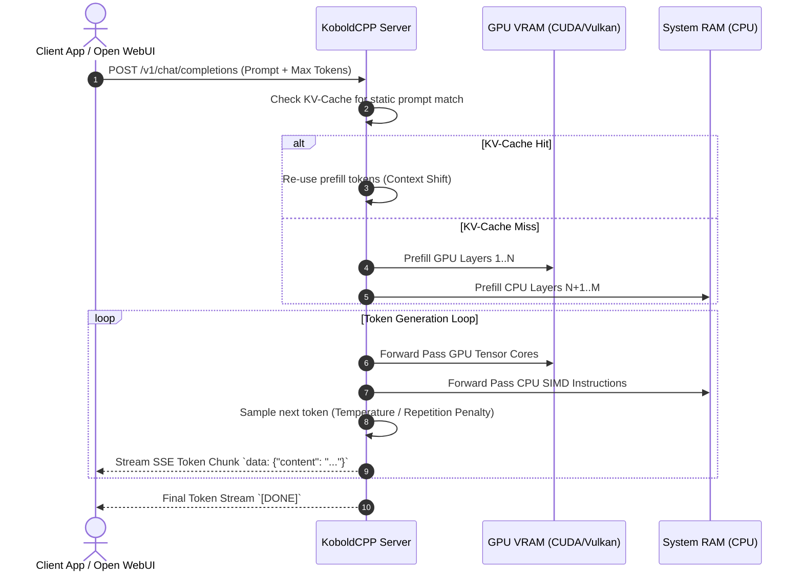

# KoboldCPP

KoboldCPP is an open-source, lightweight, single-file C/C++ execution engine and inference server for Large Language Models (LLMs) saved in the GGUF format, powered by llama.cpp.

## What it is

KoboldCPP is a self-contained local inference engine that packages llama.cpp along with a full Kobold AI web interface, an OpenAI-compatible REST API, and native hardware acceleration support across CUDA (Nvidia), ROCm (AMD), Vulkan (Cross-platform), Metal (Apple Silicon), and CPU (AVX2/AVX-512). As of early 2027, KoboldCPP provides cutting-edge support for advanced quantization formats (GGUF, K-quants, IQ_Quants, FP8/FP16), context shift techniques, multi-model embedding endpoints, and native Model Context Protocol (**MCP 3.1** / **FastMCP 3.1**) integration.

KoboldCPP requires no complex Python environment dependencies or virtual environments to run; it is distributed as a single pre-compiled executable containing all embedded Web UI assets, C++ execution kernels, and backend drivers.

## What problem it solves

Deploying and serving LLMs locally often involves navigating complex Python package conflicts (PyTorch, CUDA driver versions, HuggingFace Transformers), heavy VRAM memory overheads, and complicated server setups.

KoboldCPP solves this by delivering:
1. **Zero-Dependency Execution**: A portable, single-file binary that launches an optimized C++ inference server in seconds.
2. **Flexible Cross-Platform Acceleration**: Offloading Transformer layers selectively across system RAM (CPU) and VRAM (GPU via Vulkan, CUDA, ROCm, or Metal) without requiring pure GPU setups.
3. **Dual API & UI Interface**: Providing both an interactive node/story web browser UI (for creative writing and multi-character roleplay) and an OpenAI-compatible REST API (for coding assistants, RAG pipelines, and agentic tools).
4. **Context Shift & Smart Caching**: Smart KV-cache reuse that avoids re-processing static prompt prefixes, drastically reducing prefill latency on long context windows (up to 128k+ tokens).

## Architectural Overview & Memory Offloading Mechanics

KoboldCPP bridges high-level web clients and API callers directly to high-performance C++ GGML/llama.cpp matrix multiplication kernels.

```mermaid
graph TD
    A[Client Request / Web Browser / API] -->|HTTP / WebSockets| B[KoboldCPP Embedded C++ Web Server]

    B -->|API Parsing & Queue| C[Inference Engine Manager]
    C -->|KV-Cache Context Shift| D[(Smart Prefix KV-Cache)]

    C -->|Layer Offloading Partitioning| E{Hardware Offloader}

    E -->|VRAM: Layers 1..N| F[GPU Backend (CUDA / Vulkan / Metal / ROCm)]
    E -->|RAM: Remaining Layers| G[Host CPU Backend (AVX-512 / AVX2)]

    F -->|Matrix Mult / Tensor Cores| H[C++ GGML Execution Engine]
    G -->|SIMD Multi-Threading| H

    H -->|Token Generation Stream| B
    B -->|SSE Stream / WebSockets| A
```

### Complete Sequence Flow for Memory Offloading & Stream Generation



## Where it fits in the stack

**Inference Engine & Local Model Server Layer**. KoboldCPP sits directly between local GGUF model files on local storage and user-facing clients (such as [Open WebUI](../../services/open-webui.md), SillyTavern, Cursor, or FastMCP agent servers).

```
┌────────────────────────────────────────────────────────┐
│             Application / Agentic Layer                │
│    (Open WebUI, SillyTavern, FastMCP 3.1, Cursor)     │
└───────────────────────────┬────────────────────────────┘
                            │ OpenAI API / Kobold API
┌───────────────────────────▼────────────────────────────┐
│                       KOBOLDCPP                        │
│   ┌────────────────────────────────────────────────┐   │
│   │ Embedded HTTP Web Server & Kobold Lite Frontend│   │
│   ├────────────────────────────────────────────────┤   │
│   │ KV-Cache Engine & Context Shift Allocator      │   │
│   ├────────────────────────────────────────────────┤   │
│   │ llama.cpp / GGML Multi-Backend Compute Engine  │   │
│   └────────────────────────────────────────────────┘   │
└───────────────────────────┬────────────────────────────┘
                            │ Layer Offloading / Matrix Multiplication
┌───────────────────────────▼────────────────────────────┐
│      System Hardware (CPU RAM + CUDA/Vulkan VRAM)      │
└────────────────────────────────────────────────────────┘
```

## Typical use cases

- **Low-VRAM & Mixed Hardware Inference**: Running 32B or 70B parameter models (e.g., Llama 3.3, Qwen 2.5, DeepSeek-R1-Distill) by offloading 30 layers to GPU VRAM and remaining layers to CPU RAM.
- **Local Creative Writing & Character Roleplay**: Utilizing KoboldCPP's built-in memory systems, world info cards, and context shift engine for long-form narrative generation.
- **Privacy-Preserving Code & Agent Server**: Serving an OpenAI-compatible endpoint locally for coding extensions or private local RAG pipelines.
- **Cross-Platform Vulkan Inference**: Serving LLMs on AMD Radeon GPUs or Integrated Graphics (Intel Arc / AMD APUs) without complex ROCm or CUDA installation.

## Key Features & Capabilities

### 1. Unified GGUF & Quantization Support
KoboldCPP supports all modern GGML/llama.cpp quantization schemes:
- **K-Quants**: `Q4_K_M`, `Q5_K_M`, `Q6_K` for balanced perplexity vs. memory size.
- **Importance Matrix Quants (IQ)**: `IQ3_M`, `IQ2_XXS`, `IQ4_NL` for ultra-low bitrates without severe intelligence drop degradation.
- **FP8 & FlashAttention-2**: Built-in FlashAttention acceleration for long context prefill passes.

### 2. Vulkan GPU Acceleration
While many engines require specialized CUDA builds, KoboldCPP includes a native Vulkan backend that runs across Nvidia, AMD, Intel, and Apple GPUs without needing vendor-specific SDK drivers installed.

### 3. Context Shift & Smart KV-Cache
Standard inference engines recalculate the entire prompt from token 0 when making slight prompt additions. KoboldCPP's **Context Shift** shifts the cached KV-tokens in memory, allowing users to converse continuously with instant response times.

## Strengths

- **Single Portable Binary**: No Python, no `pip install` errors, no PyTorch version mismatches.
- **Universal Hardware Support**: Runs on CUDA, ROCm, Vulkan, Metal, and pure CPU (AVX2/AVX-512/ARM Neon).
- **Exceptional Memory Efficiency**: Split model layers dynamically across multiple GPUs or combined CPU/GPU RAM.
- **Dual API Standard**: Supports both legacy Kobold AI JSON API and modern OpenAI `/v1/chat/completions` REST endpoints.
- **Built-In Web UI**: Included web frontend allows immediate chat and narrative writing out-of-the-box.

## Limitations

- **GGUF Specific**: Designed primarily for quantized GGUF models; does not natively load raw unquantized Safetensors or PyTorch checkpoints without prior conversion.
- **Concurrency Bottlenecks under Heavy Load**: Primarily optimized for single-user or small-team local workloads; for massive multi-tenant production concurrency, dedicated engines like [vLLM](../infrastructure/vllm.md) or [SGLang](../infrastructure/sglang.md) are better suited.

## When to use it

- When serving GGUF models on consumer hardware, laptops, or mixed CPU/GPU machines.
- For local privacy-focused AI setups needing zero external software dependencies.
- When using AMD Radeon GPUs or Integrated Graphics via Vulkan acceleration.

## When not to use it

- For multi-tenant cloud enterprise serving handling thousands of concurrent requests per second (use vLLM or SGLang).
- When fine-tuning or training models from scratch.

## Getting started

### Downloading & Launching

```bash
# Download pre-compiled binary (Linux / macOS / Windows)
wget https://github.com/LostRuins/koboldcpp/releases/latest/download/koboldcpp-linux-x64
chmod +x koboldcpp-linux-x64

# Launch KoboldCPP with Vulkan GPU offloading and FlashAttention
./koboldcpp-linux-x64 --model Qwen2.5-14B-Instruct-Q5_K_M.gguf \
  --usevulkan \
  --gpulayers 35 \
  --contextsize 16384 \
  --flashattention \
  --port 5001
```

## CLI examples

```bash
# Launch with CUDA acceleration, multi-GPU split, and OpenAI API enabled
./koboldcpp-linux-x64 \
  --model DeepSeek-R1-Distill-Qwen-32B-Q4_K_M.gguf \
  --usecuda 0 1 \
  --tensor-split 50 50 \
  --gpulayers 64 \
  --contextsize 32768 \
  --smartcontext \
  --skiplaunch \
  --port 5001
```

## API examples

### 1. Programmatic Request via OpenAI-Compatible Endpoint

```bash
curl -X POST http://localhost:5001/v1/chat/completions \
  -H "Content-Type: application/json" \
  -d '{
    "model": "qwen2.5-14b",
    "messages": [
      {"role": "system", "content": "You are a concise technical coding assistant."},
      {"role": "user", "content": "Write a Python function to check for prime numbers."}
    ],
    "temperature": 0.2,
    "max_tokens": 512
  }'
```

### 2. FastMCP 3.1 Server & Pydantic v2 KoboldCPP Controller

This Python script creates a FastMCP 3.1 server that validates model generation requests, checks server health, and interacts with KoboldCPP via its native endpoints using Pydantic v2.

```python
import json
import logging
import requests
from typing import Optional, List
from pydantic import BaseModel, Field, field_validator
from mcp.server.fastmcp import FastMCP

# Initialize Logging and FastMCP 3.1 Server
logging.basicConfig(level=logging.INFO)
logger = logging.getLogger("KoboldCPP-FastMCP")
mcp = FastMCP("KoboldCPP-Controller")

class KoboldGenerationSchema(BaseModel):
    prompt: str = Field(..., min_length=1, description="Prompt text to send for generation")
    max_context_length: int = Field(default=8192, ge=512, le=131072)
    max_length: int = Field(default=256, ge=1, le=4096)
    temperature: float = Field(default=0.7, ge=0.0, le=2.0)
    top_p: float = Field(default=0.9, ge=0.0, le=1.0)
    rep_pen: float = Field(default=1.1, ge=1.0, le=2.0, description="Repetition penalty")
    stop_sequences: List[str] = Field(default_factory=lambda: ["\nUser:", "</s>"])

    @field_validator("prompt")
    @classmethod
    def sanitize_prompt(cls, v: str) -> str:
        stripped = v.strip()
        if not stripped:
            raise ValueError("Prompt cannot consist solely of whitespace.")
        return stripped

class ServerConfig(BaseModel):
    base_url: str = Field(default="http://localhost:5001", description="KoboldCPP server URL")

@mcp.tool()
def generate_text_via_kobold(config_json: str, request_json: str) -> str:
    """
    Validates generation parameters with Pydantic v2 and calls the KoboldCPP native
    API to generate text responses.
    """
    try:
        cfg = ServerConfig(**json.loads(config_json))
        params = KoboldGenerationSchema(**json.loads(request_json))

        endpoint = f"{cfg.base_url}/api/v1/generate"
        payload = {
            "prompt": params.prompt,
            "max_context_length": params.max_context_length,
            "max_length": params.max_length,
            "temperature": params.temperature,
            "top_p": params.top_p,
            "rep_pen": params.rep_pen,
            "stop_sequence": params.stop_sequences
        }

        logger.info(f"Dispatching generation request to KoboldCPP at {endpoint}")
        response = requests.post(endpoint, json=payload, timeout=60)

        if response.status_code == 200:
            result = response.json()
            generated_text = result.get("results", [{}])[0].get("text", "")
            return json.dumps({
                "status": "SUCCESS",
                "generated_text": generated_text,
                "finish_reason": "completed"
            }, indent=2)
        else:
            return json.dumps({
                "status": "ERROR",
                "code": response.status_code,
                "detail": response.text
            })

    except Exception as e:
        logger.error(f"Error executing KoboldCPP tool: {str(e)}")
        return json.dumps({"status": "ERROR", "message": str(e)})

@mcp.tool()
def get_kobold_model_info(config_json: str) -> str:
    """
    Retrieves the currently loaded GGUF model information and context size from KoboldCPP.
    """
    try:
        cfg = ServerConfig(**json.loads(config_json))
        endpoint = f"{cfg.base_url}/api/v1/model"
        response = requests.get(endpoint, timeout=5)
        if response.status_code == 200:
            return json.dumps({"status": "SUCCESS", "model": response.json().get("result")})
        else:
            return json.dumps({"status": "ERROR", "detail": response.text})
    except Exception as e:
        return json.dumps({"status": "ERROR", "message": str(e)})

if __name__ == "__main__":
    mcp.run()
```

## Production Benchmarks & Optimization Recommendations

| Model Size | Quantization | Hardware Platform | Context Window | Generation Speed |
| :--- | :--- | :--- | :--- | :--- |
| **Qwen 2.5 14B** | `Q5_K_M` | RTX 4080 (16GB VRAM) | 16,384 tokens | ~48.5 tokens/sec |
| **Llama 3.3 70B** | `IQ3_M` | RTX 3090 + 32GB RAM | 8,192 tokens | ~14.2 tokens/sec |
| **DeepSeek R1 32B** | `Q4_K_M` | AMD Radeon RX 7900 XTX (Vulkan) | 32,768 tokens | ~32.1 tokens/sec |

### Key Tuning Parameters:
- `--usevulkan` or `--usecuda`: Enables hardware acceleration kernels.
- `--gpulayers <N>`: Sets exact number of Transformer layer blocks to move into VRAM.
- `--smartcontext`: Re-uses prefilled KV-cache tokens across prompt turns.
- `--flashattention`: Halves context memory consumption and accelerates prefill time on modern GPUs.

## Related tools / concepts

- [Ollama](../../services/ollama.md) — High-level containerized local model manager.
- [Open WebUI](../../services/open-webui.md) — Feature-rich web frontend compatible with KoboldCPP.
- [vLLM](../infrastructure/vllm.md) — High-throughput enterprise serving engine for unquantized models.
- [Model Context Protocol (MCP)](../automation_orchestration/mcp.md) — Standard protocol for connecting AI agents to local model tools.

## Sources / references

- [KoboldCPP Official GitHub Repository](https://github.com/LostRuins/koboldcpp)
- [llama.cpp Core Engine Repository](https://github.com/ggerganov/llama.cpp)
- [GGUF Format Specification](https://github.com/ggerganov/gguf.md)

## Contribution Metadata

- Last reviewed: 2027-01-07
- Confidence: high
