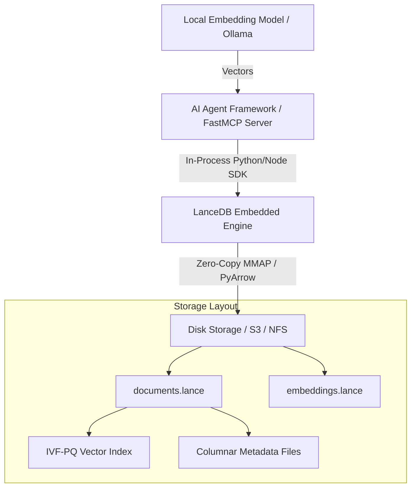

# LanceDB

## What it is
LanceDB is an open-source, developer-friendly, serverless vector database built on top of the Lance columnar data format. Designed for embedded, disk-native vector search and AI applications, it supports zero-overhead persistent storage on local drives, network-attached storage (NFS/SMB), or S3-compatible object stores without running background database daemon processes. By storing vector indices alongside structured columnar attributes in unified `.lance` files, LanceDB delivers low-latency hybrid search and high-throughput analytical queries for local retrieval-augmented generation (RAG) and multi-agent memory systems.

## What problem it solves
Traditional vector databases (such as Milvus or multi-node Qdrant cluster deployments) require dedicated background server processes, complex network configuration, memory allocation tuning, and continuous daemon maintenance. For edge nodes, local development environments, and single-box home labs, this infrastructure overhead introduces failure points and consumes valuable CPU/RAM resources.

LanceDB eliminates operational complexity by embedding directly into Python, Node.js, Rust, or C++ applications. Its disk-native Lance layout utilizes zero-copy random access via memory-mapped IO (`mmap`), allowing applications to query multi-million vector datasets that exceed available system RAM while operating entirely in-process without client-server IPC latency.

## Where it fits in the stack
**Infrastructure / Vector DB**. LanceDB serves as an embedded, zero-daemon vector and structured document storage engine for local RAG pipelines, long-term agent memory context stores, and multimodal media retrieval systems across local home labs, edge gateways, and edge AI workloads.



## Typical use cases
- **Embedded Document RAG**: Storing and searching vector embeddings generated from Paperless-ngx documents, Obsidian vaults, or local PDF collections.
- **Air-Gapped Single-Box AI**: Providing high-performance vector storage on local NVMe or NFS shares without managing Docker container daemons or systemd database services.
- **Multimodal Media Search**: Indexing combined image and text embeddings (such as CLIP or Whisper transcripts) for personal photo/video archives with hybrid metadata filtering.
- **FastMCP Agent Memory**: Serving as an embedded, persistent semantic memory store for FastMCP tool servers that save conversation turns and user preferences.

## Strengths
- **Serverless & Embedded**: Runs in-process with zero client-server network overhead, eliminating background daemon management and socket connection pools.
- **Disk-Native Columnar Performance**: Built on the Lance format, enabling random-access vector similarity queries over datasets larger than system RAM with millisecond latency.
- **Hybrid Search Capabilities**: Integrates full-text search (FTS) and SQL filtering directly alongside vector distance metrics (Cosine, L2, Dot Product).
- **Zero-Copy Arrow Integration**: Direct interoperability with Apache Arrow, PyArrow, pandas, and Polars for high-throughput data processing and zero-copy transformations.
- **Flexible Storage Backends**: Persists seamlessly to local disk directories, AWS S3, Cloudflare R2, MinIO, or NFS mounts.

## Limitations
- **Single-Writer Constraint**: While multiple readers can access the same LanceDB dataset simultaneously via shared storage, concurrent writes require serialized execution or single-writer coordination.
- **Distributed Cluster Abstraction**: Optimized primarily for embedded or single-node deployments; scaling across massive multi-tenant distributed clusters requires manual partition management or cloud abstractions.
- **Ecosystem Age**: While rapidly growing, its third-party plugin ecosystem is newer compared to legacy relational or traditional standalone vector daemons.

## When to use it
- When requiring zero-daemon embedded vector storage for local Python or Node.js RAG applications.
- When querying datasets larger than RAM directly from local NVMe or SSD storage using the Lance format.
- When deploying single-box or edge home-lab automation services where resource footprint must be minimized.
- When building FastMCP servers that need persistent semantic vector search without introducing container dependencies.

## When not to use it
- When requiring distributed multi-tenant clustering with active-active high-availability write replication across multiple geographical locations.
- When existing PostgreSQL/pgvector or SQLite setups already meet low-concurrency relational and vector storage needs without dedicated vector format optimizations.

## Getting started

### Installation
Install LanceDB via `pip` or `uv`:

```bash
pip install lancedb pyarrow pydantic
```

### Quickstart Example
A minimal working example connecting to an embedded LanceDB storage directory, creating a table, and executing vector nearest-neighbor search:

```python
import lancedb

# Connect to local embedded database path
db = lancedb.connect("./data/lancedb_store")

# Create table with vector embeddings and metadata
table = db.create_table(
    "documents",
    data=[
        {"vector": [0.1, 0.2, 0.3], "text": "Home-lab backup policy", "id": "doc1"},
        {"vector": [0.4, 0.5, 0.6], "text": "K3s cluster config", "id": "doc2"}
    ],
    mode="overwrite"
)

# Execute vector search query
results = table.search([0.1, 0.2, 0.3]).limit(1).to_list()
print("Search Result:", results)
```

## CLI examples

```bash
# 1. Install LanceDB Python SDK package
pip install lancedb

# 2. Inspect local database table names via Python CLI invocation
python3 -c "import lancedb; db = lancedb.connect('./data/lancedb_store'); print(db.table_names())"

# 3. Query row count over an embedded LanceDB table via Python CLI
python3 -c "import lancedb; db = lancedb.connect('./data/lancedb_store'); print(db.open_table('documents').count_rows())"

# 4. Perform direct vector search and output results from CLI
python3 -c "import lancedb; db = lancedb.connect('./data/lancedb_store'); print(db.open_table('documents').search([0.1, 0.2, 0.3]).limit(2).to_list())"
```

## API examples

### 1. Advanced Vector Query with Metadata Filtering
```python
import lancedb

db = lancedb.connect("./data/lancedb_store")
table = db.open_table("documents")

# Search nearest vectors with SQL metadata filter and limit parameters
results = (
    table.search([0.12, 0.21, 0.31])
    .where("id = 'doc1'")
    .limit(5)
    .to_list()
)

for row in results:
    print(f"ID: {row['id']} | Text: {row['text']} | Score/Distance: {row.get('_distance', 0.0):.4f}")
```

### 2. FastMCP 3.1 Embedded Memory Server Integration
```python
from typing import List, Dict, Any
from mcp.server.fastmcp import FastMCP
import lancedb
import pyarrow as pa

mcp = FastMCP("lancedb-memory-server")
DB_PATH = "./data/mcp_lancedb_memory"

def get_db():
    return lancedb.connect(DB_PATH)

@mcp.tool()
def store_memory(memory_id: str, text: str, vector: List[float], category: str = "general") -> str:
    """Stores a semantic vector memory entry in embedded LanceDB."""
    db = get_db()
    table_name = "agent_memories"

    data = [{
        "id": memory_id,
        "text": text,
        "category": category,
        "vector": vector
    }]

    if table_name in db.table_names():
        table = db.open_table(table_name)
        table.add(data)
    else:
        table = db.create_table(table_name, data=data)

    return f"Successfully stored memory ID '{memory_id}' in LanceDB."

@mcp.tool()
def search_memories(query_vector: List[float], category_filter: str = None, top_k: int = 3) -> List[Dict[str, Any]]:
    """Retrieves top-k relevant agent memories from LanceDB based on vector similarity."""
    db = get_db()
    if "agent_memories" not in db.table_names():
        return []

    table = db.open_table("agent_memories")
    query = table.search(query_vector).limit(top_k)

    if category_filter:
        query = query.where(f"category = '{category_filter}'")

    return query.to_list()

if __name__ == "__main__":
    mcp.run()
```

### 3. Pydantic v2 Schema for Vector Document Ingestion
```python
from typing import List, Optional
from pydantic import BaseModel, ConfigDict, Field

class DocumentRecord(BaseModel):
    model_config = ConfigDict(extra="forbid")

    id: str = Field(..., description="Unique document identifier")
    text: str = Field(..., description="Text content or excerpt")
    category: str = Field(default="default", description="Classification category for metadata filtering")
    vector: List[float] = Field(..., description="Dense float vector embedding")
    source_url: Optional[str] = Field(None, description="Optional canonical URL or document file path")

class QueryRequest(BaseModel):
    model_config = ConfigDict(extra="forbid")

    vector: List[float] = Field(..., description="Query vector embedding")
    top_k: int = Field(default=5, ge=1, le=100, description="Number of nearest neighbors to retrieve")
    filter_sql: Optional[str] = Field(None, description="Optional SQL filter clause")

if __name__ == "__main__":
    doc = DocumentRecord(
        id="doc_101",
        text="FastMCP server deployment instructions",
        category="ops",
        vector=[0.01, 0.05, 0.88],
        source_url="https://docs.homelab.local/fastmcp"
    )
    print("Ingestion record validated:", doc.model_dump_json(indent=2))
```

## Related tools / concepts
- [ChromaDB](chroma.md) — Embedded vector database comparison.
- [Qdrant](qdrant.md) — Dedicated standalone vector database engine.
- [Paperless-ngx](../../services/paperless-ngx.md) — Local document management and indexing service.
- [Local Embedding Models](local-embeddings.md) — Offline vector embedding generation runtimes.

## Sources / references
- [LanceDB Official Documentation](https://lancedb.github.io/lancedb/)
- [Lance Format Specification](https://github.com/lancedb/lance)

---
## Contribution Metadata
- Last reviewed: 2027-01-07
- Confidence: high
