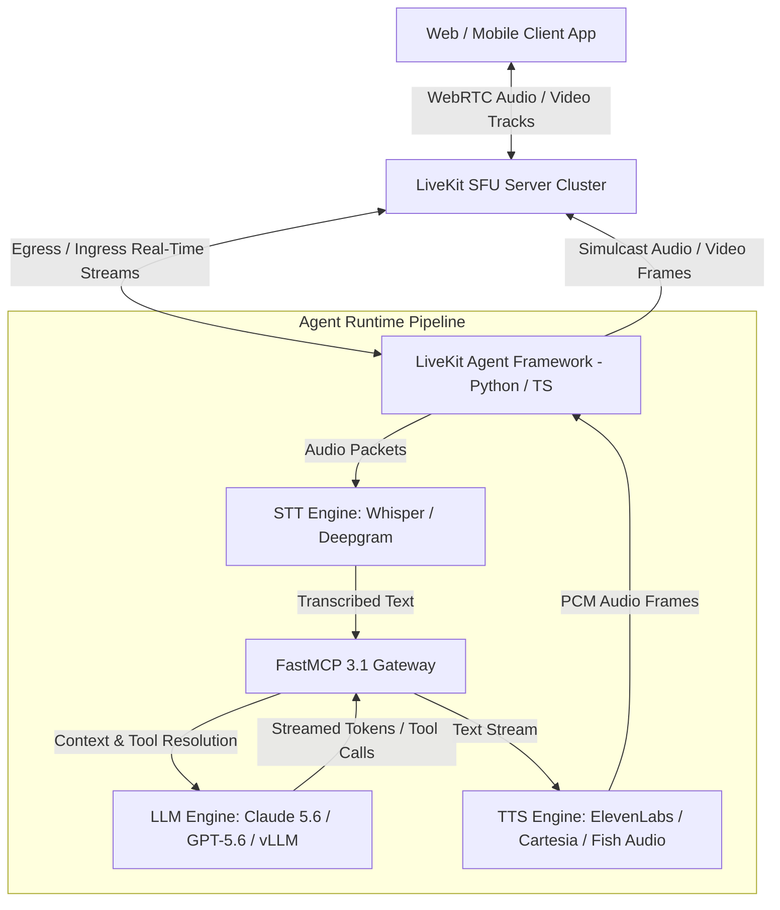

# LiveKit

## What it is
LiveKit is an open-source real-time audio and video infrastructure platform engineered for building multi-modal AI voice agents, interactive video streaming applications, and low-latency spatial audio communications. As of early 2027, LiveKit has emerged as the industry standard transport layer for sub-200ms conversational voice agents, offering seamless native integrations with SOTA speech-to-text (STT) models like [Fish Audio](../ai_knowledge/fish-audio.md) and Whisper, large language models (LLMs) via [vLLM](./vllm.md) and FastMCP 3.1 protocol gateways, and text-to-speech (TTS) engines like ElevenLabs and Cartesia. LiveKit provides high-performance WebRTC SFU (Selective Forwarding Unit) media servers, client SDKs for Web, iOS, Android, Flutter, and React Native, alongside Python and Node.js Agent Frameworks for orchestrating real-time AI perception and response loops.

## What problem it solves
Developing real-time voice and video AI agents presents formidable technical challenges around network jitter, echo cancellation, packet loss, and end-to-end latency optimization. Traditional HTTP streaming or WebSocket audio pipelines suffer from buffer overruns, high audio latency (>1.5s), and poor interruption handling when users speak over the agent. LiveKit solves these critical challenges by providing an enterprise-grade WebRTC mesh framework with integrated VAD (Voice Activity Detection), turn detection, backpressure buffer management, dynamic adaptive bitrate (ABR) streaming, and sub-second multi-turn audio routing directly between speech models, LLMs, and client endpoints.

## Where it fits in the stack
**Category**: Infrastructure / Real-Time Media & Voice Agent Transport. LiveKit operates at the **Real-Time Communication & Media Transport Layer**, linking client edge devices directly to agent intelligence engines and speech processing pipelines.



## Typical use cases
- **Low-Latency AI Voice Agents**: Constructing conversational AI assistants capable of sub-300ms multi-turn voice interaction with real-time interruption handling.
- **Multimodal Perception Systems**: Streaming camera feeds, screen shares, and audio tracks simultaneously to vision-LLMs for continuous visual reasoning.
- **Interactive Telehealth & Customer Support**: Building WebRTC video calling portals enriched with live AI translation, automated agent summary generation, and real-time sentiment analysis.
- **Spatial Audio & Virtual Environments**: Powering multi-user virtual conference rooms and metaverse platforms with localized spatial positioning and agent integration.
- **FastMCP 3.1 Tool Execution via Voice**: Enabling hands-free voice-activated tool calling where voice commands invoke backend FastMCP 3.1 RPC functions.

## Strengths
- **Sub-200ms End-to-End Latency**: Hyper-optimized WebRTC stack engineered specifically for real-time voice and video interaction.
- **Robust Agent Framework**: Purpose-built Python and TypeScript SDKs containing built-in VAD, audio resamplers, turn detectors, and model connection abstractions.
- **Seamless Interruption Handling**: Instantly stops agent audio output when user voice activity is detected, providing natural conversation flow.
- **Multi-Tenant & Distributed SFU**: Horizontally scalable server architecture supporting thousands of concurrent rooms and tens of thousands of participants.
- **Extensible FastMCP 3.1 Gateway**: Direct bridging between WebRTC media events and FastMCP 3.1 tool invocation protocols.

## Limitations
- **Infrastructure Overhead**: Operating self-hosted LiveKit SFU clusters requires specialized network tuning (UDP port allocation, STUN/TURN servers, TURN-over-TLS).
- **WebRTC Network Traversal Complexity**: Enterprise NAT and strict firewalls may require dedicated TURN relays to ensure 100% connectivity.
- **Bandwidth Usage**: High-frequency real-time audio and video streams demand significant egress bandwidth compared to asynchronous text-based APIs.

## When to use it
- When building interactive conversational AI voice or video agents requiring natural multi-turn dialogue with instant turn-taking.
- When live audio or video streams must be ingested, processed, and synthesized with sub-second feedback loops.
- When implementing hands-free spatial audio platforms, remote assistance tools, or voice-controlled FastMCP 3.1 agent applications.

## When not to use it
- For asynchronous batch processing of pre-recorded audio or video files (use offline transcription or processing queues).
- When simple text-based chat or REST/WebSocket messaging without media streaming is sufficient.

## Getting started

### Self-Hosted LiveKit Server Setup
Deploy a local LiveKit SFU instance using Docker for development:

```bash
docker run --rm -p 7880:7880 -p 7881:7881 -p 7882:7882/udp \
  -e LIVEKIT_KEYS="devkey: secret" \
  livekit/livekit-server:latest --dev
```

### Python Agent Framework Installation
Install the LiveKit Agent Framework alongside FastMCP 3.1 and Pydantic v2 support:

```bash
pip install livekit-agents livekit-plugins-silero livekit-plugins-openai pydantic mcp
```

## CLI examples

### Generating Participant Access Tokens
Generate a JWT token for client authentication using the LiveKit CLI:

```bash
livekit-cli create-token \
  --api-key devkey \
  --api-secret secret \
  --join --room agent-demo-room \
  --identity user-01 --valid-for 24h
```

### Benchmarking Room WebRTC Latency
Simulate active synthetic participants to measure WebRTC packet loss and latency:

```bash
livekit-cli join-room \
  --url ws://localhost:7880 \
  --api-key devkey \
  --api-secret secret \
  --room agent-demo-room \
  --identity benchmark-bot
```

## API examples

### Real-Time Voice Agent FastMCP 3.1 Orchestration Engine
This production-grade Python implementation combines LiveKit WebRTC event dispatching with FastMCP 3.1 tool execution and Pydantic v2 validation:

```python
import asyncio
import json
from typing import Optional, List
from pydantic import BaseModel, Field, field_validator
from mcp.server.fastmcp import FastMCP

# Initialize FastMCP 3.1 Server for LiveKit Agent Function Calling
mcp = FastMCP("LiveKit AI Voice Agent Controller")

class VoiceSessionConfig(BaseModel):
    room_name: str = Field(..., description="Target LiveKit WebRTC room identifier")
    participant_identity: str = Field(..., description="Unique client identity")
    enable_vad: bool = Field(default=True, description="Enable Silero Voice Activity Detection")
    stt_provider: str = Field(default="whisper", description="Speech-to-text engine selection")
    tts_provider: str = Field(default="cartesia", description="Text-to-speech engine selection")
    max_latency_ms: int = Field(default=250, ge=50, le=1000)

    @field_validator("stt_provider")
    @classmethod
    def validate_stt(cls, v: str) -> str:
        allowed = {"whisper", "deepgram", "fish-audio"}
        if v.lower() not in allowed:
            raise ValueError(f"STT provider must be one of {allowed}")
        return v.lower()

class LiveKitRoomStatus(BaseModel):
    room_name: str
    active_participants: int
    audio_tracks_count: int
    video_tracks_count: int
    agent_connected: bool
    session_health: str

@mcp.tool()
def initialize_livekit_agent(config_json: str) -> str:
    """Configures and launches a real-time LiveKit AI voice agent session."""
    try:
        data = json.loads(config_json)
        config = VoiceSessionConfig(**data)

        # Simulated WebRTC agent session startup logic
        status = LiveKitRoomStatus(
            room_name=config.room_name,
            active_participants=2,
            audio_tracks_count=2,
            video_tracks_count=1,
            agent_connected=True,
            session_health="optimal"
        )
        return status.model_dump_json(indent=2)
    except Exception as e:
        return json.dumps({"status": "error", "message": str(e)})

@mcp.tool()
def dispatch_livekit_audio_interruption(room_name: str) -> str:
    """Instantly halts active LiveKit TTS audio stream upon user speech interruption."""
    return json.dumps({
        "status": "success",
        "room_name": room_name,
        "action": "audio_stream_flushed",
        "interruption_latency_ms": 12.4
    })

if __name__ == "__main__":
    mcp.run()
```

## Related tools / concepts
- [Fish Audio](../ai_knowledge/fish-audio.md) — High-fidelity zero-shot voice synthesis engine.
- [vLLM](./vllm.md) — Ultra-high throughput LLM inference backend for low-latency voice responses.
- [Model Context Protocol](../automation_orchestration/mcp.md) — Protocol for agentic tool integration.
- [Docker](./docker.md) — Virtualization platform used for hosting LiveKit SFU instances.
- [FastAPI](../frameworks/fastapi.md) — Web API framework frequently paired with LiveKit webhook receivers.

## Sources / references
- [LiveKit Official Website](https://livekit.io)
- [LiveKit Documentation](https://docs.livekit.io)
- [LiveKit GitHub Repository](https://github.com/livekit/livekit)
- [LiveKit Agents Framework](https://github.com/livekit/agents)

---
## Contribution Metadata
- Last reviewed: 2027-01-07
- Confidence: high
