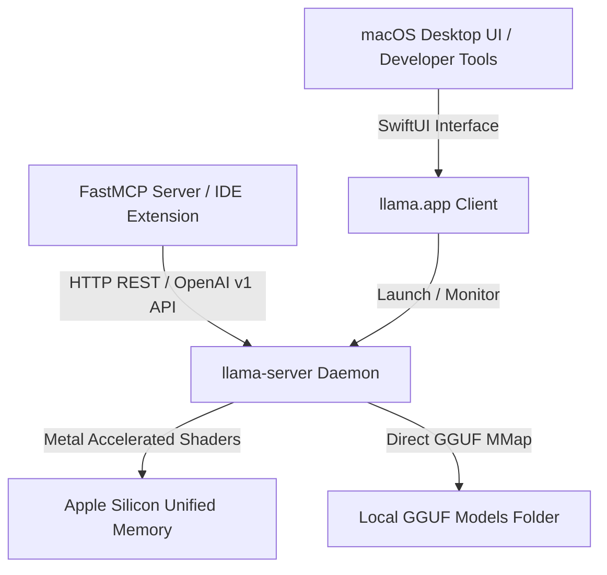

# llama.app

## What it is
`llama.app` is a native macOS graphical user interface and companion desktop client for `llama.cpp` and `llama-server`. Designed specifically for macOS and Apple Silicon hardware (M1/M2/M3/M4 Series), it provides a clean, user-friendly interface for managing local GGUF models, launching local OpenAI-compatible inference servers, and chatting with LLMs offline without relying on web browser engines or heavy cross-platform frameworks.

By leveraging Apple's native SwiftUI and Metal framework bindings, `llama.app` provides lightweight hardware acceleration, custom VRAM/Unified Memory allocation controls, and background server execution.

## What problem it solves
While `llama.cpp` is the industry standard for high-performance GGUF local inference, configuring its command-line parameters (`-m`, `-c`, `-ngl`, `--temp`, `-b`, `--flash-attn`) can be complex and intimidating for developers and non-technical users alike. Furthermore, managing background `llama-server` daemons, monitoring unified memory usage, and managing custom GGUF model paths manually requires persistent terminal sessions and continuous process tracking.

`llama.app` wraps `llama.cpp` and `llama-server` into a native macOS app, offering zero-config model discovery, hardware-accelerated Metal execution, visual server management, and automatic OpenAI REST endpoint binding.

## Where it fits in the stack
**Infrastructure / Local Inference Client**. It sits directly on top of `llama.cpp` and `llama-server` on macOS, providing local inference capabilities to local LLM clients, browser extensions, FastMCP agent servers, and developer IDEs via standard OpenAI-compatible REST endpoints.



## Typical use cases
- **Native macOS Local Chat**: Interacting with local GGUF models (e.g., Llama 4 Maverick, DeepSeek-V4, Gemma 4, Qwen 3.6) with zero cloud dependency or external network telemetry.
- **Background OpenAI Endpoint**: Running `llama-server` in the background with custom VRAM and Metal layer offloading settings for local agent integration and coding assistants.
- **Model Library Management**: Browsing, downloading, organizing, and inspecting quantization parameters of local GGUF files across custom local storage directories.
- **Local Agent Tool Integration**: Providing FastMCP servers and developer tools with offline, OpenAI-compatible LLM inference backends.

## Strengths
- **Native Metal Optimization**: Fully utilizes Apple Silicon Unified Memory and GPU cores via optimized Metal shaders without emulation overhead.
- **Zero-Configuration Server**: Automatically manages `llama-server` background processes and exposes standard OpenAI-compatible API endpoints (`http://localhost:8080/v1`).
- **Low Memory Overhead**: Built as a lightweight native SwiftUI macOS application without heavy WebKit or Electron runtime memory footprints.
- **Privacy-First Architecture**: Operates 100% offline without telemetry, phone-home metrics, or external tracking.
- **GGUF Quantization Flexibility**: Supports execution of full-range quantized models from Q2_K to Q8_0 and float16 formats.

## Limitations
- **macOS Exclusive**: Tailored specifically for macOS and Apple Silicon/Intel Mac architectures; not available on Linux or Windows platforms.
- **GUI Abstraction**: Advanced fine-tuning parameters or niche GBNF grammar configurations available in raw `llama.cpp` CLI may require manual CLI flags.
- **Single Host Focus**: Designed for single-machine workstation usage rather than distributed production clusters or multi-node server deployments.

## When to use it
- On Apple Silicon Mac workstations where you want a simple, native interface to manage local `llama.cpp` models and servers.
- When serving local GGUF models to developer tools like VS Code extensions or local FastMCP agents.
- When seeking a lightweight alternative to resource-heavy Electron-based local model runners.

## When not to use it
- On Linux or Windows operating systems (use [LM Studio](lm-studio.md), [Jan.ai](jan-ai.md), or raw [llama.cpp](llama-cpp.md)).
- In headless Linux server or containerized production deployment environments.

## Getting started

### Installation
1. Download the latest release `.dmg` from the official repository or community release page.
2. Drag `llama.app` to your `/Applications` folder.
3. Open `llama.app` and select your local model directory containing `.gguf` files.

### Server Integration
Once started, `llama.app` exposes an OpenAI-compatible REST server on `http://localhost:8080`:

```bash
curl http://localhost:8080/v1/chat/completions \
  -H "Content-Type: application/json" \
  -d '{
    "model": "llama-4-maverick",
    "messages": [{"role": "user", "content": "Hello from local Mac server!"}]
  }'
```

## CLI examples

```bash
# Check running llama-server process bound by llama.app
pgrep -af llama-server

# Point local Python OpenAI client to llama.app server
export OPENAI_API_BASE="http://localhost:8080/v1"
export OPENAI_API_KEY="not-needed"

# Test local endpoint completion via curl
curl -s http://localhost:8080/v1/models | jq .
```

## API examples

### 1. Connecting OpenAI Python SDK to llama.app
```python
import openai

# Connect OpenAI Python SDK to local llama.app server
client = openai.OpenAI(
    base_url="http://localhost:8080/v1",
    api_key="not-needed"
)

response = client.chat.completions.create(
    model="llama-4-maverick",
    messages=[{"role": "user", "content": "Explain quantisation in 2 sentences."}]
)
print(response.choices[0].message.content)
```

### 2. FastMCP 3.1 Local Client Integration
```python
from typing import Dict, Any
from mcp.server.fastmcp import FastMCP
import urllib.request
import json

mcp = FastMCP("llama-app-mcp-bridge")

LLAMA_APP_ENDPOINT = "http://localhost:8080/v1/chat/completions"

@mcp.tool()
def generate_local_response(prompt: str, model_name: str = "llama-4-maverick") -> Dict[str, Any]:
    """Sends a completion request to local llama.app endpoint on macOS."""
    payload = {
        "model": model_name,
        "messages": [{"role": "user", "content": prompt}],
        "temperature": 0.7
    }

    req = urllib.request.Request(
        LLAMA_APP_ENDPOINT,
        data=json.dumps(payload).encode("utf-8"),
        headers={"Content-Type": "application/json"}
    )

    try:
        with urllib.request.urlopen(req, timeout=60) as resp:
            data = json.loads(resp.read().decode("utf-8"))
            content = data["choices"][0]["message"]["content"]
            return {"status": "success", "content": content}
    except Exception as e:
        return {"status": "error", "message": str(e)}

if __name__ == "__main__":
    mcp.run()
```

### 3. Pydantic v2 Schema for Local Server Configuration
```python
from typing import Optional
from pydantic import BaseModel, ConfigDict, Field

class LlamaAppServerConfig(BaseModel):
    model_config = ConfigDict(extra="forbid")

    host: str = Field("127.0.0.1", description="Local binding IP address")
    port: int = Field(8080, ge=1024, le=65535, description="Port for OpenAI REST endpoint")
    model_path: str = Field(..., description="Absolute file path to target GGUF model")
    context_size: int = Field(4096, ge=512, le=131072, description="Context window length in tokens")
    gpu_layers: int = Field(99, ge=0, description="Number of model layers offloaded to Metal GPU")
    threads: Optional[int] = Field(None, ge=1, description="CPU threads allocated for prompt processing")

if __name__ == "__main__":
    cfg = LlamaAppServerConfig(
        model_path="/Users/homelab/Models/llama-4-maverick-q4.gguf",
        gpu_layers=99,
        context_size=8192
    )
    print("Validated Llama.app Server Config:\n", cfg.model_dump_json(indent=2))
```

## Related tools / concepts
- **[llama.cpp](llama-cpp.md)**: Foundational C/C++ local GGUF inference runtime.
- **[LM Studio](lm-studio.md)**: Cross-platform local LLM desktop GUI client.
- **[Jan.ai](jan-ai.md)**: Open-source desktop assistant for local model execution.
- **[Ollama](../../services/ollama.md)**: Popular CLI and background service for running local models.

## Sources / references
- [llama.app Reddit Release Announcement](https://www.reddit.com/r/LocalLLaMA/comments/1vdt1i2/psa_llamaapp_mac_app_and_llama_serve_from_llamacpp/?ref=2026-09-21-audit)
- [llama.cpp Repository](https://github.com/ggerganov/llama.cpp)

---
## Contribution Metadata
- Last reviewed: 2027-01-07
- Confidence: high
