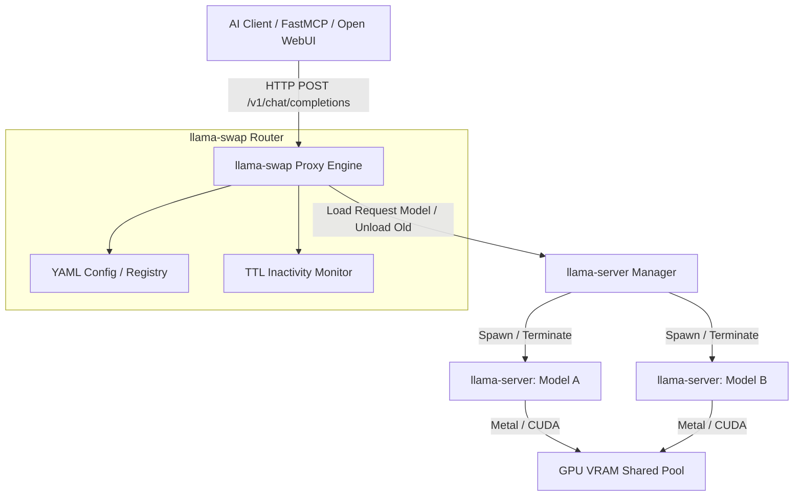

# llama-swap

## What it is
llama-swap is an open-source, lightweight model proxy and routing engine designed to hot-swap local GGUF models on demand behind a single OpenAI-compatible API endpoint. Built primarily for resource-constrained home labs, edge deployments, and developer workstations running `llama.cpp` backends, it automatically manages loading, serving, and unloading model processes based on incoming API request parameters.

By managing backend process lifecycles and isolating model loading from client API logic, llama-swap provides an intelligent abstraction layer for hosting multiple LLMs on consumer hardware.

## What problem it solves
Running multiple local LLMs concurrently requires significant VRAM or RAM, which quickly exhausts hardware capacity on consumer GPUs or single-board computers. Manually starting and stopping different model server instances creates operational friction, consumes admin effort, and breaks automated agent workflows that expect an always-available, unified API endpoint.

llama-swap solves this by transparently intercepting OpenAI-compatible API calls, inspecting the requested model parameter, gracefully unloading active models from GPU memory, and spinning up requested models dynamically—all without requiring manual server reconfiguration or breaking client connections.

## Architectural Overview

```
+-----------------------------------------------------------------------------------+
|                                 CLIENT LAYER                                      |
|   Open WebUI  /  Cursor IDE  /  FastMCP 3.1 Pipelines  /  LangChain / AutoGen    |
+-----------------------------------------------------------------------------------+
                                         |
                       HTTP POST /v1/chat/completions
                                         v
+-----------------------------------------------------------------------------------+
|                                 LLAMA-SWAP PROXY                                  |
|                                                                                   |
|  +--------------------+   +-----------------------+   +------------------------+  |
|  | Request Router     |   | Inactivity TTL Monitor|   | Model Registry Config  |  |
|  | - Intercept model  |-->| - Idle timer resets   |-->| - Ports & binary args  |  |
|  | - Match vs active  |   | - Auto SIGTERM on idle|   | - GGUF model paths     |  |
|  +--------------------+   +-----------------------+   +------------------------+  |
|            |                                                                      |
|            +-------------------+--------------------+                             |
|                                |                    |                             |
|                                v                    v                             |
|                     [Model Match Active?]     [Model Swap Needed]                 |
|                                |                    |                             |
|                        Direct Proxy Pass     1. Graceful SIGTERM old process       |
|                                              2. Wait for VRAM release             |
|                                              3. Spawn new llama-server binary     |
|                                              4. Buffer incoming HTTP requests     |
|                                              5. Forward payload to new backend    |
+-----------------------------------------------------------------------------------+
                                         |
                                         v
+-----------------------------------------------------------------------------------+
|                             BACKEND EXECUTION LAYER                               |
|                                                                                   |
|  +----------------------------------+     +------------------------------------+  |
|  | llama-server: Qwen-Coder (8081)    |     | llama-server: Llama-3-8B (8082)    |  |
|  | - GGUF model loaded in VRAM      |  OR | - GGUF model loaded in VRAM        |  |
|  | - Context: 8192, Flash Attention |     | - Context: 4096, Metal/CUDA        |  |
|  +----------------------------------+     +------------------------------------+  |
+-----------------------------------------------------------------------------------+
                                         |
                                         v
+-----------------------------------------------------------------------------------+
|                              SHARED HARDWARE POOL                                 |
|                          Single Consumer GPU / Metal VRAM                         |
+-----------------------------------------------------------------------------------+
```


```mermaid
graph TD
    Client[AI Client / FastMCP / Open WebUI] -->|HTTP POST /v1/chat/completions| Proxy[llama-swap Proxy Engine]

    subgraph llama-swap Router
        Proxy --> Config[YAML Config / Registry]
        Proxy --> Monitor[TTL Inactivity Monitor]
    end

    Proxy -->|Load Request Model / Unload Old| Backend[llama-server Manager]
    Backend -->|Spawn / Terminate| Server1[llama-server: Model A]
    Backend -->|Spawn / Terminate| Server2[llama-server: Model B]
    Server1 -->|Metal / CUDA| VRAM[GPU VRAM Shared Pool]
    Server2 -->|Metal / CUDA| VRAM
```

## Where it fits in the stack
**Infrastructure / Model Routing & Serving**. llama-swap sits between AI clients, agents, and IDE extensions and underlying `llama.cpp` server backends, acting as a dynamic, VRAM-conscious proxy and process orchestration layer.

## Feature & Operational Comparison

| Feature / Metric | llama-swap | Ollama | vLLM | LiteLLM |
| :--- | :--- | :--- | :--- | :--- |
| **Primary Target** | GGUF hot-swapping proxy | All-in-one local runner | High-throughput enterprise | API gateway & proxy |
| **Model Format** | Raw GGUF via `llama-server` | Custom Modelfiles / GGUF | Safetensors / PyTorch | Multi-provider HTTP |
| **Hot-Swapping Mechanism** | Process SIGTERM & spawn | Built-in VRAM unloader | Requires pre-allocated VRAM | Proxies to external |
| **Memory Footprint** | Minimal (~15MB Go proxy) | Medium (~300MB daemon) | High (Multi-GB framework) | Low-Medium (Python/Go) |
| **Startup Overhead** | Minimal (Direct binary start) | Medium (API layer abstraction) | High (CUDNN/TensorRT init) | Zero (Pure Proxy) |
| **Concurreny Strategy** | Request queuing during swap | Internal model queuing | Continuous batching | Client-side fan-out |
| **Configuration Style** | Declarative YAML | CLI / Modelfile | CLI / Python config | YAML proxy config |

## Typical use cases
- **Multi-Model Home Lab Serving**: Hosting specialized code-completion, reasoning, and conversational models on a single GPU without triggering VRAM out-of-memory errors.
- **OpenAI API Proxying**: Intercepting requests from tools like Open WebUI, LiteLLM, LibreChat, or Cursor to dynamically load target models on demand.
- **Automated Memory Reclamation**: Automatically unloading idle models after a configurable Time-To-Live (TTL) timeout to free system resources for other workloads.
- **Multi-Agent Orchestration**: Allowing multi-agent workflows (e.g. CrewAI, AutoGen, or FastMCP pipelines) to switch between different model sizes (7B, 14B, 32B) seamlessly.

## Strengths
- **VRAM & Hardware Optimization**: Maximizes memory efficiency by ensuring only active models reside in VRAM.
- **Drop-in OpenAI Compatibility**: Works seamlessly with standard OpenAI client SDKs, LangChain, LlamaIndex, and agent frameworks.
- **Zero-Downtime Configuration**: Allows dynamic model registry updates without restarting the proxy engine.
- **Resource Reclaim Automation**: Automatically unloads idle models after custom inactivity timeouts to conserve electricity and memory.
- **Transparent Request Buffering**: Queues incoming requests during model swaps to prevent client-side connection drops.

## Limitations
- **Load Latency Penalty**: Switching models introduces initial startup latency while loading multi-gigabyte GGUF weights into system/GPU memory.
- **Single-User / Low-Concurrency Focus**: Optimized for individual home labs, developer workstations, or small teams rather than multi-tenant high-throughput production clusters.
- **Process Management Dependencies**: Requires valid local executable paths for underlying `llama-server` or `llama.cpp` binaries.

## When to use it
- When operating home lab hardware with limited VRAM (e.g., 8GB–24GB GPUs) that cannot hold multiple models simultaneously.
- When agent workflows require access to specialized models (e.g., Qwen-Coder vs Llama-3) on demand.
- When requiring automatic idle model unloading to conserve power and VRAM.
- When seeking a unified OpenAI API endpoint for a collection of local GGUF models.

## When not to use it
- When running enterprise inference clusters where all models must remain warm with zero load latency.
- When using high-concurrency model servers like vLLM or TGI that manage continuous batching across shared multi-GPU setups.

## Getting started

### Installation & Execution
To set up llama-swap on a home lab server:

```bash
# Install llama-swap CLI / binary via Go
go install github.com/sammcj/llama-swap@latest

# Start llama-swap with a configuration file
llama-swap --config config.yaml
```

### Configuration Example
Example `config.yaml`:
```yaml
port: 8080
ttl: 300 # Unload model after 5 minutes of inactivity
models:
  llama-3:
    cmd: "llama-server -m /models/llama-3-8b.gguf --port 8081"
    port: 8081
  qwen-coder:
    cmd: "llama-server -m /models/qwen2.5-coder-7b.gguf --port 8082"
    port: 8082
```

## CLI examples

```bash
# Check running llama-swap status and active model
llama-swap status

# Pre-warm a specific model endpoint via HTTP POST
curl -X POST http://localhost:8080/v1/models/llama-3/load

# Send a chat completion request that triggers automatic model swap
curl http://localhost:8080/v1/chat/completions \
  -H "Content-Type: application/json" \
  -d '{
    "model": "qwen-coder",
    "messages": [{"role": "user", "content": "Write a Python script to sort a list."}]
  }'
```

## Operational Best Practices & Troubleshooting

### Cold Start Latency Mitigation
When switching models, `llama-server` must map GGUF files into host RAM and load layer weights into GPU VRAM (using CUDA or Metal).
1. **mmap Optimization**: Ensure `--mmap` is enabled in `llama-server` arguments so OS page caching reduces subsequent reload delays.
2. **Layer Offloading (`-ngl`)**: Tune `-ngl` parameters per model in `config.yaml` to prevent fallback to slow CPU system memory.
3. **Pre-warming API**: Call `/v1/models/<name>/load` before starting agent execution phases to hide cold start latencies during workflow setup.

### Port Collision and Stale PID Cleanup
If `llama-swap` terminates abruptly, underlying child `llama-server` processes may continue holding backend ports.
```bash
# Inspect processes occupying llama-swap ports
lsof -i :8081 -i :8082

# Clean up orphaned llama-server processes
pkill -f llama-server
```

### VRAM Memory Fragmentation
Frequent hot-swapping on Linux NVIDIA systems can cause VRAM fragmentation or residual memory allocation delay.
- Configure `ttl` to at least 180–300 seconds to avoid unnecessary rapid cycle switching.
- Set environment variables `CUDA_MODULE_LOADING=LAZY` in the `llama-swap` systemd unit to minimize CUDA runtime initialization overhead.

## API examples

### 1. Pydantic v2 Schema for llama-swap Configuration & Status Validation
```python
from typing import Dict, Optional, List, Literal
from pydantic import BaseModel, ConfigDict, Field

class ModelEndpointConfig(BaseModel):
    model_config = ConfigDict(extra="forbid")

    cmd: str = Field(..., description="Execution command for launching backend llama-server instance")
    port: int = Field(..., ge=1024, le=65535, description="Local port for the backend instance")
    args: Optional[List[str]] = Field(default_factory=list, description="Additional CLI arguments for llama-server")
    ttl_override: Optional[int] = Field(default=None, ge=0, description="Custom TTL override for specific model")

class LlamaSwapConfig(BaseModel):
    model_config = ConfigDict(extra="forbid")

    port: int = Field(default=8080, ge=1024, le=65535, description="Proxy listening port")
    ttl_seconds: int = Field(default=300, ge=0, description="Idle timeout before unloading model")
    models: Dict[str, ModelEndpointConfig] = Field(..., description="Registry of available models")

class ModelSwapStatus(BaseModel):
    model_config = ConfigDict(extra="forbid")

    active_model: Optional[str] = Field(default=None, description="Currently loaded model name in VRAM")
    status: Literal["idle", "loading", "ready", "error"] = Field(..., description="State of the model server")
    uptime_seconds: int = Field(default=0, ge=0, description="Seconds active model has been loaded")
    port: Optional[int] = Field(default=None, description="Active backend port")

if __name__ == "__main__":
    cfg = LlamaSwapConfig(
        port=8080,
        ttl_seconds=300,
        models={
            "qwen-coder": ModelEndpointConfig(
                cmd="llama-server -m /models/qwen2.5-coder.gguf --port 8081",
                port=8081,
                args=["-c", "8192", "-ngl", "99"]
            ),
            "llama-3": ModelEndpointConfig(
                cmd="llama-server -m /models/llama-3-8b.gguf --port 8082",
                port=8082,
                args=["-c", "4096", "-ngl", "99"]
            )
        }
    )
    status = ModelSwapStatus(active_model="qwen-coder", status="ready", uptime_seconds=142, port=8081)
    print(f"llama-swap configured on port {cfg.port} with {len(cfg.models)} model(s). Active: {status.active_model}")
    print("Serialized Config:\n", cfg.model_dump_json(indent=2))
```

### 2. FastMCP 3.1 Task Protocol Integration
```python
from typing import Dict, Any
from mcp.server.fastmcp import FastMCP
import urllib.request
import json

mcp = FastMCP("llama-swap-manager")

PROXY_URL = "http://localhost:8080"

@mcp.tool()
def swap_model(model_name: str) -> Dict[str, Any]:
    """Pre-loads or swaps target GGUF model via llama-swap proxy endpoint."""
    url = f"{PROXY_URL}/v1/models/{model_name}/load"
    req = urllib.request.Request(url, method="POST")
    try:
        with urllib.request.urlopen(req, timeout=60) as resp:
            data = json.loads(resp.read().decode("utf-8"))
            return {"status": "success", "requested_model": model_name, "details": data}
    except Exception as e:
        return {"status": "error", "message": str(e)}

@mcp.tool()
def get_proxy_status() -> Dict[str, Any]:
    """Queries current status and loaded model in llama-swap proxy."""
    url = f"{PROXY_URL}/status"
    try:
        with urllib.request.urlopen(url, timeout=10) as resp:
            data = json.loads(resp.read().decode("utf-8"))
            return {"status": "success", "info": data}
    except Exception as e:
        return {"status": "error", "message": str(e)}

@mcp.tool()
def unload_current_model() -> Dict[str, Any]:
    """Forces unloading of currently active model from GPU VRAM."""
    url = f"{PROXY_URL}/v1/models/unload"
    req = urllib.request.Request(url, method="POST")
    try:
        with urllib.request.urlopen(req, timeout=15) as resp:
            data = json.loads(resp.read().decode("utf-8"))
            return {"status": "success", "unloaded": True, "details": data}
    except Exception as e:
        return {"status": "error", "message": str(e)}

if __name__ == "__main__":
    mcp.run()
```

## Related tools / concepts
- [llama.cpp](llama-cpp.md) — Core backend execution engine for GGUF models.
- [Ollama](../../services/ollama.md) — Alternative local model runner with built-in model management.
- [Model Routing Guide](../../knowledge_base/model_routing_guide.md) — Architectural patterns for local model routing.
- [LM Studio](lm-studio.md) — Cross-platform desktop local inference application.

## Sources / references
- [llama-swap GitHub Repository](https://github.com/sammcj/llama-swap)

---
## Contribution Metadata
- Last reviewed: 2027-01-07
- Confidence: high
