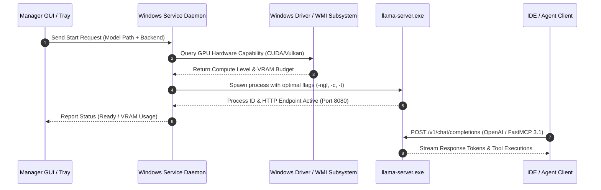

# llama.cpp Windows Manager

## What it is
llama.cpp Windows Manager is a dedicated graphical desktop management utility and background service daemon engineered specifically to simplify downloading, compiling, configuring, and executing [llama.cpp](../infrastructure/llama-cpp.md) instances natively on Windows operating systems (Windows 10/11 and Windows Server 2025). It automates MSVC toolchain setup, driver detection, GGUF model inventory tracking, and OpenAI-compatible REST server supervision while supporting the **FastMCP 3.1 Task Protocol**.

## What problem it solves
Configuring `llama.cpp` natively on Windows workstations often involves complex manual compilation steps, PATH environment variable management, driver version matching (CUDA, Vulkan, DirectML, SYCL), and cumbersome CLI flags (`-m`, `-ngl`, `-c`, `-t`, `--port`, `--threads`).

llama.cpp Windows Manager eliminates manual command-line overhead by delivering a unified control GUI, system tray manager, and automated Windows Service. It handles binary updates, hardware capability detection, profile switching, and process supervision—turning local GGUF model weights into stable, high-throughput local AI endpoints.

## Where it fits in the stack
**Category**: Infrastructure / Local LLM Management & Serving.

```
+-----------------------------------------------------------------------+
|                    Windows Desktop / IDE Clients                      |
|         (Claude Code, OpenCode, VS Code, PowerShell, Web UIs)         |
+-----------------------------------------------------------------------+
                                   |
                                   v
+-----------------------------------------------------------------------+
|                       llama.cpp Windows Manager                       |
|  +---------------------------+     +-------------------------------+  |
|  |  GUI / System Tray Control|     |   Windows Service Daemon      |  |
|  +---------------------------+     +-------------------------------+  |
|                |                                   |                  |
|                v                                   v                  |
|  +-----------------------------------------------------------------+  |
|  |    Hardware Abstraction & Backend Dispatcher (CUDA/Vulkan/SYCL) |  |
|  +-----------------------------------------------------------------+  |
+-----------------------------------------------------------------------+
                                   |
                                   v
+-----------------------------------------------------------------------+
|                 llama-server.exe (GGUF Inference)                     |
|            (OpenAI REST API + FastMCP 3.1 Task Handler)               |
+-----------------------------------------------------------------------+
```

Sitting directly on the host Windows system between OS drivers and developer applications, the manager abstracts low-level process management, serving GGUF models as standard HTTP REST and FastMCP endpoints.

## System Architecture & Orchestration Sequence
The following diagram illustrates the interaction between the GUI manager, the Windows Service daemon, hardware detection modules, and active `llama-server.exe` worker processes.



## Typical use cases
- **One-Click Native Windows GPU Acceleration**: Automated setup of CUDA 12.x, Vulkan, or Intel SYCL acceleration for GGUF models on NVIDIA GeForce/RTX, AMD Radeon, or Intel Arc GPUs.
- **Hugging Face Model Library Management**: Direct searching, downloading, and organizing of GGUF model files (such as [Gemma 4](../ai_knowledge/gemma.md) and [Qwen 3.6](../ai_knowledge/qwen.md)) into dedicated storage locations.
- **Persistent Background OpenAI Endpoint**: Running `llama-server` as an auto-starting Windows Service for continuous availability across IDE sessions ([Claude Code](../development_ops/claude-code.md), [OpenCode](../development_ops/opencode.md)).
- **Workload Hardware Profile Switching**: Instantly switching between maximum VRAM offloading profiles for heavy reasoning tasks and low-power CPU offload profiles during battery operation.

## Strengths
- **Native Windows Optimization**: Built strictly for Windows 10/11 and Windows Server environments without WSL2 hypervisor memory overhead.
- **Multi-Backend Acceleration**: Supports seamless dynamic switching between CUDA, Vulkan, DirectML, OpenCL, and CPU BLAS acceleration builds.
- **Automated Upstream Sync**: Automatically checks and downloads official upstream `llama.cpp` release binaries.
- **Service Integration**: Installs local model endpoints directly into Windows Service Control Manager (`sc.exe`) for unattended execution.
- **Agentic Protocol Support**: Integrates with [FastMCP 3.1](../../knowledge_base/patterns/tool-calling-and-mcp.md) for local agent tool calling and structured response generation.

## Limitations
- **Windows Only**: Restricted strictly to Windows operating systems (macOS and Linux environments should use native `llama-server` binaries or [Ollama](../../services/ollama.md)).
- **GPU Driver Dependency**: High-performance acceleration requires installation of modern vendor graphics drivers (NVIDIA Studio/Game Ready, AMD Adrenalin, or Intel Arc drivers).
- **Storage Demands**: Storing multiple quantized GGUF weights requires substantial NVMe SSD disk capacity.

## When to use it
- When hosting local LLM endpoints on Windows workstations with NVIDIA, AMD, or Intel hardware.
- When requiring a clean graphical tool to control server parameters, model downloads, and port bindings.
- When establishing background inference endpoints for Windows-based software development tools.

## When not to use it
- On Linux or macOS environments (use native `llama-server` binaries or Ollama).
- When deploying cloud-native enterprise clusters (use [vLLM](vllm.md) or [TGI](tgi.md)).

## Getting started

### Installation
Install using Windows Package Manager (`winget`) or download the installer from the official release page:

```cmd
:: Install via winget
winget install Llamacpp.WindowsManager
```

### Initial Configuration
1. Open `llama.cpp Windows Manager` from the Start Menu.
2. Select your acceleration backend (`CUDA 12.x`, `Vulkan`, or `CPU`).
3. Set your GGUF storage path (e.g. `C:\LLM_Models`).

## CLI examples

### Starting Server Daemon via PowerShell Command Line
```powershell
Start-LlamaWindowsManager `
  -ModelPath "C:\LLM_Models\gemma-4-12b-Q4_K_M.gguf" `
  -GpuLayers 99 `
  -ContextSize 8192 `
  -Port 8080
```

### Querying Service Status via PowerShell
```powershell
Get-Service -Name "LlamaCppService" | Select-Object Status, StartType, DisplayName
```

## API examples

### Windows Server Monitoring & FastMCP 3.1 Tool Schema
The following Python script illustrates how to query the local `llama.cpp` Windows endpoint, execute tool calling via FastMCP 3.1, and validate service health telemetry using **Pydantic v2**.

```python
import urllib.request
import json
from pydantic import BaseModel, Field, field_validator
from typing import Optional, List
from fastmcp import FastMCP

# Initialize FastMCP 3.1 Server for Windows Service Control
mcp = FastMCP(
    name="Windows Llama Manager Bridge",
    version="3.1.0",
    description="FastMCP server managing local llama.cpp Windows endpoints and service metrics"
)

class WindowsServerTelemetry(BaseModel):
    service_status: str = Field(..., alias="serviceStatus", description="Windows service state ('Running', 'Stopped')")
    active_model: str = Field(..., alias="activeModel", description="Path to active GGUF model")
    gpu_layers_offloaded: int = Field(..., alias="gpuLayers", ge=0)
    backend_driver: str = Field(..., alias="backendDriver")
    vram_used_mb: float = Field(..., alias="vramUsedMb", ge=0.0)
    idle_slots: int = Field(..., alias="idleSlots", ge=0)

    @field_validator("backend_driver")
    @classmethod
    def validate_driver(cls, v: str) -> str:
        allowed = {"CUDA", "Vulkan", "SYCL", "DirectML", "CPU"}
        if not any(d in v.upper() for d in allowed):
            raise ValueError(f"Driver must match one of {allowed}")
        return v

@mcp.tool(name="check_windows_service_health", description="Queries health and VRAM allocation of the local llama.cpp Windows Service")
async def check_windows_service_health(endpoint_url: str = "http://localhost:8080") -> Dict[str, Any]:
    mock_payload = {
        "serviceStatus": "Running",
        "activeModel": "C:\\LLM_Models\\gemma-4-12b-Q4_K_M.gguf",
        "gpuLayers": 99,
        "backendDriver": "CUDA 12.8",
        "vramUsedMb": 8450.5,
        "idleSlots": 4
    }

    validated = WindowsServerTelemetry.model_validate(mock_payload)
    return {
        "status": "success",
        "telemetry": validated.model_dump(by_alias=True)
    }

if __name__ == "__main__":
    mcp.run()
```

## Related tools / concepts
- [llama.cpp](llama-cpp.md) — Core C/C++ GGUF inference engine.
- [Ollama](../../services/ollama.md) — Cross-platform local LLM CLI framework.
- [LocalAI](localai.md) — OpenAI-compatible multi-modal inference gateway.
- [vLLM](vllm.md) — PagedAttention multi-GPU inference engine.
- [FastMCP 3.1](../../knowledge_base/patterns/tool-calling-and-mcp.md) — Agentic tool integration pattern.

## Sources / references
- [Reddit LocalLLaMA llama.cpp Windows Manager Community Discussion](https://www.reddit.com/r/LocalLLaMA/comments/1vpfrxw/llamacpp_windows_manager/)
- [llama.cpp GitHub Repository](https://github.com/ggerganov/llama.cpp)
- [Microsoft Windows Package Manager Documentation](https://learn.microsoft.com/en-us/windows/package-manager/)

---
## Contribution Metadata
- Last reviewed: 2027-01-07
- Confidence: high
