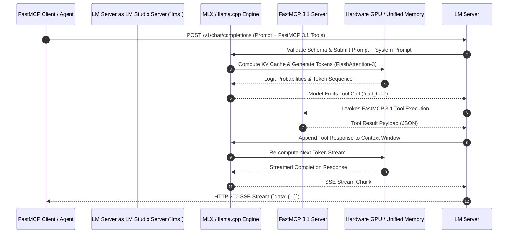

# LM Studio

## What it is
LM Studio is an enterprise-grade desktop application and local inference runtime for discovering, downloading, serving, and orchestrating open-weights LLMs (Large Language Models) and VLMs (Vision-Language Models). Built on top of high-performance C++ backends including `llama.cpp` and Apple's MLX framework, LM Studio provides both a polished graphical interface and a production-ready headless daemon (`lms`). In 2027, LM Studio serves as a foundational developer workbench for local AI engineering, supporting frontier open models such as Gemma 4, DeepSeek-V4, Qwen 3.6 VL, Llama 4, and Mistral 3, while offering native Model Context Protocol (FastMCP 3.1) integration for tool-calling agents.

## What problem it solves
Developing AI applications with cloud hosted APIs creates operational liabilities around data privacy, internet connectivity requirements, latency overhead, and unpredictable API tier pricing. Furthermore, setting up bare-metal local inference engines via command-line interface tools traditionally requires manually configuring toolchains, CUDA/Metal drivers, quantization matrices (GGUF, EXL3, AWQ), and HTTP server abstractions.

LM Studio eliminates these points of friction by providing:
1. **Unified Model Lifecycle Management**: One-click discovery, Hugging Face Hub integration, SHA-256 verification, and hardware-accelerated quantization checks.
2. **Standardized Local API Infrastructure**: A zero-configuration, OpenAI-compatible local HTTP REST and WebSocket server with strict JSON Schema and FastMCP 3.1 tool invocation capabilities.
3. **Hardware Acceleration Optimization**: Automatic backend selection, layer offloading heuristics, and memory allocation tuning across Apple Silicon unified memory architectures (M3/M4/M5 Max/Ultra) and NVIDIA RTX/H100 series GPUs.
4. **Local Multi-Device Swarming**: Distributed model context partitioning across adjacent local devices via the LM Studio Bionic mesh protocol.

## Where it fits in the stack
**AI & Knowledge / Local Inference Runtime & Workbench**. LM Studio operates as the bridge between raw model weights and client applications, sitting directly above low-level inference backends (`llama.cpp`, `mlx-engine`) and below client applications, agent frameworks, and IDE extensions (e.g., Cursor, Claude Code, Cline, or LangChain).

```
+-----------------------------------------------------------------------+
|                 Application Layer (IDE, Agents, RAG)                  |
|          (Cursor, Claude Code, FastMCP 3.1 Clients, LangChain)        |
+-----------------------------------------------------------------------+
                                   | (OpenAI REST / FastMCP 3.1 IPC)
                                   v
+-----------------------------------------------------------------------+
|                          LM Studio Runtime                            |
|  +-----------------------------------------------------------------+  |
|  | LM Studio Desktop GUI / Headless Daemon (`lms`)                 |  |
|  +-----------------------------------------------------------------+  |
|  | FastMCP 3.1 Host & Tool Registry | Structured Output Engine     |  |
|  +-----------------------------------------------------------------+  |
|  | LM Studio Bionic Swarm Mesh       | Dynamic KV Cache Allocator  |  |
+-----------------------------------------------------------------------+
                                   |
           +-----------------------+-----------------------+
           | (Metal / Unified Memory)                      | (CUDA / TensorRT)
           v                                               v
+-----------------------+                       +-----------------------+
|      MLX Backend      |                       |   llama.cpp / EXL3    |
| (Apple M3/M4/M5 Silicon)|                       | (NVIDIA / AMD / Vulkan)|
+-----------------------+                       +-----------------------+
```

## Typical use cases
- **Privacy-Preserving Code & Document Intelligence**: Processing enterprise codebases, financial filings, or medical records entirely on local hardware without sending telemetry or prompts to external cloud providers.
- **FastMCP 3.1 Tool-Calling Workbench**: Prototyping and testing agentic workflows locally using standard MCP tools (e.g., filesystem, git, SQL, shell execution) before deploying to production cloud infrastructure.
- **Off-Grid & Air-Gapped Agent Operations**: Running autonomous reasoning tasks, code generation, and synthetic data pipelines in environments with zero internet access or strict compliance mandates.
- **Local Model Benchmarking & Evaluation**: Head-to-head performance comparisons of quantization formats (Q4_K_M, Q8_0, FP16) and token throughput across Apple Silicon M-series chips and discrete GPUs.
- **Hybrid Cloud Fallback Node**: Serving as an automatic low-cost local fallback provider in multi-provider LLM routers when cloud endpoints experience rate limits or outages.

## Strengths
- **Native Apple Silicon M-Series Supremacy**: Deep integration with Metal performance shaders and Apple's MLX engine allows chips like the M4/M5 Max (up to 128GB unified memory) and M4/M5 Ultra (up to 512GB) to run models like DeepSeek-V4 (Q4) and Gemma 4 at production-ready token generation speeds (>35 tokens/sec).
- **FastMCP 3.1 Native Host & Client Support**: Built-in support for registering and managing Model Context Protocol servers natively, enabling seamless local tool execution with built-in sandbox security.
- **Zero-Config OpenAI API Server**: Fully compliant OpenAI API server supporting `/v1/models`, `/v1/chat/completions`, `/v1/embeddings`, and `/v1/responses` endpoints with real-time SSE streaming.
- **LM Studio Bionic Distributed Swarm**: Peer-to-peer memory pooling across local network devices, allowing splitting 70B+ parameter model layers across multiple Mac Studio or Linux GPU nodes.
- **Grammar-Constrained Generation**: Native support for GBNF (GGML BNF) and JSON Schema constraints to guarantee structural output compliance at the logit generation level.
- **Granular Hardware Tuning**: Direct control over GPU offload layer counts, context window sizes (up to 128k/1M tokens with FlashAttention-3), CPU thread pinning, and KV cache quantization (FP16, Q8_0, Q4_0).

## Limitations
- **GUI Overhead in Headless Environments**: While the `lms` CLI enables background daemon operation, the core application packaging contains GUI dependencies that require desktop runtime libs on Linux.
- **Proprietary Core Packaging**: Although the underlying inference engines (`llama.cpp`, `MLX`) are open-source, the LM Studio UI shell, Bionic swarm protocol, and desktop orchestrator remain closed-source commercial software.
- **Multi-Tenant Rate Limiting & Queueing**: Lacks advanced cloud enterprise features like tenant-level token bucket rate limiting, multi-organization billing, and dynamic load balancing across heterogeneous nodes (where [vLLM](../infrastructure/vllm.md) or [SGLang](../infrastructure/sglang.md) excel).

## When to use it
- When building local AI tools, agent frameworks, or IDE plugins on macOS, Windows, or Linux that require an OpenAI-compatible API backend.
- When evaluating frontier open models (Gemma 4, DeepSeek-V4, Qwen 3.6 VL) with fast setup and visual parameter tuning.
- When utilizing Apple Silicon workstations to maximize unified memory bandwidth for local inference.
- When testing agentic FastMCP 3.1 tool workflows locally before committing to cloud-hosted agent deployments.

## When not to use it
- When building high-throughput, multi-tenant enterprise production serving clusters handling hundreds of concurrent users (use [vLLM](../infrastructure/vllm.md) or [TGI](../infrastructure/tgi.md)).
- When deploying to headless Minimal Docker/Kubernetes containers requiring lightweight Linux binaries (use [Ollama](../../services/ollama.md) or standalone `llama.cpp`).

## Getting started
1. **Download & Installation**:
   Download the installer from the official portal or install via command-line package managers:
   ```bash
   # Install lms CLI on macOS using Homebrew
   brew install lmstudio

   # Verify CLI installation
   lms --version
   ```

2. **Discover & Download Models**:
   Search Hugging Face Hub directly through the `lms` CLI:
   ```bash
   # Search for Gemma 4 models
   lms search gemma-4

   # Download Gemma 4 9B Instruct GGUF
   lms get lmstudio-community/gemma-4-9b-it-GGUF
   ```

3. **Launch Local OpenAI Server**:
   Start the background daemon server listening on port 1234:
   ```bash
   # Load model onto GPU and start OpenAI server
   lms load lmstudio-community/gemma-4-9b-it-GGUF --gpu max --context-length 16384
   lms server start --port 1234
   ```

## Architecture / Key Components



### Key Architectural Layers
1. **Daemon Engine (`lms`)**: The underlying background process managing process lifecycles, IPC, port bindings, memory locks, and IPC streaming.
2. **FastMCP 3.1 Execution Runtime**: Manages standard Model Context Protocol tool definitions, handles JSON-RPC 2.0 transport over stdin/stdout or SSE, and injects tool schemas into model prompts automatically.
3. **Hardware Dispatcher**: Automatically detects platform capabilities—selecting Apple Metal performance shaders for Apple Silicon or CUDA/TensorRT for NVIDIA hardware.
4. **Context Manager & KV Cache**: Controls context window sliding, prompt caching, and memory-quantized KV states (e.g., Q8_0 KV cache) to minimize memory footprints during multi-turn chats.

## CLI examples
The modern `lms` CLI provides comprehensive control over loaded models, GPU allocations, and FastMCP server registrations:

```bash
# Check status of running LM Studio server and active models
lms status

# List loaded models and memory footprints
lms ps

# Load model with specific quantization and custom thread pinning
lms load lmstudio-community/gemma-4-9b-it-GGUF \
  --gpu max \
  --context-length 32768 \
  --threads 8 \
  --ttl 3600

# Register a local FastMCP 3.1 filesystem tool server
lms mcp register filesystem-server \
  --command npx \
  --args "-y @modelcontextprotocol/server-filesystem /Users/developer/projects"

# Inspect active FastMCP 3.1 tool servers
lms mcp list

# Unload model to free GPU VRAM / Unified Memory
lms unload --all

# Stop background server
lms server stop
```

## API examples

The following Python script demonstrates invoking an LM Studio local server using the official `openai` SDK alongside `pydantic` v2 for structured output validation and FastMCP 3.1 tool payload schema construction:

```python
import os
import json
from typing import List, Optional
from openai import OpenAI
from pydantic import BaseModel, Field

# Define Pydantic v2 schemas for structured output extraction
class SecurityVulnerability(BaseModel):
    cve_id: Optional[str] = Field(default=None, description="CVE identifier if applicable")
    severity: str = Field(description="Severity rating: LOW, MEDIUM, HIGH, CRITICAL")
    component: str = Field(description="Affected software component or file path")
    description: str = Field(description="Detailed explanation of the flaw")
    remediation: str = Field(description="Recommended fix or patch")

class SecurityAuditReport(BaseModel):
    target_project: str = Field(description="Name of the audited project")
    vulnerabilities: List[SecurityVulnerability] = Field(default_factory=list)
    overall_risk_score: float = Field(description="Risk score from 0.0 to 10.0")

# Initialize OpenAI client pointing to local LM Studio daemon
client = OpenAI(
    base_url="http://localhost:1234/v1",
    api_key="lmstudio"  # LM Studio does not enforce API keys locally
)

# FastMCP 3.1 Tool Schema definition passed in standard OpenAI format
mcp_tool_definition = {
    "type": "function",
    "function": {
        "name": "analyze_codebase_security",
        "description": "Scan a target repository path for OWASP top 10 security vulnerabilities.",
        "parameters": {
            "type": "object",
            "properties": {
                "repo_path": {
                    "type": "string",
                    "description": "Absolute filesystem path to code repository"
                },
                "strict_mode": {
                    "type": "boolean",
                    "description": "Whether to perform deep AST analysis"
                }
            },
            "required": ["repo_path"]
        }
    }
}

def run_local_inference():
    print("Sending structured analysis query to local LM Studio server...")

    # Send request with response_format enforced via JSON Schema
    response = client.chat.completions.create(
        model="gemma-4-9b-instruct",
        messages=[
            {
                "role": "system",
                "content": "You are an expert security auditor running on local hardware via LM Studio."
            },
            {
                "role": "user",
                "content": (
                    "Perform a security audit on project 'AuthService'. "
                    "Found SQL injection in 'src/db.py' line 42 (HIGH risk) and hardcoded API secret "
                    "in 'config.yaml' (CRITICAL risk). Provide response in JSON format matching schema."
                )
            }
        ],
        tools=[mcp_tool_definition],
        tool_choice="auto",
        temperature=0.2,
        response_format={
            "type": "json_schema",
            "json_schema": {
                "name": "SecurityAuditReport",
                "schema": SecurityAuditReport.model_json_schema()
            }
        }
    )

    message = response.choices[0].message

    # Check if model requested FastMCP tool execution
    if message.tool_calls:
        for tool_call in message.tool_calls:
            print(f"Model requested tool call: {tool_call.function.name}")
            print(f"Tool arguments: {tool_call.function.arguments}")
    elif message.content:
        # Parse output into Pydantic model
        report_json = json.loads(message.content)
        report = SecurityAuditReport.model_validate(report_json)
        print("\n--- Parsed Pydantic V2 Security Audit Report ---")
        print(f"Project: {report.target_project}")
        print(f"Risk Score: {report.overall_risk_score}/10.0")
        for vuln in report.vulnerabilities:
            print(f" - [{vuln.severity}] {vuln.component}: {vuln.description}")

if __name__ == "__main__":
    run_local_inference()
```

## Related tools / concepts
- [Local LLMs (Ollama, MLX, llama.cpp)](../ai_knowledge/local_llms.md)
- [Ollama](../../services/ollama.md)
- [Jan.ai](jan-ai.md)
- [Msty](msty.md)
- [Claude Code](../development_ops/claude-code.md)
- [llama.cpp](../infrastructure/llama-cpp.md)
- [MLX](mlx.md)
- [vLLM](../infrastructure/vllm.md)
- [SGLang](../infrastructure/sglang.md)
- [Inference Engines](../infrastructure/index.md)

## Sources / References
- [LM Studio Official Portal](https://lmstudio.ai/)
- [Introducing LM Studio Bionic](https://lmstudio.ai/blog/introducing-lm-studio-bionic)
- [LM Studio CLI (`lms`) Reference Guide](https://lmstudio.ai/docs/cli)
- [FastMCP 3.1 Task Protocol Specifications](https://modelcontextprotocol.io/)
- [Apple Silicon Metal & Unified Memory for LLMs](https://developer.apple.com/metal/tensorflow-plugin/)

## Contribution Metadata
- Last reviewed: 2027-01-07
- Confidence: high
