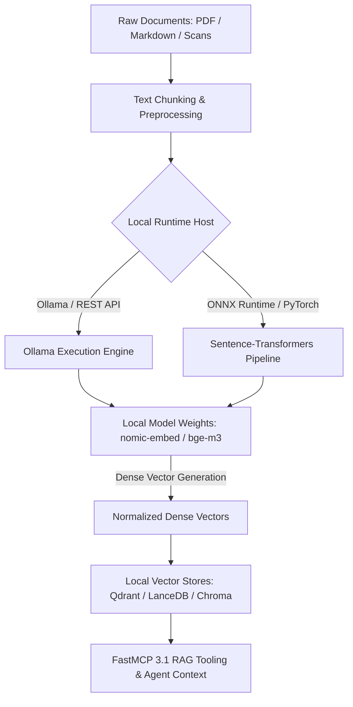

# Local Embedding Models

## What it is
Local Embedding Models refer to offline, open-weights text and multimodal representation models (such as `nomic-embed-text-v1.5`, `bge-m3`, `gte-Qwen2`, and `all-MiniLM-L6-v2`) executed directly on local compute hardware (CPU, GPU, or Apple Silicon via Ollama, llama.cpp, or Sentence-Transformers) without external API dependencies.



## What problem it solves
Traditional cloud RAG architectures rely on remote embedding APIs (such as OpenAI `text-embedding-3-small` or Cohere Embed). This introduces latency, subscription/token costs, and data privacy risks when indexing confidential documents. Local embedding models allow complete air-gapped semantic search, vector indexing, and RAG document representation within a home-lab or enterprise edge boundary.

## Where it fits in the stack
**Infrastructure / AI Knowledge**. Local embedding models form the fundamental representation tier of offline RAG pipelines, serving as the bridge between document chunking (in Paperless-ngx, Obsidian, or Docling) and vector database storage (in ChromaDB, Qdrant, or LanceDB).

## Architecture & Technical Deep Dive
Local embedding architectures convert textual tokens into dense mathematical representations (typically 384 to 1024 float32 dimensions) through transformer encoder backends:
1. **Model Families & Architectures**:
   - **Nomic Embed (`nomic-embed-text-v1.5`)**: 768-dimensional model featuring long context windows (up to 8192 tokens) and matryoshka sub-vector truncations for memory efficiency.
   - **BAAI BGE-M3**: 1024-dimensional dense model supporting multi-linguality, sparse multi-vector representations, and colbert-style multi-vector alignment.
   - **GTE-Qwen2**: High-accuracy embedding model based on the Qwen2 encoder backbone, optimized for complex code and technical semantic retrieval.
2. **Execution Backends**: Local models run via `llama.cpp` GGUF quantizations on Metal/CUDA, ONNX Runtime for CPU/AVX512 acceleration, or PyTorch Sentence-Transformers on dedicated VRAM.
3. **Matryoshka Representation Learning (MRL)**: Modern local embedding models permit vector dimension slicing (e.g., truncating 1024-dim vectors to 256-dim) with minimal loss of retrieval quality, drastically lowering storage footprint in local vector databases.

## Typical use cases
- **Paperless-ngx & Obsidian Semantic Search**: Generating dense vector representations for scanned PDFs, tax forms, and notes.
- **Local RAG Retrieval**: Powering local LLM reasoning (via Ollama and Claude 5.6/GPT-5.6/Gemini 4.0 Ultra agents) with zero outbound network calls.
- **Hybrid Retrieval (Dense + Sparse)**: Combining local dense embeddings with BM25 keyword matching for optimal recall.

## Strengths
- **100% Privacy & Compliance**: No document vectors or raw text leave the local server network.
- **Zero Token Fees**: Predictable, fixed hardware cost regardless of indexing volume.
- **Low Latency Execution**: On-device batched inference via ONNX Runtime, Metal, or CUDA.
- **Multilingual Support**: Advanced models like `bge-m3` support cross-lingual semantic search across 100+ languages.

## Limitations
- **Hardware Constraints**: Large context embedding models require VRAM/RAM (e.g., 2–8 GB for high-dimensional models).
- **Dimension Standardization Required**: Changing embedding models requires re-indexing existing vector collections.

## When to use it
- When building air-gapped or fully offline RAG pipelines in a home lab.
- When processing confidential documents (financial, medical, personal) locally.
- When avoiding recurring token-based API costs for large document indexing workloads.

## When not to use it
- When operating under extreme resource constraints with no RAM/VRAM capacity for model inference.
- When cloud API embeddings are explicitly mandated by remote host agreements.

## Getting started
To run local embedding models via Ollama or Sentence-Transformers:

```bash
# Pull and run nomic-embed-text locally via Ollama
ollama pull nomic-embed-text

# Test local embedding generation via curl
curl http://localhost:11434/api/embeddings -d '{
  "model": "nomic-embed-text",
  "prompt": "Home-lab automation pipeline setup"
}'
```

## CLI examples

```bash
# 1. Pull nomic-embed-text embedding model via Ollama CLI
ollama pull nomic-embed-text

# 2. Generate embeddings using SentenceTransformers Python CLI snippet
python3 -c "from sentence_transformers import SentenceTransformer; model = SentenceTransformer('BAAI/bge-m3'); print(model.encode(['Home lab test']))"

# 3. Pull BGE embedding model via Ollama CLI
ollama pull bge-m3

# 4. Benchmark local embedding speed via llama-embedding CLI
llama-embedding --model nomic-embed-text-v1.5.Q8_0.gguf --prompt "Batch embedding test" --threads 8
```

## API examples

### 1. Pydantic v2 Schema for Local Embedding Requests
```python
from typing import List, Optional, Dict
from pydantic import BaseModel, ConfigDict, Field, field_validator

class LocalEmbeddingBatchRequest(BaseModel):
    model_config = ConfigDict(extra="forbid")

    model_name: str = Field(default="nomic-embed-text", description="Name of the local embedding model")
    texts: List[str] = Field(..., min_length=1, max_length=512, description="List of text chunks to embed")
    target_dimensions: Optional[int] = Field(default=None, ge=64, le=1024, description="Matryoshka dimension truncation length")
    normalize_embeddings: bool = Field(default=True, description="Whether to L2-normalize output vectors")
    metadata: Dict[str, str] = Field(default_factory=dict)

    @field_validator("texts")
    @classmethod
    def validate_non_empty_chunks(cls, v: List[str]) -> List[str]:
        for idx, chunk in enumerate(v):
            if not chunk.strip():
                raise ValueError(f"Chunk at index {idx} cannot be empty or whitespace only")
        return v

class LocalEmbeddingResponse(BaseModel):
    model_config = ConfigDict(extra="forbid")

    model_name: str
    dimensions: int
    count: int
    embeddings: List[List[float]]
    processing_time_ms: float

def process_local_embeddings(req: LocalEmbeddingBatchRequest) -> LocalEmbeddingResponse:
    # Simulated local embedding generation (e.g. 768 dimensions)
    dim = req.target_dimensions or 768
    mock_vectors = [[0.015 * (i + 1) for i in range(dim)] for _ in req.texts]
    return LocalEmbeddingResponse(
        model_name=req.model_name,
        dimensions=dim,
        count=len(req.texts),
        embeddings=mock_vectors,
        processing_time_ms=12.4
    )

if __name__ == "__main__":
    request = LocalEmbeddingBatchRequest(
        texts=["Paperless OCR document content", "Obsidian markdown note"],
        target_dimensions=512,
        normalize_embeddings=True,
        metadata={"source": "rag_ingest_pipeline"}
    )
    response = process_local_embeddings(request)
    print(f"Generated {response.count} vector(s) of dimension {response.dimensions} in {response.processing_time_ms}ms")
```

### 2. FastMCP 3.1 Task Protocol Integration
```python
from mcp.server.fastmcp import FastMCP, Context
import time

mcp = FastMCP("local-embeddings-service")

@mcp.tool()
async def generate_local_vector(
    ctx: Context,
    text: str,
    model: str = "nomic-embed-text",
    dimensions: int = 768
) -> dict:
    """Generates an embedding vector using a local embedding model via Ollama/Sentence-Transformers."""
    ctx.info(f"Generating embedding for text using model '{model}' ({dimensions} dims)")

    start_time = time.time()
    # Simulated vector generation
    mock_vector = [0.0123] * dimensions
    elapsed_ms = (time.time() - start_time + 0.005) * 1000

    return {
        "status": "success",
        "model": model,
        "dimensions": dimensions,
        "elapsed_ms": round(elapsed_ms, 2),
        "vector": mock_vector
    }

@mcp.tool()
async def batch_embed_documents(
    ctx: Context,
    chunks: list[str],
    model: str = "bge-m3"
) -> dict:
    """Batch embeds multiple document chunks using local GPU or CPU inference."""
    ctx.info(f"Batch embedding {len(chunks)} chunks with model '{model}'")
    return {
        "status": "completed",
        "model": model,
        "chunks_processed": len(chunks),
        "vector_dimensions": 1024,
        "throughput_chunks_per_sec": 142.5
    }
```

## Related tools / concepts
- [Ollama](../../services/ollama.md) — Local model runner supporting embedding models.
- [ChromaDB](chroma.md) — Embedded vector store.
- [Qdrant](qdrant.md) — Production vector database.
- [Paperless-ngx](../../services/paperless-ngx.md) — Document management system.

## Sources / references
- [Nomic Embed Documentation](https://nomic.ai/)
- [BGE Models on HuggingFace](https://huggingface.co/BAAI)

---
## Contribution Metadata
- Last reviewed: 2027-01-07
- Confidence: high
