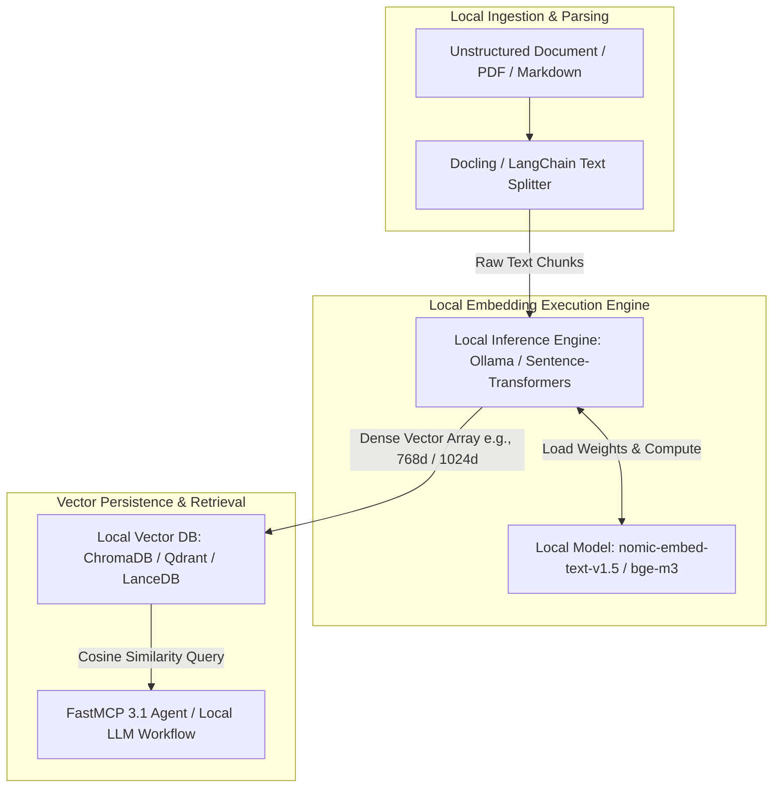

# Local Embedding Models

## What it is
Local Embedding Models refer to offline, open-weights text and multimodal representation models (such as `nomic-embed-text-v1.5`, `bge-m3`, `gte-Qwen2`, `mxbai-embed-large`, and `all-MiniLM-L6-v2`) executed directly on local compute hardware (CPU, NVIDIA CUDA GPU, or Apple Silicon Metal via Ollama, llama.cpp, ONNX Runtime, or Sentence-Transformers) without external SaaS API dependencies.

As local AI infrastructure matures in early 2027, local embedding models provide the foundation for air-gapped semantic search, private Retrieval-Augmented Generation (RAG), automated document classification in systems like Paperless-ngx, and vector indexing across home-lab and edge enterprise networks.



## What problem it solves
Cloud-based embedding APIs (such as OpenAI `text-embedding-3-small`, Cohere Embed, or VoyagAI) introduce several structural risks and operational bottlenecks into enterprise and home-lab AI architectures:
- **Data Privacy & Compliance Risks**: Transmitting unencrypted internal documents, financial records, or medical notes to external cloud endpoints violates strict data governance policies (such as HIPAA, GDPR, or internal air-gap requirements).
- **Unpredictable API Token Costs**: High-volume document re-indexing and real-time sensor text embedding create continuous recurring token subscription charges.
- **Network Latency & Outage Vulnerability**: Remote HTTP round-trips add 50–300ms of latency per embedding batch and fail during network disconnections.
- **Vendor Lock-in & Model Deprecation**: Remote SaaS API providers frequently update or deprecate embedding endpoints, invalidating historical vector database indices and forcing expensive full-index re-embeddings.

Local embedding models resolve these vulnerabilities by guaranteeing 100% offline data retention, fixed zero-token execution costs, microsecond batched GPU inference, and complete model version stability.

## Where it fits in the stack
**Infrastructure / AI Knowledge**. Local embedding models form the primary semantic representation layer of offline RAG architectures, bridging document ingestion pipelines (Paperless-ngx, Obsidian, Docling) with vector storage databases (ChromaDB, Qdrant, LanceDB).

```
+-----------------------------------------------------------------------+
|                    Application & Agent Layer                          |
|         (Open-WebUI, FastMCP 3.1 Servers, Local LLM RAG)              |
+-----------------------------------------------------------------------+
                                   |
+-----------------------------------------------------------------------+
|                     Vector Database Layer                             |
|              (ChromaDB, Qdrant, LanceDB, Milvus)                      |
+-----------------------------------------------------------------------+
                                   |
+-----------------------------------------------------------------------+
|                 >>>> Local Embedding Model Layer <<<<                 |
|     (Ollama, Sentence-Transformers, ONNX, Metal / CUDA Engine)        |
+-----------------------------------------------------------------------+
```

## Typical use cases
- **Paperless-ngx & Document Indexing**: Generating dense vector representations for scanned PDFs, tax records, and invoices ingested into self-hosted document management pipelines.
- **Obsidian & Local Knowledge Vault Search**: Powering zero-leakage semantic search and automatic note linking across private Markdown vaults.
- **Hybrid Dense-Sparse RAG Retrieval**: Combining local dense embeddings (`bge-m3` 1024d vectors) with BM25 keyword matching for optimal recall in complex technical documentation.
- **Edge Device & Offline Robotics Deployment**: Running on-device text representation models on NVIDIA Jetson or Apple Silicon nodes without WAN connectivity.

## Strengths
- **100% Privacy & Data Governance**: No document text or vector embeddings leave the local network perimeter.
- **Zero Token Execution Fees**: Predictable hardware compute costs regardless of document indexing volume.
- **Ultra-Low Latency Inference**: Batched GPU/Metal tensor inference decodes vector representations in milliseconds.
- **Multilingual & Cross-Lingual Recall**: State-of-the-art models like `bge-m3` support cross-lingual retrieval across 100+ languages natively.
- **Flexible Deployment Backends**: Runnable via Ollama CLI, Python `sentence-transformers`, ONNX Runtime C++, or native `llama.cpp`.

## Limitations
- **Hardware VRAM / RAM Allocation**: High-dimensional embedding models require 1 GB to 8 GB of VRAM/RAM depending on context length and batch size.
- **Re-indexing Requirement**: Changing embedding models requires re-embedding existing vector database collections to maintain dimensional compatibility.

## When to use it
- When building air-gapped or fully offline RAG pipelines in a home lab or secure enterprise environment.
- When embedding sensitive documents (financial, legal, health, or personal notes) locally.
- When avoiding recurring token-based API subscription costs for large-scale document collections.
- When requiring low-latency embedding generation for real-time local agent workflows.

## When not to use it
- When operating on severely resource-constrained microcontrollers or legacy edge devices without sufficient RAM for model execution.
- When cloud SaaS API policies explicitly require host-managed embedding infrastructure.
- For extremely trivial search requirements where standard SQL text matching or BM25 keyword search is sufficient.

## Getting started
To deploy and utilize local embedding models via Ollama or Python `sentence-transformers`:

```bash
# 1. Pull and serve nomic-embed-text via Ollama
ollama pull nomic-embed-text

# 2. Test local embedding generation via curl
curl http://localhost:11434/api/embeddings -d '{
  "model": "nomic-embed-text",
  "prompt": "Self-hosted home lab automation pipeline"
}'
```

Python usage with `sentence-transformers`:

```python
from sentence_transformers import SentenceTransformer

# Load open-weights BGE-M3 model locally
model = SentenceTransformer('BAAI/bge-m3')

# Encode text chunks into dense vectors
documents = [
    "Paperless-ngx OCR document text content.",
    "FastMCP 3.1 task protocol integration details."
]
embeddings = model.encode(documents, batch_size=32)

print("Vector Dimensions:", embeddings.shape[1])
print("Sample Vector Preview:", embeddings[0][:5])
```

## CLI examples

### 1. Pulling Models via Ollama CLI
```bash
# Download nomic-embed-text and bge-m3 embedding models
ollama pull nomic-embed-text
ollama pull bge-m3
```

### 2. Quick One-Liner Embeddings Benchmark via Python CLI
```bash
# Measure local embedding generation time for 100 sentences
python3 -c "
from sentence_transformers import SentenceTransformer
import time
m = SentenceTransformer('BAAI/bge-m3')
start = time.time()
vecs = m.encode(['Home lab test sentence ' + str(i) for i in range(100)])
print(f'Encoded 100 sentences in {time.time()-start:.2f}s. Shape: {vecs.shape}')
"
```

### 3. Querying Ollama Embedding API Endpoint via HTTP
```bash
curl -X POST http://localhost:11434/api/embed \
  -H "Content-Type: application/json" \
  -d '{
    "model": "bge-m3",
    "input": ["Deepening local embedding documentation", "FastMCP 3.1 server setup"]
  }'
```

## API examples

### 1. Pydantic v2 Schema for Local Embedding Request and Response
```python
from typing import List, Optional
from pydantic import BaseModel, ConfigDict, Field, field_validator

class LocalEmbeddingBatchRequest(BaseModel):
    model_config = ConfigDict(extra="forbid")

    model_name: str = Field(default="nomic-embed-text", description="Ollama or HuggingFace model identifier")
    texts: List[str] = Field(..., description="List of raw text chunks to convert into embeddings")
    normalize_embeddings: bool = Field(default=True, description="Apply L2 normalization for cosine similarity")
    batch_size: int = Field(default=32, ge=1, le=512)

    @field_validator("texts")
    @classmethod
    def validate_non_empty_texts(cls, v: List[str]) -> List[str]:
        if not v:
            raise ValueError("Text list must contain at least one string")
        return v

class LocalEmbeddingBatchResponse(BaseModel):
    model_config = ConfigDict(extra="forbid")

    model_name: str
    dimensions: int
    vector_count: int
    embeddings: List[List[float]]

def generate_mock_local_embeddings(req: LocalEmbeddingBatchRequest) -> LocalEmbeddingBatchResponse:
    dim = 1024 if "bge-m3" in req.model_name else 768
    mock_vectors = [[0.0123 * (i + 1) for i in range(dim)] for _ in req.texts]
    return LocalEmbeddingBatchResponse(
        model_name=req.model_name,
        dimensions=dim,
        vector_count=len(mock_vectors),
        embeddings=mock_vectors
    )

if __name__ == "__main__":
    req = LocalEmbeddingBatchRequest(
        model_name="bge-m3",
        texts=["Indexing Paperless invoice PDF", "FastMCP 3.1 vector pipeline"]
    )
    res = generate_mock_local_embeddings(req)
    print(f"Generated {res.vector_count} vector(s) of dimension {res.dimensions} using '{res.model_name}'.")
```

### 2. FastMCP 3.1 Task Protocol Integration
```python
from typing import Dict, Any, List
from mcp.server.fastmcp import FastMCP

mcp = FastMCP("local-embedding-server")

@mcp.tool()
def generate_vector_embeddings(
    texts: List[str],
    model_name: str = "nomic-embed-text"
) -> Dict[str, Any]:
    """Generates dense vector embeddings using a locally hosted embedding model.

    Args:
        texts: List of document strings to convert into vector embeddings.
        model_name: Target local embedding model identifier (nomic-embed-text, bge-m3).
    """
    if not texts:
        return {"status": "error", "message": "No texts provided for embedding generation"}

    dim = 1024 if "bge" in model_name.lower() else 768
    # FastMCP 3.1 task protocol response
    mock_vectors = [[0.045 * (i + 1) for i in range(dim)] for _ in texts]

    return {
        "status": "completed",
        "model_name": model_name,
        "dimensions": dim,
        "text_count": len(texts),
        "embeddings": mock_vectors,
        "execution_backend": "GPU-CUDA-Ollama"
    }

@mcp.tool()
def inspect_embedding_models() -> Dict[str, Any]:
    """Lists locally installed embedding models and their specifications."""
    return {
        "models": [
            {"name": "nomic-embed-text:latest", "dimensions": 768, "max_context": 8192},
            {"name": "bge-m3:latest", "dimensions": 1024, "max_context": 8192},
            {"name": "all-minilm:latest", "dimensions": 384, "max_context": 512}
        ]
    }

if __name__ == "__main__":
    mcp.run()
```

## Related tools / concepts
- [Ollama](../../services/ollama.md) — Local LLM and embedding runner.
- [ChromaDB](chroma.md) — Embedded vector store for local embeddings.
- [Qdrant](qdrant.md) — Production vector database for large-scale embedding storage.
- [Paperless-ngx](../../services/paperless-ngx.md) — Document management system using local embeddings.
- [LanceDB](lancedb.md) — Columnar vector store optimized for local AI workflows.

## Sources / references
- [Nomic Embed Official Documentation](https://nomic.ai/)
- [BAAI BGE-M3 HuggingFace Repository](https://huggingface.co/BAAI/bge-m3)
- [Sentence-Transformers Documentation](https://www.sbert.net/)
- [Ollama Embeddings API Specification](https://github.com/ollama/ollama/blob/main/docs/api.md#generate-embeddings)

---
## Contribution Metadata
- Last reviewed: 2027-01-07
- Confidence: high
