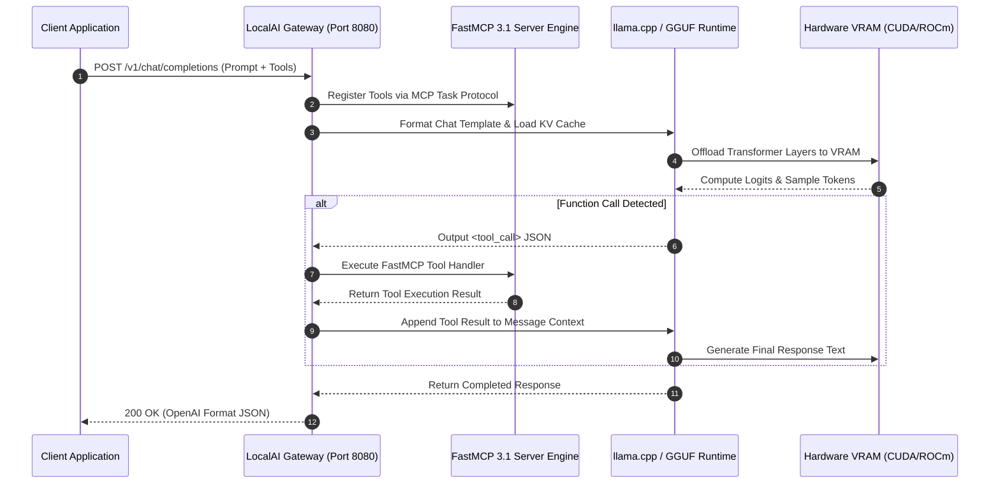

# LocalAI

## What it is
LocalAI is a self-hosted, OpenAI-compatible inference platform for running local models without depending on proprietary cloud APIs. It acts as a multi-modal proxy that can serve LLMs, image generation, audio-to-text, and text-to-audio. In early 2027, it has expanded to support [FastMCP 3.1 Task Protocol](../../knowledge_base/patterns/tool-calling-and-mcp.md) natively, enabling local frontier models (like Gemma 4, DeepSeek-V4, Qwen 3.6 VL) to call tools natively and interact with stateful servers in secure sandboxed environments.

## What problem it solves
It gives teams a local or self-hosted way to serve models behind a familiar API surface, which reduces vendor dependence and ensures data privacy. It unifies disparate local inference backends (llama.cpp, diffusers, whisper.cpp, bark, exllamav3) under a single, standard API, solving the fragmentation problem in the local AI ecosystem.

By standardizing client communication through OpenAI-compatible REST endpoints and FastMCP 3.1 RPC interfaces, developers can drop LocalAI in as a seamless backend for agentic tools, IDE extensions ([Claude Code](../development_ops/claude-code.md), [Aider](../development_ops/aider.md)), and enterprise RAG platforms without changing upstream code.

## Where it fits in the stack
**Category**: Infrastructure / Local Inference Gateway & Serving Platform.

```
+-----------------------------------------------------------------------+
|                    Client / Agentic Applications                      |
|      (Claude Code, Windsurf, Open-WebUI, n8n, Home Assistant)        |
+-----------------------------------------------------------------------+
                                   |
                                   v
+-----------------------------------------------------------------------+
|                           LocalAI Gateway                             |
|  +---------------------------+     +-------------------------------+  |
|  |  OpenAI REST API Adapter  |     |   FastMCP 3.1 Server Engine   |  |
|  +---------------------------+     +-------------------------------+  |
|                |                                   |                  |
|                v                                   v                  |
|  +-----------------------------------------------------------------+  |
|  |                     Backend Dispatcher                          |  |
|  +-----------------------------------------------------------------+  |
+-----------------------------------------------------------------------+
        |                  |                   |                  |
        v                  v                   v                  v
+---------------+  +---------------+  +----------------+  +-------------+
|   llama.cpp   |  |   Diffusers   |  |  whisper.cpp   |  |  ExLlamaV3  |
|  (GGUF Text)  |  |  (SD / Flux)  |  | (Audio Trans)  |  | (EXL3 High) |
+---------------+  +---------------+  +----------------+  +-------------+
```

Sitting between application code and low-level C++/Rust inference runtimes, LocalAI serves as the unified orchestration gateway, insulating systems from backend driver changes while enforcing security policy and tool authorization.

## System Architecture & Processing Sequence
The diagram below details the sequence of a tool-calling chat completion request routed through LocalAI to a GGUF backend, including FastMCP 3.1 tool extraction and execution.



## Typical use cases
- **Privacy-First Enterprise AI APIs**: Serving models internally within air-gapped networks where compliance strictly prohibits data transmission to external cloud services.
- **Cost-Controlled RAG Pipelines**: Powering high-throughput document vectorization and retrieval without incurring per-token cloud API bills.
- **Local Smart Home Automation**: Integrating speech-to-text (Whisper), reasoning (Gemma 4), and text-to-speech (Piper) directly into [Home Assistant](../../services/home-assistant.md) or [n8n](../../services/n8n.md).
- **Offline Software Engineering**: Running local coding assistants with [Claude Code](../development_ops/claude-code.md) or [Aider](../development_ops/aider.md) while disconnected from public networks.

## Strengths
- **Standardized Drop-In API**: Full parity with OpenAI chat completions, embeddings, transcriptions, audio speech, and image generation endpoints.
- **Multi-Backend Architecture**: Dynamically manages llama.cpp, diffusers, whisper.cpp, stablediffusion-cpp, and bark backends in a single runtime binary.
- **Cross-Platform Hardware Acceleration**: Optimized support for NVIDIA CUDA 12.8, AMD ROCm 6.3, Intel OneAPI, Vulkan, and Apple Metal.
- **Agentic Capability**: Native tool-calling support and [FastMCP 3.1 Task Protocol](../../knowledge_base/patterns/tool-calling-and-mcp.md) integration, including secure sandboxed tool execution.
- **Model Gallery Automation**: One-click downloading and installation of pre-configured YAML model cards directly from community galleries.

## Limitations
- **Configuration Overhead**: Fine-tuning YAML configuration files for multiple backends and thread/batch settings requires technical expertise compared to simpler GUI runners.
- **Heavy Resource Consumption**: Full-featured All-In-One (AIO) Docker images can exceed 40GB in size and require significant GPU VRAM for multi-modal operation.
- **Backend Sync Delays**: Upstream updates to underlying libraries (such as llama.cpp GGUF format revisions) can occasionally require waiting for LocalAI releases.

## When to use it
- When you need a single, unified API surface for heterogeneous AI workloads (text, vision, TTS, STT, image generation).
- When data privacy, enterprise compliance, or cost predictability requires self-hosting on on-premise hardware.
- When building multi-agent tools that require FastMCP 3.1 tool execution over local models.

## When not to use it
- When you only require simple single-model text generation on a desktop workstation (where [Ollama](../../services/ollama.md) or [LM Studio](lm-studio.md) may be simpler).
- When serving ultra-high-concurrency enterprise text workloads where specialized engines like [vLLM](vllm.md) offer better memory paged-attention throughput.

## Getting started

### Docker Compose Setup (CUDA 12 Acceleration)
Create a `docker-compose.yml` file to run LocalAI with NVIDIA GPU acceleration and FastMCP configuration:

```yaml
services:
  local-ai:
    image: localai/localai:v2.26.0-cublas-cuda12
    container_name: local-ai
    ports:
      - "8080:8080"
    environment:
      - DEBUG=true
      - MODELS_PATH=/models
      - THREADS=8
      - GALLERIES=[{"name":"localai", "url":"github:go-skynet/model-gallery/index.yaml"}]
    volumes:
      - ./models:/models
    deploy:
      resources:
        reservations:
          devices:
            - driver: nvidia
              count: 1
              capabilities: [gpu]
    restart: always
```

### Model Installation via Gallery API
Download and configure a local frontier model (e.g. Gemma 4 9B Instruct) via the LocalAI REST API:
```bash
curl http://localhost:8080/models/apply -H "Content-Type: application/json" -d '{
  "id": "gemma-4-9b-instruct",
  "name": "gemma-4"
}'
```

## CLI examples

### List Installed Models
```bash
curl -s http://localhost:8080/v1/models | jq '.data[].id'
```

### Generate Images (Stable Diffusion Backend)
```bash
curl http://localhost:8080/v1/images/generations \
  -H "Content-Type: application/json" \
  -d '{
    "prompt": "Architectural schematic of a modern modular AI data center, 8k render",
    "size": "1024x1024",
    "model": "stablediffusion"
  }'
```

### Audio Transcription (Whisper Backend)
```bash
curl http://localhost:8080/v1/audio/transcriptions \
  -H "Content-Type: multipart/form-data" \
  -F file="@voice_memo.wav" \
  -F model="whisper-1"
```

## API examples

### FastMCP 3.1 Gateway and Pydantic v2 Tool Handler
The following Python script implements a **FastMCP 3.1** task server that connects to LocalAI for local function calling and validates model request/response payloads using **Pydantic v2**.

```python
import os
from typing import List, Dict, Any, Optional
from pydantic import BaseModel, Field, field_validator
from openai import OpenAI
from fastmcp import FastMCP

# Initialize FastMCP 3.1 Server
mcp = FastMCP(
    name="LocalAI Agent Gateway",
    version="3.1.0",
    description="FastMCP server handling tool orchestration over LocalAI endpoints"
)

# Initialize OpenAI client pointing to LocalAI local endpoint
client = OpenAI(
    base_url=os.getenv("LOCALAI_BASE_URL", "http://localhost:8080/v1"),
    api_key="sk-localai-not-required"
)

class DatabaseQuerySpec(BaseModel):
    query_string: str = Field(..., alias="query", description="SQL query to execute against local store")
    max_rows: int = Field(default=50, alias="maxRows", ge=1, le=1000)
    read_only: bool = Field(default=True, alias="readOnly")

    @field_validator("query_string")
    @classmethod
    def validate_sql(cls, v: str) -> str:
        forbidden = ["DROP", "DELETE", "TRUNCATE", "ALTER"]
        if any(keyword in v.upper() for keyword in forbidden):
            raise ValueError("Destructive database operations are blocked by security policy")
        return v

class InferenceResponseValidation(BaseModel):
    model_name: str
    prompt_tokens: int = Field(..., ge=0)
    completion_tokens: int = Field(..., ge=0)
    content: str

@mcp.tool(name="execute_db_query", description="Executes a validated read-only SQL query against local SQLite database")
async def execute_db_query(spec_data: Dict[str, Any]) -> Dict[str, Any]:
    # Validate payload using Pydantic v2
    spec = DatabaseQuerySpec.model_validate(spec_data)

    # Simulated execution
    return {
        "status": "success",
        "rows_returned": 2,
        "data": [
            {"id": 101, "server_name": "inference-node-01", "status": "online"},
            {"id": 102, "server_name": "inference-node-02", "status": "busy"}
        ],
        "executed_query": spec.query_string
    }

def run_localai_completion_with_tools():
    # Define tool schema using Pydantic v2 json schema export
    tool_schema = {
        "type": "function",
        "function": {
            "name": "execute_db_query",
            "description": "Executes a validated read-only SQL query against local SQLite database",
            "parameters": DatabaseQuerySpec.model_json_schema()
        }
    }

    response = client.chat.completions.create(
        model="gemma-4",
        messages=[{"role": "user", "content": "Query active inference nodes from the database"}],
        tools=[tool_schema]
    )

    choice = response.choices[0]
    print(f"Model Finish Reason: {choice.finish_reason}")
    if choice.message.tool_calls:
        print(f"Tool Call Executed: {choice.message.tool_calls[0].function.name}")
        print(f"Arguments: {choice.message.tool_calls[0].function.arguments}")

if __name__ == "__main__":
    run_localai_completion_with_tools()
```

## Related tools / concepts
- [Ollama](../../services/ollama.md) — Simple local LLM management framework.
- [LM Studio](lm-studio.md) — Graphical desktop workspace for local LLMs.
- [llama.cpp](llama-cpp.md) — High-performance C++ GGUF inference engine.
- [vLLM](vllm.md) — PagedAttention high-throughput model server.
- [LiteLLM](../../services/litellm.md) — Unified proxy layer for cloud and local models.
- [FastMCP 3.1 Task Protocol](../../knowledge_base/patterns/tool-calling-and-mcp.md) — Tool-calling agent pattern.

## Sources / references
- [LocalAI Official Documentation](https://localai.io/)
- [LocalAI GitHub Repository](https://github.com/mudler/LocalAI)
- [LocalAI Model Gallery Index](https://localai.io/models/)
- [FastMCP 3.1 Protocol Specification](https://modelcontextprotocol.io)

---
## Contribution Metadata
- Last reviewed: 2027-01-07
- Confidence: high
