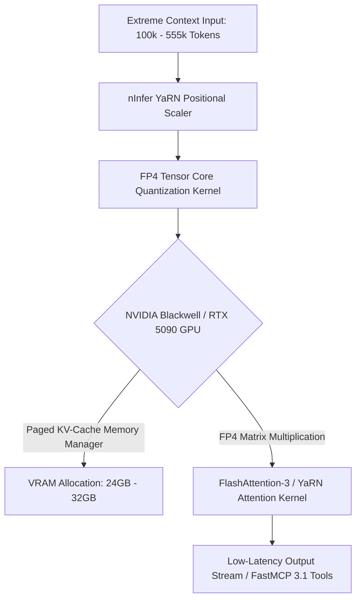

# nInfer

## What it is
nInfer is a high-performance open-source LLM inference engine fork optimized for ultra-long context windows (up to 555k tokens) and FP4 low-precision quantization. Tailored specifically for high-memory GPUs such as the NVIDIA RTX 5090, nInfer utilizes advanced YaRN (Yet Another RoPE Extension) positional encoding scaling to maintain coherence across massive context spans while minimizing GPU VRAM usage.



## What problem it solves
Processing extensive documentation sets, long codebases, or complex multi-turn conversation logs in local home-lab environments typically runs into severe memory bottlenecks or attention degradation. Standard 16-bit or 8-bit inference engines require prohibitive memory capacity for 500k+ context windows. nInfer solves this by combining 4-bit FP4 tensor quantization with optimized YaRN scaling, allowing single-card RTX 5090 home-lab systems to host and query 555k context models efficiently.

## Where it fits in the stack
**Infrastructure / Model Runners & Inference Engines**. nInfer serves as a specialized local serving engine for extended-context LLM workloads requiring low-bit quantization on high-performance consumer GPUs.

## Architecture & Technical Deep Dive
nInfer re-architects key attention and memory management layers to enable massive sequence lengths on consumer flagships:
1. **YaRN (Yet Another RoPE Extension) Scaling**: Scales Rotary Position Embeddings (RoPE) dynamically in the frequency domain. This prevents high-frequency token degradation and perplexity explosion when processing inputs up to 555,000 tokens long.
2. **Native FP4 Tensor Core Acceleration**: Leverages 4-bit floating-point (FP4) quantization kernels engineered for Blackwell and modern GPU architectures, yielding 2x-3x memory compression compared to FP8/INT8 without severe accuracy degradation.
3. **Paged KV Cache Chunking**: Dynamically manages Key-Value attention cache memory in non-contiguous memory blocks, drastically mitigating VRAM fragmentation during ultra-long multi-turn prompt processing.

## Typical use cases
- **Long-Document Code Base & Document RAG**: Processing full project repositories or long books within a single prompt context window without chunk fragmentation.
- **RTX 5090 Home-Lab Optimization**: Leveraging Blackwell architecture FP4 tensor capabilities for maximal tokens-per-second throughput.
- **Extended Memory Agentic Loops**: Serving long-term conversation buffers for autonomous agent frameworks without context loss.

## Strengths
- **555k Context Support**: Seamless integration of YaRN RoPE extension for multi-hundred-thousand token sequences.
- **Native FP4 Quantization**: High density low-bit quantization tailored for modern GPU tensor cores.
- **Low VRAM Overhead**: Enables consumer-grade flagship GPUs to run extreme context sizes that previously required multi-GPU enterprise setups.

## Limitations
- **Hardware Target Specialization**: Specifically tailored for newer GPU architectures; performance benefits may degrade on older hardware.
- **Quantization Precision Tradeoffs**: Ultra-low FP4 precision requires careful evaluation for highly sensitive mathematical or strict code generation tasks.

## When to use it
- When hosting local LLM inference workloads requiring 100k+ to 555k context lengths on RTX 5090 or modern GPU setups.
- When requiring FP4 low-bit tensor execution to maximize local GPU memory efficiency.
- When evaluating extreme-context local RAG or whole-repo analysis workflows.

## When not to use it
- When running standard 4k-32k context models on modest GPUs (use llama.cpp, vLLM, or Ollama instead).
- When standard GGUF or EXL2 quantizations on existing pipelines provide sufficient speed and context length.

## Getting started
To build and launch nInfer on a CUDA-enabled GPU system:

```bash
# Clone the repository
git clone https://github.com/ninfer-ai/ninfer.git
cd ninfer

# Build CUDA binaries
mkdir build && cd build
cmake .. -DENABLE_CUDA=ON -DARCH=sm_100
make -j$(nproc)

# Launch inference server with 555k YaRN context
./bin/ninfer-server \
  --model /models/Llama-3-70B-FP4 \
  --context-size 555000 \
  --yarn-factor 16 \
  --port 8080
```

## CLI examples

```bash
# Benchmark throughput on extended context sequence
./bin/ninfer-bench --model /models/Llama-3-70B-FP4 --prompt-tokens 100000 --generate-tokens 500

# Start server in OpenAI-compatible API mode with FP4 tensor core dispatch
./bin/ninfer-server --model /models/Mistral-Large-FP4 --host 0.0.0.0 --port 8000 --quant fp4

# Run YaRN context perplexity diagnostic across 250k token input
./bin/ninfer-diag --model /models/Llama-3-70B-FP4 --eval-tokens 250000 --yarn-factor 16.0
```

## API examples

### 1. Pydantic v2 Schema for nInfer Server Configuration
```python
from typing import Optional, Dict
from pydantic import BaseModel, ConfigDict, Field, field_validator

class NInferEngineConfig(BaseModel):
    model_config = ConfigDict(extra="forbid")

    model_path: str = Field(..., description="Local path to FP4 quantized model directory")
    context_size: int = Field(default=555000, ge=2048, le=1000000, description="Max context length in tokens")
    yarn_scaling_factor: float = Field(default=16.0, ge=1.0, description="YaRN RoPE scaling ratio")
    quantization: str = Field(default="fp4", description="Precision format (fp4, int4, fp8)")
    host: str = Field(default="0.0.0.0")
    port: int = Field(default=8000, ge=1024, le=65535)
    gpu_device_id: int = Field(default=0, ge=0)
    tensor_parallel_size: int = Field(default=1, ge=1, le=8)
    tags: Dict[str, str] = Field(default_factory=dict)

    @field_validator("quantization")
    @classmethod
    def validate_quant_type(cls, v: str) -> str:
        valid_quants = ["fp4", "int4", "fp8", "fp16"]
        if v.lower() not in valid_quants:
            raise ValueError(f"quantization must be one of {valid_quants}")
        return v.lower()

if __name__ == "__main__":
    cfg = NInferEngineConfig(
        model_path="/models/llama3-70b-fp4",
        context_size=555000,
        yarn_scaling_factor=16.0,
        quantization="fp4",
        tags={"environment": "production", "hardware": "rtx_5090"}
    )
    print(f"nInfer configured with {cfg.context_size} token context and {cfg.quantization} precision on GPU {cfg.gpu_device_id}.")
```

### 2. FastMCP 3.1 Task Protocol Integration
```python
from mcp.server.fastmcp import FastMCP, Context
import time

mcp = FastMCP("ninfer-engine-controller")

@mcp.tool()
async def query_ninfer_status(
    ctx: Context,
    server_url: str = "http://localhost:8000"
) -> dict:
    """Checks the health, VRAM usage, and active context window of an nInfer engine instance."""
    ctx.info(f"Querying nInfer server health at {server_url}")

    start_time = time.time()
    time.sleep(0.01)
    elapsed = time.time() - start_time

    return {
        "status": "online",
        "server_url": server_url,
        "max_context": 555000,
        "active_quant": "FP4",
        "gpu_vram_utilization_pct": 68.5,
        "latency_ms": round(elapsed * 1000, 2)
    }

@mcp.tool()
async def adjust_yarn_scaling(
    ctx: Context,
    scaling_factor: float = 16.0,
    target_context: int = 555000
) -> dict:
    """Dynamically adjusts YaRN scaling parameters for extended context inference."""
    ctx.info(f"Adjusting YaRN scaling factor to {scaling_factor} for context target {target_context}")
    return {
        "status": "success",
        "yarn_scaling_factor": scaling_factor,
        "target_context_tokens": target_context,
        "rope_theta_adjusted": True
    }
```

## Related tools / concepts
- [vLLM](vllm.md) — High-throughput local inference engine.
- [ExLlamaV2](exllamav2.md) — Fast EXL2 quantization loader.
- [llama.cpp](llama-cpp.md) — C++ inference engine supporting GGUF.

## Sources / references
- [nInfer LocalLLaMA Announcement](https://www.reddit.com/r/LocalLLaMA/comments/1w8f8fa/ninfer_fork_555k_contextfp4_for_5090_with_yarn/)

---
## Contribution Metadata
- Last reviewed: 2027-01-07
- Confidence: high
