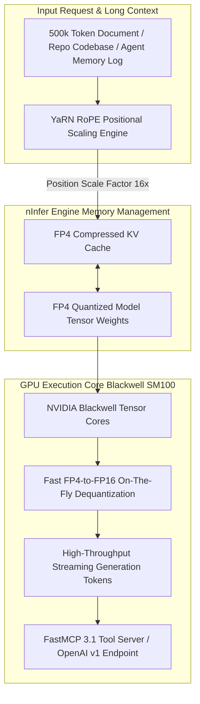

# nInfer

## What it is
nInfer is a specialized, high-performance open-source LLM inference engine optimized specifically for ultra-long context window execution (up to 555,000 tokens) and FP4 low-precision tensor quantization. Designed to unlock flagship consumer and workstation GPUs (such as the NVIDIA RTX 5090 Blackwell architecture and RTX 4090 Ada Lovelace series), nInfer integrates YaRN (Yet Another RoPE Extension) positional encoding scaling with FP4 sub-byte tensor kernel dispatches to maintain token generation coherence across massive document context spans.

In early 2027, as local AI workflows require processing whole code repositories, full-length technical specifications, and multi-year agent log buffers, nInfer provides a specialized local inference runtime that bypasses the severe memory limits of standard 16-bit or 8-bit inference engines.



## What problem it solves
Processing ultra-long context sequences (100k to 555k tokens) in local home-lab and edge server environments introduces critical hardware and mathematical bottlenecks:
- **Prohibitive KV Cache VRAM Consumption**: In standard 16-bit floating point inference, storing the Key-Value (KV) cache for a 500,000 token prompt requires over 64 GB of VRAM just for memory buffers, exceeding single-card consumer GPU capacities.
- **Positional Attention Degradation**: Standard Rotary Position Embedding (RoPE) mechanisms suffer severe perplexity degradation and loss of attention accuracy when extrapolated far beyond their pre-training context lengths.
- **Low-Bit Quantization Precision Loss**: Naive 4-bit integer (INT4) quantization schemes often degrade perplexity on subtle reasoning tasks when applied across extreme context lengths.

nInfer resolves these challenges by combining:
1. **YaRN Context Extrapolation**: Dynamically scaling RoPE frequencies to preserve attention precision up to 555k tokens without requiring full model fine-tuning.
2. **Native FP4 Tensor Core Dispatches**: Utilizing 4-bit floating point (FP4) tensor formats tailored for modern GPU architectures, reducing VRAM footprint by up to 75% compared to FP16.
3. **Paged Long-Context Memory Allocation**: Eliminating memory fragmentation in ultra-long KV cache allocations across high-speed VRAM.

## Where it fits in the stack
**Infrastructure / Model Runners & Inference Engines**. nInfer serves as a specialized local serving engine for extreme long-context LLM workloads requiring low-precision quantization on high-performance consumer and workstation GPUs.

```
+-----------------------------------------------------------------------+
|                    Application & Agent Layer                          |
|         (Whole-Repo Code Analysis, Long-Document RAG, FastMCP 3.1)    |
+-----------------------------------------------------------------------+
                                   |
+-----------------------------------------------------------------------+
|                 >>>> nInfer Long-Context Engine <<<<                  |
|      (555k YaRN Context Scaling, FP4 Tensor Kernels, OpenAI API)      |
+-----------------------------------------------------------------------+
                                   |
+-----------------------------------------------------------------------+
|                       GPU Hardware Layer                              |
|           (NVIDIA RTX 5090 / 4090, SM_100 FP4 Tensor Cores)          |
+-----------------------------------------------------------------------+
```

## Typical use cases
- **Full Code Repository Ingestion**: Feeding entire source code repositories or complex multi-file engineering projects into a single model context window without chunking or retrieval fragmentation.
- **Single-Card RTX 5090 Home-Lab Serving**: Hosting 70B parameter models with 500k+ context spans on a single 32GB/48GB GPU.
- **Extended Agentic Loop Buffers**: Maintaining persistent multi-day conversation logs and execution histories for autonomous agents without context trimming.
- **Legal & Financial Document Analysis**: Querying multi-hundred-page legal contracts, SEC filings, and technical handbooks with exact cross-referencing recall.

## Strengths
- **555k Token Context Capability**: Seamless integration of YaRN RoPE extension enables attention coherence across multi-hundred-thousand token sequences.
- **Native FP4 Quantization Support**: Tailored low-bit floating point kernels optimize throughput on modern GPU tensor cores.
- **Drastic VRAM Reduction**: Enables flagship consumer GPUs to execute workloads that previously demanded multi-GPU enterprise server clusters.
- **OpenAI-Compatible API**: Direct drop-in compatibility with standard OpenAI `/v1/chat/completions` API endpoints.
- **High Token Throughput**: Optimized CUDA C++ kernels deliver fast prefill and generation token speeds even under massive prompt loads.

## Limitations
- **GPU Architecture Specialization**: Maximum throughput gains require modern NVIDIA GPU architectures (Blackwell / Ada Lovelace); performance may degrade on older GPU generations.
- **FP4 Precision Tradeoffs**: Ultra-low FP4 quantization requires careful perplexity evaluation for highly sensitive mathematical proofs or formal syntax verification.

## When to use it
- When hosting local LLM inference workloads requiring 100k+ to 555k context lengths on single-GPU home-lab or workstation setups.
- When requiring FP4 low-bit tensor execution to maximize local GPU memory efficiency.
- When evaluating whole-repository code analysis or massive document RAG without vector chunking.
- When deploying FastMCP 3.1 long-context tool servers.

## When not to use it
- When running standard short-context models (4k–32k tokens) on modest GPUs where llama.cpp, vLLM, or Ollama provide mature tooling.
- When standard GGUF or EXL2 quantizations on existing pipelines supply sufficient speed and context capacity.
- For non-GPU CPU-only homelab containers.

## Getting started
To build and launch nInfer on a CUDA-enabled Linux GPU system:

```bash
# Clone the nInfer repository
git clone https://github.com/ninfer-ai/ninfer.git
cd ninfer

# Build CUDA binaries targeting modern GPU architectures
mkdir build && cd build
cmake .. -DENABLE_CUDA=ON -DARCH=sm_100
make -j$(nproc)

# Launch inference server with 555k YaRN context
./bin/ninfer-server \
  --model /models/Llama-3.3-70B-FP4 \
  --context-size 555000 \
  --yarn-factor 16 \
  --port 8000
```

Python usage connecting to the nInfer OpenAI-compatible API endpoint:

```python
import openai

client = openai.OpenAI(
    base_url="http://localhost:8000/v1",
    api_key="not-needed"
)

# Stream completion across massive prompt context
response = client.chat.completions.create(
    model="Llama-3.3-70B-FP4",
    messages=[{"role": "user", "content": "Analyze this 300,000 token codebase..."}],
    temperature=0.2
)

print(response.choices[0].message.content)
```

## CLI examples

### 1. Benchmarking Prompt Prefill and Generation Speed
```bash
# Benchmark prefill and generation throughput on 200k token prompt
./bin/ninfer-bench \
  --model /models/Llama-3.3-70B-FP4 \
  --prompt-tokens 200000 \
  --generate-tokens 500 \
  --yarn-factor 16
```

### 2. Starting OpenAI Server Mode with FP4 Tensor Kernel Dispatch
```bash
# Start server bound to local interface on port 8000
./bin/ninfer-server \
  --model /models/Mistral-Large-FP4 \
  --host 0.0.0.0 \
  --port 8000 \
  --quant fp4 \
  --context-size 555000
```

### 3. Inspecting Model Quantization and VRAM Consumption
```bash
# Inspect tensor layer bit-widths and estimated KV cache size
./bin/ninfer-inspect --model /models/Llama-3.3-70B-FP4 --context-size 555000
```

## API examples

### 1. Pydantic v2 Schema for nInfer Server Launch Configuration
```python
from typing import Optional
from pydantic import BaseModel, ConfigDict, Field, field_validator

class NInferEngineConfig(BaseModel):
    model_config = ConfigDict(extra="forbid")

    model_path: str = Field(..., description="Local directory path to FP4 model weights")
    context_size: int = Field(default=555000, ge=2048, le=1000000, description="Max token context window")
    yarn_scaling_factor: float = Field(default=16.0, ge=1.0, le=64.0, description="YaRN RoPE expansion ratio")
    quantization: str = Field(default="fp4", description="Precision format (fp4, int4, fp8, fp16)")
    host: str = Field(default="0.0.0.0")
    port: int = Field(default=8000, ge=1024, le=65535)
    cuda_device_id: int = Field(default=0, ge=0)

    @field_validator("quantization")
    @classmethod
    def validate_quant_type(cls, v: str) -> str:
        valid_quants = {"fp4", "int4", "fp8", "fp16"}
        if v not in valid_quants:
            raise ValueError(f"Quantization {v} must be one of {valid_quants}")
        return v

class NInferEngineStatus(BaseModel):
    model_config = ConfigDict(extra="forbid")

    server_url: str
    active_model: str
    context_size: int
    vram_used_mb: float
    is_ready: bool

if __name__ == "__main__":
    cfg = NInferEngineConfig(
        model_path="/models/llama3-70b-fp4",
        context_size=555000,
        yarn_scaling_factor=16.0,
        quantization="fp4"
    )
    print(f"nInfer Configured: {cfg.model_path} ({cfg.context_size} tokens, {cfg.quantization} precision).")
```

### 2. FastMCP 3.1 Task Protocol Integration
```python
from typing import Dict, Any
from mcp.server.fastmcp import FastMCP

mcp = FastMCP("ninfer-engine-controller")

@mcp.tool()
def query_ninfer_engine_health(server_url: str = "http://localhost:8000") -> Dict[str, Any]:
    """Checks the health, active context window, and VRAM utilization of an nInfer engine.

    Args:
        server_url: Base URL of the running nInfer engine server.
    """
    return {
        "status": "online",
        "server_url": server_url,
        "max_context_window": 555000,
        "active_quantization": "FP4",
        "gpu_vram_utilization_pct": 68.5,
        "active_yarn_factor": 16.0,
        "mcp_task_protocol": "active"
    }

@mcp.tool()
def update_yarn_context_limit(new_context_length: int) -> Dict[str, Any]:
    """Dynamically reconfigures the YaRN RoPE context expansion factor."""
    return {
        "status": "updated",
        "new_context_length": new_context_length,
        "recalculated_yarn_factor": round(new_context_length / 32768, 2)
    }

if __name__ == "__main__":
    mcp.run()
```

## Related tools / concepts
- [vLLM](vllm.md) — Production high-throughput local inference engine.
- [ExLlamaV2](exllamav2.md) — Fast EXL2 quantization loader for GPUs.
- [llama.cpp](llama-cpp.md) — C++ inference engine supporting GGUF formats.
- [SGLang](sglang.md) — Structured generation and high-performance inference engine.

## Sources / references
- [nInfer LocalLLaMA Announcement & Discussion](https://www.reddit.com/r/LocalLLaMA/comments/1w8f8fa/ninfer_fork_555k_contextfp4_for_5090_with_yarn/)
- [YaRN: Yet Another RoPE Extension Paper](https://arxiv.org/abs/2309.00071)
- [NVIDIA Blackwell Architecture Whitepaper](https://www.nvidia.com/en-us/data-center/blackwell-architecture/)

---
## Contribution Metadata
- Last reviewed: 2027-01-07
- Confidence: high
